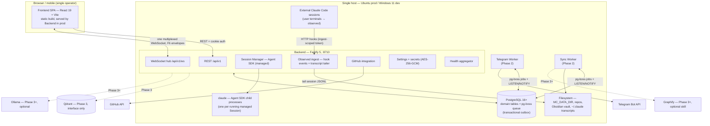

# TDS 00 — Overview & Integration Review (WS7)

- **Status:** **APPROVED for Phase 1 implementation** — 2026-08-11. All 12 blocking findings closed and verified in the documents; zero cross-document contradictions remain. Three leaf-feature contract items remain open against WS2 (§7.2) — none on the Phase 1 critical path. No Foundation Contract change was required at any point.
- **Owner:** WS7 / architect-reviewer
- **Date:** 2026-08-11 (revision-loop closure and sign-off)
- **Inputs:** `Requirements.md` (PRD v2.1), `CLAUDE.md`, `docs/project-plan.md`, `docs/tds/01`–`07`, `docs/research/claude-code-control-spike.md`, `docs/reviews/ws5-ux-critique-register.md`
- **Purpose:** entry point to the TDS — document map, system overview, canonical vocabulary pointer, sanctioned deviations from the PRD, arbitrated cross-workstream decisions, acceptance-criteria status, and sign-off.
- **Review basis:** all seven workstream documents reviewed in full across two passes — an initial pass over 01–04 and 07 (vocabulary, contract cross-check, constraint audit, scope guard, PRD coverage), then a closure pass verifying every finding against the revised files and completing the WS4/WS5 cross-check. Findings were verified by reading the documents, not by accepting revision summaries.

---

## 1. TDS Document Map

| File | WS | Purpose (one line) |
|---|---|---|
| `00-overview.md` | WS7 | This document: map, system overview, deviations, arbitrations, acceptance status, sign-off. |
| `01-foundation-decisions.md` | WS0 | The Foundation Contract F1–F9 — stack, topology, queue, vocabulary, API/event conventions, session state machine, process/config model, doc rules. **Locked; the consistency baseline for everything else.** |
| `02-service-architecture-and-deployment.md` | WS1 | Process topology, Backend internals, the Claude Code wrapper (managed via Agent SDK; observed via hooks + transcript tailing), health model, bootstrap config, Ubuntu systemd deployment, Windows 11 dev run story. |
| `03-database-schema.md` | WS3 | PostgreSQL DDL for all Phase 1–2 entities plus supporting tables, indexes/constraints, the transactional-outbox mechanism, migrations, Phase 3/4 skeletons. |
| `04-api-contracts-and-events.md` | WS2 | REST contract (`/api/v1`, OpenAPI-first), WebSocket protocol, error-code registry, Settings/Test-Connection/health APIs, and the complete Phase 1–2 event catalog with producers and consumers. |
| `05-frontend-architecture.md` | WS4 | SPA structure, routing, state management, real-time client layer, live-chat rendering, Settings UI, theming, dual-OS build tooling. Also owns the keyboard model and session-identity rendering rules. |
| `06-wireframes-and-design-system.md` | WS5 | Design tokens (dark-first), component inventory, and low-fi wireframes for every Phase 1–2 screen including the full Settings page, plus the accessibility contract (contrast assertions, streaming a11y, per-state glyphs). |
| `07-test-strategy.md` | WS6 | Test pyramid, Docker-free real-PostgreSQL integration harness, wrapper test seams and mock runtime, WebSocket/queue testing, dual-OS CI matrix, coverage and phase gates. |

Supporting documents: `docs/research/claude-code-control-spike.md` (evidence base for F1.5), `docs/reviews/ws5-ux-critique-register.md` (accepted UX findings and pre-arbitrated WS4/WS5 conflicts), `docs/project-plan.md` (workstream mandates and acceptance criteria).

---

## 2. System Overview

Four application processes plus PostgreSQL, all native, no Docker, no reverse proxy in V1 (F2, F3, F8).



**Reading the diagram:** the browser talks only to the Backend. Workers expose no ports and never call the Backend over HTTP — PostgreSQL (pg-boss jobs + `LISTEN/NOTIFY`) is the sole inter-process contract (F2.2, F3). Every domain write and its event are committed in one transaction (F6.3); the WebSocket hub is a best-effort relay with no replay, so clients refetch on reconnect.

---

## 3. Canonical Vocabulary

`docs/tds/01-foundation-decisions.md` is the single authority. Do not restate these lists anywhere else — cite them.

| Concern | Authority | Summary |
|---|---|---|
| Entity names, tables, ID/naming/timestamp conventions | **F4** | UUIDv7 PKs generated in app code; `snake_case` plural tables; `camelCase` JSON; `timestamptz` UTC with `created_at`/`updated_at` everywhere. |
| API conventions | **F5** | REST under `/api/v1`, POST sub-actions for lifecycle verbs, cursor pagination, `{ error: { code, message, details, requestId } }`, cookie session + bearer API tokens, one multiplexed WebSocket. |
| Event grammar, envelope, delivery | **F6** | `<domain>[.<sub-entity>].<verb-past>`; envelope `{ id, type, schemaVersion, occurredAt, source, correlationId, payload }`; at-least-once with idempotent consumers; payloads carry IDs, never entities. |
| Session state machine | **F7** | `created → running → paused → completed / failed → archived`, verbatim lowercase; resume of a completed/archived Session creates a **new** Session; `paused → running` is in-place. |
| Documentation conventions | **F9** | File map, heading structure, the mandatory Phase-N placeholder callout, Mermaid diagrams, vocabulary discipline. |

Vocabulary drift found in this review is listed in §7 (blocking) and §8 (non-blocking); it is drift *against* these anchors, not a reason to change them.

---

## 4. Sanctioned Deviations Register

Deliberate, reasoned departures from the PRD or from the literal Foundation entity list. Anything not listed here is not sanctioned.

| # | Deviation | PRD/contract reference | Rationale | Where implemented |
|---|---|---|---|---|
| **D1** | **Redis is eliminated. PostgreSQL (pg-boss + `LISTEN/NOTIFY`) is the only queue/eventing substrate; per-process in-memory LRU caches replace any shared cache tier.** | PRD §13 lists Redis as production service #4; PRD §4.4.7 says "Redis (or dev substitute)". | Redis has no official native Windows build, so any hard dependency breaks the mandated Windows 11 dev-parity constraint (plan risk R2). A single-user, single-node system's queue throughput is trivially within PostgreSQL's capability; a second stateful service adds operational surface for no benefit, and two different engines across dev/prod is a parity trap. The `QueuePort` abstraction keeps a Redis/BullMQ driver swap available post-V1. | F3; WS1 §1, §7; WS3 §7; WS6 §3, §7. Settings → Services shows **"Queue (PostgreSQL)"** in Redis's row. |
| **D2** | **Frontend is not a separate running service** — it is a static Vite build served by the Backend from a single origin. | PRD §13 lists Frontend as production service #1. | No SSR/SEO requirement for a login-gated operator dashboard; single origin removes CORS, one systemd unit, and a second runtime to manage on two OSes. nginx/TLS remains an optional later hardening step, not part of V1. | F2.3; WS1 §1.1, §9.1. |
| **D3** | **Qdrant, Ollama, and Graphify appear in the topology as Phase 3+ placeholders only**, with settings forms and stub Test Connection actions from Phase 1. | PRD §13 lists Qdrant as service #5 without a phase. | PRD §15 roadmap places Memory in Phase 3; the project-plan scope guard forbids Phase 3–5 detail. Settings forms exist early because PRD §4.4.2 mandates them; the integrations stay inert. | WS1 §11; WS2 §7.2, §13.1; WS3 §6. |
| **D4** | **Supporting tables beyond the F4.1 entity list**: `auth_sessions`, `api_tokens`, `session_events`, `transcript_tail_states`, `service_heartbeats`, `obsidian_sync_states` (+ vendored `pgboss` schema). | F4.1 permits supporting tables, forbids new domain entities. | Each backs a mechanism mandated elsewhere (cookie sessions F5.5, API tokens PRD §4.4.6, F7 timeline, WS1 §6.3 tailer cursor, WS1 §7.2 heartbeats, PRD §7.1 two-way sync). None introduces a new domain concept or user-facing entity. | WS3 §3, §4. |
| **D5** | **`SyncRun` is sanctioned as a supporting entity** (operational run record for Obsidian sync), exposed at `/api/v1/sync-runs`. | Not in PRD §11 or F4.1. | PRD §7.1 mandates two-way sync and §4.4.7/§9 mandate visible sync health and failure alerts; a run record is the minimum honest representation. It is bookkeeping, not domain vocabulary. **Condition satisfied** — WS3 §4.5 provides `sync_runs`, with a partial unique index (`WHERE state IN ('queued','running')`) that turns WS2's overlapping-run `409` into a database guarantee. | WS2 §10, §15.2 events 21–24; WS3 §4.5. |
| **D6** | **`TEST_DATABASE_URL`** exists outside the locked F8.2 bootstrap variable set. | F8.2 locks the bootstrap variable list. | Test-tooling only; never read by application code. The F8.2 set is unchanged for all four apps. | WS6 §3.1. |
| **D7** | **`security.allowedOrigins` is a database-stored setting, not an env var.** | F8.2 bootstrap/DB split. | Keeps the F8.2 variable set locked while giving the WebSocket Origin allowlist (cross-site WS hijacking defense) an operator-editable surface. | WS2 §7.2, §14.2. |
| **D8** | **Assisted-mode PR *actions* (PR creation, description/review generation) are deferred to Phase 2**; only the Manual/Assisted *mode setting* is Phase 1. | PRD §4.3 Workflow Modes. | Assisted actions depend on Phase 2 knowledge generation; the mode selector must still exist and persist in Phase 1 so the product is configurable end to end. **Condition satisfied** — `GithubSettings.workflowMode` (WS2 §7.2) plus per-Project override `Project.workflowMode` (`null` = inherit, WS2 §4), stored in `projects.workflow_mode` (WS3 §3.5). | WS2 §4, §5.3, §7.2; WS3 §3.5. |
| **D9** | **PRD §12 Agent APIs and Memory APIs ship as reserved route stubs only**, with reserved event names and WebSocket channels. | PRD §12. | Project-plan scope guard: Phases 3–5 get interfaces and extension points, not designs. | WS2 §13, §15.4; WS3 §6; WS1 §11.4. |
| **D10** | **V1 binds `127.0.0.1` by default with no TLS and no reverse proxy**; LAN exposure is an explicit operator action (`MC_HOST=0.0.0.0`). | PRD §10 security. | Single-user, self-hosted, single-node. Cookie `Secure` flag, Origin allowlist, Argon2id, and encrypted secrets are in place; TLS termination is an operator/deployment concern, documented rather than designed. | F2.3; WS1 §9.1; WS2 §14.2. |

---

## 5. Arbitrated Decisions

Decisions taken by WS7 to resolve cross-document conflicts. These are binding on the owning workstreams; where a decision requires a document change, the change is tracked as a finding in §7.

A1–A13 were taken at the review gate (2026-08-11). **A14 onwards are recorded during implementation**, when a contradiction that survived the gate is found by the code that has to satisfy both sides of it; each carries the date it was settled and names the document it amended.

### A1 — "Upcoming Tasks" dashboard widget (PRD §8.1) → **schedule read model (WS5's position)**

**Decision: the widget renders scheduled *system* activity, computed at read time. WS4 §2.2's empty-state placeholder is rejected.**

Reasoning:

1. **No new entity, no new table.** Every value is already in the system: next Obsidian sync (`obsidian.syncIntervalMinutes` + last `SyncRun`), next repository poll (`github.syncIntervalMinutes` + `repositories.last_synced_at`), next daily report (`notifications.dailyReport.time` + `general.timezone`). F4.1 is untouched — no Task entity is invented, which was the original objection.
2. **A permanently empty widget on the most-visited page is not the simpler option, it is the dishonest one.** It occupies prime dashboard space, tells the operator nothing, and invites someone to later fill it with a fake to-do feature. The schedule model answers a question the operator actually asks ("when does the vault sync next?") and its empty state is *actionable*: "No scheduled work — set sync intervals in Settings."
3. **Cost is one read-only endpoint**, no persistence, no event, no worker change.

Contract (WS2 must add; small, Phase 1):

```ts
// GET /api/v1/schedule
{ data: Array<{
    kind: 'obsidian_sync' | 'github_poll' | 'daily_report',
    label: string,
    enabled: boolean,
    nextRunAt: string | null,        // ISO 8601 UTC; null when disabled or interval = 0
    lastRunAt: string | null
}> }
```

Constraints on the implementation: values are **derived**, never stored; the widget must make clear these are system-scheduled runs, not user tasks. Retaining the PRD's "Upcoming Tasks" label is acceptable provided the widget's subtitle or empty state says so; a clearer label ("Upcoming — scheduled runs") is preferred but not mandated. **Status: implemented** — WS2 §7.7 provides `GET /api/v1/schedule`, and WS4 §2.2 now renders the schedule model.

**Actions:** WS2 add `GET /api/v1/schedule` (§7 finding B13); WS4 replace the §2.2 routing-map note and close open item §13.5; WS5 keep §5.2 as written.

### A2 — Session launch at capacity → **queued, not rejected**

WS1 §4.3 and WS6 §7.1 (durable `session.launch` job, FIFO, restart-surviving) win over WS2 §6.2's `409 CONFLICT`. `start`/`resume` must not fail when the max-concurrent budget is saturated. WS2 changes the Start/Resume contract to `200 { data: Session, meta: { launch: 'started' | 'queued' } }`, with the Session remaining `created`/`paused` while queued. Rationale: failing an operator action because *another* session holds a slot is a worse contract than deferring it, and the durable job already exists in the design.

### A3 — `PullRequest.state` → **GitHub-truth state; PRD lifecycle words are events**

Storage and API both use `open | merged | closed` (plus `draft` if surfaced). PRD §4.3's "Created, Opened, Reviewed, Merged, Rejected" are *lifecycle facts*, already modelled as events (`pull_request.opened/reviewed/merged/closed`) and timestamps. WS3 §3.8 alters its CHECK accordingly and adds `reviewed_at`; WS2 §5.3 is otherwise unchanged. Rationale: a state column that cannot represent what GitHub actually returns forces a lossy mapping at every write.

### A4 — `Adr.status` → **`proposed`**, not `draft`

WS3's `proposed | accepted | rejected | superseded` wins (standard ADR vocabulary, and it is the DDL). WS2 §9 replaces `draft` with `proposed`, including in `POST /sessions/{id}/generate-adr`. WS5 must use `proposed` in wireframe copy.

### A5 — Message ordering → **`ordinal`, and it is part of the API**

WS3's per-session monotonic `ordinal` is the conversation-order contract; ordering messages by UUIDv7 `id` (WS2 §1.2 default) is wrong for observed sessions, where dual-channel ingest can insert out of order. WS2 exposes `ordinal` on the `Message` resource, keys the `GET /sessions/{id}/messages` cursor on it, and also exposes `status: 'complete' | 'pending' | 'interrupted'` (required by WS1 §5.1 cold-pause semantics and by accepted UX findings MF6/MF7) and `occurredAt`.

### A6 — Session lineage → **discriminated**

Resume-as-new and Clone must be distinguishable. WS3 keeps one FK plus a `lineage_kind text CHECK (lineage_kind IN ('resumed','cloned'))` (nullable), and WS2 derives `resumedFromSessionId` / `clonedFromSessionId` from it. A single undiscriminated `resumed_from_session_id` cannot populate the two API fields WS2 specifies.

### A7 — `AuditLogEntry` shape → **database shape wins**

API exposes `entityType`, `entityId`, `before`, `after`, `occurredAt` (mapped from `created_at`) — not `targetType`/`targetId`/`details`. `actorType` is `user | agent | system` (WS3); token-authenticated actions are recorded as `user` with the token identified in `after`/`details` metadata, rather than inventing a fourth actor type that has no column.

### A8 — `notifications.type` → **notification-type enum, not F6 event name**

WS2's enum (`session_completed`, `session_failed`, `sync_failed`, `repository_problem`, `daily_report`, `cost_budget_alert`) is stored, with a CHECK. WS3's comment ("F6 event name") cannot hold: `daily_report` and `cost_budget_alert` have no corresponding F6 event. The originating event type, where one exists, goes in `payload.eventType`.

### A9 — Observed-session fidelity degradation → **its own event, not `sync.failed`**

WS1 §6.3 and WS6 §5.4 refer to a "`sync.failed`-family diagnostic event" for transcript parser drift, but `sync.failed` is the Obsidian sync-run failure event and its payload (`syncRunId`) is meaningless here. WS2 adds `session.observation_degraded` (payload `sessionId`, `reason`, `driftCount`; channels `sessions`, `session:{id}`) and a `Session.observation: { channel: 'hooks_and_transcript' | 'hooks_only' | 'transcript_only', degraded: boolean } | null` field so WS5's degraded-fidelity badge has a source. WS1 and WS6 update their wording to the new name.

### A10 — Workflow Modes (PRD §4.3) → **setting now, actions later**

`workflowMode: 'manual' | 'assisted'` is added to `GithubSettings` with a nullable per-Project override (`projects.workflow_mode`, NULL = inherit), exposed on `PATCH /projects/{id}`. Assisted PR *actions* stay Phase 2 per deviation D8. A Phase 1 PRD functional requirement may not exist only as a wireframe.

### A11 — Observation degradation is **terminal for the life of a Session**; `session.observation_restored` is withdrawn

The closure pass found `session.observation_restored` had **no producer anywhere**: WS2 §6.9 deferred "when re-attachment happens" to WS1, and WS1 §6.3 has no re-attachment policy — its degradation ladder is one-directional and `transcript_tail_states.degraded` is deliberately sticky across restarts so the badge cannot flap. An event nothing can emit is worse than no event.

**Decision: keep `session.observation_degraded` and `Session.observation.degraded`; remove `session.observation_restored` from the V1 catalog. Degradation lasts for the life of that Session.**

The deciding argument is not cost, it is truthfulness: **re-attaching the tailer would not recover the lines already skipped.** The transcript keeps its holes either way, so a "restored" signal would tell the operator that fidelity came back when only *future* fidelity did. A chip that stays amber for the rest of the session states a durable fact. The tail-state row dies with the Session, so the next Session starts clean with no mechanism at all. Automatic or operator-triggered re-attachment (with an honest "gap" marker in the transcript) is a post-V1 concern.

Applied: WS1 §6.3 and WS6 §5.4 now name `session.observation_degraded` and state terminality; WS5 §5.5 binds the chip to `Session.observation.degraded` + the event and no longer claims it auto-clears. **WS2 closed 2026-08-12** — `session.observation_restored` removed from §6.9 (now "Transition — one event", with the terminality rule and its rationale stated inline), the §6.7 timeline `kind` mapping, the §14.3 `sessions` channel, §15.2 (event 12 deleted), and both §17 hand-off notes. The only surviving mention is the explicit statement that the event does not exist. §7.2 item 3 is therefore **closed**, not outstanding.

### A12 — Mobile session launch (UX register **WC5**) → **no `+` FAB; WS4's position wins**

WS5 specified a `+` New Session FAB on the mobile Sessions list; WS4 §9.2 restricted mobile to resume/clone shortcuts. **Decision: no New Session FAB on mobile in V1.**

1. **PRD §14 scopes mobile to *monitoring*** — "glanceable monitor plus lightweight steering" is a faithful reading; composing a new agent launch target is neither.
2. **Resume-as-new and Clone are already launches** — they spawn a runtime and consume a concurrency slot — but every consequential parameter (working directory, repository, branch) is *inherited from a Session already vetted on a desktop*. That is exactly the right line: re-run what you vetted, don't compose new targets on a phone.
3. **The launch flow now carries a mandatory working-tree disclosure** (resolved absolute path, current branch, dirty-file count, branch-change acknowledgement — WC11). That disclosure cannot be honestly reviewed on a phone, and an acknowledgement nobody can verify is theatre.
4. **A FAB is the highest-prominence control in mobile design language.** Giving the most consequential, least-verifiable action top billing on the smallest screen inverts the risk ordering.

If a mobile entry point is ever wanted it belongs in the overflow/command surface, routed through the full disclosure modal — never a FAB. Applied to WS5 §5.4 and annotated in WS4 §9.2.

### A13 — Session-title auto-derivation is the **Backend's** (WS4 §13.7, assigned)

`sessions.title` is now the primary human label on every surface (WS4 §9.3, WS5 §2.2), but no document owned deriving it. **Decision: the Backend derives it, exactly as WS4 preferred.**

On persisting the **first user Message** of a Session — managed prompt path or observed hook/transcript ingest — if `sessions.title IS NULL`, set it to the first line of that content, trimmed and ellipsised to ≤ 60 characters, **in the same transaction**. An operator-set title is never overwritten; `PATCH /sessions/{id}` wins thereafter.

Reasoning: the title is read by Telegram notifications, Obsidian notes, session exports, and the search index — WS3 §4.6 weights `sessions.title` as rank class `A`, the highest. A client-side-only derivation would leave every one of those surfaces reading "Untitled" while the browser alone showed the right label. **No new event is required:** WS4 §9.3's display-only fallback already renders the derived label immediately, and the stored value arrives with the next `['sessions', id]` fetch — so this costs one `COALESCE`-style write, not a contract.

Owners: **WS2** states the rule in the contract (§6.4 prompt path and §6.8 ingest); **WS1** implements it in the session manager and observed ingest; **WS3** unchanged (column exists, nullable). Recorded as outstanding item 2 in §7.2.

### A14 — Settings writes are a **full-category replace**, not a partial patch (WS2 §7.3 wins over WS5 §7.2)

WS2 §7.3 specifies `PUT /api/v1/settings/{category}` as a "full-category replace"; WS5 §7.2 describes the client "sending only dirty fields". The two are mutually exclusive, and the disagreement is not cosmetic: **a partial body interpreted as a full replace silently erases every field the operator did not touch.**

**Decision: full replace wins.** It is what the API contract states, it is what the Settings UI already implements (`apps/frontend/src/features/settings/mutations.ts` builds `{...persisted, ...dirty}` for exactly this reason), and it is the only one of the two that a server can implement without guessing which absent fields were "not dirty" and which were "cleared".

Consequences, now stated in WS2 §7.3:

1. An **omitted non-secret field resets to its registry default** (§7.6). The body is the new state of the category, in full.
2. An **omitted secret keeps its stored value**; `null` clears it; a string sets it (§7.1). This exception is forced, not chosen — the client may not read a secret, so it cannot resend one, and "omitted = reset" would make every save of an integration destroy its credential.
3. An **unknown field is rejected by name** rather than ignored: under (1), an ignored `instanceNam` is a silent reset of `instanceName`. (Fastify's Ajv would strip it under `removeAdditional: true`, so the settings write schemas deliberately omit `additionalProperties: false` and the write planner rejects instead.)
4. A body that changes nothing writes nothing — no rows, no audit entry, no `setting.updated`.

WS5 needs no change: "send only dirty fields" describes the *editing* model, and the panel already merges its dirty set onto the persisted document before writing. Recorded 2026-08-13, implemented in `apps/backend/src/settings/documents.ts`.

### A15 — `SecretFieldRead` carries `updatedAt` (WS5 §4.4's requirement is real)

WS2 §7.1 defined the masked read shape as `{ isSet: boolean }`. WS5 §4.4/§5.7.3 render `•••••••••••• (saved 2026-08-10 09:14)` and call that timestamp "the only honest confirmation possible for a write-only value".

**Decision: `SecretFieldRead` becomes `{ isSet: boolean; updatedAt: string | null }`.** The alternative was for the UI to drop the timestamp, and that costs the operator the only evidence available to them: a credential they are forbidden to read back cannot be confirmed any other way, so a paste that silently failed to save would look exactly like one that succeeded. The value is `secret_items.updated_at` — a timestamp, carrying no prefix, no length and no part of the secret (TDS 03 §3.13 stores none of those). `null` exactly when `isSet` is `false`.

Recorded 2026-08-13; WS2 §7.1 updated, and the Frontend's provisional `SecretFieldRead` (which already anticipated this, optionally) can now import the shared type.

---

## 6. Acceptance-Criteria Checklist (project plan §4)

| # | Criterion | Status |
|---|---|---|
| 1 | All eight files exist under `docs/tds/` and follow F9 conventions | **Met** — all eight present; H1 pattern, header blocks, Mermaid, and the mandatory Phase-N callout verified in every document, byte-exact. |
| 2 | Covers all six mandated TDS elements (schemas, API contracts, deployment architecture, service boundaries, event models, wireframes) | **Met** — WS3, WS2, WS1 §9–§10, WS1 §1–§2, WS2 §15, WS5 §5 respectively. |
| 3 | Zero naming/ID/state contradictions across documents | **Not met** — B4, B5, B6, B9, B10 are direct contradictions; N1–N3 are softer drift. All mechanical; none touches F4/F6/F7. |
| 4 | A developer could start Phase 1 from WS1+WS2+WS3+WS4 without inventing any contract | **Not met** — B1, B2, B3, B6, B7, B8, B11, B12, B13 each require invention today. |
| 5 | Windows 11 dev story and Ubuntu prod story fully described; no Docker; no hard Redis dependency in dev | **Met** — WS1 §9/§10, WS6 §3.2/§10.2. All Docker mentions across the corpus are prohibitions; Redis appears only as the rejected option and as the "Queue (PostgreSQL)" replacement label. |
| 6 | Settings Management (PRD §4.4) covered end to end | **Met** — storage + encrypted secrets (WS3 §3.12–3.13), APIs incl. Test Connection, health, and the settings key registry (WS2 §7, registry owned at §7.6), wireframes (WS5 §5.7 — UX critique records coverage as COMPLETE across all seven categories and six integrations), bootstrap split honored (F8.2, WS1 §8). |
| 7 | Phase 3–5 content is interface/placeholder-level only, with the standard callout | **Met** — verified byte-exact in all five WS5 placeholder sections and in 02, 03, 04, 05, 07. No Phase 3–5 section contains detailed design; the one allowed exception (Qdrant/Ollama settings *forms*) is self-declared and phase-badged. |
| 8 | Claude Code wrapper addresses managed + observed sessions and real-time streaming, or documents a validated fallback | **Met** — WS1 §4–§6 on the spike's evidence; raw-CLI `stream-json` fallback documented; degradation ladder defined, and its terminality now stated (A11). |
| 9 | `architect-reviewer` sign-off recorded in `00-overview.md` | **Met** — §9, Approved. |
| 10 | Post-acceptance: update `CLAUDE.md` with the chosen stack | **Met** — `CLAUDE.md` corrected in the revision loop: PRD v2.1, TDS file map, chosen stack, no-Redis constraint recorded, and the contradictory "Docker architecture" phrase removed (former finding N14). |

**Overall: accepted.** The integration debt that blocked the first pass is gone. Both re-dispatch packages were applied and verified against the files: WS3 now stores everything WS2 exposes, and the vocabularies that diverged (PR states, ADR status, notification types, audit shape, session-type spelling, message ordering) resolve to one value each. The two hardest problems — the Claude Code wrapper and the no-Redis queue — remain the strongest parts of the design, and the revision loop improved rather than merely patched them: the FTS design (WS3 §4.6) pins its configuration to core PostgreSQL specifically to preserve dual-OS parity, and the `sync_runs` partial unique index turns an API-level race into a database guarantee.

Three leaf-feature contract items remain open against WS2 (§7.2). They are recorded rather than waived, and none blocks the Phase 1 critical path: authentication, session lifecycle, the wrapper, streaming, settings, GitHub tracking, schema, and the test harness are all fully specified.

---

## 7. Findings — Closure Record

### 7.1 The twelve blocking findings — all closed

Verified by reading the revised documents, not by accepting revision summaries. Evidence is the section that now carries the fix.

| # | Finding | Status | Evidence |
|---|---|---|---|
| **B1** | `SyncRun` exposed by the API with no table | **Closed** | WS3 §4.5 `sync_runs` — plus `ux_sync_runs_active` (partial unique on `kind WHERE state IN ('queued','running')`), which makes WS2 §10's overlapping-run `409` a database guarantee instead of a race-prone check. Conflict *detail* stays in `obsidian_sync_states` and is joined at read time; no redundant FK. |
| **B2** | Search endpoint with no backing index | **Closed** | WS3 §4.6 — stored generated `search_tsv` + GIN on all five tables, with configuration (`pg_catalog.english`/`simple`), parser (`websearch_to_tsquery`), rank (`ts_rank_cd(…, 32)`, normalized so branches are comparable), weights, and `ts_headline` all pinned, plus the canonical `UNION ALL` query. Deliberately **core-PostgreSQL only — no extensions** — so behavior is identical on Windows and Ubuntu. `search_documents` rejected with reasons. Tool payloads excluded from `messages` vectors to protect ranking and index size. |
| **B3** | Launch-at-capacity: `409` vs durable queued launch | **Closed** | WS2 §6.2.1 — `meta.launch: 'started' \| 'queued'`; the `409`/`details.reason` path is explicitly withdrawn; the Session stays `created`/`paused` and emits no `session.state_changed` while queued. Matches WS1 §4.3 and the tests already written in WS6 §7.1. |
| **B4** | `pull_requests.state` CHECK vs API enum | **Closed** | WS3 §3.8 — CHECK is now `('open','merged','closed','draft')` with `reviewed_at`; the withdrawn vocabulary is documented as lossy. WS5 §5.3 wireframe corrected at this gate (it still showed the old set). |
| **B5** | `Adr.status: 'draft'` vs `proposed` | **Closed** | WS2 §9 — `proposed` is the initial status, matching the WS3 CHECK. |
| **B6** | `Message` ordering and missing `ordinal`/`status` | **Closed** | WS2 §6.6 — `ordinal`, `status`, `occurredAt` exposed; cursor keyed on `ordinal`; `createdAt` marked never-an-ordering-key; OpenAPI `Message` requires all three. `session.message.appended` now carries `ordinal` and `status`, so the pending-prompt (MF6) and retained-partial-turn (MF7) behaviours render from server truth. |
| **B7** | Undiscriminated clone/resume lineage | **Closed** | WS3 §3.9 — `lineage_kind ('resumed'\|'cloned')` plus `ck_sessions_lineage` enforcing "both NULL or both set", with an explicit mapping table to the two API fields. |
| **B8** | Five API fields with no column | **Closed** | WS3 §3.9 (`repository_id`, `notes`), §3.3 (`api_tokens.scopes text[]` with a CHECK that forbids empty/NULL/unknown scopes — and it resolves where the hook-ingest token hash lives), §4.2 (`notifications.correlation_id`), §3.6 (`repositories.sync_status` + `last_sync_error`). |
| **B9** | `AuditLogEntry` shape and actor vocabulary | **Closed** | WS2 §12 — `entityType`/`entityId`/`before`/`after`/`occurredAt`; `actorType` is the three-value DB set; the `'token'` actor is dropped, with token-authenticated calls recorded as `user` plus `after.apiTokenId`. |
| **B10** | `notifications.type` semantics | **Closed** | WS3 §4.2 — CHECK on the WS2 enum; originating event type moved to `payload.eventType`, with the reasoning that `daily_report` and `cost_budget_alert` have no F6 event. |
| **B11** | Workflow Mode (PRD §4.3) had no storage or API | **Closed** | WS2 §7.2 `GithubSettings.workflowMode`, WS2 §4 `Project.workflowMode` (`null` = inherit, with the effective-mode rule stated), WS3 §3.5 `projects.workflow_mode`. Assisted *actions* remain Phase 2 (D8). |
| **B12** | Observation degradation had no event and no API surface | **Closed** | WS2 §6.9 `Session.observation` + `session.observation_degraded`, mapped field-by-field from `transcript_tail_states` so the badge renders on cold load. The name-propagation half that WS2 could only recommend was **completed at this gate**: WS1 §6.3 and WS6 §5.4 no longer say `sync.failed`. The unproducible `_restored` event is resolved by arbitration **A11** (§7.2 item 3). |

### 7.2 Open items — recorded, owner assigned, not on the critical path

Three contract items were recorded here. All were WS2's, all leaf features, none blocking Phase 1. **All three are now closed:** item 3 by arbitration A11 (2026-08-12), and items 1 and 2 by WS2 §7.8 and §6.10 respectively (2026-08-12) — see the Specification column for the closing sections and the two WS3 additions they required. Non-blocking findings **N16** (§6.2) and **N17** (§11) were resolved in the same pass.

| # | Item | Why it is open | Specification |
|---|---|---|---|
| **1** | **No spend/usage aggregate endpoint** — **CLOSED 2026-08-12** | Accepted UX finding **WC1** puts a spend-vs-budget stat on the Dashboard and a `$x.xx / $y.yy` chip in the top bar, and PRD §4.4.2 mandates cost-budget alerts. `Session.costUsd` is per-session and lists are cursor-paginated, so a client cannot compute "today's spend" without walking every page. Found at this gate. | **Closed by WS2 §7.8** — `GET /api/v1/spend` returns `day` + `month` `SpendPeriod`s, `budget`, and a server-computed `dayStatus`, with period boundaries taken as calendar day/month in `general.timezone` (DST-correct, echoed as UTC instants) and cost attributed to `sessions.started_at`. Derived at read time, uncached, no breakdown in V1 (decided). Threshold field `costBudget.alertThresholdPercent` added to WS2 §7.2 (no new registry row). **One WS3 addition:** `ix_sessions_started_at` (WS3 §3.9) — the original "no WS3 change" assumption did not hold, since no existing index leads with a time column usable for this range aggregate. |
| **2** | **Session-scoped Files (and Commits) panel has no endpoint** — **CLOSED 2026-08-12** | WS4 §6.7 specifies right-panel tabs Commits / Files / Timeline / Notes with query keys `['sessions', id, …]`, and PRD §8.3 names Files explicitly. `timeline` exists; commits are reachable only via `/repositories/{id}/commits?sessionId=`; **Files has no source at all** — `files[]` is returned only on single-commit fetches, so the panel would need N+1 requests. Found at this gate. | **Closed by WS2 §6.10** — `GET /api/v1/sessions/{id}/commits` (cursor list, no WS3 change) and `GET /api/v1/sessions/{id}/files` (bounded read model, 500-file cap). Files unions commit file lists **and** tool activity per WS5 §5.5, de-duplicated on a root-normalized path, and reports `completeness: 'partial'` whenever observed-session fidelity is known to be reduced. **One WS3 addition:** `messages.tool_file_path` + `ix_messages_session_tool_file` (WS3 §3.11) — the tool-activity half has no queryable source otherwise. |
| **3** | **Remove `session.observation_restored`** (arbitration **A11**) | The event has no producer: WS2 deferred the trigger to WS1, and WS1 has no re-attachment policy by design. Re-attaching would not recover skipped lines, so "restored" would overstate what the operator sees. | Delete from WS2 §6.9, the §6.7 timeline `kind` mapping, §14.3 `sessions` channel, §15.2 (event 12), and the §17 WS5 note. WS1 §6.3, WS6 §5.4, and WS5 §5.5 already state terminality. |

**A13 (session-title auto-derivation) — CLOSED 2026-08-12.** Transcribed into the API contract as **WS2 §6.11** ("Session title — derivation, override, fallback"), with pointers from §6.1 (resource), §6.2 (`PATCH`), §6.4 (managed prompt path) and §6.8 (observed ingest). The section pins the deterministic rule (first non-blank, non-code-fence line; whitespace collapsed; ≤ 60 Unicode code points, word-boundary cut, `…`), the idempotence guard (`UPDATE … WHERE title IS NULL` in the message-insert transaction — no flag column), the operator override and clearing semantics, the observed-session path, and the event decision (**no new event, no channel widened** — the transaction already emits `session.message.appended`; §6.11.6 records why relaying it on the `sessions` channel was rejected). **No WS3 change was required** — `sessions.title` exists and is nullable. WS1 still implements it (recorded in WS2 §17's WS1 hand-off).

### 7.3 Corrections applied at this gate by WS7

Contradictions that survived the revision loop, fixed here because each was a transcription of an already-recorded decision rather than a new design choice:

| File | Change |
|---|---|
| `02-service-architecture-and-deployment.md` §6.3 | `sync.failed`-family → **`session.observation_degraded`**; added the A11 terminality rule (no re-attach, with the reason). |
| `07-test-strategy.md` §5.4 | Same event-name correction, with an instruction to assert the exact type string; §6.3's "whatever sequence field WS2 defines" now names `ordinal`. |
| `05-frontend-architecture.md` §2.2, §13.5–13.7 | Upcoming Tasks switched to the A1 schedule read model; §13.6 marked closed by WS2 §6.3.1; §13.7 closed with the A13 assignment. §9.2 annotated with the A12 reasoning. |
| `06-wireframes-and-design-system.md` §5.3, §5.4, §5.5, §7 | PR states corrected to the A3 set (the wireframe still showed `created/opened/reviewed/merged/rejected`); mobile `+` FAB removed per A12; degraded-fidelity chip bound to `Session.observation.degraded` + `session.observation_degraded` and its false "clears automatically" claim replaced per A11; the incorrect claim that F8 limits client support to Windows/Linux browsers removed (F8 constrains the server host, and PRD §14 mandates mobile monitoring, which includes iOS). |

---

## 8. Non-Blocking Findings (open questions)

Status as of the closure pass. Items marked **Closed** were verified in the revised files; the rest are recorded, not gating.

| # | Finding | Status / handling |
|---|---|---|
| N1 | Session type called three things (`sessions.kind`, `Session.type`, `sessionType`). | **Closed** — `sessionType` API-wide (WS2 §6.1) and the column renamed `sessions.session_type` (WS3 §3.9), so the mapping is mechanical snake→camel with no special case. |
| N2 | `Message.runtimeUuid` vs `messages.runtime_message_id`. | **Closed** — explicit mapping table in WS3 §3.11. |
| N3 | `durationSeconds` vs `duration_ms` conversion unstated. | **Closed** — mapping table in WS3 §3.9. |
| N4 | Timeline `kind` was a second event vocabulary with a phantom `note` kind. | **Closed** — demoted to a total presentation projection over F6 event names; `note` removed. |
| N5 | `Notification.deliveries[]` vs flat `telegram_*` columns. | **Closed** — API flattened to `telegram: {…}`, matching storage. |
| N6 | `Session.title` required in OpenAPI but nullable in DDL; commit aggregates derived from `files` JSONB. | Open, cosmetic. A13 now guarantees a derived title on first user Message, so the practical gap closes; either make `title` `NOT NULL DEFAULT ''` or drop it from `required`. |
| N7 | `workspaces` has no API surface. | Justified internal (single default workspace in V1, F4.1) — recorded so it is not re-flagged. |
| N8 | WS6 §5.1 mandates an `AgentRuntimePort` seam that WS1 §4/§11.4 never names. | **Still open.** WS1 should adopt the name, so the mock runtime and the Phase-5 port-conformance kit are anchored in the architecture rather than only in the test document. Low cost, real value at Phase 5. |
| N9 | WS1 §5.2 named a provisional error code for type-inapplicable transitions. | **Closed** — `OPERATION_NOT_SUPPORTED` pinned as canonical in WS1 §5.2 and WS2 §1.3. |
| N10 | Settings key derivation between camelCase API documents and snake_case DB rows had no owner. | **Closed** — WS2 §7.6 owns the registry, shipped as `packages/shared/src/settings/registry.ts`. No third document was created. |
| N11 | Two ingest dedupe keys, one keyed on an optional field. | **Closed** — single dedupe key with a deterministic synthesized fallback. |
| N10 | Settings key derivation between API category documents (camelCase fields) and DB `(category, key)` rows (snake_case keys) is owned by an unwritten shared registry. | WS2 should publish the key registry (name, type, JSON Schema, secret flag) as the authority WS3 §3.12 defers to. |
| N11 | Two ingest dedupe keys coexist: hook events on `(runtimeSessionId, hookEventName, occurredAt)` (WS2 §6.8, where `occurredAt` is optional) and messages on `(session_id, runtime_message_id)` (WS3 §3.11). | Pin the hook dedupe key to something always present, or make `occurredAt` required. |
| N12 | `pull_requests` has no `session_id` link, so "which session produced this PR" is unanswerable although commits carry it. | Optional additive column; not required by the PRD. |
| N13 | WS4 §2.2 and WS5 §5.2 conflicted on the Upcoming Tasks widget. | **Closed** — A1 applied to WS4 §2.2/§13.5; WS2 §7.7 provides `GET /schedule`. |
| N14 | `CLAUDE.md` was stale and listed "Docker architecture" among the TDS contents. | **Closed** — corrected in the revision loop (PRD v2.1, TDS file map, stack, no-Redis constraint, Docker phrase removed). |
| N15 | UX register **WC5** (mobile session launch) and **WC7** (`Ctrl+Enter` send convention). | **WC5 closed** by arbitration A12 (no mobile FAB). **WC7 stands deferred** — a "Send with: Enter / Ctrl+Enter" General setting, post-V1; the current binding is documented and consistent across WS4 §9.4 and WS5 §7. |
| N16 | **Needs Attention widget has no server-side time filter.** MF2 scopes it to "failed sessions, last 24h", but `GET /sessions` filters on `state`/`projectId`/`sessionType`/`repositoryId` only. | Acceptable as-is: the list is ordered newest-first, so the client filters the first page by `createdAt`. Single-user volumes make this safe. Add `?since=` only if the widget ever misses entries. |
| N17 | **`?types=` value form is ambiguous in search.** WS2 §11's example sends plural (`types=sessions,adrs`) while the response `type` values are singular (`'session'`, `'adr'`). | Pick one — recommend singular, matching the response discriminator and WS3 §4.6's branch names. |
| N18 | **WS5 §5.6 links the sync-conflict count to `sync.failed`**, but conflicts are `sync.conflict_detected` (catalog #26). | **Closed 2026-08-12** — WS5 §5.7.6 now binds the Last-sync conflict count to **`sync.conflict_detected`** (WS2 #26) and states why it is not `sync.failed` (#25): a run can complete successfully with a non-zero conflict count, so the failure event would report `0 conflicts` on exactly the runs that had them. WS5-only correction; WS2 was already unambiguous. |
| N19 | **WS5 §6.2 renders "Runtime → Agent → Task" as sample UI copy**, introducing "Task" where F4.1 has no such entity. | **Closed 2026-08-12** — WS5 §6.2 gains a footnote under the Phase 4 placeholder: the phrase is verbatim PRD §5.1 conceptual copy, and **no `Task` entity exists in F4.1, is stored, is exposed, or is planned** (arbitration **A1**). It also separates the two appearances of the word — the Dashboard's "Upcoming Tasks" widget is the computed schedule read model from `GET /api/v1/schedule` (WS2 §7.7), not a task list — and states that introducing a Task entity would be an F4.1 change, not an inheritance from the placeholder. |
| N20 | **ADR status is never rendered in WS5's wireframes** (list shows ID/Title/Project/Date; detail shows the four template sections), so the arbitrated `proposed\|accepted\|rejected\|superseded` set has no visual surface. | **Closed 2026-08-12** — WS5 §5.6.1 adds a STATUS column (plus a `Status` filter) and §5.6.2 puts the chip beside the ADR title, both rendering the verbatim A4 vocabulary with a glyph (`○ ✓ ▣ ✕`). Colour carries one bit — in force or not — so only `accepted` is filled (`--mc-info-subtle`/`--mc-info`); the rest are outline tags. The F7 `--mc-state-*` ramp and `--mc-accent` are explicitly not borrowed (§2.1.4/§2.1.6). One new Badge variant recorded in WS5 §2.5; every contrast pair used is already asserted in §7.1, so no new obligation. |

---

## 9. Sign-off

| Role | Status |
|---|---|
| WS0 backend-architect (Foundation Contract) | Decided — 2026-08-11 (`01-foundation-decisions.md`). No amendment was required at any point in the review. |
| WS1 backend-architect (instance A) | **Accepted** — 2026-08-11. Pause semantics, wrapper, health model, deployment. Gate corrections applied to §5.2 (canonical error code) and §6.3 (event name + A11 terminality). |
| WS2 backend-architect (instance B) | **Accepted with three open items** — 2026-08-11. Package 2 fully applied and verified (B3, B5, B6, B9, B11b, B12, B13). Outstanding: spend endpoint, session files/commits endpoints, `_restored` removal (§7.2). |
| WS3 postgresql-dba | **Accepted** — 2026-08-11. Package 1 fully applied and verified (B1, B2, B4, B7, B8, B10, B11a). The FTS design and the `sync_runs` active-run index exceeded what was asked. |
| WS4 frontend-developer | **Accepted** — 2026-08-11. UX critique applied; right-panel layout, shell switcher, `[Stop]`, partial-turn reconciliation, title-first identity. Gate corrections applied to §2.2, §9.2, §13.5–13.7. |
| WS5 ui-designer + ui-ux-designer | **Accepted** — 2026-08-11. All 12 must-fix and 8 accepted secondary UX findings applied; vocabulary, phase callouts, and constraint audit verified clean by independent sweep. Gate corrections applied to §5.3 (PR states), §5.4 (mobile FAB), §5.5 (fidelity chip), §7 (client-platform claim). |
| WS6 test-engineer | **Accepted** — 2026-08-11. Its coverage rule ("every Phase-1 endpoint gets integration coverage") is generative, so new endpoints inherit test obligations without re-authoring. Gate corrections applied to §5.4 and §6.3. |
| **WS7 architect-reviewer** | **APPROVED — 2026-08-11.** All seven documents reviewed in full across two passes. Twelve blocking findings raised, twelve closed and verified against the files. Zero cross-document contradictions remain. Thirteen arbitrations recorded (§5); ten sanctioned PRD deviations registered (§4). Three leaf-feature contract items and one transcription remain open against WS2 (§7.2), none on the Phase 1 critical path. **No Foundation Contract change was required.** Phase 1 implementation may begin. |

**Standing conditions on this approval** — recorded so they cannot be lost in the handoff:

1. WS2 closes the three §7.2 items before the sprints that build the Dashboard spend widget, the Session Files panel, and the observed-session badge. None gates the start of Phase 1.
2. WS2 transcribes the A13 title-derivation rule into §6.4/§6.8; WS1 implements it. Until then, no surface outside the browser has a Session label.
3. Any change to a value set arbitrated in §5 (PR states, ADR status, notification types, audit shape, message ordering, session-type spelling) is a **cross-document** change: it must land in WS2, WS3, and the affected UI documents in the same revision, or it re-opens the contradiction this gate closed.
4. The `pgboss` schema stays vendored (WS3 §7.1) and `MC_ENCRYPTION_KEY` stays backed up out-of-band (WS1 §9.3) — the two operational facts most likely to be discovered the hard way.
