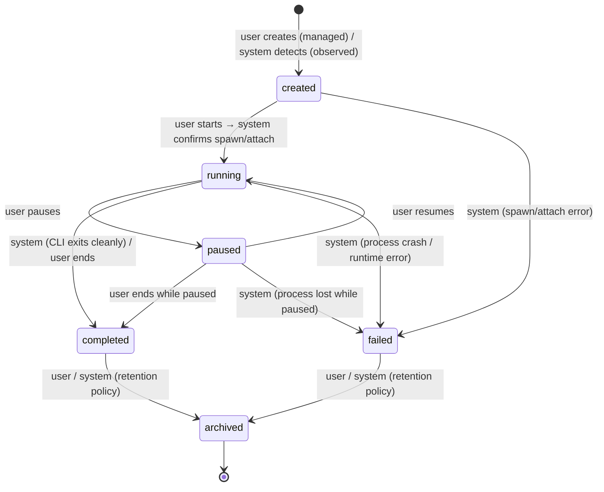

# TDS 01 — Foundation Decisions (WS0)

- **Status:** Locked — `architect-reviewer` approved 2026-08-11 (see §Sign-off)
- **Owner:** WS0 / backend-architect
- **Date:** 2026-08-11
- **Inputs:** `Requirements.md` (PRD v2.1), `CLAUDE.md`, `docs/project-plan.md`
- **Reference consulted:** builderz-labs/mission-control (self-hosted AI-runtime control plane) — used as domain validation for F1/F2/F5, not adopted wholesale. Where the reference conflicts with the PRD (e.g., SQLite), the PRD wins.

These nine decisions are the Foundation Contract. WS1–WS6 consume them verbatim and may not amend them; conflicts are escalated to the orchestrator → `architect-reviewer`. No TBDs exist on F1–F7. The R1 research spike on programmatic Claude Code control is complete (`docs/research/claude-code-control-spike.md`) and its findings are incorporated in F1.5, which is now final.

---

## F1 — Tech Stack

### F1.1 Decision summary

| Layer | Choice |
|---|---|
| Language (whole stack) | TypeScript 5.x, strict mode |
| Backend runtime | Node.js 22 LTS |
| Backend framework | Fastify 5 (with `@fastify/websocket`) |
| Frontend | React 19 + Vite 6 (SPA), Tailwind CSS 4, dark-mode-first |
| Data layer / ORM | Drizzle ORM + drizzle-kit migrations, `pg` driver |
| Real-time transport | WebSocket (single multiplexed connection; see F5.6) |
| Package/workspace tooling | pnpm workspaces (monorepo) |
| Test tooling (baseline for WS6) | Vitest (unit/integration), Playwright (E2E) |

### F1.2 Backend: Node.js 22 + TypeScript + Fastify

**Rationale:** The core Phase 1 job is wrapping the Claude Code CLI as a child process with bidirectional streaming — Node's `child_process` + streams model is the native idiom for exactly this, and Claude Code itself (and its Agent SDK) is a Node/TypeScript product, so the wrapper, SDK types, and `stream-json` parsing live in the same ecosystem. Node runs identically on Windows 11 and Ubuntu with no platform-specific dependencies, satisfying the dual-OS constraint. One language across backend, workers, and frontend maximizes shared types (entities, event envelopes, API DTOs) in a single monorepo package. The builderz-labs reference implementation independently validates Node 22 + TypeScript + pnpm as proven in this exact domain.

**Rejected alternatives:**
- **Python + FastAPI** — subprocess/PTY streaming on Windows is notoriously weaker (no first-class PTY, asyncio subprocess quirks); splits the stack into two languages.
- **Go** — excellent process control, but no Agent SDK affinity, no shared types with the frontend, slower iteration for a single-developer product.
- **NestJS (instead of Fastify)** — heavier abstraction with DI ceremony this single-user system doesn't need; Fastify gives schema validation and speed without the framework tax.

### F1.3 Frontend: React 19 + Vite (SPA) + Tailwind CSS 4

**Rationale:** The dashboard is an authenticated, operator-focused, real-time SPA — there is no SEO or public-content requirement, so SSR buys nothing and adds a server runtime to manage on two OSes. Vite builds static assets that the backend serves in production (single origin, no CORS, one fewer systemd unit). React + Tailwind matches the reference implementation's validated choices (React 19, Tailwind 4) and has the deepest ecosystem for the components we need (virtualized chat logs, charts, terminal-style views such as xterm.js if WS4 adopts it).

**Rejected alternatives:**
- **Next.js App Router** (reference's choice) — SSR/RSC complexity and a Node server per environment for zero benefit in a self-hosted, login-gated dashboard; our realtime and process control belong in the Fastify backend, not a Next server.
- **SvelteKit** — capable, but smaller ecosystem for chat/terminal/monitoring components and less shared-type tooling maturity.

### F1.4 Data layer: Drizzle ORM + drizzle-kit

**Rationale:** SQL-first with zero runtime binary dependencies (pure TypeScript over `pg`), so it behaves identically on Windows and Ubuntu. Schema-as-code generates both migrations and shared TS types consumed by API contracts (WS2) and the frontend (WS4). Migrations are plain SQL files — reviewable, and usable by WS3 as the DDL source of truth.

**Rejected alternatives:**
- **Prisma** — ships a platform-specific query-engine binary and its own migration DSL; heavier and less SQL-transparent.
- **Knex/raw SQL** — no type generation; hand-maintained types would drift across six parallel workstreams.

### F1.5 Claude Code wrapper approach — FINAL (spike incorporated)

> Finalized per the R1 research spike: `docs/research/claude-code-control-spike.md` (2026-08-11). The spike's SDK recommendation strongly reinforces the TypeScript backend choice in F1.2. WS1 owns the detailed wrapper design within these boundaries.

**Decision: hybrid wrapper — Agent SDK for managed sessions, hooks + transcript tailing for observed sessions.**

- **Managed sessions — Claude Agent SDK (`@anthropic-ai/claude-agent-sdk`, TypeScript), embedded in the Backend.** Full agentic loop with built-in tools; per-turn async-generator streaming with `includePartialMessages: true` (`stream_event` deltas relayed over the F5.6 WebSocket); automatic session persistence to disk. Per-session cost and token usage captured from the SDK `ResultMessage` (`total_cost_usd`, `usage`) — the SDK path is the **canonical cost source** for managed sessions (PRD §4.1 cost metadata). No PTY is involved; the SDK abstracts process handling cross-platform.
  - *Fallback (documented, not designed-for):* raw CLI spawn via `execFile('claude', ['-p', …, '--input-format', 'stream-json', '--output-format', 'stream-json', '--include-partial-messages'])` — same event vocabulary, usable if an SDK gap appears.
- **Resume/clone/fork:** Claude Code's native session IDs (UUIDv4, generated by the runtime) map onto the Session entity's `runtime_session_id` — distinct from our UUIDv7 primary key (F4.2). SDK `resume: <id>` implements Resume; `forkSession: true` implements Clone. Per F7, resuming a completed session always creates a new Session record.
- **Observed sessions — two channels, both Phase 1:**
  1. **Hooks as push channel:** Mission Control writes a hooks profile into `.claude/settings.json` (project or user scope) registering HTTP-type hooks for `SessionStart`, `UserPromptSubmit`, `PostToolUse`, `Stop`, `SessionEnd`, POSTing JSON (session_id, transcript_path, tool payloads) to a dedicated Backend ingest endpoint (WS2 contract). A settings-writer/installer with clear UX is part of the wrapper design (WS1).
  2. **Transcript tailing as fidelity channel:** tail `~/.claude/projects/<encoded-cwd>/<session-id>.jsonl` (Windows: `%USERPROFILE%\.claude\projects\`; honor `CLAUDE_CONFIG_DIR`) behind a **version-tolerant parser isolated in an adapter module** — the JSONL format is internal to Claude Code and may drift between versions; parse failures degrade gracefully to hook-only observation, never crash the session record. Watch individual session files, not large trees (Windows watcher efficiency, per spike §8).
- **Permission gating (Phase 4 interface hook):** the runtime's control surfaces — `--permission-mode`, `--allowedTools`/`--disallowedTools` patterns, and `PreToolUse` hooks returning `permissionDecision: allow|deny|ask` — are the designated enforcement mechanism onto which the Agent permissions entity (PRD §5.5) will map. Phase 1 uses static defaults; the interface is reserved, not designed.
- **Concurrency:** multiple concurrent sessions are safe at the runtime level (per-session JSONL, atomic appends, concurrency-safe auth). The real constraint is Anthropic plan rate limits — session launches respect the `max concurrent sessions` setting (PRD §4.4.2) and rate-limit stop reasons trigger backoff/queueing via the F3 queue.
- **Windows dev parity:** native `claude.exe` (requires Git for Windows ≥ 2.31), PowerShell tool auto-enabled, no WSL/Docker — consistent with all F8 constraints.

**Rejected alternatives:**
- **Raw CLI `stream-json` wrapper as primary** — workable but re-implements what the SDK provides (session mgmt, partial-message streaming, hooks, cost capture); kept as fallback only.
- **PTY-based interactive wrapping (`node-pty`)** — unnecessary given first-class headless/SDK modes; native-module build burden on two OSes.
- **Transcript tailing as the *only* observation channel** — brittle against format drift; hooks provide a supported push channel, so tailing is demoted to fidelity enhancement.

---

## F2 — Service Topology & Boundaries

### F2.1 Canonical service list (locked names)

| # | Service | Kind | Process model (V1) | Phase |
|---|---|---|---|---|
| 1 | **Frontend** | Static SPA build artifact | Served by Backend in prod; Vite dev server in dev | 1 |
| 2 | **Backend** | Node/Fastify app: API, auth, session manager (Claude wrapper), WebSocket hub, GitHub integration | Own process (systemd unit / dev console) | 1 |
| 3 | **PostgreSQL** | Database + queue substrate (see F3) | Native install (Windows service / systemd) | 1 |
| 4 | **Telegram Worker** | Notification dispatcher | Separate Node process, same monorepo | 2 |
| 5 | **Sync Worker** | Obsidian two-way sync, ADR generation, repo polling jobs | Separate Node process, same monorepo | 2 |
| 6 | **Qdrant** | Vector store | Native binary | 3 — *interface only in TDS* |
| 7 | **Ollama** (optional) | Local model runtime | Native install | 3+ — *interface only* |
| 8 | **Graphify** (optional) | Structural code memory (Claude Code skill) | Per-repo skill, later Sync Worker refresh | 3+ — *interface only* |

**Redis does not appear in the topology** — eliminated by F3. The Settings → Services health view (PRD §4.4.7) shows **"Queue (PostgreSQL)"** in its place, satisfying the PRD's "Redis (or dev substitute)" wording.

### F2.2 Workers: separate processes, shared monorepo

**Decision:** Telegram Worker and Sync Worker are **separate OS processes** (own systemd units in prod, own dev console processes), built from the same pnpm monorepo and sharing the `packages/shared` data layer. They communicate with the Backend exclusively through the PostgreSQL-backed queue and events (F3/F6) — never via direct HTTP calls between internal services.

**Rationale:** The PRD names them as distinct services with individually reported health (§4.4.7, §13), and both do failure-prone I/O (Telegram network calls, Obsidian file churn, git polling) that must not be able to stall the API/live-chat path or the Claude child processes. Separate processes cost almost nothing here because the queue substrate (F3) already decouples them; keeping them in one monorepo avoids microservice overhead. This mirrors the reference implementation's pattern of a governance/control layer above runtimes with lean supporting processes.

**Rejected alternatives:**
- **Workers as Backend modules (single process)** — simpler start, but one Obsidian sync bug or Telegram outage loop can degrade live session streaming; also breaks per-service health reporting mandated by §4.4.7.
- **Full microservices with HTTP APIs between services** — needless for a single-node, single-user system; the queue is the only inter-process contract required.

### F2.3 Frontend serving

**Decision:** In production the Backend serves the built SPA from a static directory (single origin, no reverse proxy required in V1; nginx remains an optional later hardening step, not part of the design). In development, Vite dev server proxies `/api` to the Backend.

---

## F3 — Queue/Cache Strategy (the Redis decision)

**Decision: No Redis anywhere in V1.** PostgreSQL is the single stateful substrate:

1. **Job queue:** [pg-boss](https://github.com/timgit/pg-boss) (PostgreSQL-backed job queue, `SKIP LOCKED`-based) behind a thin `QueuePort` interface owned by `packages/shared`. All async work (notifications, syncs, exports, report generation) goes through it.
2. **Cross-process eventing:** PostgreSQL `LISTEN/NOTIFY` as the wake-up channel; durable event records live in queue/outbox tables (see F6). In-process fan-out inside the Backend uses a typed EventEmitter.
3. **Cache:** per-process in-memory caches (LRU with TTL) only. No shared cache tier exists in V1.

**Rationale:** Redis has no official native Windows build, which makes any hard Redis dependency a direct violation of the dev-parity constraint (risk R2). This is a single-node, single-user system whose queue throughput is trivially within PostgreSQL's capability, so a second stateful service adds operational surface for zero benefit — the reference implementation's "keep infra lean" instinct (they went as far as SQLite) validates this direction, while our PRD's PostgreSQL mandate gives us a durable queue substrate for free. `QueuePort` keeps the door open: if V2+ ever needs Redis/BullMQ on Ubuntu, it is a driver swap, not a redesign.

**Rejected alternatives:**
- **Memurai on Windows dev + real Redis on Ubuntu** — two different queue engines between dev and prod is a parity trap; adds a paid/third-party dependency.
- **In-process queue only (no persistence)** — loses jobs on restart; workers are separate processes (F2.2) and need a durable cross-process channel.
- **Redis with an embedded dev substitute (e.g., miniredis-style)** — emulators diverge from real Redis semantics exactly where queues bite (blocking ops, expiry).

**Consequences:** WS3 includes pg-boss's schema (own `pgboss` schema, treated as vendored); WS1's health view reports queue depth from PostgreSQL; F6 delivery semantics are defined against pg-boss.

---

## F4 — Canonical Entity List & Conventions

### F4.1 Entities (locked vocabulary)

| Entity | DB table | Phase | Notes |
|---|---|---|---|
| User | `users` | 1 | Single local account in V1; table anyway (future OIDC) |
| Workspace | `workspaces` | 1 | Single default workspace in V1 |
| Project | `projects` | 1 | |
| Repository | `repositories` | 1 | |
| Commit | `commits` | 1 | Git commit tracking (PRD §4.3) |
| PullRequest | `pull_requests` | 1 | |
| Session | `sessions` | 1 | State machine per F7 |
| Message | `messages` | 1 | Roles: user / assistant / system / tool |
| Adr | `adrs` | 2 | Context/Decision/Alternatives/Consequences |
| Notification | `notifications` | 2 | |
| Setting | `settings` | 1 | DB-stored config per PRD §4.4; bootstrap excluded (F8) |
| SecretItem | `secret_items` | 1 | Encrypted at rest (AES-256-GCM, key from bootstrap env) |
| AuditLogEntry | `audit_log_entries` | 1 | Captures setting changes, auth, git/agent actions |
| Agent | `agents` | 4 | *Skeleton table only in TDS* |
| AgentTeam | `agent_teams` | 4 | *Skeleton table only* |
| MemoryItem | `memory_items` | 3 | *Skeleton table only* |

WS3 may add supporting tables (join tables, sync state, queue schema) but may not rename or add domain entities without escalation.

### F4.2 ID, naming, and timestamp conventions

- **IDs:** **UUIDv7**, generated in application code (`uuid` npm, v7), stored as PostgreSQL `uuid`. Time-ordered for index locality; sortable; safe to expose in URLs. *(Rejected: bigserial — leaks counts, awkward for offline generation; UUIDv4 — index-hostile randomness.)*
- **DB naming:** `snake_case`, **plural** table names, `snake_case` columns. FKs as `<entity>_id`. Enum-like values stored as lowercase `snake_case` text with CHECK constraints (e.g., `'running'`).
- **API naming:** `camelCase` JSON fields; entity names in PascalCase in docs/types.
- **Timestamps:** `timestamptz`, always UTC. Every table has `created_at` and `updated_at`. Lifecycle moments get dedicated nullable columns (`started_at`, `completed_at`, `archived_at`). API serializes ISO 8601 with `Z` suffix. No soft-delete convention by default; archival is an explicit state or `archived_at`.

---

## F5 — API Conventions

1. **Style:** Resource-oriented REST. Lifecycle verbs that don't map to CRUD are POST sub-actions: `POST /api/v1/sessions/{id}/pause`, `/resume`, `/archive`, `/clone`. The reference implementation validates REST + OpenAPI as the integration surface for this domain; WS2 authors the contract OpenAPI-first (OpenAPI 3.1, generated from Fastify schemas).
2. **URL scheme:** `/api/v1/<plural-resource>[/{id}[/<sub-resource|action>]]`, kebab-case path segments (`/api/v1/pull-requests`). Version bump only on breaking change; `v1` for all of V1.
3. **Pagination:** Cursor-based. Query params `limit` (default 50, max 200) and `cursor` (opaque, base64 of UUIDv7 ordering key). List responses: `{ "data": [...], "meta": { "nextCursor": string|null, "limit": number } }`. *(Rejected: offset pagination — unstable under live inserts, e.g., streaming messages.)*
4. **Error envelope:** every non-2xx returns `{ "error": { "code": "UPPER_SNAKE_CODE", "message": string, "details": object|null, "requestId": string } }`. `requestId` is also returned as `X-Request-Id` header and appears in logs.
5. **Auth (single local account):** username + password login (`POST /api/v1/auth/login`) creating a server-side session persisted in PostgreSQL, referenced by an **HTTP-only, SameSite=Lax session cookie**. Additionally, **bearer API tokens** (PRD §4.4.6 "API token management") for programmatic/CLI access, hashed at rest. *(Rejected: JWT — needless statelessness for one user; revocation and timeout are trivial with DB sessions.)*
6. **Real-time channel: WebSocket** (not SSE). Single multiplexed connection at `/api/v1/ws`, authenticated by the session cookie at upgrade, with subscribe/unsubscribe frames per channel (e.g., `session:{id}`, `notifications`). Chosen because live session chat is **bidirectional** (prompt transmission client→server plus token streaming server→client, PRD §4.2), and one duplex channel is simpler than SSE-plus-POST for multi-session support. Wire frames carry the F6 envelope. *(Rejected: SSE — one-directional, needs a parallel POST path and per-stream connections; the reference exposes both surfaces, but a single canonical channel keeps V1 lean. SSE remains a possible V2 addition for read-only monitors.)*

---

## F6 — Event Model

1. **Naming grammar:** dot-separated lowercase `snake_case`: `<domain>.<verb-past>` with optional sub-entity — `<domain>[.<sub-entity>].<verb-past>`. Domains match F4 entities or subsystems (`session`, `message`, `repository`, `pull_request`, `adr`, `sync`, `notification`, `setting`, `agent` [Phase 4 reserved], `memory` [Phase 3 reserved]). Examples: `session.created`, `session.state_changed`, `session.message.appended`, `session.completed`, `session.failed`, `repository.synced`, `sync.failed`, `notification.sent`, `setting.updated`.
2. **Envelope (all events, persisted and over WebSocket):**

```json
{
  "id": "<uuidv7>",
  "type": "session.completed",
  "schemaVersion": 1,
  "occurredAt": "2026-08-11T14:03:22.000Z",
  "source": "backend | telegram-worker | sync-worker",
  "correlationId": "<uuidv7 | null>",
  "payload": { "sessionId": "…", "…": "…" }
}
```

Payloads always carry entity IDs, never full entities; consumers fetch current state via the API. `correlationId` links event chains (e.g., session → notification).

3. **Delivery semantics: at-least-once**, via pg-boss (F3). Consumers must be **idempotent**, deduplicating on event `id`. Ordering is guaranteed only per queue, not globally. Events flow: producer writes domain change + enqueues event in the **same PostgreSQL transaction** (transactional outbox by construction — the queue *is* Postgres), pg-boss dispatches to worker consumers; the Backend's WebSocket hub relays a UI-relevant subset to subscribed clients (best-effort, no replay in V1 — clients refetch on reconnect).
4. **Where events live:** pg-boss job tables are the durable log for in-flight delivery; long-term event history relevant to the product (audit, timeline) is written to domain tables (`audit_log_entries`, session timeline), not mined from the queue.

*(Rejected: CloudEvents spec envelope — more fields than we need; our envelope is a strict subset in spirit and could be mapped later. Rejected: exactly-once claims — dishonest without idempotent consumers anyway.)*

---

## F7 — Session State Machine (canonical)

States (stored lowercase: `created`, `running`, `paused`, `completed`, `failed`, `archived`):



| From | To | Trigger |
|---|---|---|
| — | created | **User** (managed launch) or **System** (observed session detected) |
| created | running | **User** action `start`; system confirms child-process spawn / attach |
| created | failed | **System** — spawn or attach error |
| running | paused | **User** action `pause` |
| paused | running | **User** action `resume` |
| running | completed | **System** — CLI process exits cleanly; or **User** action `end` |
| paused | completed | **User** action `end` |
| running | failed | **System** — process crash, runtime error, unrecoverable stream loss |
| paused | failed | **System** — underlying process lost while paused |
| completed | archived | **User** action `archive`, or **System** retention policy |
| failed | archived | **User** action `archive`, or **System** retention policy |

**Rules:** `completed`, `failed` are semi-terminal (only → `archived`); `archived` is terminal. **"Resume Session" on a completed/archived session creates a NEW Session record** (linked via `resumed_from_session_id`, using the runtime's native resume, F1.5) — states never move backward. Every transition emits `session.state_changed` (plus the specific event, e.g., `session.completed`) and is recorded with timestamp + trigger (`user` | `system`) for the session timeline. Invalid transitions are rejected by the API with error code `INVALID_STATE_TRANSITION`.

---

## F8 — Cross-Platform Process Model & Config Split

### F8.1 Repository & process layout

pnpm monorepo:

```
apps/backend/           # Fastify app (serves SPA in prod)
apps/telegram-worker/
apps/sync-worker/
apps/frontend/          # React + Vite SPA
packages/shared/        # entities, Drizzle schema, QueuePort, event types, config loader
deploy/systemd/         # *.service unit files (prod only — never imported by app code)
deploy/windows/         # dev run scripts (PowerShell + cross-platform npm scripts)
```

- **Windows 11 dev:** PostgreSQL installed natively (Windows service). Each app runs as a console process; root script `pnpm dev` (via `concurrently`) starts backend + workers + Vite dev server. No Windows-service registration required for the apps in dev.
- **Ubuntu prod:** one systemd unit per app process (`mission-control-backend.service`, `mission-control-telegram-worker.service`, `mission-control-sync-worker.service`) with `After=postgresql.service`, `Restart=on-failure`. Frontend is static files served by the backend (F2.3). systemd knowledge lives only in `deploy/`; application code is process-manager-agnostic (starts in foreground, logs to stdout, exits nonzero on fatal — works identically under a console or systemd).
- **Path rules:** all paths built with `node:path`; user-provided paths (Obsidian vault, repo roots, Claude CLI path) stored as absolute native paths in Settings and validated by Test Connection; a `MC_DATA_DIR` env var (default: platform data dir) roots any app-owned files. No shell-outs to platform-specific commands; git/CLI invocations use `execFile` with explicit executable paths.

### F8.2 Config split (per PRD §4.4)

**Bootstrap settings — env/config file only** (`.env`, loaded at process start; required before DB is reachable):

| Variable | Purpose |
|---|---|
| `DATABASE_URL` | PostgreSQL connection string |
| `MC_HOST` / `MC_PORT` | Backend listen address (default `127.0.0.1:8710`) |
| `MC_ENCRYPTION_KEY` | 32-byte key (base64) for AES-256-GCM secret encryption |
| `MC_DATA_DIR` | App-owned data directory root |
| `NODE_ENV`, `LOG_LEVEL` | Environment/logging |

**Everything else lives in the `settings` table** and is managed exclusively through the Settings page (PRD §4.4): all integration config (GitHub, Claude Code, Telegram, Obsidian, Qdrant, Ollama), notifications, memory, agents, security policy. Secrets go to `secret_items`, encrypted with `MC_ENCRYPTION_KEY`, write-only in the UI. Workers read settings from the DB via `packages/shared`; setting changes emit `setting.updated` so processes refresh without restart. Minor open point (allowed by gate criteria): whether dev uses `.env` files per app or one root `.env` — WS1 decides; the variable set above is locked.

---

## F9 — TDS Documentation Conventions

1. **File map** (locked, per project plan):

```
docs/tds/00-overview.md                             (WS7)
docs/tds/01-foundation-decisions.md                 (WS0 — this file)
docs/tds/02-service-architecture-and-deployment.md  (WS1)
docs/tds/03-database-schema.md                      (WS3)
docs/tds/04-api-contracts-and-events.md             (WS2)
docs/tds/05-frontend-architecture.md                (WS4)
docs/tds/06-wireframes-and-design-system.md         (WS5)
docs/tds/07-test-strategy.md                        (WS6)
```

2. **Heading structure:** H1 title `TDS NN — <Name> (WSn)`; status/owner/date/inputs header block (as at the top of this file); `##` numbered major sections; every document cites the foundation decisions it consumes (e.g., "per F5.3").
3. **Phase 3–5 placeholder callout (mandatory, exact format):**

```markdown
> **Phase N — interface only.** This section is a placeholder/extension point.
> Detailed design is out of TDS scope per the project-plan scope guard.
```

Any Agent/Memory/multi-runtime content beyond an interface stub is a scope violation and gets flagged in WS7's constraint audit.

4. **Diagrams:** Mermaid fenced blocks (`stateDiagram-v2`, `sequenceDiagram`, `erDiagram`, `flowchart`). ASCII permitted only for wireframes (WS5).
5. **Vocabulary discipline:** entity names per F4.1, session states per F7, event names per F6 — verbatim, no synonyms ("Session", never "Run"/"Job"; `paused`, never `suspended`).

---

## Sign-off

| Role | Status |
|---|---|
| backend-architect (WS0 author) | Decided — 2026-08-11 |
| architect-reviewer | **Approved** — 2026-08-11. Gate open for WS1–WS6. Non-blocking findings below. |

**Non-blocking findings (recorded for downstream workstreams; no foundation change required):**

1. **PRD §13 deviation (deliberate):** Redis is listed as a production service in the PRD but is eliminated by F3. This is a sanctioned option under the project plan's F3 mandate and consistent with PRD §4.4.7's "Redis (or dev substitute)" wording; WS7 should record it in `00-overview.md` as an explicit, intentional PRD deviation.
2. **Pause semantics for SDK-managed sessions (WS1):** the Agent SDK has no native "pause" primitive. WS1 must define the physical meaning of `paused` for managed sessions (e.g., interrupt current turn and/or stop accepting prompts) and for observed sessions, where several user-triggered F7 transitions (pause/resume/end) may be inapplicable or observation-only. The F7 state machine itself stands as canonical.
3. **WebSocket upgrade hardening (WS2):** cookie-authenticated upgrades at `/api/v1/ws` should validate the `Origin` header (single-origin check) to prevent cross-site WebSocket hijacking; SameSite=Lax alone does not cover WS upgrades.
4. **pg-boss transactional enqueue (WS3):** F6.3's "same transaction" outbox claim requires enqueueing jobs on the caller's transaction (pg-boss `insert` with a supplied db/transaction handle, or direct insert into the pg-boss job table). WS3 should pin the exact mechanism so the outbox guarantee is real, not aspirational.
