# TDS 02 — Service Architecture & Deployment (WS1)

- **Status:** Draft for WS7 review
- **Owner:** WS1 / backend-architect (instance A)
- **Date:** 2026-08-11
- **Inputs:** `docs/tds/01-foundation-decisions.md` (Foundation Contract, consumed verbatim — esp. F1, F2, F3, F7, F8), `Requirements.md` (PRD v2.1 §4.1–4.2, §4.4, §13), `docs/project-plan.md` (WS1 scope), `docs/research/claude-code-control-spike.md`
- **Resolves:** WS0 sign-off finding #2 (physical pause semantics for managed/observed sessions — §5) and the delegated F8.2 TBD (root vs per-app `.env` — §8.2)
- **Non-goals:** HTTP endpoint shapes/OpenAPI (WS2), event payload catalog (WS2), table DDL (WS3), frontend internals (WS4), UI layouts (WS5), test plans (WS6). Where this document names an endpoint, queue, or table, it names a *responsibility*; the owning workstream defines the contract.

---

## 1. Process Topology

Per F2.1/F2.2 and F8.1, Mission Control V1 is four application processes plus PostgreSQL, all native, no Docker, no reverse proxy. Workers never speak HTTP to the Backend; the only inter-process contracts are the PostgreSQL-backed queue and `LISTEN/NOTIFY` (F3).

```mermaid
flowchart TB
    subgraph client["Browser / Mobile"]
        SPA["Frontend SPA (React 19 + Vite build)"]
    end

    subgraph host["Single host (Ubuntu prod / Windows 11 dev)"]
        subgraph be["Backend process (Fastify, :8710)"]
            API["REST API /api/v1"]
            WSHUB["WebSocket hub /api/v1/ws"]
            SM["Session Manager (Agent SDK wrapper)"]
            ING["Observed-session ingest (hooks + tailer)"]
            GH["GitHub integration"]
            SET["Settings service"]
            AUTH["Auth"]
            HLTH["Health aggregator"]
            QP["Queue producers/consumers"]
            STATIC["Static SPA serving (prod)"]
        end
        TG["Telegram Worker process"]
        SY["Sync Worker process"]
        PG[("PostgreSQL 16+ (data + pg-boss queue)")]
        CLI["claude (Agent SDK child processes, one per active managed session)"]
        EXT["External Claude Code sessions (user terminals)"]
        FS["Filesystem: MC_DATA_DIR, Obsidian vault, repos, ~/.claude"]
    end

    GHAPI["GitHub API"]
    TGAPI["Telegram Bot API"]
    QD[("Qdrant — Phase 3, placeholder")]
    OL["Ollama — Phase 3+, optional placeholder"]

    SPA -- "HTTPS + WS (session cookie)" --> API
    SPA --- WSHUB
    SM --> CLI
    EXT -- "HTTP hooks POST" --> ING
    ING -- "tail JSONL" --> FS
    be <--> PG
    TG <--> PG
    SY <--> PG
    GH --> GHAPI
    TG --> TGAPI
    SY --> FS
    be -.Phase 3.-> QD
    be -.Phase 3+.-> OL
```



### 1.1 Process inventory and ports

| Process | Monorepo app (F8.1) | Listens on | Talks to | Phase |
|---|---|---|---|---|
| Backend | `apps/backend` | `MC_HOST:MC_PORT` (default `127.0.0.1:8710`) | PostgreSQL, GitHub API, Claude runtime, filesystem | 1 |
| Frontend | `apps/frontend` | — (static artifact; Vite dev server `:5173` in dev only) | Backend | 1 |
| PostgreSQL | native install | `:5432` (localhost) | — | 1 |
| Telegram Worker | `apps/telegram-worker` | *nothing* (no HTTP server) | PostgreSQL, Telegram Bot API | 2 |
| Sync Worker | `apps/sync-worker` | *nothing* (no HTTP server) | PostgreSQL, Obsidian vault FS, git repos | 2 |
| Qdrant | native binary | `:6333` (default) | — | 3 — interface only (§11.1) |
| Ollama | native install | `:11434` (default) | — | 3+ — interface only (§11.2) |
| Graphify | Claude Code skill (per-repo) | — | repo FS | 3+ — interface only (§11.3) |

Workers deliberately expose no ports: they are queue consumers only (F2.2), which shapes the health model (§7 — heartbeat rows, not HTTP probes).

### 1.2 Data directories (`MC_DATA_DIR`)

All app-owned files live under `MC_DATA_DIR` (F8.1 path rules; default: platform data dir — `%LOCALAPPDATA%\MissionControl` on Windows, `/var/lib/mission-control` on Ubuntu):

```
MC_DATA_DIR/
  exports/          # session exports, context packages (PRD §4.1)
  hooks/            # generated hook profile fragments + installer state (§6.2)
  tmp/              # scratch; safe to delete when processes are stopped
```

Logs are **not** written here (§9.4 — stdout only). PostgreSQL data and the Obsidian vault are user/OS-managed and outside `MC_DATA_DIR`; the Claude runtime owns `~/.claude` (honoring `CLAUDE_CONFIG_DIR`), which Mission Control reads (transcripts) and surgically writes (hook profiles) but never relocates.

---

## 2. Backend Internal Architecture

One Fastify 5 process (F1.2). Internally modular, monolithic by design — modules communicate through a typed in-process event bus and shared services, never by importing each other's internals.

```
apps/backend/src/
  main.ts                  # process entry: config load, DB pool, plugin registration, listen
  http/                    # Fastify wiring: route plugins per domain, error envelope (F5.4),
                           #   request-id, auth guards; serves SPA static dir in prod (F2.3)
  auth/                    # local account login, DB-backed sessions, cookie issuance,
                           #   bearer API tokens (F5.5); password hashing (argon2id)
  ws/                      # WebSocket hub: single multiplexed /api/v1/ws endpoint (F5.6),
                           #   channel registry (session:{id}, notifications, services:health),
                           #   subscribe/unsubscribe frames, F6-envelope relay, backpressure
  sessions/                # Session domain (F7 state machine owner)
    state-machine.ts       #   the ONLY code path that mutates sessions.state; emits
                           #   session.state_changed (+specific events) transactionally (F6.3)
    manager.ts             #   ManagedSessionRegistry: slot pool, launch queue consumer (§4.3)
    managed/               #   Agent SDK controller per active session (§4)
    observed/              #   hook ingest handler + transcript tailer adapter (§6)
    export.ts              #   session export / context package generation (writes MC_DATA_DIR/exports)
  github/                  # repo discovery (scan roots from settings), commit/PR polling
                           #   producers; REST calls via execFile-free octokit; results → DB + events
  settings/                # settings service: typed read/write over settings/secret_items,
                           #   AES-256-GCM via shared crypto, audit log writes, setting.updated
                           #   emission, Test Connection executors (GitHub/Telegram/Obsidian path/
                           #   Claude CLI; Qdrant/Ollama stubs Phase 3)
  health/                  # health aggregator for PRD §4.4.7 (§7)
  events/                  # typed EventEmitter bus (in-process fan-out, F3.2) + outbox helper
                           #   that persists domain change + enqueues event in one tx (F6.3)
  queue/                   # QueuePort consumers/producers owned by the Backend
                           #   (session.launch consumer §4.3; notification/sync job producers)
```

Module rules:

- **Only `sessions/state-machine.ts` transitions Session state.** Managed controllers, observed ingest, recovery, and API handlers all call it; it validates against F7, records timestamp + trigger (`user`|`system`), and emits events via the outbox helper. This is how six writers stay consistent with one state machine.
- **`ws/` is a dumb relay.** It subscribes to the in-process bus, filters to UI-relevant event types per channel, and forwards F6 envelopes. Best-effort, no replay (F6.3); clients refetch on reconnect.
- **`http/` owns no business logic** — routes validate (Fastify schemas, the WS2 OpenAPI source) and delegate to domain modules.

### 2.1 `packages/shared` contents

Consumed by all three Node apps and (types only) the frontend:

| Export | Contents |
|---|---|
| `schema` | Drizzle schema — WS3's DDL source of truth (F1.4) |
| `entities` | TS types for F4.1 entities + API DTO types (camelCase per F4.2) |
| `events` | F6 envelope type, event-type string union, payload types (payload *shapes* owned by WS2) |
| `queue` | `QueuePort` interface + pg-boss driver (F3.1); queue name constants |
| `config` | bootstrap env loader/validator (§8): reads env, applies defaults, fails fast with named missing vars |
| `settings-client` | DB-backed settings reader with in-process LRU+TTL cache, invalidated on `setting.updated` NOTIFY (F3.3, F8.2) |
| `crypto` | AES-256-GCM encrypt/decrypt for `secret_items` using `MC_ENCRYPTION_KEY` |
| `logger` | pino factory: JSON to stdout, `requestId`/`sessionId` bindings (§9.4) |
| `heartbeat` | worker heartbeat writer (§7.2) |

Workers import `queue`, `config`, `settings-client`, `crypto`, `logger`, `heartbeat`, `schema` — never Backend modules.

### 2.2 Worker internal shape (Phase 2)

Both workers follow the same skeleton: `main.ts` (config, DB pool, heartbeat start) + pg-boss subscriptions + a small domain core.

- **Telegram Worker** (`apps/telegram-worker`): consumes notification-dispatch jobs (queue names per WS2 catalog), reads bot token/chat id via `settings-client`, sends via Bot API with retry/backoff (pg-boss retry policy), writes `notifications` delivery state, emits `notification.sent`. Also owns the scheduled daily-report job (pg-boss cron).
- **Sync Worker** (`apps/sync-worker`): consumes Obsidian sync jobs and scheduled repo-polling jobs; two-way vault sync with conflict policy from settings; ADR file generation; emits `repository.synced`, `sync.failed`, `adr.*` events. All FS paths from settings, validated absolute native paths (F8.1). Graphify refresh hangs off this worker in Phase 3+ (§11.3).

---

## 3. Inter-Process Communication Summary

Per F3/F6 — restated here only as the wiring diagram; semantics are locked in the Foundation Contract and payloads are WS2's.

| Path | Mechanism |
|---|---|
| Browser ↔ Backend | REST `/api/v1` + one multiplexed WebSocket (F5.6) |
| Backend ↔ Workers | pg-boss jobs (durable, at-least-once) + `LISTEN/NOTIFY` wake-ups (F3) |
| Backend ↔ Claude runtime (managed) | Agent SDK in-process API → SDK-managed child processes (§4) |
| External Claude sessions → Backend | HTTP hook POSTs to ingest endpoint + JSONL transcript tailing (§6) |
| Domain change + event | same-transaction outbox write via `events/` helper (F6.3; mechanism pinned by WS3 per sign-off finding #4) |
| Settings propagation | DB write → `setting.updated` event → NOTIFY → each process's `settings-client` cache invalidation; no restarts (F8.2) |

---

## 4. Claude Code Wrapper — Managed Sessions (F1.5)

The Session Manager embeds `@anthropic-ai/claude-agent-sdk` in the Backend. No PTY, no raw spawn (raw CLI `stream-json` remains the documented fallback per F1.5, not designed for here).

### 4.1 Process/task model

One **`ManagedSessionController`** instance per Session in `running` state, owned by the `ManagedSessionRegistry` (in-memory map keyed by Session id — the UUIDv7 PK, F4.2).

Each controller holds:

- an SDK `query()` in **streaming-input mode**: the prompt argument is an async iterable fed by the controller's **prompt inbox** (an async queue). This keeps the SDK session (and its underlying `claude` child process) alive across turns, enabling multi-turn live chat (PRD §4.2) without re-resume latency per prompt.
- `options`: `includePartialMessages: true`; `resume: runtime_session_id` when resuming/recovering; `forkSession: true` for Clone; cwd = project repo path; model + permission defaults from settings (`Claude Code` integration category, PRD §4.4.2). Phase 1 uses static permission defaults; the F1.5 permission-gating surface is reserved for Phase 4 (§11.4).
- a **pump task**: a single async loop iterating the SDK message stream, feeding the streaming pipeline (§4.2).
- turn bookkeeping: `idle | turn_in_flight`, last-activity timestamp, accumulated cost.

Lifecycle: `create` (Session row in `created`, no controller) → user `start` → registry acquires a concurrency slot (§4.3) → controller constructed, SDK query opened → on the SDK init/system message carrying the runtime session id, persist `runtime_session_id` and transition `created → running` ("system confirms spawn", F7). SDK/spawn errors before that point transition `created → failed`.

```mermaid
sequenceDiagram
    participant UI as Browser
    participant WS as WS hub
    participant API as Backend API
    participant REG as ManagedSessionRegistry
    participant C as SessionController
    participant SDK as Agent SDK (claude child)
    participant DB as PostgreSQL

    UI->>API: POST sessions/{id}/start
    API->>REG: launch(sessionId)
    REG->>REG: acquire slot (or enqueue, §4.3)
    REG->>C: construct controller
    C->>SDK: query({ prompt: inbox, includePartialMessages: true, ... })
    SDK-->>C: system/init (runtime session id)
    C->>DB: save runtime_session_id; state → running (tx + events)
    UI->>WS: frame: prompt (channel session:{id})
    WS->>C: enqueue prompt → inbox
    C->>DB: persist Message(role=user); emit session.message.appended
    SDK-->>C: stream_event deltas / assistant / tool messages
    C-->>WS: normalized frames → session:{id} subscribers
    C->>DB: persist completed Messages
    SDK-->>C: result (total_cost_usd, usage)
    C->>DB: accumulate session cost/tokens; turn → idle
```

### 4.2 Streaming pipeline

Per SDK message, the pump:

1. **Normalizes** SDK message types (`system`, `assistant`, `user`, `stream_event`, `result`) into Mission Control's wire frames (frame schema owned by WS2, carried in the F6 envelope over `session:{id}`).
2. **Relays deltas ephemerally**: `stream_event` text/`input_json_delta` fragments go straight to the WS hub; they are *not* persisted (best-effort per F6.3 — a reconnecting client refetches messages and misses only in-flight deltas).
3. **Persists at message granularity**: completed assistant/tool/user messages become `messages` rows (roles per F4.1) written with their `session.message.appended` event in one transaction.
4. **Handles `result`**: captures `total_cost_usd` and `usage` — the canonical cost source (F1.5) — accumulates onto the Session, marks the turn idle, and services the next inbox prompt if queued.

Backpressure: the WS hub relay is fire-and-forget per socket with a bounded per-socket buffer; a slow browser gets deltas dropped (it recovers via refetch), never stalling the pump or the DB write path.

### 4.3 Max-concurrent enforcement and queue backoff

- The registry holds a semaphore sized by the `max concurrent sessions` setting (PRD §4.4.2), re-read on `setting.updated` (shrinking takes effect as slots free; running sessions are never killed to shrink).
- `start`/`resume` requests when saturated do **not** fail: the Session stays `created` (or `paused`) and a durable `session.launch` job is enqueued via `QueuePort` (survives Backend restarts, F3). A single Backend consumer dequeues launches as slots free, in FIFO order. The API response distinguishes "started" from "queued for launch" (surface: WS2).
- **Rate-limit backoff (F1.5):** when a turn ends with a rate-limit/budget stop reason, the controller keeps the Session `running` (the turn failed; the session did not), surfaces the condition over the WS channel, and re-enqueues the affected prompt as a delayed job with exponential backoff + jitter (pg-boss retry with `retryDelay`/`retryBackoff`). Repeated exhaustion past the retry policy marks that prompt's turn failed and notifies (Phase 2: Telegram alert path) — it does not transition the Session to `failed`, because the process is healthy.

### 4.4 Crash and restart recovery

Two failure classes:

- **Child/SDK failure while Backend lives:** the pump observes stream error or abnormal termination → controller disposes → state machine: `running → failed` (system trigger, reason recorded on the timeline). Cost captured so far is already persisted per turn.
- **Backend process restart:** all SDK child processes die with it. On boot, the Session Manager runs recovery:
  1. Sessions in `running` (managed) with no live controller → `running → failed` (system, reason `backend_restart`). F7 has no system path back into `running`, and silently auto-respawning an agentic session that may have been mid-tool-execution is unsafe; the UI offers one-click **Resume**, which per F7 creates a **new** Session linked via `resumed_from_session_id`, using SDK `resume: runtime_session_id` — full context restores from the runtime's own JSONL, so nothing is lost but the failed marker.
  2. Sessions in `paused` are untouched — pause is cold (§5.1), they hold no process, and they remain resumable.
  3. Pending `session.launch` jobs remain queued in pg-boss and are serviced normally.

This is deliberate: the runtime's on-disk session persistence (spike §3) is the durability layer; the Backend never tries to be one.

---

## 5. Physical Semantics of `paused` (resolves WS0 sign-off finding #2)

The F7 state machine is locked and unchanged. This section defines what its transitions physically *do*, given that the Agent SDK has no native pause primitive.

### 5.1 Managed sessions — cold pause

**Decision: `paused` = no process. Pause interrupts and disposes; resume re-attaches by runtime session id.**

On user `pause` (`running → paused`):

1. If a turn is in flight, the controller calls the SDK's `interrupt()` on the active query — the current turn aborts; partial assistant output already streamed is persisted as an interrupted message (flagged on the timeline).
2. The prompt inbox is closed; any prompts queued but not yet sent to the runtime are persisted as pending user Messages attached to the Session (they redisplay on resume; they are **not** auto-replayed — the operator paused for a reason and re-sends explicitly).
3. The SDK query is disposed and the child process exits. The concurrency slot is **released** (§4.3) — pausing session A frees capacity for session B, which is the operationally useful meaning of pause under a max-concurrent budget and Anthropic rate limits.
4. State machine records `running → paused` (user).

While `paused`: the API rejects prompt frames for the session (`SESSION_PAUSED` semantics; exact error code per WS2), no runtime process exists, nothing accrues cost.

On user `resume` (`paused → running`): acquire a slot (queueing via `session.launch` if saturated — the Session remains `paused` until launched), open a new SDK query with `resume: runtime_session_id` on the **same** Session record — F7's "resume creates a new Session" rule applies only to completed/archived sessions; `paused → running` is an in-place transition. The runtime restores full context from its JSONL (spike §3).

On user `end` while paused (`paused → completed`): pure state-machine transition; there is no process to stop.

`paused → failed` (system) occurs only when resume discovers the underlying runtime session is gone (JSONL deleted, e.g., by the runtime's ~30-day `cleanupPeriodDays` retention, or `CLAUDE_CONFIG_DIR` moved) — i.e., F7's "process lost while paused" physically means *resume target lost*, detected lazily at resume time or by a daily sweep that validates transcript existence for `paused` sessions.

**Rejected — warm pause** (keep the SDK process alive, merely gate prompts): holds a concurrency slot and memory for an idle process, makes `paused` sessions die on every Backend restart (turning routine deploys into `failed` cascades), and buys only marginal resume latency that runtime-native resume already makes small. Cold pause makes `paused` a durable, restart-proof, zero-cost state — which is what an operator dashboard wants it to mean.

### 5.2 Observed sessions — F7 applicability

Mission Control does not own the external process and never signals, kills, or throttles it. F7 transitions map as follows:

| F7 transition | Observed-session realization |
|---|---|
| — → `created` | System, on first hook event or discovered transcript for an unknown `runtime_session_id` |
| `created → running` | **System-only** (no user `start`): confirmed attach = ingest pipeline bound (hook receipt; tailer attached if transcript readable) |
| `created → failed` | System: attach error (e.g., transcript path unreadable *and* no further hook traffic) |
| `running → paused` / `paused → running` | **Not applicable.** MC cannot gate an external CLI. API rejects with `INVALID_STATE_TRANSITION` semantics; WS2 has since assigned the canonical code **`OPERATION_NOT_SUPPORTED` (409)** for this case (WS2 §1.3/§6.3) — the state is legal but the session type is not. This document's earlier provisional name `UNSUPPORTED_FOR_SESSION_TYPE` is superseded |
| `running → completed` (user `end`) | Realized as **"stop observing"**: MC detaches (ignores further hook events for the id, stops the tailer) and closes the record. The external session may keep running, unobserved. UI copy must say "Stop observing", not "End" (note for WS5) |
| `running → completed` (system) | `SessionEnd` hook received; or staleness fallback — no hook events *and* no transcript writes for the observation-timeout window (default 30 min, settings-tunable) |
| `running → failed` | System: ingest hard-failure only — hooks stopped mid-stream *and* the transcript is gone/truncated before any `SessionEnd`. Parser drift alone never causes this (§6.3 degrades instead) |
| `completed/failed → archived` | Identical to managed |

Resume/Clone of an observed session's *conversation* (via runtime `resume`/`forkSession` on its `runtime_session_id`) is legal and creates a **new managed** Session per F7 — the promotion path from observation to management.

---

## 6. Claude Code Wrapper — Observed-Session Ingest (F1.5)

Two channels, both Phase 1: hooks (push, supported surface) and transcript tailing (fidelity, version-sensitive).

### 6.1 Hook ingest endpoint

A dedicated Backend ingest route (contract: WS2) receives HTTP hook POSTs for `SessionStart`, `UserPromptSubmit`, `PostToolUse`, `Stop`, `SessionEnd`. The handler:

- authenticates via a per-install **hook token** generated by the installer (§6.2) and embedded in the hook URL/header — hooks run outside the browser session, so cookie auth does not apply; token is stored hashed like API tokens (F5.5),
- resolves `session_id` (runtime UUIDv4) → Session row, creating one (`created`, then `running` on bind, §5.2) on first sight; captures `transcript_path` from the payload and hands it to the tailer registry,
- appends hook-derived Messages/timeline entries idempotently (dedup on runtime event identity), inside the standard outbox transaction, and relays to `session:{id}` subscribers,
- always returns 200 fast (< 50 ms budget; work beyond row-append is deferred to the in-process bus) — a slow hook endpoint would visibly stall the user's own CLI session, which is unacceptable.

### 6.2 Hooks installer (settings-writer)

Part of the Settings → Claude Code integration UX (surface: WS2/WS5):

- writes the Mission Control hook profile into `.claude/settings.json` at **user scope** by default (observes all sessions on the machine) or **project scope** per repo, per operator choice,
- performs a **surgical JSON merge** — only Mission Control's own hook entries (identifiable by the MC ingest URL) are added/updated/removed; all other user settings are preserved verbatim; a pre-write backup copy is kept under `MC_DATA_DIR/hooks/`,
- records installed profile locations + hook token in `MC_DATA_DIR/hooks/state.json` so Test Connection can verify and uninstall is clean,
- honors `CLAUDE_CONFIG_DIR` and Windows paths (`%USERPROFILE%\.claude`) per F8.1.

### 6.3 Transcript tailer adapter and version tolerance

`sessions/observed/transcript-tailer.ts` implements a `TranscriptTailerPort` behind which **all** JSONL format knowledge is isolated (F1.5):

- watches **individual session files** only — `<config-dir>/projects/<encoded-cwd>/<session-id>.jsonl` — never directory trees (Windows watcher efficiency, spike §8); paths come from hook payloads' `transcript_path`, falling back to computed encoded-cwd paths,
- reads incrementally from a persisted byte offset (per-session tail state), parsing line-by-line,
- **version tolerance:** each line parses against a lenient schema — known fields extracted, unknown fields ignored, unknown line types counted and skipped. Parse failure policy: skip the line, increment a per-session drift counter; past a threshold, the tailer **detaches for that session and degrades to hook-only observation**, emitting **`session.observation_degraded`** (WS2 §6.9 / §15.2 — *not* `sync.failed`, which belongs to Obsidian sync runs and carries a meaningless `syncRunId` here) and surfacing a "degraded fidelity" badge on the session (UI: WS5, reading `Session.observation.degraded`). Parse failures never crash the session record, never transition state (F1.5),
- **degradation is terminal for the life of that Session** (WS7 arbitration A11): the tailer does not re-attach, because re-attaching would not recover the lines already skipped — the transcript has holes either way, so "restored" would be a false claim. `transcript_tail_states.degraded` therefore persists across Backend restarts (WS3 §3.15) and clears only when the Session ends and its row dies with it. Automatic or operator-triggered re-attachment is a post-V1 concern,
- reconciles with hook data by runtime event identity: the tailer *enriches* (full message bodies, tool I/O detail) rather than duplicates — hook-derived rows are upgraded in place when the transcript yields the richer form.

Degradation ladder: **hooks + tailer** (full fidelity) → **hooks only** (lifecycle + tool events, reduced message detail) → **tailer only** (hooks not installed; discovery limited to transcripts of already-known projects) → none. The first two are the designed Phase 1 states; tailer-only is best-effort.

---

## 7. Service Health Model (PRD §4.4.7)

The Backend's `health/` aggregator produces the read-only Services view. Per F2.1, the view lists: PostgreSQL, **Queue (PostgreSQL)** (in Redis's place), Qdrant (Phase 3 placeholder), Telegram Worker, Sync Worker — plus the Backend itself.

**Decision: heartbeat rows for workers; direct checks for infrastructure.** Workers have no HTTP servers (§1.1) and their only shared substrate is PostgreSQL, so HTTP probes would add a surface that exists solely for health. A heartbeat table costs one upsert per interval.

### 7.1 Checks performed by the Backend (on demand, cached ~5 s)

| Service | Method | Healthy means |
|---|---|---|
| PostgreSQL | `SELECT 1` + latency on the live pool | reply < 250 ms |
| Queue (PostgreSQL) | pg-boss tables query: depth, active, failed counts per queue | reachable; failed-job count below alert threshold |
| Backend | self-report: uptime, version, WS client count, active managed sessions / slots | always (it answered) |
| Telegram Worker | heartbeat row age (§7.2) | heartbeat < 3× interval (90 s) |
| Sync Worker | heartbeat row age | heartbeat < 90 s |
| Qdrant | *Phase 3:* HTTP readiness probe against configured host/port | placeholder — shown "Not configured" until Phase 3 |
| Ollama | *Phase 3+:* HTTP tags probe, only if enabled | placeholder |

### 7.2 Worker heartbeats

Each worker upserts one row (supporting table, WS3 — e.g., `service_heartbeats`: service name, pid, version, `started_at`, `heartbeat_at`, small JSON stats like jobs processed/failed since start) every **30 s** via `packages/shared` `heartbeat`. Status derivation: `healthy` (< 90 s), `stale` (90 s–5 min), `down` (older/no row). Heartbeat rows also give the view "last seen" and version-skew visibility after partial upgrades. Health snapshots are served over the WS2 health endpoint and pushed on the `services:health` WS channel on status *changes* only.

Liveness vs. this view: process-level restart is systemd's job (§9.1, `Restart=on-failure`); §4.4.7 is operator observability, not an orchestrator.

---

## 8. Configuration & Bootstrap Env (F8.2)

### 8.1 Split (restated from F8.2 — locked)

Bootstrap-only in env: `DATABASE_URL`, `MC_HOST`/`MC_PORT`, `MC_ENCRYPTION_KEY`, `MC_DATA_DIR`, `NODE_ENV`, `LOG_LEVEL`. Everything else: `settings` table via the Settings page; secrets in `secret_items`; live refresh via `setting.updated` (§3).

### 8.2 Delegated decision: single root `.env` (chosen) vs per-app `.env`

**Decision: one root `.env` file at the monorepo root, read by all apps through the shared `config` loader; no per-app `.env` files.**

Rationale: the bootstrap variable set is locked, tiny, and — by construction — identical for every process (all four apps need the same `DATABASE_URL`, `MC_ENCRYPTION_KEY`, `MC_DATA_DIR`; only the Backend consumes `MC_HOST`/`MC_PORT`, and the others simply ignore them). Per-app files would create three copies of the same five lines that *must* agree — a drift trap with zero benefit, since anything that could legitimately differ per app belongs in the `settings` table, not in env (F8.2). A single file also mirrors production exactly: on Ubuntu every unit loads the same `EnvironmentFile=/etc/mission-control/mission-control.env` (§9.1), so dev and prod share the "one env source, many processes" shape. The loader accepts real process env over-riding file values (12-factor precedence), which covers any exotic per-process need without reopening this decision. `.env` is git-ignored; `.env.example` with placeholders is committed.

### 8.3 Loader behavior

`packages/shared/config`: locate root `.env` (walk up from cwd to the workspace root marker; explicit `MC_ENV_FILE` override for prod), parse, merge under real env, validate (presence + `MC_ENCRYPTION_KEY` decodes to 32 bytes, `MC_DATA_DIR` absolute), create `MC_DATA_DIR` subtree if missing, freeze, and expose typed config. Any validation failure: log the named variable, exit nonzero — fail-fast before touching the DB (works identically under console and systemd, F8.1).

---

## 9. Deployment — Ubuntu Production

All systemd knowledge is confined to `deploy/systemd/` (F8.1); application code is process-manager-agnostic.

### 9.1 systemd units (`deploy/systemd/`)

Three units — `mission-control-backend.service`, `mission-control-telegram-worker.service`, `mission-control-sync-worker.service` — from one template shape:

```ini
# deploy/systemd/mission-control-backend.service
[Unit]
Description=Mission Control Backend
After=network-online.target postgresql.service
Wants=network-online.target

[Service]
Type=simple
User=missioncontrol
Group=missioncontrol
WorkingDirectory=/opt/mission-control
EnvironmentFile=/etc/mission-control/mission-control.env
ExecStart=/usr/bin/node apps/backend/dist/main.js
Restart=on-failure
RestartSec=3
# Managed Claude child processes die with the Backend by design (§4.4)
KillMode=control-group
# Hardening (paths per install layout)
NoNewPrivileges=true
ProtectSystem=full
ReadWritePaths=/var/lib/mission-control
# + operator-granted paths: repo roots, Obsidian vault, ~/.claude of the operating user

[Install]
WantedBy=multi-user.target
```

Worker units differ only in `Description`/`ExecStart` (`apps/telegram-worker/dist/main.js`, `apps/sync-worker/dist/main.js`); the Sync Worker additionally needs `ReadWritePaths` for the vault and repo roots. The Frontend has **no unit** — static files served by the Backend (F2.3). PostgreSQL and (Phase 3) Qdrant run under their own distro/vendor units; app units declare `After=postgresql.service` only (no `Requires=` — the apps retry DB connections on their own so a Postgres restart doesn't cascade-stop them).

Install layout: code at `/opt/mission-control` (owned by `missioncontrol` system user), env at `/etc/mission-control/mission-control.env` (mode `0600`, root:missioncontrol — it contains `MC_ENCRYPTION_KEY`), data at `/var/lib/mission-control` (`MC_DATA_DIR`). Backend binds `127.0.0.1:8710` by default; LAN exposure is an operator choice via `MC_HOST=0.0.0.0` (nginx/TLS remains optional later hardening, F2.3).

### 9.2 Upgrade / restart story

Standard upgrade (documented as `deploy/` runbook; scripts, not code baked into apps):

1. `git fetch && git checkout <tag>` in `/opt/mission-control`
2. `pnpm install --frozen-lockfile && pnpm build` (builds backend, workers, frontend SPA into `apps/frontend/dist` served by the Backend)
3. `pnpm db:migrate` (drizzle-kit migrations, F1.4) — run **before** restart; migrations must be backward-compatible with the still-running old process for the seconds involved, or the operator stops services first for breaking migrations (single-user system: brief downtime is acceptable and is the default runbook)
4. `sudo systemctl restart mission-control-backend mission-control-telegram-worker mission-control-sync-worker`

Consequences by design: Backend restart fails orphaned `running` managed sessions with one-click resume (§4.4); `paused` sessions and queued jobs survive untouched; workers are stateless between jobs (at-least-once + idempotent consumers, F6.3), so mid-job restarts are safe.

### 9.3 Backup story

- **PostgreSQL** (all domain state + queue): nightly `pg_dump -Fc mission_control` via cron/systemd-timer to a backup directory, retention 14 daily + 8 weekly. The `pgboss` schema is included but restore-optional (in-flight jobs are re-derivable; F6.4 — durable history lives in domain tables).
- **`MC_DATA_DIR`**: nightly tar of `exports/` and `hooks/` (tiny; `tmp/` excluded).
- **Not Mission Control's to back up:** repos (git remotes), Obsidian vault (user's own sync/backup), `~/.claude` transcripts (runtime-owned, 30-day retention — which is precisely why durable session history lives in `messages`, §4.2).
- **Restore test note:** `MC_ENCRYPTION_KEY` (in `/etc/mission-control/mission-control.env`) must be backed up out-of-band (password manager); without it, `secret_items` are unrecoverable by design.

### 9.4 Log management

Apps log JSON (pino) to **stdout only** (F8.1). Production: journald captures per-unit; operators use `journalctl -u mission-control-backend`; retention via journald's own `SystemMaxUse`. No app-managed log files, no log directory in `MC_DATA_DIR`. Correlation: every log line carries `requestId` (HTTP), `sessionId` (wrapper paths), or job id (workers) — matching the F5.4 error envelope's `requestId`.

---

## 10. Development — Windows 11 Run Story

Per F8.1: PostgreSQL as a native Windows service; apps as console processes; no Windows-service registration, no WSL, no Docker.

- **One command:** root `pnpm dev` runs, via `concurrently`: Backend (`tsx watch`), Telegram Worker, Sync Worker, and the Vite dev server (`:5173`, proxying `/api` → `127.0.0.1:8710` per F2.3, including WS upgrade proxying for `/api/v1/ws`). Prefixed, color-coded output; killing the root command kills all four.
- Per-app targets exist for focused work: `pnpm --filter @mc/backend dev`, etc. Workers are Phase 2 — until then `pnpm dev` simply runs fewer processes (the `concurrently` list grows with the phases).
- **Bootstrap:** copy `.env.example` → `.env` at the repo root (§8.2); `pnpm db:migrate` against local PostgreSQL; `MC_DATA_DIR` defaults under `%LOCALAPPDATA%` so the variable can be omitted in dev.
- **Claude runtime:** native `claude.exe` (Git for Windows ≥ 2.31, spike §8); CLI path configurable in Settings and validated by Test Connection; transcripts under `%USERPROFILE%\.claude\projects\` (or `CLAUDE_CONFIG_DIR`) — the tailer's per-file watching (§6.3) is the Windows-friendly mode.
- **Parity guarantees:** same PostgreSQL-backed queue (no substitute — F3 eliminated the divergence), same `.env` shape as prod (§8.2), same foreground/stdout process contract (F8.1). `deploy/windows/` holds any PowerShell convenience scripts (e.g., first-run PostgreSQL DB/user creation); they wrap the same pnpm targets and are never required.

---

## 11. Phase 3+ Interface Placeholders

### 11.1 Qdrant

> **Phase 3 — interface only.** This section is a placeholder/extension point.
> Detailed design is out of TDS scope per the project-plan scope guard.

Topology slot: native Qdrant binary on the same host (own systemd unit, vendor-provided; `:6333`), accessed **only by the Backend** via a `VectorStorePort` in `packages/shared` (mirroring the `QueuePort` pattern). Settings category exists from Phase 1 (host/port/API key/embedding model, PRD §4.4.2) with a stub Test Connection; §7 health row shows "Not configured" until enabled. Memory indexing jobs will flow through the existing pg-boss queue (producers in Backend/Sync Worker) — no new IPC mechanism.

### 11.2 Ollama (optional)

> **Phase 3+ — interface only.** This section is a placeholder/extension point.
> Detailed design is out of TDS scope per the project-plan scope guard.

Topology slot: native install, `:11434`, reached only from the Backend as an alternate runtime/embedding provider behind the Phase 4/5 runtime-adapter seam (§11.4). Settings + stub Test Connection as above. Not part of any Phase 1–2 flow.

### 11.3 Graphify (optional)

> **Phase 3+ — interface only.** This section is a placeholder/extension point.
> Detailed design is out of TDS scope per the project-plan scope guard.

Ships as a per-repo Claude Code skill (no Mission Control process). Reserved integration points: repository onboarding flag, and a Sync Worker job family for graph refresh (F2.1) — both no-ops until the hands-on trial (PRD §6.2.1) succeeds.

### 11.4 Runtime adapters & permission gating (Phase 4/5 seam)

> **Phase 4 — interface only.** This section is a placeholder/extension point.
> Detailed design is out of TDS scope per the project-plan scope guard.

The `ManagedSessionController` (§4.1) is constructed behind a narrow factory so Phase 5 runtime adapters (Anthropic/OpenAI/Gemini) can slot in without touching the registry, pipeline, or state machine. Agent permission enforcement will map onto the reserved F1.5 control surfaces (`--permission-mode`, tool allow/deny patterns, `PreToolUse` `permissionDecision`); Phase 1 pins static defaults only.

---

## 12. Failure Modes, Bottlenecks, and Notes to Other Workstreams

**Failure modes (designed-for):**

| Failure | Behavior |
|---|---|
| Backend crash/restart | systemd restarts; running managed sessions → `failed` with one-click resume-as-new; `paused` + queued launches survive (§4.4) |
| PostgreSQL down | all apps retry with backoff, fail-fast health; Backend serves 503s; no split-brain possible (single substrate) |
| Worker crash | systemd restarts; pg-boss redelivers (at-least-once + idempotent consumers, F6.3); health view shows `down` via heartbeat age (§7.2) |
| Anthropic rate limits | turn-level backoff via delayed jobs; session stays `running` (§4.3) |
| Transcript format drift | tailer degrades to hook-only per session, diagnostic event, no state impact (§6.3) |
| Hook endpoint slow/unreachable | user's CLI experience protected by fast-ACK budget; missed hooks recovered by tailer where attached (§6.1) |
| Disk pressure (`MC_DATA_DIR`, journald) | bounded: journald caps, `tmp/` disposable, exports are operator-visible artifacts |

**Bottleneck watch:** the single Backend process multiplexes API + WS + all SDK pumps. Fine for single-user V1 (a handful of concurrent sessions); the pressure valve is the max-concurrent setting, and the seam for later scale-out is the registry (§4.1), which could move to a dedicated session-runner process without changing any contract — noted, not designed.

**Notes to other workstreams (no Foundation conflicts encountered):**

1. **WS2:** needs the hook-ingest route + hook-token auth (§6.1), launch-queued vs started distinction (§4.3), and a distinct error code for type-inapplicable transitions on observed sessions (§5.2) — `INVALID_STATE_TRANSITION` alone conflates "illegal state" with "unsupported for session type".
2. **WS3:** supporting tables implied here: worker heartbeats (§7.2), transcript tail state (§6.3), pending/interrupted message flags (§5.1), timeline reasons (`backend_restart`, `observation_timeout`); plus sign-off finding #4 (transactional pg-boss enqueue) which §3 depends on.
3. **WS5:** observed sessions need "Stop observing" copy (§5.2) and a degraded-fidelity badge (§6.3); managed sessions need "queued for launch" and "resume (new session)" affordances.
4. **WS6:** the recovery matrix in §4.4/§12 and the degradation ladder in §6.3 are the priority test surfaces; both OSes must exercise the tailer path (watcher semantics differ).
