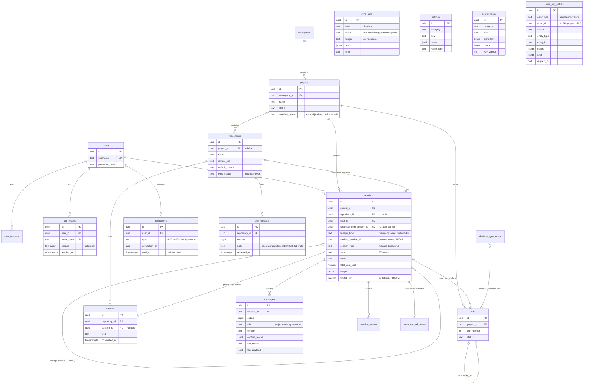

# TDS 03 — Database Schema (WS3)

- **Status:** Revised 2026-08-12 — two additive storage changes for the WS7 §7.2 leaf endpoints: `ix_sessions_started_at` (§3.9, WS2 §7.8 spend aggregate) and `messages.tool_file_path` + `ix_messages_session_tool_file` (§3.11, WS2 §6.10.2 Session Files). Earlier: 2026-08-11 — WS7 review Package 1 applied (B1, B2, B4, B7, B8, B10, B11a; N2, N3, N11).
- **Owner:** WS3 / postgresql-dba
- **Date:** 2026-08-11
- **Inputs:** `docs/tds/01-foundation-decisions.md` (Foundation Contract — consumed verbatim, esp. F3, F4, F6.3, F7, F8), `docs/tds/00-overview.md` (WS7 integration review — §5 arbitrated decisions A3, A6, A8, A10 and §7 Package 1 consumed verbatim), `Requirements.md` (PRD v2.1 §4.1, §4.3, §4.4, §6, §10, §11), `docs/project-plan.md` (WS3 row), `docs/research/claude-code-control-spike.md` (§6 cost/usage fields), `docs/tds/02-service-architecture-and-deployment.md` (§5 pause semantics, §6.3 tailer, §7.2 heartbeats, §12 handoff), `docs/tds/04-api-contracts-and-events.md` (§3.3 token scopes, §5–§11 resource shapes the columns must back)
- **Target:** PostgreSQL 16+ (native install, Windows 11 dev / Ubuntu prod). SQL below is the contract; Drizzle schema in `packages/shared` must generate equivalent DDL.

This document defines the full relational schema for Phases 1–2 at implementation depth, plus skeleton tables for Phase 3/4 entities per the project-plan scope guard. Entity names, ID/timestamp conventions, and session states are taken verbatim from F4 and F7. WS3 adds supporting tables (`auth_sessions`, `api_tokens`, `session_events`, `transcript_tail_states`, `service_heartbeats`, `obsidian_sync_states`, `sync_runs`) as permitted by F4.1 — `transcript_tail_states`/`service_heartbeats`/`obsidian_sync_states` per WS1's handoff (TDS 02 §6.3, §7.2, §12) and `sync_runs` per WS7 deviation D5 / finding B1; no domain entity is renamed or added.

---

## 1. Conventions Applied (per F4.2)

- **IDs:** `uuid` columns holding **UUIDv7 generated in application code** (`uuid` npm, v7). No DB-side default — PostgreSQL 16 has no `uuidv7()`; the application is the single ID authority. DDL therefore declares `id uuid PRIMARY KEY` without `DEFAULT`.
- **Naming:** `snake_case`, plural table names, FKs as `<entity>_id`. Enum-like values are lowercase `snake_case` `text` with `CHECK` constraints (not PostgreSQL `ENUM` types — these value sets are business-driven and evolve; `CHECK` alters are cheap and transactional).
- **Timestamps:** `timestamptz` only (never `timestamp`), UTC. Every table carries `created_at` and `updated_at` (`NOT NULL DEFAULT now()`); lifecycle moments get dedicated nullable columns (`started_at`, `completed_at`, `archived_at`, `read_at`, …). Append-only tables (`audit_log_entries`, `session_events`) still carry `updated_at` for convention compliance; rows are never updated in practice.
- **Strings:** `text` everywhere (no `varchar(n)`/`char(n)`); length limits, where meaningful, as `CHECK (length(col) <= n)`.
- **Money:** `numeric` (`total_cost_usd numeric(12,6)`), never float.
- **FK indexes:** PostgreSQL does not auto-index FK columns — every FK below gets an explicit index unless it is the leading column of another listed index.

### 1.1 `updated_at` maintenance — app-managed (decision)

**Decision: application-managed via Drizzle `$onUpdate(() => new Date())` on every table's `updated_at` column. No DB triggers.**

Rationale: all writes flow through the shared Drizzle data layer in `packages/shared` (F1.4, F8.1) — a single write path makes app-managed timestamps reliable; it keeps the DDL free of per-table trigger boilerplate (20+ triggers), keeps migration SQL portable and reviewable, and matches Drizzle's idiom so the generated schema and this contract stay aligned. The DB-level `DEFAULT now()` on `updated_at` covers inserts done via manual SQL. **Trade-off (accepted):** ad-hoc `UPDATE` statements issued outside Drizzle (psql maintenance) must set `updated_at = now()` explicitly; this is noted as an operational rule, not enforced by trigger. *(Rejected: `BEFORE UPDATE` trigger per table — safer against manual SQL, but adds unportable boilerplate and a second source of truth for a single-user system whose only writer is the app.)*

### 1.2 Schema layout

| Schema | Owner | Contents |
|---|---|---|
| `public` | Mission Control (Drizzle migrations) | All tables in this document |
| `pgboss` | pg-boss (its own internal migrations) | Job queue tables — **vendored, see §7** |

---

## 2. ER Diagram



*(Skeleton tables `agents`, `agent_teams`, `memory_items` — §6 — are omitted from the diagram; they have no Phase 1–2 relationships. All three are now real: see the superseded notice at the end of §6. `sync_runs` (§4.5) is shown standalone: it holds no FK — a run's per-file detail is joined from `obsidian_sync_states` at read time. `search_tsv` (§4.6) appears on `sessions` as a representative; the same generated column exists on `adrs`, `commits`, `pull_requests`, and `messages`.)*

---

## 3. Phase 1 Tables (implementation-ready DDL)

### 3.1 `users`

Single local account in V1 (F4.1), but a real table for future OIDC. `password_hash` stores the full encoded Argon2id string (algorithm/params/salt/hash — hashing is app-layer, per PRD §10).

```sql
CREATE TABLE users (
  id            uuid PRIMARY KEY,                    -- UUIDv7, app-generated
  username      text NOT NULL CHECK (length(username) BETWEEN 1 AND 64),
  password_hash text NOT NULL,                       -- Argon2id encoded string
  display_name  text,
  created_at    timestamptz NOT NULL DEFAULT now(),
  updated_at    timestamptz NOT NULL DEFAULT now()
);

CREATE UNIQUE INDEX ux_users_username_lower ON users (lower(username));
```

### 3.2 `auth_sessions` (supporting — F5.5 cookie sessions)

Server-side login sessions referenced by the HTTP-only cookie. Named `auth_sessions` to avoid any collision with the domain `sessions` entity (F9.5 vocabulary discipline). The cookie carries an opaque random token; only its SHA-256 hash is stored.

```sql
CREATE TABLE auth_sessions (
  id           uuid PRIMARY KEY,
  user_id      uuid NOT NULL REFERENCES users(id) ON DELETE CASCADE,
  token_hash   text NOT NULL,                        -- sha256 hex of cookie token
  expires_at   timestamptz NOT NULL,
  last_seen_at timestamptz,
  ip_address   inet,
  user_agent   text,
  created_at   timestamptz NOT NULL DEFAULT now(),
  updated_at   timestamptz NOT NULL DEFAULT now()
);

CREATE UNIQUE INDEX ux_auth_sessions_token_hash ON auth_sessions (token_hash);
CREATE INDEX ix_auth_sessions_user_id ON auth_sessions (user_id);
CREATE INDEX ix_auth_sessions_expires_at ON auth_sessions (expires_at);  -- expiry sweep job
```

### 3.3 `api_tokens` (supporting — PRD §4.4.6 API token management)

Bearer tokens for programmatic access, hashed at rest (F5.5). Revocation is `revoked_at`, not deletion, so the audit trail keeps its referent.

**Scopes — pinned representation (B8).** WS2 §1.4/§3.3 exposes `scopes: Array<'full'|'ingest'>` and the whole observed-session ingest model depends on it (`ingest`-scoped tokens may call only `POST /api/v1/hook-events`; cookie auth is rejected there, and `ingest` tokens are rejected everywhere else and at the WebSocket upgrade). Stored as **`text[]`**, not a scalar and not JSONB: the API shape is a set, PostgreSQL arrays keep it a first-class set (`'ingest' = ANY(scopes)` is the authorization predicate, no JSON extraction), and the two-part constraint below is exactly the API enum plus non-emptiness. *(Rejected: a scalar `scope text` — it silently forbids the multi-scope tokens the API already promises. Rejected: `jsonb` — no ordering/typing benefit here and a clumsier CHECK.)*

```sql
CREATE TABLE api_tokens (
  id           uuid PRIMARY KEY,
  user_id      uuid NOT NULL REFERENCES users(id) ON DELETE CASCADE,
  name         text NOT NULL CHECK (length(name) BETWEEN 1 AND 100),
  token_hash   text NOT NULL,                        -- sha256 hex; plaintext shown once at creation
  token_prefix text NOT NULL,                        -- first 8 chars, for identification in UI
  scopes       text[] NOT NULL DEFAULT ARRAY['full']::text[],   -- WS2 §3.3; default matches API default
  last_used_at timestamptz,
  expires_at   timestamptz,                          -- NULL = no expiry
  revoked_at   timestamptz,                          -- NULL = active
  created_at   timestamptz NOT NULL DEFAULT now(),
  updated_at   timestamptz NOT NULL DEFAULT now(),
  CONSTRAINT ck_api_tokens_scopes CHECK (
    cardinality(scopes) >= 1                           -- never an empty (= powerless) token
    AND scopes <@ ARRAY['full', 'ingest']::text[]      -- closed value set; widened by CHECK alter
    AND array_position(scopes, NULL::text) IS NULL     -- no NULL elements
  )
);

CREATE UNIQUE INDEX ux_api_tokens_token_hash ON api_tokens (token_hash);
CREATE INDEX ix_api_tokens_user_id ON api_tokens (user_id);
```

> **Corrected 2026-08-12.** The emptiness guard originally read `array_length(scopes, 1) >= 1`, which does **not** do what it says: `array_length('{}'::text[], 1)` evaluates to `NULL` rather than `0`, a CHECK constraint passes when its expression is `NULL`, and an empty-scope token therefore inserted successfully — verified against the live database before the fix. `cardinality('{}')` returns `0` and fails the comparison, so `cardinality` is the correct function here. The containment and NULL-element clauses were always sound.

No index on `scopes`: authorization reads the row by `token_hash` first (unique index) and evaluates the scope in the app on the fetched row — the set is never a search predicate. The hook-ingest token (TDS 02 §6.1) is an ordinary row here with `scopes = ARRAY['ingest']`; that resolves the §9 open item about where its hash lives.

### 3.4 `workspaces`

Single default workspace in V1 (F4.1); the row is seeded at first startup.

```sql
CREATE TABLE workspaces (
  id         uuid PRIMARY KEY,
  name       text NOT NULL CHECK (length(name) BETWEEN 1 AND 200),
  created_at timestamptz NOT NULL DEFAULT now(),
  updated_at timestamptz NOT NULL DEFAULT now()
);
```

### 3.5 `projects`

**Workflow Mode (PRD §4.3, arbitration A10 / finding B11a):** `workflow_mode` is the **per-project override** of the global Manual/Assisted setting; `NULL` means *inherit* (`integrations.github.workflowMode` in `settings`, WS2 §7.2). Three-valued by design — a `NOT NULL DEFAULT 'manual'` column could not express "follow the global default", so changing the global would silently not apply to existing Projects. Assisted-mode PR *actions* remain Phase 2 (deviation D8); only the stored mode is Phase 1. No index — the column is read with its Project row and is never a filter.

```sql
CREATE TABLE projects (
  id            uuid PRIMARY KEY,
  workspace_id  uuid NOT NULL REFERENCES workspaces(id) ON DELETE RESTRICT,
  name          text NOT NULL CHECK (length(name) BETWEEN 1 AND 200),
  description   text,
  status        text NOT NULL DEFAULT 'active'
                CHECK (status IN ('active', 'archived')),
  workflow_mode text CHECK (workflow_mode IN ('manual', 'assisted')),  -- NULL = inherit global setting
  archived_at   timestamptz,
  created_at    timestamptz NOT NULL DEFAULT now(),
  updated_at    timestamptz NOT NULL DEFAULT now()
);

CREATE INDEX ix_projects_workspace_id ON projects (workspace_id);
CREATE UNIQUE INDEX ux_projects_workspace_name ON projects (workspace_id, lower(name));
```

### 3.6 `repositories`

`project_id` is **nullable**: repository discovery (PRD §4.3) scans configured root paths and may register a repo before the user assigns it to a Project. `last_polled_sha`/`last_synced_at` carry the Sync Worker's repo-polling cursor (Phase 2), so no separate repo sync-state table is needed.

**`sync_status` (B8):** WS2 §5.1 exposes `syncStatus: 'ok'|'failed'|'never'`, which is **not** derivable from `last_synced_at` alone — a repo that synced yesterday and failed this morning still has a `last_synced_at`. The column records the outcome of the most recent attempt (`never` until the first attempt); `last_sync_error` carries the reason so the Repositories view can explain a `failed` badge without opening the audit log. Both are written by the same job that emits `repository.synced` / `repository.sync_failed` (WS2 §15.2 events 12–13).

```sql
CREATE TABLE repositories (
  id             uuid PRIMARY KEY,
  project_id     uuid REFERENCES projects(id) ON DELETE SET NULL,   -- NULL = discovered, unassigned
  name           text NOT NULL CHECK (length(name) BETWEEN 1 AND 200),
  local_path     text NOT NULL,                     -- absolute native path (F8.1 path rules)
  remote_url     text,                              -- NULL for local-only repos
  remote_name    text NOT NULL DEFAULT 'origin',
  visibility     text NOT NULL DEFAULT 'unknown'
                 CHECK (visibility IN ('public', 'private', 'unknown')),
  default_branch text NOT NULL DEFAULT 'main',
  last_polled_sha text,                             -- Sync Worker poll cursor (default branch head)
  last_synced_at  timestamptz,                      -- last *successful* sync
  sync_status     text NOT NULL DEFAULT 'never'
                  CHECK (sync_status IN ('ok', 'failed', 'never')),  -- outcome of the last attempt
  last_sync_error text,                             -- populated when sync_status = 'failed'
  created_at     timestamptz NOT NULL DEFAULT now(),
  updated_at     timestamptz NOT NULL DEFAULT now()
);

CREATE INDEX ix_repositories_project_id ON repositories (project_id);
CREATE UNIQUE INDEX ux_repositories_local_path ON repositories (local_path);
```

*(No index on `sync_status` — this table holds tens of rows in V1 and the Repositories view reads all of them; filtering it is a sequential scan by design.)*

### 3.7 `commits`

Git commit tracking (PRD §4.3). `session_id` links commits produced during a Session (Sessions detail "Commits" tab, PRD §8.3; Telegram session-complete summary, §9). `files` is a JSONB array of `{ path, status, additions, deletions }` — variable-shape, read-whole, never queried per-element in Phase 1–2, so JSONB beats a child table; revisit if per-file queries appear (a GIN index can be added without schema change).

```sql
CREATE TABLE commits (
  id            uuid PRIMARY KEY,
  repository_id uuid NOT NULL REFERENCES repositories(id) ON DELETE CASCADE,
  session_id    uuid REFERENCES sessions(id) ON DELETE SET NULL,
  sha           text NOT NULL CHECK (sha ~ '^[0-9a-f]{40}$' OR sha ~ '^[0-9a-f]{64}$'),
  author_name   text NOT NULL,
  author_email  text,
  message       text NOT NULL,
  branch        text,
  files         jsonb NOT NULL DEFAULT '[]' CHECK (jsonb_typeof(files) = 'array'),
  committed_at  timestamptz NOT NULL,
  created_at    timestamptz NOT NULL DEFAULT now(),
  updated_at    timestamptz NOT NULL DEFAULT now()
);

CREATE UNIQUE INDEX ux_commits_repository_sha ON commits (repository_id, sha);
CREATE INDEX ix_commits_repository_committed_at ON commits (repository_id, committed_at DESC);
CREATE INDEX ix_commits_session_id ON commits (session_id);
```

*(The unique index on `(repository_id, sha)` doubles as the FK index for `repository_id` and is the upsert conflict target for the polling job — `ON CONFLICT (repository_id, sha) DO NOTHING`.)*

### 3.8 `pull_requests`

**`state` stores GitHub truth (arbitration A3 / finding B4).** The column holds exactly what the GitHub API can return — `open`, `merged`, `closed`, `draft` — matching `PullRequest.state` in WS2 §5.3. The PRD §4.3 lifecycle words (Created, Opened, Reviewed, **Merged**, Rejected) are **event names, not stored states**: they are already modelled as `pull_request.opened` / `.reviewed` / `.merged` / `.closed` (WS2 §15.2 events 15–18) plus the dedicated timestamps below. A "reviewed" PR is still `open` on GitHub, so review is a fact with a time (`reviewed_at`), not a state; "rejected" is `closed` without `merged_at`, and `pull_request.closed` carries `reason` in its payload. *(The previous CHECK — `created/opened/reviewed/merged/rejected` — forced a lossy mapping on every write and could not round-trip a `draft` or a closed-unmerged PR; it is withdrawn.)*

```sql
CREATE TABLE pull_requests (
  id            uuid PRIMARY KEY,
  repository_id uuid NOT NULL REFERENCES repositories(id) ON DELETE CASCADE,
  number        bigint NOT NULL CHECK (number > 0),   -- GitHub PR number
  title         text NOT NULL,
  description   text,
  state         text NOT NULL
                CHECK (state IN ('open', 'merged', 'closed', 'draft')),  -- GitHub truth (A3)
  author        text,
  head_branch   text,
  base_branch   text,
  url           text,
  opened_at     timestamptz,
  reviewed_at   timestamptz,                          -- first review submitted (PRD "Reviewed" lifecycle fact)
  merged_at     timestamptz,
  closed_at     timestamptz,                          -- set for merged and unmerged closes alike
  created_at    timestamptz NOT NULL DEFAULT now(),
  updated_at    timestamptz NOT NULL DEFAULT now()
);

CREATE UNIQUE INDEX ux_pull_requests_repository_number ON pull_requests (repository_id, number);
CREATE INDEX ix_pull_requests_repository_state ON pull_requests (repository_id, state);
```

### 3.9 `sessions`

The core entity. Key design points:

- **Two identities (F1.5):** `id` is our UUIDv7 PK; `runtime_session_id` is Claude Code's native session ID (UUIDv4, assigned by the runtime at spawn/attach). It is `NULL` while `state = 'created'` (managed session not yet spawned). **Resume-as-new applies only to `completed`/`archived` sessions** (F7; TDS 02 §5.1): it produces a **new** `sessions` row linked via `resumed_from_session_id`, and the runtime issues a fresh native ID for the resumed/forked conversation — so a partial unique index enforces one row per runtime session, which is also the idempotency key for observed-session detection (hook `SessionStart` may fire alongside transcript discovery). **`paused → running` is an in-place transition on the SAME row** (same `id`, same `runtime_session_id`, lineage columns untouched — `resumed_from_session_id`/`lineage_kind` are set only at row creation for resume-as-new/Clone, never mutated afterward).
- **Restart durability (TDS 02 §4.4):** `paused` is cold — no process, no in-memory state, nothing in this table to "recover"; `paused` rows survive Backend restarts untouched. Orphaned `running` sessions found at boot transition `running → failed` with `failure_reason = 'backend_restart'`. `failure_reason` is free text with a recommended vocabulary owned by WS1 (`spawn_error`, `process_crash`, `backend_restart`, `resume_target_lost`, `ingest_failure`, **`cancelled`**); the same reason string is repeated in the `session_events` payload for the timeline. **`cancelled`** was added in Phase 4: `created → failed` is F7's only exit for a Session whose launch was abandoned before it started, so `SessionService.cancel` takes it and the reason is what separates an outcome the operator asked for from one they need to be told about — the notification producer stays silent for this one reason and for no other. Two of the six are likewise not failures of the work (`backend_restart` is a deploy), which is what the column is for.
- **State machine (F7):** `state` is `CHECK`-constrained to the six canonical states; **transition legality is enforced in the application/API layer** (`INVALID_STATE_TRANSITION`, F7) — a DB trigger would duplicate the rule without the context (trigger actor, event emission) that lives in the app. Every transition appends a `session_events` row (§3.10).
- **Cost/usage (spike §6):** the SDK `ResultMessage` is the canonical cost source for managed sessions — `total_cost_usd numeric(12,6)`, `usage` JSONB (`input_tokens`, `output_tokens`, `cache_creation_input_tokens`, `cache_read_input_tokens`, `usage_by_model`), `num_turns`, `duration_ms`, `duration_api_ms`. Nullable: observed sessions may have no reliable cost; the columns are cumulative (updated per `ResultMessage`).
- **Duration** (PRD §4.1 metadata) is derived as `completed_at - started_at` for display; `duration_ms` holds the runtime-reported active duration where available.
- **Lineage — discriminated (arbitration A6 / finding B7):** one self-FK plus a `lineage_kind` discriminator. `resumed_from_session_id` names the parent Session, `lineage_kind` says *how* the row descends from it: `'resumed'` (resume-as-new from a `completed`/`archived` parent — runtime `resume`) or `'cloned'` (Clone/fork — SDK `forkSession: true`). **Invariant, enforced by `ck_sessions_lineage`: both columns are NULL (a root Session) or both are set — never one without the other.** Both are written once at row creation and never mutated (in-place `paused → running` touches neither). This is what lets WS2 §6.1 populate two distinct API fields from one column pair; a single undiscriminated FK could not. Consequence: the self-FK is **`ON DELETE RESTRICT`**, not `SET NULL` — nulling only the FK on an administrative parent delete would leave `lineage_kind` orphaned and violate the invariant, so a parent with descendants must be dealt with explicitly. Harmless in practice: V1 archives Sessions, it does not delete them (§9 deletion philosophy).
- **`repository_id` (B8):** nullable FK to the Repository the Session works in — accepted on `POST /sessions`, exposed as `Session.repositoryId`, and the backing column for the `?repositoryId=` list filter (WS2 §6.1–§6.2). Nullable because a Session may run in a working directory that is not a registered repository (and `ON DELETE SET NULL` keeps the Session if the repo record is removed). It is denormalized relative to `commits.repository_id` on purpose: it records *intent* at launch, while commits record *fact*.
- **`notes` (B8):** free-text operator notes for the Sessions detail "Notes" tab (PRD §8.3), writable via `PATCH /sessions/{id}`. Plain `text`, no length cap, not indexed for equality — it is search input (§4.6), not a filter.
- **API mapping (WS7 N1/N2/N3 — stated so nobody guesses):** DB names stay `snake_case` per F4.2; the API serializer in `packages/shared` performs these and only these transformations.

| Column | API field | Rule |
|---|---|---|
| `session_type` | `Session.sessionType`, `?sessionType=` filter, event payload `sessionType` | Pure `snake_case` → `camelCase`, values verbatim (`managed`, `observed`) — **no special case to remember**. N1 closed: WS2 standardized the API on `sessionType`, so the column is `session_type`, not `kind` |
| `duration_ms` | `Session.durationSeconds` | **`durationSeconds = Math.round(duration_ms / 1000)`**; `NULL` → `null`. Storage stays milliseconds because that is the runtime's own unit (SDK `ResultMessage.duration_ms`) — rounding on read is lossless-enough for display and lossy-forever if done on write (N3) |
| `duration_api_ms` | *(not exposed)* | Diagnostic only |
| `resumed_from_session_id` + `lineage_kind` | `resumedFromSessionId`, `clonedFromSessionId` | `resumedFromSessionId` = FK when `lineage_kind = 'resumed'`, else `null`; `clonedFromSessionId` = FK when `lineage_kind = 'cloned'`, else `null` (A6) |
| `total_cost_usd` | `costUsd` | `numeric` → JSON number |
| `usage` | `tokenUsage` | JSONB subset `{ input, output, cacheRead, cacheWrite }` projected from `input_tokens` / `output_tokens` / `cache_read_input_tokens` / `cache_creation_input_tokens` |

- **Phase 4 extension point:** an `agent_id uuid REFERENCES agents(id)` column is added by an additive migration in Phase 4 (skeleton target table already exists, §6). It is deliberately **not** in the Phase 1 DDL.

```sql
CREATE TABLE sessions (
  id                       uuid PRIMARY KEY,
  project_id               uuid NOT NULL REFERENCES projects(id) ON DELETE RESTRICT,
  repository_id            uuid REFERENCES repositories(id) ON DELETE SET NULL,   -- nullable (B8)
  user_id                  uuid NOT NULL REFERENCES users(id) ON DELETE RESTRICT,
  resumed_from_session_id  uuid REFERENCES sessions(id) ON DELETE RESTRICT,      -- see ck_sessions_lineage
  lineage_kind             text CHECK (lineage_kind IN ('resumed', 'cloned')),    -- NULL iff FK is NULL
  session_type             text NOT NULL CHECK (session_type IN ('managed', 'observed')),  -- N1
  state                    text NOT NULL DEFAULT 'created'
                           CHECK (state IN ('created', 'running', 'paused',
                                            'completed', 'failed', 'archived')),
  runtime                  text NOT NULL DEFAULT 'claude_code'
                           CHECK (runtime IN ('claude_code')),             -- narrowed by 0010; see below
  runtime_session_id       text,             -- runtime-native session ID (UUIDv4); NULL until spawn/attach
  runtime_version          text,             -- e.g. Claude Code CLI/SDK version (PRD §4.1 "Claude Version")
  model                    text,
  machine                  text,             -- hostname (PRD §4.1 "Machine")
  environment              text,             -- e.g. 'windows-dev', 'ubuntu-prod' (PRD §4.1 "Environment")
  branch                   text,
  working_dir              text,             -- absolute native path
  transcript_path          text,             -- runtime JSONL path (observation fidelity channel, F1.5)
  title                    text,
  notes                    text,             -- operator notes, PRD §8.3 Notes tab (B8)
  failure_reason           text,             -- populated on state = 'failed'
  total_cost_usd           numeric(12,6) CHECK (total_cost_usd >= 0),
  usage                    jsonb CHECK (jsonb_typeof(usage) = 'object'),
  num_turns                integer CHECK (num_turns >= 0),
  duration_ms              bigint CHECK (duration_ms >= 0),
  duration_api_ms          bigint CHECK (duration_api_ms >= 0),
  started_at               timestamptz,
  completed_at             timestamptz,      -- set on completed OR failed
  archived_at              timestamptz,
  created_at               timestamptz NOT NULL DEFAULT now(),
  updated_at               timestamptz NOT NULL DEFAULT now(),
  -- Lineage invariant (A6): a Session either has a parent AND a lineage kind, or neither.
  CONSTRAINT ck_sessions_lineage CHECK (
    (resumed_from_session_id IS NULL) = (lineage_kind IS NULL)
  )
);

-- Primary list query: sessions by project, filtered by state, newest first (UUIDv7 PK is
-- time-ordered, but created_at is the explicit, human-auditable sort key).
CREATE INDEX ix_sessions_project_state_created_at ON sessions (project_id, state, created_at DESC);
CREATE INDEX ix_sessions_user_id ON sessions (user_id);
-- ?repositoryId= list filter (WS2 §6.2) + FK index.
CREATE INDEX ix_sessions_repository_id ON sessions (repository_id) WHERE repository_id IS NOT NULL;
CREATE INDEX ix_sessions_resumed_from ON sessions (resumed_from_session_id);
-- Dashboard "Active Sessions" widget: tiny hot subset.
CREATE INDEX ix_sessions_active ON sessions (created_at DESC)
  WHERE state IN ('created', 'running', 'paused');
-- One record per runtime-native session; idempotent observed-session detection.
CREATE UNIQUE INDEX ux_sessions_runtime_session_id ON sessions (runtime, runtime_session_id)
  WHERE runtime_session_id IS NOT NULL;
-- Spend aggregate (WS2 §7.8): sum(total_cost_usd) over a started_at range, day and month.
CREATE INDEX ix_sessions_started_at ON sessions (started_at DESC) INCLUDE (total_cost_usd)
  WHERE started_at IS NOT NULL;
```

**`ck_sessions_runtime` was narrowed to `('claude_code')` by migration `0010`.** It admitted `'ollama'` from `0000`, and that was the wider of two disagreeing claims: `ck_agents_runtime` admits only `claude_code` (§3.x `agents`), the agent binding copies an agent's runtime onto the Session, `insertSession` defaults to `claude_code`, and the managed runtime drives the Claude Agent SDK unconditionally (F1.5). **No code path could produce an `ollama` Session and the live database contained none** — checked before the migration was written — so the CHECK described a capability the build does not have. The schema now derives the list from `AGENT_RUNTIMES` rather than restating it, so the two CHECKs cannot drift apart again, and a real second runtime widens both from one array. The `settings` half of the same fiction (`integrations.ollama.enabled`, `integrations.ollama.defaultModel`) was withdrawn in `0011`. The migration is **not** `NOT VALID`: it validates against existing rows, and it rolls back cleanly if one contradicts it.

**`ix_sessions_started_at` (added for WS2 §7.8 `GET /api/v1/spend`).** No pre-existing index serves "sum `total_cost_usd` over a `started_at` range": `ix_sessions_project_state_created_at` leads with `project_id`, `ix_sessions_active` is partial on the three non-terminal states while the Sessions that spent money are mostly `completed`, and `created_at` is the wrong column anyway (WS2 attributes cost to the day a Session *started*, not the day its row was created). The index is **partial on `started_at IS NOT NULL`** — the rows it excludes never ran and therefore carry no cost, so they are exactly the rows the aggregate ignores — and `INCLUDE (total_cost_usd)` makes the month-range scan index-only. It also serves any plain "Sessions started between X and Y" read without a second index.

### 3.10 `session_events` (supporting — F7 timeline)

Append-only session timeline: every F7 transition is recorded "with timestamp + trigger (`user` | `system`)" (F7 rules), and F6.4 places durable, product-facing event history in domain tables rather than the queue. Also carries non-transition timeline entries (Sessions detail "Timeline" tab, PRD §8.3) such as `session.message.appended` markers or commit detections; `type` uses F6 event names verbatim.

```sql
CREATE TABLE session_events (
  id             uuid PRIMARY KEY,
  session_id     uuid NOT NULL REFERENCES sessions(id) ON DELETE CASCADE,
  type           text NOT NULL,             -- F6 event name, e.g. 'session.state_changed'
  from_state     text CHECK (from_state IN ('created', 'running', 'paused',
                                            'completed', 'failed', 'archived')),
  to_state       text CHECK (to_state   IN ('created', 'running', 'paused',
                                            'completed', 'failed', 'archived')),
  trigger        text NOT NULL CHECK (trigger IN ('user', 'system')),
  payload        jsonb,                     -- F6.2 envelope payload subset (IDs, reasons)
  correlation_id uuid,                      -- F6.2 correlationId
  occurred_at    timestamptz NOT NULL DEFAULT now(),
  created_at     timestamptz NOT NULL DEFAULT now(),
  updated_at     timestamptz NOT NULL DEFAULT now()   -- convention only; rows are append-only
);

CREATE INDEX ix_session_events_session_occurred ON session_events (session_id, occurred_at);
```

### 3.11 `messages`

Roles per F4.1: `user` / `assistant` / `system` / `tool`.

**Ordering — decision:** an application-assigned, per-session monotonic `ordinal bigint` with `UNIQUE (session_id, ordinal)`. Each Session has exactly **one writer** at any moment — the Backend session manager owns a managed session's stream, and the observation ingester (hooks + tailer) is serialized per session in WS1's design — so the writer can assign `last_ordinal + 1` without cross-process coordination. Gaps are permitted (failed turns); order is what matters. *(Rejected: ordering by `created_at` — hook posts and transcript tailing can deliver the same burst with identical or out-of-order timestamps. Rejected: global sequence — pointless contention and no per-session semantics. Rejected: ordering by UUIDv7 PK — encodes ingest time, not conversation order, and dual-channel observation can ingest out of order.)*

**Deduplication — one key, pinned (WS7 N11).** Observed sessions ingest through two channels (hooks push + transcript tailing, F1.5) that will see the same content, and hook POSTs may be retried. **`(session_id, runtime_message_id)` is the single ingest idempotency key**, enforced by the partial unique index below; every ingest write is `ON CONFLICT DO NOTHING` against it. **The index is partial, so the conflict target must repeat its predicate** — `ON CONFLICT (session_id, runtime_message_id) WHERE runtime_message_id IS NOT NULL DO NOTHING`. Omitting the `WHERE` clause does not silently skip deduplication; PostgreSQL raises *"there is no unique or exclusion constraint matching the ON CONFLICT specification"* and the write fails outright. The same applies to any upsert targeting `ux_sync_runs_active` (§4.5). WS2 §6.8's `(runtimeSessionId, hookEventName, occurredAt)` triple is *not* a second key — it is the API-level description of the same rule, and it is rejected as the storage key because (a) `occurredAt` is optional there, so the key can be undefined exactly when a retry needs it, and (b) it dedupes hooks against hooks only, never hooks against the transcript, which is the duplicate that actually occurs. Concretely:

- `runtimeSessionId` resolves to `session_id` via `ux_sessions_runtime_session_id` (§3.9) before any message is written, so the key is stated in our ID space, not the runtime's.
- When the runtime supplies a message/event UUID (transcript line `uuid`, and hook payloads that echo it), that value **is** `runtime_message_id` — both channels therefore converge on the same row.
- When it does not (hook-only/degraded observation, PostToolUse payloads with no transcript line yet), the ingester **synthesizes a deterministic id** into the same column: `hook:{hookEventName}:{sha256(canonical_json(payload) || occurredAt ?? '')}`. It is a pure function of the request body, so a retried POST produces the identical key and collapses; nothing depends on the optional `occurredAt` being present. *(Accepted, documented residual: two byte-identical hook posts in one Session that are genuinely distinct events — same tool, same input, same output, no `occurredAt`, no transcript channel — collapse into one Message. Rare, and strictly better than the alternative of duplicating every retried tool call.)*
- Messages originated by Mission Control itself (system notices) leave `runtime_message_id` `NULL` and are exempt from the index; they are written exactly once by definition.
- Hook events that do **not** produce a Message (`SessionStart`, `Stop`, `SessionEnd`) need no key: observed-Session creation is idempotent via `ux_sessions_runtime_session_id`, and a repeated transition is a no-op in the F7 state machine (no transition ⇒ no `session_events` row), so replay converges without a dedupe column.

**API mapping (WS7 N2):** `messages.runtime_message_id` ⇄ the `Message` field WS2 §6.6 currently calls `runtimeUuid` (WS7 N2 recommends renaming it `runtimeMessageId`). Whichever name the API settles on, it is a 1:1 passthrough of this column — no transformation, no separate identifier. The DB name stays `snake_case` per F4.2.

**Content:** `content` holds the canonical rendered text (searchable, exportable); `content_blocks` holds the raw structured blocks (text/tool_use/tool_result JSON from the stream) for faithful re-rendering. Tool messages carry `tool_name`, `tool_use_id`, and `tool_payload` (input or result). Large values ride TOAST transparently; default `EXTENDED` storage is kept.

**`tool_file_path` (added for WS2 §6.10.2 `GET /api/v1/sessions/{id}/files`).** The Session Files panel is a de-duplicated union of commit files and *tool activity*, and the tool half has to come from somewhere queryable. `tool_payload` is deliberately loose — "input or result", no discriminator, no index — so extracting `tool_payload->>'file_path'` at read time would push runtime-version knowledge into a SQL expression that cannot degrade gracefully when Claude Code's tool schema drifts, which is precisely what F1.5 isolates in an adapter module. Instead the ingester writes the absolute native path it already parsed into a dedicated nullable column, once, at write time; `tool_payload` remains the raw truth and is untouched. Only the five file-naming tools populate it (`Read`, `Write`, `Edit`, `MultiEdit`, `NotebookEdit` — WS2 §6.10.2 owns that list); everything else, including every conversation turn, leaves it `NULL` and is excluded from the partial index. An unrecognized tool or payload shape leaves it `NULL` and must never fail the ingest write. *(Rejected: a generated column — self-maintaining, but the extraction rule is runtime-version-dependent and a generated column cannot be version-tolerant, which is the same reason §4.6's generated `search_tsv` columns are safe and this one would not be. Rejected: a GIN index on `tool_payload` — indexes the whole payload to answer one narrow question, and still leaves the fragile extraction in the query.)*

**Delivery status (TDS 02 §5.1):** cold pause needs two flags — user prompts queued but never sent to the runtime are persisted as `status = 'pending'` (redisplayed on resume, not auto-replayed), and partial assistant output cut off by `interrupt()` is persisted as `status = 'interrupted'`. A single `status` column covers both; default `'complete'` keeps the normal path untouched.

```sql
CREATE TABLE messages (
  id                 uuid PRIMARY KEY,
  session_id         uuid NOT NULL REFERENCES sessions(id) ON DELETE CASCADE,
  ordinal            bigint NOT NULL CHECK (ordinal >= 0),
  role               text NOT NULL CHECK (role IN ('user', 'assistant', 'system', 'tool')),
  status             text NOT NULL DEFAULT 'complete'
                     CHECK (status IN ('complete', 'pending', 'interrupted')),
  content            text NOT NULL DEFAULT '',
  content_blocks     jsonb CHECK (jsonb_typeof(content_blocks) = 'array'),
  model              text,                  -- assistant messages
  tool_name          text,                  -- tool role
  tool_use_id        text,                  -- runtime tool-use correlation id
  tool_payload       jsonb,
  tool_file_path     text,                  -- absolute native path from the tool input; NULL unless a file-naming tool
  runtime_message_id text,                  -- runtime message uuid, or synthesized 'hook:…' key (sole dedupe key)
  occurred_at        timestamptz NOT NULL DEFAULT now(),  -- runtime-reported time when available
  created_at         timestamptz NOT NULL DEFAULT now(),
  updated_at         timestamptz NOT NULL DEFAULT now()
);

-- Conversation read path + cursor pagination (F5.3) + ordering contract, one index:
CREATE UNIQUE INDEX ux_messages_session_ordinal ON messages (session_id, ordinal);
-- Dual-channel ingest idempotency:
CREATE UNIQUE INDEX ux_messages_session_runtime_id ON messages (session_id, runtime_message_id)
  WHERE runtime_message_id IS NOT NULL;
-- Session Files panel (WS2 §6.10.2): group tool touches by path within one Session.
CREATE INDEX ix_messages_session_tool_file ON messages (session_id, tool_file_path)
  WHERE tool_file_path IS NOT NULL;
```

**Retention/archival note:** messages live and die with their Session (`ON DELETE CASCADE`); V1 defines no automatic pruning. Archived sessions retain full history (Export/Context Package need it). The Phase 3 memory retention settings (PRD §4.4.4) may later add a pruning job for archived sessions' messages — that is a job, not a schema change. If the table grows very large (>10M rows), `ix`/`ux` above remain the only required indexes; partitioning by `session_id` hash is explicitly **not** planned (queries are always session-scoped and index-selective).

### 3.12 `settings` (PRD §4.4 — typed key/value rows)

**Decision: one typed key/value table, not per-category tables.** The seven §4.4 categories share no relational structure; per-category tables would mean a migration per new setting. A typed row — `(category, key, value jsonb, value_type)` — keeps reads trivial (`SELECT ... WHERE category = $1`), lets WS2 validate against the settings key registry — **WS2 §7.6, shipped as `packages/shared/src/settings/registry.ts`** (that registry, not the DB, is the authority on which `(category, key)` rows exist, their `value_type`, their JSON Schema, and their secret flag; this table stores whatever it declares) — and makes `setting.updated` events (F8.2) uniform. The `services` category is a read-only *view* in the UI (live health, PRD §4.4.7) and is **not stored** here.

**Bootstrap exclusion (F8.2):** `DATABASE_URL`, `MC_HOST`/`MC_PORT`, `MC_ENCRYPTION_KEY`, `MC_DATA_DIR`, `NODE_ENV`/`LOG_LEVEL` live in the environment only and MUST NOT appear in this table.

```sql
CREATE TABLE settings (
  id         uuid PRIMARY KEY,
  category   text NOT NULL CHECK (category IN
             ('general', 'integrations', 'notifications', 'memory', 'agents', 'security')),
  key        text NOT NULL CHECK (length(key) BETWEEN 1 AND 128),  -- snake_case, e.g. 'github_poll_interval_seconds'
  value      jsonb NOT NULL,
  value_type text NOT NULL CHECK (value_type IN ('string', 'number', 'boolean', 'object', 'array')),
  created_at timestamptz NOT NULL DEFAULT now(),
  updated_at timestamptz NOT NULL DEFAULT now(),
  CONSTRAINT ck_settings_value_matches_type CHECK (
    (value_type = 'string'  AND jsonb_typeof(value) = 'string')  OR
    (value_type = 'number'  AND jsonb_typeof(value) = 'number')  OR
    (value_type = 'boolean' AND jsonb_typeof(value) = 'boolean') OR
    (value_type = 'object'  AND jsonb_typeof(value) = 'object')  OR
    (value_type = 'array'   AND jsonb_typeof(value) = 'array')
  )
);

CREATE UNIQUE INDEX ux_settings_category_key ON settings (category, key);
```

Reads are by `(category, key)` or whole-category — the unique index covers both; no further indexes. Every write emits `setting.updated` (F6.1) and an `audit_log_entries` row (PRD §4.4 behaviors); both happen in the writer's transaction via the outbox mechanism (§7).

### 3.13 `secret_items` (PRD §4.4/§10 — encrypted at rest)

Secrets (GitHub PAT, Telegram bot token, Qdrant API key, …) are stored **separately from `settings`** so that plaintext can never leak through the settings read path, and encrypted with **AES-256-GCM** under the Key-Encryption-Key `MC_ENCRYPTION_KEY` (32-byte, base64, bootstrap env — F8.2).

**Storage contract:**

- `ciphertext` = GCM ciphertext with the **16-byte auth tag appended** (Node `crypto` emits the tag separately via `cipher.getAuthTag()`; the app appends it on write and splits the last 16 bytes on read — pinned here so both Backend and workers agree).
- `nonce` = 12-byte random IV, **unique per encryption operation** (never reused under the same key; enforced by generation, checked for length).
- `aad` — additional authenticated data is the UTF-8 string `"{category}/{key}"`, binding a ciphertext to its row so ciphertexts cannot be swapped between rows undetected. (Convention, not a column.)
- `key_version` supports KEK rotation: bump `MC_ENCRYPTION_KEY`, re-encrypt rows one by one, update `key_version`. V1 runs with version 1; the column exists so rotation is a job, not a migration.
- **Write-only semantics are an API-layer contract (WS2):** reads return only existence + masked hint (`token_prefix`-style is deliberately *not* stored — no partial plaintext at rest); the DB contract is simply that no plaintext column exists.

```sql
CREATE TABLE secret_items (
  id          uuid PRIMARY KEY,
  category    text NOT NULL CHECK (category IN
              ('general', 'integrations', 'notifications', 'memory', 'agents', 'security')),
  key         text NOT NULL CHECK (length(key) BETWEEN 1 AND 128),  -- e.g. 'github_token', 'telegram_bot_token'
  ciphertext  bytea NOT NULL CHECK (octet_length(ciphertext) > 16), -- gcm ciphertext || 16-byte auth tag
  nonce       bytea NOT NULL CHECK (octet_length(nonce) = 12),
  key_version integer NOT NULL DEFAULT 1 CHECK (key_version >= 1),
  created_at  timestamptz NOT NULL DEFAULT now(),
  updated_at  timestamptz NOT NULL DEFAULT now()
);

CREATE UNIQUE INDEX ux_secret_items_category_key ON secret_items (category, key);
```

Audit entries for secret writes record **that** the value changed (`action = 'secret_item.updated'`, `before`/`after` = `{"set": true|false}`), never the value.

### 3.14 `audit_log_entries` (PRD §10)

Append-only. `actor_id` is deliberately **not** an FK: it is polymorphic (`users.id` today, `agents.id` in Phase 4, `NULL` for `system`) and audit rows must survive actor deletion. `request_id` is the F5.4 `requestId` / `X-Request-Id`, correlating an audit row with API logs and the F6.2 `correlationId` chain.

> **Corrected 2026-08-12 — `text`, not `uuid`.** This column was originally `uuid`, which silently defeated its own purpose. F5.4 accepts an inbound `X-Request-Id` so an external caller can supply its own correlation id, and such ids are frequently not UUIDs. With a `uuid` column the only options were to fail the audit insert or to store `NULL` — and `NULL` loses the correlation in precisely the case that most needs it, an externally-originated call such as a Claude Code hook POST. The column is now `text` with a 1–128 length bound matching the request-id generator's own cap. Ids we generate remain UUIDv7 strings; ids we are given are preserved as sent.

```sql
CREATE TABLE audit_log_entries (
  id          uuid PRIMARY KEY,
  actor_type  text NOT NULL CHECK (actor_type IN ('user', 'agent', 'system')),
  actor_id    uuid,                          -- users.id / agents.id (Phase 4); NULL for system
  action      text NOT NULL,                 -- '<domain>.<verb-past>', e.g. 'setting.updated', 'auth.login'
                                             -- (WS2 §3.1 owns the action registry; this column stores it verbatim)
  entity_type text,                          -- F4 table name, e.g. 'settings', 'sessions'
  entity_id   uuid,
  before      jsonb,                         -- relevant field subset; NULL for creates
  after       jsonb,                         -- relevant field subset; NULL for deletes
  request_id  text CHECK (request_id IS NULL OR length(request_id) BETWEEN 1 AND 128),
                                             -- F5.4 requestId correlation; text, not uuid — see note
  ip_address  inet,
  created_at  timestamptz NOT NULL DEFAULT now(),
  updated_at  timestamptz NOT NULL DEFAULT now()   -- convention only; rows are append-only
);

CREATE INDEX ix_audit_entity ON audit_log_entries (entity_type, entity_id, created_at DESC);
CREATE INDEX ix_audit_actor ON audit_log_entries (actor_type, actor_id, created_at DESC);
-- Insert-ordered append-only table: BRIN gives near-free time-range scans for the audit view
CREATE INDEX ix_audit_created_at_brin ON audit_log_entries USING brin (created_at);
```

**Coverage (minimum, Phase 1–2):** auth events (login success/failure, logout, token create/revoke), all `settings`/`secret_items` writes, session lifecycle actions triggered by users, git actions performed by the system (PR creation in assisted mode), Obsidian sync conflict resolutions. **Retention:** `security.audit_log_retention_days` setting (PRD §4.4.6) drives a periodic pg-boss pruning job — `DELETE ... WHERE created_at < now() - retention`; the BRIN index keeps that cheap.

### 3.15 `transcript_tail_states` (supporting — TDS 02 §6.3 tailer cursor)

Per-observed-session tail state so transcript tailing **survives Backend restarts**: on boot the tailer registry reloads rows for non-terminal observed sessions and reattaches at the persisted byte offset instead of re-ingesting from byte 0 (idempotency via `ux_messages_session_runtime_id` would absorb a full re-read, but not the cost of one). One row per Session (`session_id` unique); rows for managed sessions never exist. The drift counter and degraded flag persist WS1's degradation ladder — a session degraded to hook-only observation stays degraded across restarts rather than flapping.

The row is updated on every tailer read burst — an update-heavy, narrow table, so it gets `fillfactor = 90` to encourage HOT updates (offsets/counters are non-indexed columns).

```sql
CREATE TABLE transcript_tail_states (
  id              uuid PRIMARY KEY,
  session_id      uuid NOT NULL REFERENCES sessions(id) ON DELETE CASCADE,
  transcript_path text NOT NULL,              -- absolute native path to the runtime JSONL
  byte_offset     bigint NOT NULL DEFAULT 0 CHECK (byte_offset >= 0),
  line_no         bigint NOT NULL DEFAULT 0 CHECK (line_no >= 0),   -- lines fully parsed (diagnostics)
  drift_count     integer NOT NULL DEFAULT 0 CHECK (drift_count >= 0),  -- parse failures (TDS 02 §6.3)
  degraded        boolean NOT NULL DEFAULT false,  -- true = detached, hook-only observation
  last_read_at    timestamptz,
  last_error      text,
  created_at      timestamptz NOT NULL DEFAULT now(),
  updated_at      timestamptz NOT NULL DEFAULT now()
) WITH (fillfactor = 90);

CREATE UNIQUE INDEX ux_transcript_tail_session ON transcript_tail_states (session_id);
```

---

## 4. Phase 2 Tables & Indexes (implementation-ready DDL)

### 4.1 `adrs`

Template sections per PRD §7.3 as dedicated text columns (they are always all rendered; no reason for JSONB). `adr_number` is per-project and user-visible ("ADR-0007"); assigned by the app as `max + 1` within the insert transaction. Obsidian mapping lives in `obsidian_sync_states` (§4.3), but the current vault path is denormalized here for display.

```sql
CREATE TABLE adrs (
  id                   uuid PRIMARY KEY,
  project_id           uuid NOT NULL REFERENCES projects(id) ON DELETE RESTRICT,
  adr_number           integer NOT NULL CHECK (adr_number > 0),
  title                text NOT NULL CHECK (length(title) BETWEEN 1 AND 300),
  status               text NOT NULL DEFAULT 'proposed'
                       CHECK (status IN ('proposed', 'accepted', 'rejected', 'superseded')),
  context              text NOT NULL DEFAULT '',
  decision             text NOT NULL DEFAULT '',
  alternatives         text NOT NULL DEFAULT '',
  consequences         text NOT NULL DEFAULT '',
  superseded_by_adr_id uuid REFERENCES adrs(id) ON DELETE SET NULL,
  source_session_id    uuid REFERENCES sessions(id) ON DELETE SET NULL,  -- ADR generated from a session
  obsidian_path        text,                       -- vault-relative path, denormalized for display
  created_at           timestamptz NOT NULL DEFAULT now(),
  updated_at           timestamptz NOT NULL DEFAULT now()
);

CREATE UNIQUE INDEX ux_adrs_project_number ON adrs (project_id, adr_number);
CREATE INDEX ix_adrs_project_status ON adrs (project_id, status);
CREATE INDEX ix_adrs_superseded_by ON adrs (superseded_by_adr_id);
CREATE INDEX ix_adrs_source_session ON adrs (source_session_id);
```

### 4.2 `notifications`

One row per notification event: the in-app record (dashboard widget, unread badge) **and** the Telegram delivery ledger. The Telegram Worker consumes a pg-boss job (enqueued transactionally with this row, §7), attempts delivery, and writes the outcome back. `telegram_status = 'skipped'` when Telegram is disabled or the event type is toggled off (PRD §4.4.3).

**`type` is the notification-type enum, not an event name (arbitration A8 / finding B10).** The stored value set is WS2 §8's enum — `session_completed`, `session_failed`, `sync_failed`, `repository_problem`, `daily_report`, `cost_budget_alert` — CHECK-constrained, because that is what the UI filters on and what `NotificationsSettings.events` toggles map to. The earlier "F6 event name" comment cannot hold: `daily_report` (a scheduled job) and `cost_budget_alert` (a threshold evaluation) have **no** F6 event. Where an originating event does exist, its F6 type is carried in **`payload.eventType`** alongside the entity IDs, so the timeline chain stays traceable without overloading the column: e.g. `type = 'session_failed'`, `payload = { "eventType": "session.failed", "sessionId": "…", "reason": "process_crash" }`.

**`correlation_id` (B8):** the F6.2 `correlationId` of the event chain that produced this Notification (WS2 §8 `Notification.correlationId`) — the join key between a Notification, the `session_events`/`audit_log_entries` rows, and the API `requestId` that started it all. `uuid`, no FK (it references an event envelope, not a table row).

```sql
CREATE TABLE notifications (
  id               uuid PRIMARY KEY,
  user_id          uuid NOT NULL REFERENCES users(id) ON DELETE CASCADE,
  type             text NOT NULL             -- WS2 §8 notification-type enum (A8), NOT an F6 event name
                   CHECK (type IN ('session_completed', 'session_failed', 'sync_failed',
                                   'repository_problem', 'daily_report', 'cost_budget_alert')),
  severity         text NOT NULL DEFAULT 'info'
                   CHECK (severity IN ('info', 'warning', 'error')),
  title            text NOT NULL,
  body             text NOT NULL DEFAULT '',
  payload          jsonb,                    -- entity IDs for deep links + `eventType` (F6.2: IDs, not entities)
  correlation_id   uuid,                     -- F6.2 correlationId of the originating chain (B8)
  read_at          timestamptz,              -- NULL = unread
  telegram_status  text NOT NULL DEFAULT 'skipped'
                   CHECK (telegram_status IN ('skipped', 'pending', 'sent', 'failed')),
  telegram_sent_at timestamptz,
  telegram_error   text,
  created_at       timestamptz NOT NULL DEFAULT now(),
  updated_at       timestamptz NOT NULL DEFAULT now()
);

-- Unread badge/list: hot subset, partial index
CREATE INDEX ix_notifications_unread ON notifications (user_id, created_at DESC)
  WHERE read_at IS NULL;
CREATE INDEX ix_notifications_user_created ON notifications (user_id, created_at DESC);
```

*(No index on `type` or `correlation_id`: the list API filters only on `?unread=`, and `correlation_id` is read on an already-fetched row — it is a trace handle, not a query predicate. Both become one-line index adds if a "notifications for this chain" view ever appears.)*

### 4.3 `obsidian_sync_states` (supporting — two-way sync bookkeeping)

Per-file sync ledger for the Sync Worker (PRD §7.1). One row per vault file under the managed layout; `entity_type`/`entity_id` map a file to its Mission Control entity where one exists (`NULL` for vault-originated notes Mission Control only mirrors). Hashes on both sides plus the vault mtime let the worker classify each file as in-sync / push / pull / conflict; the conflict *policy* (PRD §4.4.2 Obsidian settings) is worker logic, not schema. `entity_id` has no FK — it is polymorphic across `adrs`, `sessions`, `projects`; referential cleanup is the worker's reconciliation pass.

```sql
CREATE TABLE obsidian_sync_states (
  id             uuid PRIMARY KEY,
  vault_path     text NOT NULL,              -- vault-relative path, forward slashes
  entity_type    text CHECK (entity_type IN ('project', 'session', 'adr', 'agent', 'feature', 'daily')),
  entity_id      uuid,                       -- polymorphic, no FK
  mc_hash        text,                       -- sha256 of last content generated/accepted by Mission Control
  vault_hash     text,                       -- sha256 of vault file at last scan
  vault_mtime    timestamptz,
  status         text NOT NULL DEFAULT 'pending_pull'
                 CHECK (status IN ('in_sync', 'pending_push', 'pending_pull', 'conflict', 'error')),
  last_synced_at timestamptz,
  last_error     text,
  created_at     timestamptz NOT NULL DEFAULT now(),
  updated_at     timestamptz NOT NULL DEFAULT now()
);

CREATE UNIQUE INDEX ux_obsidian_sync_vault_path ON obsidian_sync_states (vault_path);
CREATE INDEX ix_obsidian_sync_entity ON obsidian_sync_states (entity_type, entity_id);
CREATE INDEX ix_obsidian_sync_status ON obsidian_sync_states (status)
  WHERE status IN ('pending_push', 'pending_pull', 'conflict', 'error');
```

### 4.4 `service_heartbeats` (supporting — TDS 02 §7.2 worker health)

Workers have no HTTP surface; PostgreSQL is their only shared substrate, so each worker **upserts one row every 30 s** via the shared `heartbeat` helper (`ON CONFLICT (service) DO UPDATE`). **Status is derived at read time, never stored:** `healthy` = `last_heartbeat_at` < 90 s old, `stale` = 90 s–5 min, `down` = older or no row — storing a status column would just be a second clock to keep honest. `hostname`/`pid`/`version` give the Services view "last seen" identity and version-skew visibility after partial upgrades. Table is created in Phase 1 (schema stability) but populated from Phase 2 when the workers exist; the Backend self-reports and does not heartbeat here. One hot row per service, updated in place — `fillfactor = 90` for HOT updates.

```sql
CREATE TABLE service_heartbeats (
  id                uuid PRIMARY KEY,
  service           text NOT NULL CHECK (service IN ('telegram_worker', 'sync_worker')),
  hostname          text NOT NULL,
  pid               integer NOT NULL CHECK (pid > 0),
  version           text,
  stats             jsonb CHECK (jsonb_typeof(stats) = 'object'),  -- jobs processed/failed since start
  started_at        timestamptz NOT NULL,
  last_heartbeat_at timestamptz NOT NULL,
  created_at        timestamptz NOT NULL DEFAULT now(),
  updated_at        timestamptz NOT NULL DEFAULT now()
) WITH (fillfactor = 90);

CREATE UNIQUE INDEX ux_service_heartbeats_service ON service_heartbeats (service);  -- upsert conflict target
```

*(Adding a service later — e.g., a dedicated session-runner (TDS 02 §12 bottleneck note) — is a one-line `CHECK` alter.)*

### 4.5 `sync_runs` (supporting — Obsidian sync run record, finding B1 / deviation D5)

The **run** record behind `POST|GET /api/v1/sync-runs` (WS2 §10) and the `syncRunId` in events 21–24 (`sync.started`, `sync.completed`, `sync.failed`, `sync.conflict_detected`). `obsidian_sync_states` (§4.3) is a per-*file* ledger and cannot answer "did the 09:00 sync succeed, and what did it do" — that is this table. Sanctioned as a supporting entity (D5), not a domain entity: it is operational bookkeeping, and no PRD vocabulary is added.

Notes:

- **`state` here is a run state, not an F7 session state** (F9.5 vocabulary discipline): `queued → running → completed | failed`, exactly the four values in WS2 §10. `queued` exists because a manual trigger returns `202` before the Sync Worker picks up the pg-boss job.
- `kind` is `CHECK`-constrained to `('obsidian')` today; a future run kind (e.g. a repository sweep) is a one-line alter, and the column keeps the API's `kind` field honest rather than implying "all runs are Obsidian" by omission.
- `stats` is the WS2 §10 shape `{ notesExported, notesImported, conflicts }` — a small, whole-read, display-only object, so JSONB rather than three columns that would need a migration each time the worker learns to count something new. `error` holds the `sync.failed` reason verbatim.
- Per-file conflict *detail* for a run stays in `obsidian_sync_states` (`status = 'conflict'`); `stats.conflicts` is the count. `GET /sync-runs/{id}` joins the two at read time; no FK is added to the ledger, because a file's conflict status is current-state, not run history.
- The partial unique index makes WS2 §10's `CONFLICT` ("a run already `running`") a database guarantee rather than a race-prone `SELECT`-then-`INSERT` check.

```sql
CREATE TABLE sync_runs (
  id           uuid PRIMARY KEY,                     -- UUIDv7, app-generated
  kind         text NOT NULL DEFAULT 'obsidian' CHECK (kind IN ('obsidian')),
  state        text NOT NULL DEFAULT 'queued'
               CHECK (state IN ('queued', 'running', 'completed', 'failed')),
  trigger      text NOT NULL CHECK (trigger IN ('user', 'schedule')),
  stats        jsonb CHECK (jsonb_typeof(stats) = 'object'),  -- { notesExported, notesImported, conflicts }
  error        text,                                 -- populated on state = 'failed'
  started_at   timestamptz,
  completed_at timestamptz,                          -- set on completed OR failed
  created_at   timestamptz NOT NULL DEFAULT now(),
  updated_at   timestamptz NOT NULL DEFAULT now()
);

-- List/newest-first read path (GET /sync-runs, dashboard "last sync" widget, A1 schedule model).
CREATE INDEX ix_sync_runs_kind_created_at ON sync_runs (kind, created_at DESC);
-- At most one non-terminal run per kind — backs the 409 on overlapping triggers (WS2 §10).
CREATE UNIQUE INDEX ux_sync_runs_active ON sync_runs (kind) WHERE state IN ('queued', 'running');
```

Row lifecycle is one transaction per transition, same rule as sessions (§7.2): `UPDATE sync_runs` + outbox enqueue of the matching `sync.*` event.

### 4.6 Full-text search — generated `tsvector` columns + GIN (finding B2)

Backs `GET /api/v1/search` (WS2 §11) across the five promised types: `session`, `adr`, `commit`, `message`, `pull_request`. **Decision: a stored, generated `tsvector` column named `search_tsv` on each searchable table, each with its own GIN index. No `search_documents` table.**

Rationale: a generated column is maintained by PostgreSQL itself, inside the same write, so the index **cannot drift** from the row — no triggers (§1.1 rejected triggers for `updated_at` for the same reasons), no reindex job, no second copy of every message body, and no cascade bookkeeping when a Session is deleted. *(Rejected: a consolidated `search_documents` table — a single query and single ranking are genuinely nicer, but it duplicates the text of the largest table in the system, needs a trigger or a job per source table to stay fresh, and turns every delete into a two-table problem. The five-branch `UNION ALL` below is the price, and it is small for a single-user corpus.)*

**Pinned choices** — all of these are stock PostgreSQL 16, **no extensions** (no `pg_trgm`, no `unaccent`, no `pgroonga`), so the behavior is identical on Windows 11 dev and Ubuntu prod (F8):

| Concern | Pinned choice |
|---|---|
| Text search configuration | **`pg_catalog.english`** for prose, **`pg_catalog.simple`** for identifier-ish fields (author names, branch names). Schema-qualified so the expression is `search_path`-independent and therefore legal in a generated column. |
| Query parsing | **`websearch_to_tsquery('pg_catalog.english', $1)`** — accepts raw operator input (`quoted phrases`, `or`, `-negation`) and never raises a syntax error on junk, unlike `to_tsquery`. |
| Rank source (`rank` in the API response) | **`ts_rank_cd(search_tsv, query, 32)`** — cover-density ranking; normalization flag `32` = `rank/(rank+1)`, so every branch of the `UNION ALL` yields a comparable value in `(0,1)` and results from different entity types can be merged into one ordered list. Default weight vector `{D,C,B,A} = {0.1, 0.2, 0.4, 1.0}`. |
| Field weights | `A` = title-ish (session title, ADR title, PR title, commit subject), `B` = primary body (notes, ADR decision, PR description, message content), `C` = secondary body (ADR context/alternatives/consequences), `D` = metadata (author, branch). |
| Highlight (`snippet` with `<mark>`) | **`ts_headline`** over the original text (never the tsvector), applied in an outer query over the already-limited top-N rows, because it re-parses the source document and is far too expensive to run over every match. **`StartSel`/`StopSel` are private sentinels, not `<mark>` — see the correction below.** |
| Index type | `GIN` on `search_tsv` (default `fastupdate`), one per table. |

> **Corrected 2026-08-13 — `StartSel=<mark>` was a stored XSS.** Two facts are true at once: a
> `snippet` containing `<mark>` *must* be rendered as HTML (escaping it would show the operator
> the literal characters `<mark>` instead of a highlight), and **`ts_headline` copies the source
> document through verbatim, escaping nothing**. So a commit message, ADR body, PR description or
> assistant turn containing `` arrived in the snippet as live markup, and the
> client had no way to distinguish a `<` PostgreSQL emitted from a `<` the corpus contained.
>
> This is easy to miss because PostgreSQL's text-search parser *does* drop some HTML as `tag`
> tokens — a well-formed `` can vanish, making the feature look safe. Its tag grammar is
> far stricter than a browser's; both of these survived on this instance and are
> browser-executable: ``.
>
> **The fix is one indirection**, implemented in `apps/backend/src/search/highlight.ts`:
> `ts_headline` highlights with a private ASCII sentinel that means nothing to a browser; the
> whole headline is then HTML-escaped; and only then is the **escaped sentinel** replaced with
> real `<mark>` tags. `<mark>`/`</mark>` become the only markup that can exist in the output,
> because they are the only markup introduced *after* escaping. Source text that happens to
> contain the sentinel literal degrades to a stray `<mark>` — cosmetic, not injection.
>
> Ordering is load-bearing in two places: `&` is escaped before `<` (otherwise `&lt;` is
> double-escaped), and truncation happens *before* escaping (cutting afterwards would slice
> through an entity or a tag; cutting before can only slice a sentinel, whose shape is known and
> repairable). WS2 §11's contract is unchanged and now strictly true: `<mark>` highlights, and
> nothing but.

```sql
-- Phase 2 additive migration. Column name is uniform across tables: search_tsv.

ALTER TABLE sessions ADD COLUMN search_tsv tsvector GENERATED ALWAYS AS (
  setweight(to_tsvector('pg_catalog.english', coalesce(title, '')), 'A') ||
  setweight(to_tsvector('pg_catalog.english', coalesce(notes, '')), 'B')
) STORED;
CREATE INDEX ix_sessions_search_tsv ON sessions USING gin (search_tsv);

ALTER TABLE adrs ADD COLUMN search_tsv tsvector GENERATED ALWAYS AS (
  setweight(to_tsvector('pg_catalog.english', coalesce(title, '')), 'A') ||
  setweight(to_tsvector('pg_catalog.english', coalesce(decision, '')), 'B') ||
  setweight(to_tsvector('pg_catalog.english',
            coalesce(context, '') || ' ' || coalesce(alternatives, '') || ' ' ||
            coalesce(consequences, '')), 'C')
) STORED;
CREATE INDEX ix_adrs_search_tsv ON adrs USING gin (search_tsv);

ALTER TABLE commits ADD COLUMN search_tsv tsvector GENERATED ALWAYS AS (
  setweight(to_tsvector('pg_catalog.english', coalesce(message, '')), 'A') ||
  setweight(to_tsvector('pg_catalog.simple',
            coalesce(author_name, '') || ' ' || coalesce(branch, '')), 'D')
) STORED;
CREATE INDEX ix_commits_search_tsv ON commits USING gin (search_tsv);

ALTER TABLE pull_requests ADD COLUMN search_tsv tsvector GENERATED ALWAYS AS (
  setweight(to_tsvector('pg_catalog.english', coalesce(title, '')), 'A') ||
  setweight(to_tsvector('pg_catalog.english', coalesce(description, '')), 'B')
) STORED;
CREATE INDEX ix_pull_requests_search_tsv ON pull_requests USING gin (search_tsv);

-- Messages: conversation turns only. Tool payloads are machine output — they dominate volume
-- and pollute ranking — so they are excluded from the vector itself (NULL), not merely from
-- the index. left(…, 100000) guards PostgreSQL's 1 MB tsvector ceiling against a runaway turn.
ALTER TABLE messages ADD COLUMN search_tsv tsvector GENERATED ALWAYS AS (
  CASE WHEN role IN ('user', 'assistant')
       THEN setweight(to_tsvector('pg_catalog.english', left(coalesce(content, ''), 100000)), 'B')
       ELSE NULL END
) STORED;
CREATE INDEX ix_messages_search_tsv ON messages USING gin (search_tsv)
  WHERE search_tsv IS NOT NULL;
```

**Canonical query shape** (the contract WS2's `/search` handler implements — ranked, merged, highlighted):

```sql
WITH q AS (SELECT websearch_to_tsquery('pg_catalog.english', $1) AS query),
hits AS (
  SELECT 'session' AS type, s.id, coalesce(s.title, '(untitled session)') AS title,
         s.created_at AS occurred_at, ts_rank_cd(s.search_tsv, q.query, 32) AS rank,
         coalesce(s.title, '') || E'\n' || coalesce(s.notes, '') AS source
    FROM sessions s, q WHERE s.search_tsv @@ q.query AND s.state <> 'archived'
  UNION ALL
  SELECT 'adr', a.id, 'ADR-' || lpad(a.adr_number::text, 4, '0') || ' — ' || a.title,
         a.updated_at, ts_rank_cd(a.search_tsv, q.query, 32),
         a.title || E'\n' || a.decision || E'\n' || a.context
    FROM adrs a, q WHERE a.search_tsv @@ q.query
  UNION ALL
  SELECT 'commit', c.id, split_part(c.message, E'\n', 1),
         c.committed_at, ts_rank_cd(c.search_tsv, q.query, 32), c.message
    FROM commits c, q WHERE c.search_tsv @@ q.query
  UNION ALL
  SELECT 'pull_request', p.id, '#' || p.number || ' ' || p.title,
         coalesce(p.opened_at, p.created_at), ts_rank_cd(p.search_tsv, q.query, 32),
         p.title || E'\n' || coalesce(p.description, '')
    FROM pull_requests p, q WHERE p.search_tsv @@ q.query
  UNION ALL
  SELECT 'message', m.id, m.role || ' message', m.occurred_at,
         ts_rank_cd(m.search_tsv, q.query, 32), m.content
    FROM messages m, q WHERE m.search_tsv @@ q.query
)
SELECT h.type, h.id, h.title, h.occurred_at, h.rank,
       -- Sentinels, not <mark>: the substitution happens after HTML-escaping, in the
       -- application layer. See the correction note above — the literal form is an XSS.
       ts_headline('pg_catalog.english', h.source, q.query,
                   'StartSel=<<<mc-hl>>>, StopSel=<<</mc-hl>>>, MaxFragments=2, MinWords=5, MaxWords=18') AS snippet
  FROM (SELECT * FROM hits
         ORDER BY rank DESC, occurred_at DESC, id DESC
         LIMIT $2) h, q;
```

- `?types=` (WS2 §11) prunes branches from the `UNION ALL`; the handler builds only the requested ones.
- **Pagination:** keyset on the composite sort key `(rank, occurred_at, id)`; the opaque `meta.nextCursor` is the base64 of that triple, not of a UUIDv7 alone (F5.3's cursor is opaque, so this is compatible). Ranks are stable for a fixed query string, which is what makes the keyset sound.
- `ts_headline` runs **only on the rows of the requested page** (it is applied outside the `LIMIT` subquery, so at most `limit` documents are re-parsed, never the full match set) — that placement is what keeps the query cheap on `messages`.
- The `sessions` branch filters archived Sessions out by default; the handler passes the filter through rather than the schema hard-coding policy.
- **Cost:** the `messages` GIN index is by far the largest object added here — expect it to approach the size of the indexed text. That is the price of the feature and it is the reason tool payloads are excluded.
- **Explicitly not in V1:** fuzzy/typo tolerance and accent folding (`pg_trgm`, `unaccent`) — both are extensions, and installing extensions on two operating systems is exactly the dependency the no-Docker constraint punishes. Keyword search with stemming is what WS2 §11 promises; semantic search is Phase 3 Qdrant (§6), on a different route.

---

## 5. Session State Machine in the Schema (F7)

The `sessions.state` CHECK admits exactly the six F7 states. Enforcement split:

| Concern | Where | Mechanism |
|---|---|---|
| Only valid state *values* | DB | `CHECK` constraint (§3.9) |
| Only valid *transitions* | API layer | F7 transition table; violations → `INVALID_STATE_TRANSITION` (F5.4 envelope) |
| Transition history + trigger | DB | `session_events` append (same transaction as the `UPDATE`) |
| Event emission (`session.state_changed` + specific event) | Same transaction | pg-boss transactional enqueue (§7) |
| Resume-as-new (from `completed`/`archived` only) | DB + app | new row with `resumed_from_session_id` + `lineage_kind = 'resumed'`; states never move backward |
| Clone/fork (any state with a `runtime_session_id`, not `archived`) | DB + app | new row with `resumed_from_session_id` + `lineage_kind = 'cloned'`; `ck_sessions_lineage` keeps the pair consistent (A6) |
| In-place resume (`paused → running`) | app | `UPDATE` on the same row; no new row, lineage columns untouched (TDS 02 §5.1) |
| Restart recovery | app (boot) + DB | orphaned `running` → `failed`, `failure_reason = 'backend_restart'`; `paused` rows untouched (cold pause holds no process state); queued launches persist in `pgboss.job` |

A state transition is therefore **one transaction**: `UPDATE sessions SET state = ..., <lifecycle timestamp> = now(), updated_at = now()` + `INSERT session_events` + outbox enqueue. Crash before commit = nothing happened; crash after commit = events are durably queued (at-least-once, F6.3).

---

## 6. Phase 3/4 Skeleton Tables

> **Phase 3 — interface only.** This section is a placeholder/extension point.
> Detailed design is out of TDS scope per the project-plan scope guard.

`memory_items` reserves the entity name and the columns Phase 1–2 must not collide with. The actual vectors live in **Qdrant** (F2.1 #6); this table will hold the relational spine (source linkage, tier, retention) with a `qdrant_point_id` reference. Qdrant collection design (collections per tier vs. payload filtering, embedding model/dimensions per PRD §4.4.2) is entirely deferred to the Phase 3 design doc — this table is the only Postgres footprint reserved now.

```sql
-- Phase 3 skeleton — DO NOT extend before Phase 3 design.
CREATE TABLE memory_items (
  id         uuid PRIMARY KEY,
  tier       text NOT NULL CHECK (tier IN ('session', 'project', 'agent', 'global')),  -- PRD §6.1
  created_at timestamptz NOT NULL DEFAULT now(),
  updated_at timestamptz NOT NULL DEFAULT now()
);
```

> **Phase 4 — interface only.** This section is a placeholder/extension point.
> Detailed design is out of TDS scope per the project-plan scope guard.

Skeletons exist so Phase 1–2 never has to renumber or rename anything when agents land: `audit_log_entries.actor_id` can already point at `agents.id`, and `sessions` gains a nullable `agent_id` FK by additive migration in Phase 4. The PRD §5.3 agent structure (scope, runtime, permissions, knowledge, instructions) and the team-membership join table (`agent_team_members`, name reserved) are Phase 4 design work.

```sql
-- Phase 4 skeletons — DO NOT extend before Phase 4 design.
CREATE TABLE agents (
  id         uuid PRIMARY KEY,
  name       text NOT NULL,
  created_at timestamptz NOT NULL DEFAULT now(),
  updated_at timestamptz NOT NULL DEFAULT now()
);

CREATE TABLE agent_teams (
  id         uuid PRIMARY KEY,
  name       text NOT NULL,
  created_at timestamptz NOT NULL DEFAULT now(),
  updated_at timestamptz NOT NULL DEFAULT now()
);
```

> **Superseded — this section is now history.** Every table it reserved has graduated in the phase it was deferred to, and the DDL above is no longer what the database holds:
>
> | skeleton | graduated | real definition |
> |---|---|---|
> | `memory_items` | Phase 3 (migration 0004) | `packages/shared/src/db/schema/memory.ts` |
> | `agents` | Phase 4 slice 1 (0006, corrected by 0007) | `.../schema/agents.ts`; `sessions.agent_id` landed with it, exactly as promised above |
> | `agent_teams` | Phase 4 slice 2 (0008) | `.../schema/agent-teams.ts`, together with the reserved `agent_team_members` and a third table this section did not foresee, `agent_team_assignments` (PRD §5.7's "assigned per project" is a relationship, not a column) |
>
> `packages/shared/src/db/schema/skeletons.ts` no longer exists. The design rationale for each table lives in its module header; the API contract for teams is TDS 04 §13.2.1.
>
> **Four further tables landed in Phase 4 slice 3 (migration 0009) that this section never reserved at all**, because PRD §5.6 had no execution primitive to hang them on: `agent_workflows`, `agent_workflow_steps`, `agent_workflow_runs`, `agent_workflow_run_steps` (`.../schema/agent-workflows.ts`, API contract TDS 04 §13.2.2). They divide into a *definition* an operator edits and *history* that must not change, and `agent_workflow_run_steps.session_id` is the whole execution model: a workflow step **is** a managed Session, so there is no second lifecycle, no second transcript and no second cost column. The cross-table scope rule reuses `agent_team_members`' construction verbatim — denormalized copies pinned by composite FKs, every comparison `coalesce`d, because a CHECK sees one row and passes when it evaluates to NULL.

---

## 7. Queue Coexistence & the Transactional Outbox (F3, F6.3)

### 7.1 pg-boss schema — vendored

pg-boss (v10) creates and migrates its own `pgboss` schema (`pgboss.job`, `pgboss.archive`, `pgboss.version`, …) via `boss.start()`. Rules:

1. **Never touched by drizzle-kit.** Drizzle config scopes to `public`; the `pgboss` schema is treated as a vendored dependency, exactly like `node_modules`.
2. **Startup ordering:** app migrations (`drizzle-kit migrate`) run first, then `boss.start()` (which runs pg-boss's own migrations), then the service accepts work. Workers call `boss.start()`/`boss.work()` but never run app migrations — the Backend is the sole app-migration runner (WS1 startup sequence).
3. **Backups include both schemas** — a restore must not resurrect domain state without its in-flight jobs or vice versa (`pg_dump` of the whole database, not per-schema).
4. Queue *depth* for the Settings → Services health view is read from `pgboss.job` via a pg-boss API call, not raw SQL against its internals — its table layout is not our contract.

### 7.2 The outbox mechanism — pinned (resolves reviewer finding #4)

F6.3 claims "transactional outbox by construction — the queue *is* Postgres." That is only true if the job row is inserted **on the same connection, inside the same open transaction** as the domain write. The exact mechanism:

**pg-boss `send()`/`insert()` accept a per-call `db` option (pg-boss v10) — an object exposing `executeSql(text, values)`. We pass an adapter wrapping the *caller's Drizzle transaction client*, so pg-boss's `INSERT INTO pgboss.job ...` executes on the transaction's connection and commits or rolls back atomically with the domain write.**

The `QueuePort` in `packages/shared` (F3.1) exposes **only** the transactional form for domain events — there is no fire-and-forget overload, which makes the non-transactional mistake unrepresentable in application code:

```ts
// packages/shared — QueuePort (shape, not implementation)
interface QueuePort {
  // tx is mandatory: enqueue is only possible inside a domain transaction
  enqueue(tx: DbTransaction, queue: string, event: EventEnvelope): Promise<void>;
}

// pg-boss driver
async function enqueue(tx: DbTransaction, queue: string, event: EventEnvelope) {
  await boss.send(queue, event, {
    db: {
      // route pg-boss's SQL through the open transaction's client
      executeSql: (text, values) => tx.session.client.query(text, values),
    },
    // dedupe belt-and-braces: pg-boss singleton key = event id (F6.2 envelope id)
    singletonKey: event.id,
  });
}

// usage — one atomic unit: domain write + timeline + audit + event enqueue
await db.transaction(async (tx) => {
  await tx.update(sessions).set({ state: 'completed', completedAt: now, updatedAt: now })
          .where(eq(sessions.id, id));
  await tx.insert(sessionEvents).values({ ... });
  await queue.enqueue(tx, 'events', envelope('session.completed', { sessionId: id }));
  await queue.enqueue(tx, 'events', envelope('session.state_changed', { sessionId: id, from: 'running', to: 'completed' }));
});
```

Because `SKIP LOCKED` fetchers only ever see **committed** rows, a job can never be observed before its domain change is visible — no torn reads, no separate outbox-relay process needed. Wake-up latency is bounded by pg-boss's polling interval; an optional post-commit `NOTIFY` (F3.2) shortens it but is best-effort only — **polling is the delivery guarantee, NOTIFY is an optimization** (NOTIFY fired inside the transaction is delivered on commit, but a listener that is down misses it; the poller does not miss committed rows).

### 7.3 Failure modes (explicit)

| # | Failure | Outcome | Mitigation |
|---|---|---|---|
| 1 | Transaction rolls back | No domain change, no job — nothing happened | By construction (single transaction) |
| 2 | Commit succeeds, process crashes immediately after | Domain change + job both durable; job dispatched on next poll | By construction |
| 3 | Consumer crashes mid-handling | pg-boss retries after expiry → **at-least-once** delivery (F6.3) | Consumers idempotent; dedupe on envelope `id` (F6.2); `singletonKey` suppresses duplicate enqueues of the same event id |
| 4 | Developer enqueues outside a transaction | Job could run before/without the domain commit | `QueuePort.enqueue` *requires* a `tx` handle — no non-transactional API exists for domain events |
| 5 | Long transaction holds the connection while pg-boss inserts | Job insert adds one small INSERT to the tx; lock scope is the new `pgboss.job` row only | Keep domain transactions short (no network I/O inside tx — WS1 rule) |
| 6 | Poison message (handler always throws) | Retry loop | pg-boss `retryLimit` + `deadLetter` queue configured per queue; dead-letter depth surfaces in Services health |
| 7 | pg-boss schema migration pending at startup | Jobs not fetchable until `boss.start()` completes | Startup ordering rule (§7.1.2); health endpoint reports not-ready until then |
| 8 | Backlog growth (worker down for days) | `pgboss.job` grows; domain tables unaffected | pg-boss archival/retention defaults; queue depth alert via Services view |

---

## 8. Migrations (F1.4)

- **Workflow:** Drizzle schema lives in `packages/shared/src/db/schema/` (one file per table group). `pnpm drizzle-kit generate` diffs schema → numbered SQL files in `packages/shared/drizzle/` (committed, code-reviewed — **the SQL in the migration files is what runs; this document is its contract**). `pnpm drizzle-kit migrate` (or the programmatic `migrate()` at Backend startup — WS1's call) applies pending files, tracked in Drizzle's `__drizzle_migrations` journal table.
- **Hand-written SQL:** partial indexes, `lower(...)` expression indexes, BRIN, and multi-column CHECKs that drizzle-kit cannot express are added via drizzle-kit **custom migrations** (`generate --custom`) so they live in the same journal — never applied out-of-band.
- **Both-OS compatibility:** drizzle-kit and the `pg` driver are pure TypeScript/JavaScript — no native binaries, no shell scripts; migration commands are pnpm scripts and behave identically on Windows 11 and Ubuntu (F1.4, F8). Connection always via `DATABASE_URL` (F8.2).
- **Discipline:** additive-first (new columns nullable or defaulted — beware volatile defaults rewriting large tables); destructive changes as separate, later migrations; every migration must apply against a database restored from the previous release's backup.
- **The one heavy migration:** adding the §4.6 `search_tsv` **stored generated columns rewrites each table** and holds `ACCESS EXCLUSIVE` for the duration — drizzle-kit cannot express generated `tsvector` columns, so this ships as a custom migration. Land it early in Phase 2 while `messages` is still small; on an already-large corpus, run it in a maintenance window (single-user system — a short stop is acceptable, and there is no online alternative without the `search_documents` table that §4.6 rejects).
- **Seed:** first-run bootstrap (single `users` row, default `workspaces` row, default `settings`) is **application startup logic** (idempotent upsert), not a migration — seeds are environment-specific data, migrations are schema.

---

## 9. Cross-Cutting Notes

- **Table inventory:** 20 Phase 1–2 tables (`users`, `auth_sessions`, `api_tokens`, `workspaces`, `projects`, `repositories`, `commits`, `pull_requests`, `sessions`, `session_events`, `messages`, `transcript_tail_states`, `adrs`, `notifications`, `settings`, `secret_items`, `audit_log_entries`, `obsidian_sync_states`, `service_heartbeats`, `sync_runs`) + 3 Phase 3/4 skeletons (`memory_items`, `agents`, `agent_teams`) + vendored `pgboss` schema. *(As built, Phase 4 added six more that were never skeletons: `agent_team_members` and `agent_team_assignments` in slice 2, and the four `agent_workflow*` tables in slice 3 — see the superseded notice at the end of §6.)* Full-text search (§4.6) adds no table — five generated columns and five GIN indexes on existing ones.
- **Security at the data layer (PRD §10):** passwords as Argon2id encoded hashes; cookie/API tokens stored only as SHA-256 hashes; integration secrets AES-256-GCM under the `MC_ENCRYPTION_KEY` KEK with per-row nonce, appended auth tag, AAD binding, and `key_version` for rotation; no plaintext secret column exists anywhere; audit rows never contain secret material. The DB role used by the apps owns `public` and `pgboss` only; no superuser at runtime.
- **Deletion philosophy:** V1 has almost no hard deletes — archival is a state (`sessions.state = 'archived'`, `projects.status = 'archived'`) or a timestamp, per F4.2. `ON DELETE` actions above exist for correctness of the rare administrative delete, not as a product feature.
- **Volume reality check:** single user, single node. The largest tables are `messages`, `session_events`, `commits`, and `audit_log_entries` — all insert-mostly with narrow, session-/repo-scoped read paths; the listed indexes are sufficient and deliberately few (every index taxes the insert path). The §4.6 GIN index on `messages` is the one deliberate exception, bought for the Phase 2 search feature. No partitioning in V1; `audit_log_entries` BRIN + retention pruning is the only concession to unbounded growth.
- **WS1 handoff (TDS 02 §12 note 2) — resolved here:** worker heartbeats → `service_heartbeats` (§4.4); transcript tail state → `transcript_tail_states` (§3.15); pending/interrupted message flags → `messages.status` (§3.11); timeline reasons (`backend_restart`, `observation_timeout`, …) → `sessions.failure_reason` + `session_events.payload`; transactional pg-boss enqueue → §7.2.
- **WS7 §7.2 leaf endpoints (2026-08-12) — applied here:** `ix_sessions_started_at` (§3.9) for WS2 §7.8's `GET /spend` day/month aggregate, and `messages.tool_file_path` + `ix_messages_session_tool_file` (§3.11) for WS2 §6.10.2's `GET /sessions/{id}/files`. Both are additive and index-cheap: the first is a partial index whose excluded rows are exactly the rows the aggregate ignores, the second is a nullable column that is `NULL` on the overwhelming majority of `messages` rows and partial-indexed accordingly. WS2 §6.10.1's `GET /sessions/{id}/commits` needs **nothing** — `ix_commits_session_id` (§3.7) already serves it. WS2's new `costBudget.alertThresholdPercent` setting needs nothing either: it lives inside an object already stored whole as one `settings` JSONB row.
- **WS7 Package 1 (`00-overview.md` §7) — applied here:** B1 `sync_runs` (§4.5); B2 full-text search (§4.6); B4 `pull_requests.state` = GitHub truth + `reviewed_at` (§3.8, A3); B7 `sessions.lineage_kind` + invariant (§3.9, A6); B8 `sessions.repository_id`, `sessions.notes`, `api_tokens.scopes`, `notifications.correlation_id`, `repositories.sync_status` (§3.9, §3.3, §4.2, §3.6); B10 `notifications.type` = WS2 enum with `payload.eventType` (§4.2, A8); B11a `projects.workflow_mode` (§3.5, A10). Non-blocking: **N1 — `sessions.kind` renamed to `sessions.session_type`** to mirror WS2's standardized `sessionType` (§3.9; a plain `snake_case`↔`camelCase` mapping, no translation rule); N2/N3 mappings stated (§3.9 mapping table, §3.11) with the API field names left exactly as WS2 has them and the translation living in `packages/shared`; N11 single ingest dedupe key (§3.11).
- **Open items handed to other workstreams:** *(the settings-key registry is no longer one — WS2 §7.6 owns it as `packages/shared/src/settings/registry.ts`; it must carry `integrations.github.workflow_mode`, the global default that `projects.workflow_mode` overrides.)* Observed-session single-writer serialization per session (WS1 owns runtime behavior; the schema's dedupe/ordering contract in §3.11 assumes it); GitHub→`pull_requests` *event* mapping — which API transitions raise `pull_request.opened/reviewed/merged/closed` — now that `state` stores GitHub truth unmapped (WS1/WS2); Obsidian conflict-policy behavior over `obsidian_sync_states` and the `sync_runs` row lifecycle (WS1); computation of the derived `/schedule` read model from `sync_runs.created_at` + `repositories.last_synced_at` (WS2, arbitration A1 — no storage needed). *(Closed: the hook-ingest token hash lives in `api_tokens` with `scopes = ARRAY['ingest']`, §3.3.)*
