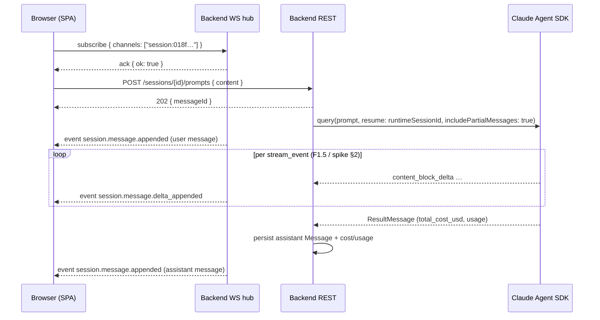
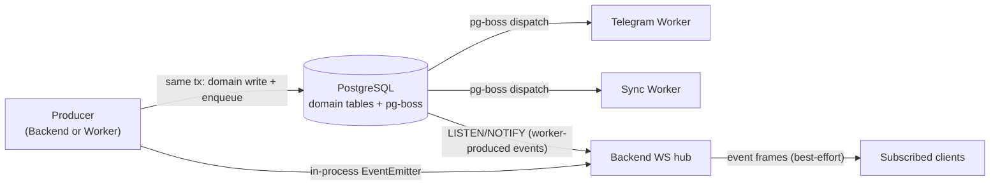

# TDS 04 — API Contracts & Event Models (WS2)

- **Status:** Revised — WS7 §7.2 leaf items closed (2026-08-12): item 1 spend aggregate (§7.8), item 2 Session-scoped Commits/Files (§6.10), the A13 session-title derivation contract (§6.11, with pointers from §6.1/§6.2/§6.4/§6.8), non-blocking N16 (§6.2) and N17 (§11). Earlier: WS7 integration-review package 2 applied (2026-08-11) — blocking findings B3, B5, B6, B9, B11b, B12, B13 and non-blocking N1, N4, N5, N10, per arbitrations A1–A11 in `docs/tds/00-overview.md` §5.
- **Owner:** WS2 / backend-architect (instance B)
- **Date:** 2026-08-12
- **Inputs:** `docs/tds/01-foundation-decisions.md` (Foundation Contract — consumed verbatim), `docs/tds/00-overview.md` (WS7 arbitrated decisions §5, blocking findings §7 — authoritative), `docs/tds/03-database-schema.md` (WS3 storage shapes this contract matches), `Requirements.md` (PRD v2.1, esp. §4, §5, §8, §12), `docs/project-plan.md` (WS2 row), `docs/research/claude-code-control-spike.md`
- **Foundation decisions consumed:** F1.5 (wrapper/session facts), F4 (entities, ID/naming/timestamp conventions), F5 (API conventions), F6 (event grammar/envelope/delivery), F7 (session state machine), F9 (doc conventions)
- **Non-goals:** process/deployment layout (WS1), table DDL (WS3), frontend consumption (WS4), UI layouts (WS5)

This document is the contract-first source for the OpenAPI 3.1 spec: every endpoint is specified with method, path, request/response shape, and error codes so that `openapi.yaml` can be generated mechanically (Fastify JSON schemas → OpenAPI per F5.1). §16 contains a fully-specified representative OpenAPI snippet for the Sessions resource.

---

## 1. Global Conventions

All conventions below restate or elaborate F4/F5 — none amend them.

### 1.1 Base URL, naming, versioning

- All REST routes live under `/api/v1` (F5.2). Plural kebab-case resources; lifecycle verbs are POST sub-actions (F5.1).
- JSON fields are `camelCase`; timestamps are ISO 8601 UTC with `Z` suffix (F4.2). All IDs are UUIDv7 strings (F4.2) unless explicitly noted (e.g., `runtimeSessionId` is the Claude Code UUIDv4 per F1.5).
- Every response carries `X-Request-Id`. The same value appears as `requestId` in error envelopes and logs (F5.4).

### 1.2 Response envelopes

- **Lists** (F5.3): `{ "data": [ … ], "meta": { "nextCursor": string|null, "limit": number } }`. Query params `limit` (default 50, max 200) and `cursor`. The cursor stays **opaque and base64-encoded** per F5.3; what it encodes is the *stated ordering key of that resource* — the UUIDv7 `id` by default, and the per-session `ordinal` for `GET /sessions/{id}/messages` (§6.6, arbitration A5). Default sort: ascending by `id` (UUIDv7 = time-ordered) unless the resource states otherwise; messages sort by `ordinal`, never by `id`.
- **Fixed read models** (`/services/health` §7.5, `/schedule` §7.7, `/spend` §7.8, `/sessions/{id}/files` §6.10.2): small, bounded, non-paginated results returned as `{ "data": … }` with no `meta` — F5.3 pagination applies to unbounded collections. Each of these states its bound explicitly (fixed cardinality, or a server-side cap plus a `truncated` flag); "bounded" is a claim the endpoint has to make good on, not a hope.
- **Single resources / action results** (WS2 elaboration, applied uniformly): `{ "data": { … } }`.
- **No body**: `204 No Content` for deletes, logout, and ingest acks.
- **Errors** (F5.4, every non-2xx):

```json
{
  "error": {
    "code": "UPPER_SNAKE_CODE",
    "message": "Human-readable summary",
    "details": { "field": "…" },
    "requestId": "018f6b2e-…"
  }
}
```

### 1.3 Error code registry

| Code | HTTP | Meaning |
|---|---|---|
| `VALIDATION_FAILED` | 400 | Request body/query failed schema validation; `details` lists field errors |
| `INVALID_CURSOR` | 400 | Unparseable/foreign `cursor` value |
| `UNAUTHORIZED` | 401 | No/invalid session cookie or bearer token |
| `INVALID_CREDENTIALS` | 401 | Login failure (never distinguishes user vs password) |
| `FORBIDDEN` | 403 | Authenticated but not allowed (e.g., `ingest`-scoped token on a non-ingest route) |
| `ORIGIN_NOT_ALLOWED` | 403 | WebSocket upgrade (or cookie-auth cross-origin request) with disallowed `Origin` (§14.2) |
| `NOT_FOUND` | 404 | Resource does not exist |
| `CONFLICT` | 409 | Generic state conflict (e.g., delete project with live sessions) |
| `INVALID_STATE_TRANSITION` | 409 | Session sub-action not legal from current F7 state |
| `SESSION_NOT_RUNNING` | 409 | Prompt submitted to a session that is not `running` |
| `OPERATION_NOT_SUPPORTED` | 409 | Action inapplicable to session type (e.g., `pause` on an observed session — physical semantics per WS1). **Canonical code** for this condition; WS1 §5.2's provisional name `UNSUPPORTED_FOR_SESSION_TYPE` is superseded — the error registry is owned by WS2 per F5.4 |
| `NO_TURN_IN_FLIGHT` | 409 | `interrupt` requested but no assistant turn is currently streaming (§6.3.1) |
| `INTEGRATION_NOT_CONFIGURED` | 409 | Test-connection or dependent action invoked before required settings/secrets exist |
| `PAYLOAD_TOO_LARGE` | 413 | Body exceeds route limit (prompts: 256 KiB; default: 1 MiB) |
| `RATE_LIMITED` | 429 | Throttled (login: 10/min/IP; other routes per WS1 policy) |
| `INTERNAL` | 500 | Unhandled error; `requestId` is the support handle |
| `RUNTIME_UNAVAILABLE` | 503 | Claude Code CLI/SDK not reachable (bad path, spawn failure) |

### 1.4 Authentication (F5.5)

Two principals, both mapped to the single local User (F4.1):

1. **Browser session cookie** — `mc_session`; HTTP-only, `SameSite=Lax`, `Secure` when served over HTTPS; server-side session persisted in PostgreSQL; idle timeout from `security.sessionTimeoutMinutes` (§7).
2. **Bearer API token** — `Authorization: Bearer mct_<token>`; hashed at rest; created/revoked via §3.3. Scopes: `full` (entire API) and `ingest` (only `POST /api/v1/hook-events`, §6.8).

All routes require authentication except `POST /api/v1/auth/login`. There is no RBAC in V1 (single user); scope enforcement (`ingest`) is the only authorization rule.

---

## 2. Resource Catalog

| Resource | Base path | Phase | Section |
|---|---|---|---|
| Auth & API tokens | `/api/v1/auth/*` | 1 | §3 |
| Projects | `/api/v1/projects` | 1 | §4 |
| Repositories | `/api/v1/repositories` | 1 | §5.1 |
| Commits | `/api/v1/commits` (+ nested) | 1 | §5.2 |
| PullRequests | `/api/v1/pull-requests` (+ nested) | 1 | §5.3 |
| Sessions | `/api/v1/sessions` | 1 | §6 |
| Messages | `/api/v1/messages` (+ nested) | 1 | §6.6 |
| Session commits (nested list) | `/api/v1/sessions/{id}/commits` | 1 | §6.10.1 |
| Session files (computed read model) | `/api/v1/sessions/{id}/files` | 1 | §6.10.2 |
| Hook events (observed-session ingest) | `/api/v1/hook-events` | 1 | §6.8 |
| Settings | `/api/v1/settings` | 1 | §7 |
| Service health | `/api/v1/services/health` | 1 | §7.5 |
| Schedule (computed read model) | `/api/v1/schedule` | 1 | §7.7 |
| Spend (computed read model) | `/api/v1/spend` | 1 | §7.8 |
| AuditLogEntries | `/api/v1/audit-log-entries` | 1 | §12 |
| Notifications | `/api/v1/notifications` | 2 | §8 |
| Adrs | `/api/v1/adrs` | 2 | §9 |
| Sync runs (Obsidian) | `/api/v1/sync-runs` | 2 | §10 |
| Search | `/api/v1/search` | 2 | §11 |
| MemoryItems | `/api/v1/memory-items` | 3 — stub | §13.1 |
| Agents / AgentTeams | `/api/v1/agents`, `/api/v1/agent-teams` | 4 — stub | §13.2 |
| WebSocket | `/api/v1/ws` | 1 | §14 |

---

## 3. Auth & API Tokens

### 3.1 Session auth

**`POST /api/v1/auth/login`** — no auth required. Rate limited 10/min/IP → `RATE_LIMITED`.

```ts
// Request
{ username: string, password: string }
// 200 — sets mc_session cookie
{ data: { user: { id: string, username: string }, expiresAt: string } }
// Errors: INVALID_CREDENTIALS (401), RATE_LIMITED (429), VALIDATION_FAILED (400)
```

Emits an `audit.entry_recorded` event (action `auth.login` / `auth.login_failed`).

**`POST /api/v1/auth/logout`** → `204`; invalidates the server-side session, clears cookie.

**`GET /api/v1/auth/me`**

```ts
// 200
{ data: {
    user: { id: string, username: string },
    authMethod: 'cookie' | 'token',
    session: { expiresAt: string } | null   // null for token auth
} }
```

**`POST /api/v1/auth/password`** — change password (PRD §4.4.6).

```ts
// Request
{ currentPassword: string, newPassword: string }   // newPassword: min 12 chars
// 204. Errors: INVALID_CREDENTIALS (401 — wrong currentPassword), VALIDATION_FAILED (400)
```

Invalidates all other server-side sessions; audited.

### 3.2–3.3 API tokens (PRD §4.4.6)

**`GET /api/v1/auth/tokens`**

```ts
// 200
{ data: Array<{
    id: string, name: string, prefix: string,          // e.g. "mct_a1b2…" (first 8 chars)
    scopes: Array<'full'|'ingest'>,
    lastUsedAt: string|null, expiresAt: string|null, createdAt: string
}>, meta: { nextCursor: null, limit: 50 } }
```

**`POST /api/v1/auth/tokens`**

```ts
// Request
{ name: string, scopes?: Array<'full'|'ingest'>, expiresAt?: string }  // default scopes: ['full']
// 201 — `token` is shown exactly once, stored only as a hash
{ data: { id: string, name: string, token: string, prefix: string, scopes: string[], expiresAt: string|null, createdAt: string } }
```

**`DELETE /api/v1/auth/tokens/{id}`** → `204`. Errors: `NOT_FOUND`. Audited.

---

## 4. Projects

```ts
interface Project {
  id: string; workspaceId: string;            // single default Workspace in V1 (F4.1)
  name: string; description: string | null;
  workflowMode: 'manual' | 'assisted' | null; // null = inherit integrations.github.workflowMode (§7.2)
  createdAt: string; updatedAt: string; archivedAt: string | null;
}
```

`workflowMode` is the per-Project override of the global GitHub Workflow Mode (PRD §4.3; arbitration A10). `null` means inherit — the effective mode is `project.workflowMode ?? integrations.github.workflowMode`. Storage: `projects.workflow_mode` (WS3, nullable). The *setting* is Phase 1; assisted **actions** are Phase 2 (§5.3).

| Method & path | Purpose | Notes / errors |
|---|---|---|
| `GET /api/v1/projects` | List (cursor) | Filter: `?archived=false` (default) |
| `POST /api/v1/projects` | Create → `201 { data: Project }` | `{ name, description?, workflowMode? }`; `VALIDATION_FAILED` |
| `GET /api/v1/projects/{id}` | Fetch | `NOT_FOUND` |
| `PATCH /api/v1/projects/{id}` | Update `{ name?, description?, archivedAt?, workflowMode? }` (`workflowMode: null` clears the override) | `VALIDATION_FAILED`, `NOT_FOUND` |
| `DELETE /api/v1/projects/{id}` | Delete → `204` | `CONFLICT` (409) if sessions/repositories still reference it |

---

## 5. Repositories, Commits, PullRequests (PRD §4.3)

### 5.1 Repositories

```ts
interface Repository {
  id: string; projectId: string | null;
  name: string; localPath: string;            // absolute native path (F8.1 path rules)
  remoteUrl: string | null; visibility: 'public'|'private'|'unknown';
  defaultBranch: string;
  lastSyncedAt: string | null; syncStatus: 'ok'|'failed'|'never';
  createdAt: string; updatedAt: string;
}
```

| Method & path | Purpose | Notes / errors |
|---|---|---|
| `GET /api/v1/repositories` | List (cursor); `?projectId=` filter | |
| `GET /api/v1/repositories/{id}` | Fetch | `NOT_FOUND` |
| `PATCH /api/v1/repositories/{id}` | `{ projectId? }` — assign to project | `NOT_FOUND`, `VALIDATION_FAILED` |
| `POST /api/v1/repositories/discover` | Scan discovery roots (settings §7.2) → `202 { data: { jobId: string } }` | `INTEGRATION_NOT_CONFIGURED` if no roots configured. Emits `repository.discovered` per new repo |
| `POST /api/v1/repositories/{id}/sync` | Refresh commits/PRs from git + GitHub → `202 { data: { jobId: string } }` | Emits `repository.synced` / `repository.sync_failed` |

Discovery/sync execute as pg-boss jobs (F3): in Phase 1 the Backend is the worker; in Phase 2 scheduled polling moves to the Sync Worker (F2.1) — the API contract is unchanged.

### 5.2 Commits

```ts
interface Commit {
  id: string; repositoryId: string; sessionId: string | null;   // linked when produced during a tracked Session
  sha: string; message: string; authorName: string; authorEmail: string;
  committedAt: string; filesChanged: number; additions: number; deletions: number;
  createdAt: string;
}
```

- `GET /api/v1/repositories/{id}/commits` — cursor list, newest first (`order=desc` default here); filters `?sessionId=`, `?branch=`.
- `GET /api/v1/commits/{id}` — single commit incl. `files: Array<{ path: string, status: 'added'|'modified'|'deleted'|'renamed' }>`.

### 5.3 PullRequests

```ts
interface PullRequest {
  id: string; repositoryId: string;
  number: number; title: string; url: string;
  state: 'open'|'merged'|'closed';                       // lifecycle facts (opened/reviewed/…) are events, §15
  authorLogin: string; sourceBranch: string; targetBranch: string;
  openedAt: string; mergedAt: string | null; closedAt: string | null;
  createdAt: string; updatedAt: string;
}
```

- `GET /api/v1/pull-requests` — cursor list; filters `?repositoryId=`, `?state=`.
- `GET /api/v1/repositories/{id}/pull-requests` — nested convenience list.
- `GET /api/v1/pull-requests/{id}` — single PR.

**Workflow Modes (PRD §4.3) — setting is Phase 1, actions are Phase 2.** The Manual/Assisted selector exists and persists from Phase 1: globally as `integrations.github.workflowMode` (§7.2) and per Project as `Project.workflowMode` (§4, `null` = inherit). Nothing in Phase 1 *behaves* differently — the mode is read by Phase 2 assisted actions.

> **Phase 2 — interface only.** This section is a placeholder/extension point.
> Detailed design is out of TDS scope per the project-plan scope guard.

Assisted-mode PR **actions** — PR creation, PR description generation, review summaries — are deferred to Phase 2 (sanctioned deviation D8): they depend on Phase 2 knowledge generation. There are therefore **no write endpoints on `pull-requests`** in this contract; `pull-requests` is read-only in Phase 1.

---

## 6. Sessions & Messages

### 6.1 Session resource

**Naming (resolves WS7 non-blocking N1): the session-type field is `sessionType` everywhere in this API** — on the resource, as the list filter `?sessionType=`, and in event payloads (§15.2). The earlier `Session.type` / `?type=` spelling is superseded; there is now exactly one API spelling. It maps to WS3's session-type column (`sessions.kind`, or `session_type` if WS3 adopts N1's rename) — a serialization mapping in `packages/shared`, not a second vocabulary. Values are unchanged: `managed` | `observed`.

```ts
type SessionState = 'created'|'running'|'paused'|'completed'|'failed'|'archived';  // F7, verbatim

interface Session {
  id: string;                                   // UUIDv7 (ours)
  projectId: string; repositoryId: string | null;
  sessionType: 'managed' | 'observed';          // PRD §4.1 session types (N1: one name, API-wide)
  state: SessionState;
  title: string; notes: string | null;
  branch: string | null;
  workingDirectory: string;                     // absolute native path
  runtime: {
    kind: 'claude_code';                        // Ollama/API adapters reserved (Phase 3+/5)
    runtimeSessionId: string | null;            // Claude Code native UUIDv4 (F1.5); null until spawn/attach
    claudeVersion: string | null;
    model: string | null;
    machine: string | null; environment: string | null;
  };
  observation: {                                // observed sessions only; null for managed (§6.9)
    channel: 'hooks_and_transcript' | 'hooks_only' | 'transcript_only';
    degraded: boolean;                          // true = transcript tailer detached (reduced fidelity)
    reason: string | null;                      // last parser/tailer error, when degraded
    driftCount: number;                         // parse failures counted by the tailer
    updatedAt: string;
  } | null;
  costUsd: number | null;                       // canonical source: SDK ResultMessage (F1.5)
  tokenUsage: { input: number, output: number, cacheRead: number, cacheWrite: number } | null;
  durationSeconds: number | null;
  resumedFromSessionId: string | null;          // F7: resume-of-completed creates a NEW Session
  clonedFromSessionId: string | null;           // clone/fork lineage (WS3 may merge with the above; API keeps both)
  createdAt: string; startedAt: string | null; completedAt: string | null;
  archivedAt: string | null; updatedAt: string;
}
```

**`title` is the primary human label for a Session, and the Backend fills it (arbitration A13).** WS4 §9.3 renders `title` first on every surface that shows a Session; WS3 §4.6 weights `sessions.title` as full-text rank class `A`, the highest; and the Phase 2 Telegram, Obsidian and export surfaces read nothing else. **§6.11 is the complete contract** — when the Backend derives a title from the first user Message, the exact derivation rule, the idempotence guard, the operator override, and the fallback.

Wire representation: `title` is **always present and always a string**; the unset value is the empty string `''`, which maps to `sessions.title IS NULL` in storage (WS3 §3.9) — `title ?? ''` outbound, `'' → NULL` inbound. That mapping is what lets §16 keep `title` in `required` as `type: string` while the column stays nullable; WS7 N6 (which observed the mismatch) is unchanged by this section and stays open as recorded.

### 6.2 CRUD

| Method & path | Purpose | Notes / errors |
|---|---|---|
| `GET /api/v1/sessions` | Cursor list; filters `?state=`, `?projectId=`, `?sessionType=`, `?repositoryId=`; `order=desc` default | `INVALID_CURSOR` |
| `POST /api/v1/sessions` | Create **managed** Session in state `created` → `201 { data: Session }` | Body below. Observed Sessions are created only by the system (§6.8) |
| `GET /api/v1/sessions/{id}` | Fetch | `NOT_FOUND` |
| `PATCH /api/v1/sessions/{id}` | `{ title?, notes?, projectId? }` — `title` is the operator override and always wins over derivation; `title: null` or `''` clears it (§6.11.4) | `VALIDATION_FAILED`, `NOT_FOUND` |

```ts
// POST /api/v1/sessions request
{
  projectId: string,
  workingDirectory: string,        // validated to exist; RUNTIME_UNAVAILABLE if CLI path invalid at start
  repositoryId?: string,
  branch?: string,
  title?: string,
  model?: string                   // overrides integrations.claudeCode.defaultModel
}
```

Emits `session.created`.

**No `?since=` time filter in V1 (resolves WS7 non-blocking N16).** WS5 §5.2's Needs Attention widget scopes itself to "Sessions that entered `failed` in the last 24 h", which this list cannot express server-side — the filter set is `state` / `projectId` / `sessionType` / `repositoryId` and stays that way. Deliberate, per WS7's handling: the list is ordered newest-first, so the widget fetches one page of `?state=failed` and drops rows older than 24 h client-side. At single-operator volumes the first page always contains every recent failure, and the widget caps at 8 rows regardless. Adding `?since=` would also want an index on `(state, created_at DESC)` that no other read path needs (WS3 §3.9 leads with `project_id`). The trigger for revisiting is concrete rather than aesthetic: **if more than `limit` Sessions can plausibly fail inside 24 h, the widget can miss an entry** — at that point add `?since=<ISO 8601 instant>` filtering `created_at >= since`, plus the matching index, and not before.

#### 6.2.1 Launch at capacity — queued, never rejected (B3 / arbitration A2)

Launch respects `maxConcurrentSessions` (F1.5), but **saturation is not an error**. `start` and `resume` always succeed when the transition is otherwise legal; the response reports whether the launch happened now or was deferred:

```ts
// 200 — POST /sessions/{id}/start and POST /sessions/{id}/resume (in-place)
{ data: Session, meta: { launch: 'started' | 'queued' } }
```

- `launch: 'started'` — a slot was free; the runtime spawned/attached and the Session is `running`.
- `launch: 'queued'` — all `maxConcurrentSessions` slots are busy. A **durable `session.launch` job** is enqueued via pg-boss (WS1 §4.3: FIFO, survives Backend restarts). The Session **stays in its pre-launch state** — `created` for `start`, `paused` for in-place `resume` — and no `session.state_changed` is emitted yet. There is no `409` for this condition and no client-side retry loop; `details.reason = 'max_concurrent_sessions'` is withdrawn.

**How the client learns the transition.** When a slot frees, the Backend's `session.launch` consumer performs the launch and the normal F7 events fire: `session.state_changed` (`created → running` or `paused → running`) **plus** `session.started` / `session.resumed`, on the `sessions` and `session:{id}` channels. A client that received `launch: 'queued'` therefore renders a "Queued for launch" affordance derived from `state ∈ { created, paused }` after a successful launch call, and clears it on the next `session.state_changed` for that id. Because relay is best-effort (F6.3 / §14.7), the state is always re-derivable from `GET /sessions/{id}`.

Failure modes are unchanged: an illegal transition is still `409 INVALID_STATE_TRANSITION`, and a spawn failure at dequeue time still moves the Session to `failed` (with `session.failed`) — for a queued launch that outcome arrives as an event, not as the HTTP response, since the response was already returned.

### 6.3 Lifecycle sub-actions (F5.1 / F7)

Every transition below emits `session.state_changed` **plus** the specific event (F7 rule) and appends a timeline entry with trigger `user` — *at the moment the transition actually happens*, which for a queued launch is when the `session.launch` job runs, not when the request returns (§6.2.1). Illegal transitions → `409 INVALID_STATE_TRANSITION` (`details: { from, action }`). Actions inapplicable to `observed` sessions (per WS0 non-blocking finding #2; physical semantics defined by WS1) → `409 OPERATION_NOT_SUPPORTED`. Concurrency saturation is **never** an error (§6.2.1).

| Action | Path | Legal from | Result |
|---|---|---|---|
| Start | `POST /api/v1/sessions/{id}/start` | `created` | `200 { data: Session, meta: { launch: 'started' \| 'queued' } }` — `running` after spawn/attach confirm, or still `created` while queued (§6.2.1); spawn failure → session `failed` + `503 RUNTIME_UNAVAILABLE` |
| Pause | `POST /api/v1/sessions/{id}/pause` | `running` | `200 { data: Session }` (`paused`) |
| Resume (in-place) | `POST /api/v1/sessions/{id}/resume` | `paused` | `200 { data: Session, meta: { launch: 'started' \| 'queued' } }` — `running`, or still `paused` while queued (§6.2.1) |
| Resume (new record) | `POST /api/v1/sessions/{id}/resume` | `completed`, `failed`, `archived` | `201 { data: Session }` — **new** Session, state `created`, `resumedFromSessionId` set, runtime-native `resume` used at start (F1.5/F7). States never move backward |

> **`failed` added 2026-08-12 — cross-document contradiction resolved.** This row previously listed `completed` and `archived` only, which contradicted three other documents: WS1 §4.4 marks sessions orphaned by a backend restart as `failed(backend_restart)` and offers one-click resume as the recovery path; WS4 §6.6 and WS5 §5.5 both render `[Resume as new session]` on the `failed` composer. WS2 was the outlier and is corrected here. Nothing in **F7** changes: resume-as-new-record does not transition the source Session at all — it creates a new one linked by `resumedFromSessionId` — so which source states permit it is an API policy question, not a state-machine one. Refusing `failed` would have made the restart-recovery story unimplementable, which is precisely how the contradiction was found.
| End | `POST /api/v1/sessions/{id}/end` | `running`, `paused` | `200 { data: Session }` (`completed`, trigger `user`) |
| Archive | `POST /api/v1/sessions/{id}/archive` | `completed`, `failed` | `200 { data: Session }` (`archived`) |
| Clone | `POST /api/v1/sessions/{id}/clone` | any state with a `runtimeSessionId` except `archived` | `201 { data: Session }` — new Session, state `created`, `clonedFromSessionId` set; SDK `forkSession: true` at start (F1.5). Body: `{ title?: string }` |

#### 6.3.1 Turn interrupt (no state transition)

**`POST /api/v1/sessions/{id}/interrupt`** — stops the assistant turn currently in flight *without* changing Session state. This backs the `[Stop]` control in WS4 §6.8 / WS5 §5.5 and maps to WS1 §5.1 `interrupt()` on the managed runtime. It is deliberately **not** in the table above: no F7 transition occurs and **no `session.state_changed` is emitted** — the Session remains `running` and is immediately ready for the next prompt.

```ts
// 200 — turn stopped, session still running
{ data: { sessionId: string, messageId: string | null } }   // messageId = the retained partial Message
// Errors: SESSION_NOT_RUNNING (409), NO_TURN_IN_FLIGHT (409),
//         OPERATION_NOT_SUPPORTED (409, observed sessions — MC cannot gate an external CLI)
```

The partial assistant Message is persisted with `status = 'interrupted'` — the same `Message.status` field the API exposes in §6.6 (storage: WS3 `messages.status`) — keeps its assigned `ordinal`, and emits `session.message.appended` carrying `ordinal` and `status`, so the transcript retains the partial turn in conversation order rather than discarding it (the same retention principle as the failure case in WS4 §6.2, and what WS5 §5.5 renders as an "interrupted" marker). `messageId` in the response is that partial Message; it is `null` only if the turn produced no persisted content.

### 6.4 Prompt submission (PRD §4.2)

**`POST /api/v1/sessions/{id}/prompts`** — canonical prompt-transmission endpoint; the WebSocket `prompt` frame (§14.4) is transport-equivalent and produces the same result.

```ts
// Request (max 256 KiB)
{ content: string }
// 202 — user Message persisted; assistant response streams over WS channel session:{id}
{ data: { messageId: string } }
// Errors: SESSION_NOT_RUNNING (409), OPERATION_NOT_SUPPORTED (409, observed sessions), PAYLOAD_TOO_LARGE (413)
```

Emits `session.message.appended` (role `user`) immediately; assistant deltas flow as `session.message.delta_appended` (§14.5), and the final assistant Message emits `session.message.appended` on persist.

**Title derivation on the prompt path (arbitration A13).** If this is the Session's first user Message and no title has been set, the Backend derives `sessions.title` from `content` **in the same transaction as the Message insert** — committed before the `202` is returned, so any subsequent `GET /sessions/{id}` already reflects it. Derivation happens at persist, while the Message is still `status = 'pending'`: the label must exist even if the prompt is never transmitted to the runtime. Full rule, guard and override in **§6.11**.

**Message status on the prompt path (§6.6).** The user Message is persisted with `status = 'pending'` at acceptance and flips to `'complete'` once the runtime has received it; a second `session.message.appended` for the same `messageId` carries the new status (consumers are idempotent on event `id`, F6.3, and last-writer-wins on message state). If the session is paused or lost before transmission, the Message stays `pending` — it is redisplayed on resume and **never auto-replayed** (WS1 §5.1 cold-pause semantics; storage WS3 §3.11). This is what makes WS4/WS5's "pending prompt" affordance renderable from the API alone.

### 6.5 Live chat flow (managed session)



### 6.6 Messages

```ts
type MessageRole = 'user'|'assistant'|'system'|'tool';   // F4.1

interface Message {
  id: string; sessionId: string;
  ordinal: number;                                         // per-session monotonic sequence — THE order (A5)
  role: MessageRole;
  status: 'complete' | 'pending' | 'interrupted';          // WS3 messages.status
  content: Array<
    | { type: 'text', text: string }
    | { type: 'thinking', text: string }
    | { type: 'tool_use', toolUseId: string, toolName: string, input: unknown }
    | { type: 'tool_result', toolUseId: string, output: string, isError: boolean }
  >;
  model: string | null;
  tokenUsage: { input: number, output: number } | null;   // assistant messages only
  runtimeUuid: string | null;                              // transcript line uuid (spike §2), for dedup
  occurredAt: string;                                      // runtime-reported time when available
  createdAt: string;                                       // persisted-at (ingest time) — never an ordering key
}
```

**Ordering contract (B6 / arbitration A5).** `ordinal` is the app-assigned, per-session monotonic sequence (WS3 §3.11, `UNIQUE (session_id, ordinal)`) and is the **only** conversation-order key. Neither `id` (UUIDv7 = ingest time) nor `createdAt`/`occurredAt` orders a transcript: observed sessions ingest through two channels (hooks push + transcript tailing) that can deliver the same burst out of order or with identical timestamps. Gaps in `ordinal` are legal (failed turns); only relative order is meaningful.

**Status vocabulary.** `complete` (normal), `pending` (accepted but not yet transmitted to the runtime — §6.4), `interrupted` (partial assistant turn retained after `POST /sessions/{id}/interrupt` or a mid-turn failure — §6.3.1). Clients must render `pending` and `interrupted` messages, not hide them.

- **`GET /api/v1/sessions/{id}/messages`** — cursor pagination (F5.3), `order=asc` default (ascending `ordinal`). The opaque `?cursor=` encodes `ordinal`, not `id` (§1.2); on WS reconnect, clients pass the cursor for their last known **ordinal** to backfill the gap (§14.7). Filters: `?role=`, `?status=`.
- **`GET /api/v1/messages/{id}`** — single Message. `NOT_FOUND`.

Messages are content-immutable and have no write endpoints (user messages are created via prompt submission, all others by the wrapper/ingest pipeline). `status` is the one mutable field — it advances `pending → complete` / `interrupted` on the runtime's behalf, and each advance re-emits `session.message.appended` for the same `messageId`.

### 6.7 Timeline, export, context package (PRD §4.1, §8.3)

This section covers the **Timeline** tab of WS4 §6.7's right panel; the **Commits** and **Files** tabs are §6.10, and **Notes** is a field on the Session resource (§6.1), written through `PATCH /sessions/{id}`.

**`GET /api/v1/sessions/{id}/timeline`** — cursor list of lifecycle facts (F7 "recorded with timestamp + trigger"), read directly from `session_events` (WS3 §3.10):

```ts
{ data: Array<{
    id: string, occurredAt: string,
    type: string,                    // F6 event name, verbatim (session_events.type) — the source of truth
    kind: 'state_changed'|'commit_linked'|'prompt_submitted'|'tool_used'|'observation_changed'|'other',
    trigger: 'user'|'system',
    fromState?: SessionState, toState?: SessionState,
    refType?: 'commit'|'message', refId?: string,
    detail?: string
}>, meta: { nextCursor: string|null, limit: number } }
```

**`kind` is a presentation projection of `type`, not a second event vocabulary (resolves WS7 non-blocking N4).** `type` carries the F6 event name unchanged; `kind` exists only so the UI can pick an icon/row template without hard-coding the full catalog. The projection is total and fixed:

| F6 event `type` (from `session_events.type`) | Timeline `kind` |
|---|---|
| `session.state_changed` | `state_changed` |
| `commit.recorded` | `commit_linked` |
| `session.message.appended` with `role = 'user'` | `prompt_submitted` |
| `session.message.appended` with `role = 'tool'` | `tool_used` |
| `session.observation_degraded` | `observation_changed` |
| any other recorded event name | `other` |

`session.created` / `session.started` / `session.paused` / `session.resumed` / `session.completed` / `session.failed` / `session.archived` are **not** given their own `kind`: each is accompanied by `session.state_changed` (F7), which already carries `fromState`/`toState`, so rendering both would double every transition. The `note` kind is **removed** — nothing in the system produced it, and free-form notes live on `Session.notes` (§6.1), not the timeline. `other` is the deliberate forward-compatibility escape hatch: WS3 may append new F6-named rows without breaking this contract, and clients render them from `type` + `detail`.

**`POST /api/v1/sessions/{id}/export`**

```ts
// Request
{ format: 'markdown' | 'json' }
// 200
{ data: { format: string, filename: string, content: string } }
// Errors: NOT_FOUND; CONFLICT if state = created (nothing to export)
```

**`POST /api/v1/sessions/{id}/context-package`** — condensed context for seeding a new session (PRD §4.1).

```ts
// 200
{ data: { content: string /* markdown */, tokenEstimate: number, generatedAt: string } }
```

Both are synchronous in V1 (single user, bounded transcript size); if generation ever exceeds request budgets, they become 202+job without a path change.

### 6.8 Observed-session ingest: hook events (F1.5)

The hooks profile written into `.claude/settings.json` (WS1 installer) registers HTTP hooks that POST to this endpoint. Auth: **bearer API token with scope `ingest`** (§3.3) — cookie auth is rejected here (`FORBIDDEN`).

**`POST /api/v1/hook-events`**

```ts
// Request
{
  hookEventName: 'SessionStart'|'UserPromptSubmit'|'PostToolUse'|'Stop'|'SessionEnd',
  runtimeSessionId: string,        // Claude Code UUIDv4
  transcriptPath: string,          // absolute native path to the session JSONL
  cwd: string,
  occurredAt?: string,
  payload: object                  // hook-specific body (tool name/input/output, prompt, …) — passed through
}
// 204. Errors: UNAUTHORIZED (401), VALIDATION_FAILED (400)
```

Behavior: unknown `runtimeSessionId` + `SessionStart` ⇒ system creates an **observed** Session (`created` → `running` on attach; F7 trigger `system`) and starts transcript tailing (fidelity channel, F1.5); known id ⇒ event is folded into the Session record/timeline; duplicates are deduplicated on `(runtimeSessionId, hookEventName, occurredAt)`. Ingest must be tolerant: unrecognized `payload` shapes are stored raw, never rejected (version-drift rule, F1.5).

**Title derivation on the ingest path (arbitration A13).** An observed Session is created by `SessionStart` with no title — Mission Control never sees a Launch modal for it — so its label comes from the **first user Message ingest persists**, by the identical rule and in the identical transaction as the managed path. Either channel may be the one that writes it (the `UserPromptSubmit` hook payload, or the transcript tailer's first `role: 'user'` line); because both converge on one row through WS3 §3.11's `(session_id, runtime_message_id)` dedupe key, exactly one transaction derives, and the loser of the race is a no-op. An observed Session that produces no user Message at all — hook-only fidelity that never captured a prompt, or a session ended before its first turn — keeps `title` unset and falls back per **§6.11.5**.

### 6.9 Observation fidelity and degradation (B12 / arbitration A9)

Observed sessions run on two channels (F1.5, WS1 §6.3): hooks (push, supported surface) and transcript tailing (fidelity, version-sensitive). When the tailer's parse-drift counter crosses WS1's threshold it detaches and the session continues on **hooks only** — reduced message detail, no state change, no failure. That fact is user-visible (WS5's degraded-fidelity badge) and therefore contractual:

**Current state — `Session.observation`** (§6.1). Present on every `GET /sessions/{id}` and in list responses; `null` for managed sessions. Mapped from WS3 `transcript_tail_states`: `degraded ← degraded`, `driftCount ← drift_count`, `reason ← last_error`, `updatedAt ← updated_at`; `channel` is derived (`hooks_and_transcript` = both attached, `hooks_only` = tailer detached or never attached, `transcript_only` = hooks profile not installed for this session). A client can therefore render the badge **on load**, not only if it happened to be connected when the event fired.

**Transition — one event** (§15.2, F6 grammar and envelope verbatim):

| Event | Fires when | Payload |
|---|---|---|
| `session.observation_degraded` | `observation.degraded` goes false → true (tailer detaches) | `sessionId`, `reason`, `driftCount`, `channel` (the *post*-degradation channel) |

Phase 1, producer `backend`, relayed on `sessions` and `session:{id}`, and appended to the session timeline as `kind: 'observation_changed'` (§6.7). It is **not** an F7 transition: no `session.state_changed` is emitted and the Session state is untouched.

**Degradation is terminal for the life of the Session (WS7 arbitration A11).** There is no `session.observation_restored` event and no re-attachment contract. WS1 §6.3's degradation ladder is one-directional and `transcript_tail_states.degraded` is deliberately sticky across restarts so the badge cannot flap — so a "restored" event would have had no producer. It is also the honest model: re-attaching the tailer would not recover the transcript lines already skipped, so telling the operator fidelity was "restored" would overstate what they are actually seeing. The tail-state row dies with the Session, so the next Session starts clean.

One further deliberate point: this is **not** `sync.failed` — that event belongs to Obsidian sync runs and its `syncRunId` payload is meaningless here (WS1 §6.3 and WS6 §5.4 adopt this name).

### 6.10 Session panel data sources — Commits and Files (closes WS7 §7.2 item 2)

WS4 §6.7 gives the Session detail view a right panel with tabs **Commits / Files / Timeline / Notes**, each owning its own query keyed `['sessions', id, …]`, and PRD §8.3 names Files explicitly. Timeline is §6.7 and Notes is a Session field (§6.1). The two remaining tabs had no Session-scoped source: Commits were reachable only as `GET /repositories/{id}/commits?sessionId=` — the wrong resource for a Session-scoped panel, and unusable when the Session has no `repositoryId` — and `files[]` existed only on `GET /commits/{id}`, so the Files tab would have been one request per commit *and* would still have missed tool activity entirely.

#### 6.10.1 `GET /api/v1/sessions/{id}/commits`

Nested convenience list, exactly the pattern of `GET /repositories/{id}/pull-requests` (§5.3). Cursor list per F5.3, `order=desc` default (newest `committedAt` first). Items are the `Commit` resource of §5.2 **without** `files[]` — that stays on the single-commit fetch, which is what makes the Files tab a separate read model rather than an N+1 walk.

```ts
// 200
{ data: Commit[], meta: { nextCursor: string|null, limit: number } }
// Errors: NOT_FOUND (404, unknown session), INVALID_CURSOR (400)
```

Storage: `commits.session_id` (WS3 §3.7), served by `ix_commits_session_id`. **No WS3 change** — a Session's commit set is tens of rows, so the `committed_at DESC` ordering is an in-memory sort over an index-selective read; widening that index would tax the commit-polling insert path for no measurable gain.

#### 6.10.2 `GET /api/v1/sessions/{id}/files`

The de-duplicated set of files the Session touched, from **both** sources WS5 §5.5 names — the Session's commits **and** its tool activity — with a per-file touch count. Bounded read model, so `{ data: { … } }` with no cursor and no `meta` (§1.2), the same shape family as `/services/health` (§7.5) and `/schedule` (§7.7).

```ts
// 200
{ data: {
    root: string,                    // resolved absolute native path that relative paths are relative to
    files: SessionFileTouch[],       // ordered: touchCount desc, then path asc
    totalFiles: number,              // distinct paths found, before the cap
    truncated: boolean,              // true when totalFiles exceeded the 500-file cap
    commitsAsOf: string | null,      // repositories.last_synced_at for the Session's repository; null when none
    completeness: 'complete' | 'partial',
    completenessReason: 'observation_degraded' | 'hooks_not_installed' | null
} }
// Errors: NOT_FOUND (404)

interface SessionFileTouch {
  path: string;                      // root-relative with '/' separators — or the absolute native path when outsideRoot
  outsideRoot: boolean;              // true = touched outside the Session's root (surfaced, never hidden)
  touchCount: number;                // toolTouchCount + commitCount
  toolTouchCount: number;
  commitCount: number;
  sources: Array<'tool' | 'commit'>;
  status: 'added'|'modified'|'deleted'|'renamed' | null;  // newest commit's status; null when tool-only
  additions: number | null;          // summed over this Session's commits; null when tool-only
  deletions: number | null;          // idem
  lastTouchedAt: string;             // max(commit committedAt, tool Message occurredAt)
}
```

**Derivation — the exact reads.**

| Source | Reads | Path key |
|---|---|---|
| Commits | `commits.files` JSONB (`[{ path, status, additions, deletions }]`, WS3 §3.7) for rows with `commits.session_id = {id}`, expanded with `jsonb_array_elements`; index `ix_commits_session_id` | `f->>'path'` — already repository-relative with `/` separators (git's own form) |
| Tool activity | `messages` rows for the Session with `tool_file_path IS NOT NULL` (WS3 §3.11, column added for this endpoint — below), grouped with `count(*)` and `max(occurred_at)` | `messages.tool_file_path` — an absolute native path as the runtime reported it |

**De-duplication.** The two sources speak different path dialects; that is the whole problem, and ignoring it would list every edited file twice.

1. **Root.** `root = repositories.local_path` when `sessions.repository_id` is set, otherwise `sessions.working_dir` (WS3 §3.9). It is echoed in the response so the UI labels the list from server truth instead of inferring it.
2. **Tool paths** are normalized: already absolute → if under `root`, rewritten root-relative with `/` separators, `outsideRoot: false`. If **not** under `root`, kept verbatim as the absolute native path with `outsideRoot: true`. A tool that read `C:\Users\me\.ssh\config` must appear; silently dropping out-of-tree touches would make the panel a comfort blanket rather than a record.
3. **Commit paths** are used verbatim with `outsideRoot: false` — git cannot report a path outside its own tree.
4. Rows are grouped by the exact normalized string. **Accepted residual:** on case-insensitive filesystems (Windows 11 dev, F8) a tool that opened `Queue.ts` where git tracks `queue.ts` produces two rows. Case-folding on Windows only would make API behavior depend on which OS the server runs — a worse defect than a rare duplicate row — and git is case-sensitive and is the source of truth.
5. `touchCount = toolTouchCount + commitCount`; a file edited four times and committed twice reads `6`. Each tool invocation counts once — repeated `Read`s of the same file *are* separate touches, and collapsing them would understate how much attention a file got, which is the only thing this count exists to convey.

**Which tools count.** Only invocations whose input names a file: `Read`, `Write`, `Edit`, `MultiEdit`, `NotebookEdit` — a `MultiEdit` counts once per invocation, not once per inner edit. `Glob`/`Grep` take a directory or a pattern and `Bash` is opaque; including them would turn "files touched" into "paths mentioned". The list is runtime-version-dependent, so it lives in WS1's version-tolerant adapter (F1.5), never in SQL.

**Storage (WS3 §3.11 — one column and one index added for this endpoint).** `messages.tool_payload` is documented as holding "input or result" with no discriminator and no index, so extracting `tool_payload->>'file_path'` at read time would push runtime-version knowledge into a SQL expression that cannot degrade gracefully when the payload shape drifts — exactly the coupling F1.5 isolates in an adapter. Added instead:

```sql
ALTER TABLE messages ADD COLUMN tool_file_path text;   -- absolute native path taken from the tool input
CREATE INDEX ix_messages_session_tool_file ON messages (session_id, tool_file_path)
  WHERE tool_file_path IS NOT NULL;
```

Written once by the ingester — managed SDK stream, `PostToolUse` hook payloads, and transcript lines alike — at the moment it already parses the tool input. `tool_payload` remains the raw truth and is not replaced or reshaped. Nullable and partial-indexed, so it costs nothing on the conversation turns that make up the bulk of the table. *(Rejected: a generated column — the extraction rule depends on the runtime's tool schema, and a generated column cannot be version-tolerant. Rejected: read-time JSON extraction — same knowledge, worse place, and it fails silently and invisibly.)*

**Incompleteness is reported, never implied.** Managed Sessions stream every tool call through the Backend, so their file set is complete by construction. For **observed** Sessions the panel reports only what it can prove:

| `Session.observation` (§6.9) | `completeness` | `completenessReason` |
|---|---|---|
| `null` (managed Session) | `complete` | `null` |
| `channel: 'hooks_and_transcript'`, `degraded: false` | `complete` | `null` |
| `degraded: true` (tailer detached, WS1 §6.3 — terminal per A11) | `partial` | `observation_degraded` |
| `channel: 'transcript_only'` (no hooks profile installed) | `partial` | `hooks_not_installed` |

Hooks (`PostToolUse`) and the transcript are *meant* to be redundant for tool activity, so a degraded tailer often loses nothing here — but Mission Control cannot prove the redundancy held for any specific skipped line, and A11 already establishes that those holes are permanent. Once fidelity is known to be reduced, the panel therefore says `partial` rather than asserting a completeness it cannot verify. **The UI must render `partial` visibly** (WS5 §5.5's degraded-fidelity treatment): a Files tab that merely looks short is indistinguishable from a Session that genuinely touched few files, and that is precisely the silent-empty failure this field exists to prevent.

`commitsAsOf` applies the same honesty to the other source — commit-derived rows are only as fresh as the last repository sync (`repositories.last_synced_at`, §5.1), so the panel can say "commits as of 14:07" instead of implying real time. It is `null` when the Session has no `repositoryId`, in which case commit-sourced rows do not exist at all and the list is tool activity only.

**Pagination: none — bounded read model, decided from real session sizes.** An ordinary Session touches tens of files and a large refactor a few hundred; the consumer is a ~340 px right-hand list the operator scans (WS4 §6.7), not a corpus. Two structural reasons make a cursor list actively worse here: (a) the ordering key is `touchCount`, a computed aggregate with heavy ties, so a keyset cursor over it is neither stable nor cheap; (b) the aggregate must be computed in full before it can be ranked at all, so paginating makes the server repeat the same work N times and the client pay N round-trips for the same bytes. The server therefore caps at **500 files** ordered `touchCount desc, path asc` and reports `totalFiles` + `truncated`. A Session that touched more than 500 distinct files has a problem the Files tab was never going to solve.

**No caching, no new event.** Derived at read time from two Session-scoped, index-selective reads. The tab fetches lazily on first activation (WS4 §6.7) and is invalidated by `commit.recorded` and `session.message.appended` on `session:{id}` — both already relayed (§14.3) — so no event is added to the F6 catalog.

### 6.11 Session title — derivation, override, fallback (arbitration A13)

`sessions.title` is the **primary human label for a Session on every surface**: WS4 §9.3 leads with it in list rows, dashboard widgets, the shell open-sessions strip, the Live Session tab bar, command-palette results and links (UX finding MF1 — UUIDv7 prefixes are visually identical for same-hour Sessions and are therefore the *least* discriminating substring available). WS3 §4.6 weights it as full-text rank class `A`, the highest in the index. Phase 2 Telegram notifications, Obsidian notes, ADR backlink chips (WS5 §5.6.2) and `POST /sessions/{id}/export` all read it and nothing else.

A13 therefore assigns derivation to the **Backend**, not the client: a client-only derivation would leave every non-browser surface reading "Untitled" while the browser alone showed the right label, and would leave rank class `A` indexing an empty string.

The derivation is **deterministic string handling, not summarization.** There is no LLM call, no runtime round-trip and no background job — it must be computable inside the transaction that persists the message, and it must yield the same title on replay.

#### 6.11.1 When it fires

At the moment the Backend persists a Message with `role = 'user'`, **in the same transaction as that insert**, and only when the insert actually created a row: a replay collapsed by WS3 §3.11's `ON CONFLICT DO NOTHING` dedupe key derives nothing, because the title was already decided by the write it collapsed into.

| Path | Trigger |
|---|---|
| **Managed** | `POST /sessions/{id}/prompts` (§6.4) and the transport-equivalent WS `prompt` frame (§14.4). Derivation runs at persist, while the Message is still `status = 'pending'` — the label must exist even if the prompt is never transmitted (cold pause, §6.4/WS1 §5.1) |
| **Observed** | The first user Message written by ingest (§6.8), from whichever channel arrives first — the `UserPromptSubmit` hook payload or the transcript tailer's first `role: 'user'` line. Both converge on one row via the dedupe key, so exactly one transaction derives |

**A Session created but never started derives nothing.** `POST /sessions` (§6.2) stores the operator's optional `title` and nothing more. A Session that is created, never prompted, and eventually `archived` keeps its title unset for its whole life — as does an observed Session whose only hook traffic is `SessionStart`/`SessionEnd`. Nothing retro-derives from a Session's metadata; §6.11.5 is the answer for those.

#### 6.11.2 The derivation rule, exactly

Input is the persisted Message's rendered text (WS3 `messages.content`) — equivalently, the `content[]` blocks of `type: 'text'` from §6.6 concatenated in order. `thinking`, `tool_use` and `tool_result` blocks are ignored.

1. Normalize line endings (`\r\n`, `\r` → `\n`) and strip a leading BOM.
2. Split on `\n`. Skip leading lines that are blank after trimming **or** that consist solely of a Markdown code fence (```` ``` ```` or `~~~`, with or without an info string). Take the **first surviving line** — A13's "first line", with the one refinement that a prompt opening with a fenced code block titles itself from the first line of code rather than from ```` ```ts ````.
3. Within that line, collapse every run of whitespace (space, tab, U+00A0) to a single `U+0020`, drop remaining C0/C1 control characters, then trim. Only *this* line is collapsed; the newline handling is step 2's job, so nothing from later lines is ever folded in.
4. If the result is **≤ 60 Unicode code points**, it is the title.
5. Otherwise truncate: cut at the last space at or before code point 59; if the first 59 code points contain **no space** — a single long token such as a path, URL or minified line — hard-cut at 59. Trim trailing whitespace, then append `…` (U+2026). A derived title is therefore never longer than 60 code points.
6. If step 3 produced the empty string, **write nothing** and leave the title unset (§6.11.5 applies).

Length is counted in **Unicode code points**, never UTF-16 code units, so a cut can never split a surrogate pair and the rule produces byte-identical output in any runtime. The 60-code-point cap binds **derived titles only**; an operator-set title is bounded by the API's own `maxLength: 200` (§16) and is never ellipsised.

| First user prompt | Derived title |
|---|---|
| `Refactor the queue port to batch enqueue` | `Refactor the queue port to batch enqueue` |
| `Fix the TLS renewal` ⏎⏎ `It fails on the nginx reload step.` | `Fix the TLS renewal` |
| ```` ```ts ```` ⏎ `export function enqueue(job: Job) {` ⏎ … | `export function enqueue(job: Job) {` |
| A 400-character single line starting `Investigate why the Sync Worker keeps …` | `Investigate why the Sync Worker keeps…` (cut at the last space ≤ 59, ellipsised) |
| `D:\Repos\MCS\apps\backend\src\sessions\manager\session-manager.ts` (no spaces) | first 59 code points + `…` |
| `   ` ⏎ ```` ``` ```` ⏎ `   ` (whitespace and a bare fence) | none — title stays unset |

#### 6.11.3 Idempotence — the guard is `title IS NULL`, and there is no flag

Derivation is a **conditional update in the message-insert transaction**:

```sql
UPDATE sessions SET title = $derived, updated_at = now()
WHERE id = $sessionId AND title IS NULL;
```

**No `title_derived` flag, and therefore no WS3 change** — `sessions.title` already exists and is already nullable (WS3 §3.9). A boolean flag would carry exactly the information `title IS NULL` already carries, while adding a column that can disagree with the value it describes (a flag left `true` after the operator renames, or `false` on a row whose title was cleared). The predicate is the literal question being asked — "has anyone named this Session yet?" — it is evaluated on a row the transaction already holds, and it cannot drift from the data. `POST /sessions` and `PATCH /sessions/{id}` normalize an empty or whitespace-only `title` to `NULL` at write, so "unnamed" has exactly one storage representation and the predicate stays total.

Four consequences, all deliberate:

- **An operator-set title is never overwritten** — the `WHERE` clause matches no row.
- **At most one *successful* derivation per Session.** Once `title` is non-null every later user Message no-ops on the same predicate.
- **A first prompt that derives nothing (step 6) leaves the next user Message eligible.** The rule is "derived once successfully", not "attempted once": a Session whose opening prompt was a bare code fence should not be condemned to `Untitled` for its lifetime, and the retry costs one predicate on a row the transaction is already touching.
- **A concurrent `PATCH` is resolved by commit order, not by a lock.** If the rename commits first, derivation no-ops; if it commits second, it overwrites — which is precisely the intended "the operator wins thereafter".

#### 6.11.4 Operator override

`PATCH /api/v1/sessions/{id}` with `{ title }` (§6.2) is the override and always wins. It is legal in **every** state including `archived` — renaming a record is not a lifecycle action and performs no F7 transition. The value is stored trimmed and verbatim, bounded by `maxLength: 200`; the 60-code-point ellipsis rule is the derivation's, not the column's.

`{ title: null }` — or `""`, or whitespace only, all normalized to `NULL` — **clears** the title.

**Clearing does not re-trigger derivation, and the reason is worth stating precisely:** derivation is triggered *only* by the persist of a user Message, never by `PATCH`. Clearing restores the precondition, so it changes the outcome only for a Session that has **not yet** had a user Message persisted — e.g. a `created` Session the operator named at launch and then thought better of, which will derive from its first prompt as normal. For any Session that has already been prompted, clearing simply leaves it unnamed and hands the label to §6.11.5. This is the honest reading of "derived only when `title IS NULL`" and it needs no extra machinery to hold.

#### 6.11.5 Fallback — referenced, not redefined

The title can legitimately be unset, so every consumer needs a fallback, and **this contract introduces no new one**:

- **Browser surfaces — WS4 §9.3 owns it** and is normative: `Untitled session · ‹…3f9a1c›`, where the tail is the last six hex characters of the id (random in UUIDv7, and therefore actually distinguishing). Not restated here.
- **Search** — WS3 §4.6 already coalesces the `session` branch to `'(untitled session)'`.
- **Phase 2 server-rendered surfaces** (Telegram bodies, Obsidian note titles, export filenames and headings) build their label the same way WS4 §9.3 does — the words `Untitled session` plus the six-hex id tail — rather than inventing a third constant.

#### 6.11.6 Events — none added, and no channel widened

**No new event, and no change to any existing event's payload or channel list.** The title changes at most once per Session, server-side, inside the transaction that already emits **`session.message.appended`** (role `user` — event #9, §15.2) on `session:{id}`. That event is the signal:

- **Live Session view, Live tab bar and the shell open-sessions strip** hold `session:{id}` subscriptions for every Session in the open set (WS4 §5.2, §6.5), so they already receive it. WS4's handler gains one clause: **on `session.message.appended` where `role = 'user'` and the cached Session has no title, also invalidate `['sessions', id]`.** No payload field is needed — `role` is already carried.
- **The sessions list and Dashboard widgets** subscribe to `sessions`, not `session:{id}`, and converge on their next `['sessions']` fetch. In the dominant flow they converge at once anyway: prompting a `created` Session is a start-with-prompt (WS4 §6.6), and the accompanying `session.state_changed` on `sessions` already invalidates `['sessions']` (WS4 §5.3). The residual is a Session prompted for the first time while already `running` (started via `[Start]`, typed into afterwards), where a list row can read `Untitled session · ‹…3f9a1c›` until the next refetch — a stale *label*, never a stale state, on a surface whose fallback already looks correct.
- **Adding `sessions` to event #9's channel list is rejected.** It would relay every message of every Session to every connected client, on the one channel the whole shell subscribes to, in order to correct one label once per Session — a firehose bought with a cosmetic gain. A13 reaches the same conclusion from the other side: because WS4 §9.3's fallback is never blank, there is no interval during which the operator sees nothing.

The derivation writes **no `session_events` row** and produces no timeline entry (§6.7): a title is not a lifecycle fact. It does bump `sessions.updated_at`, which is the only observable side effect beyond the column itself.

---

## 7. Settings (PRD §4.4)

Typed per-category documents, stored in the DB (`settings` / `secret_items`, F4.1); bootstrap settings (`DATABASE_URL`, `MC_HOST`/`MC_PORT`, `MC_ENCRYPTION_KEY`, `MC_DATA_DIR`) are **not** exposed by this API (F8.2). Every successful write emits `setting.updated` and an `audit.entry_recorded` (values of secret fields never appear in audit details).

### 7.1 Secret field semantics (write-only, PRD §4.4)

```ts
// READ shape (always masked):
type SecretFieldRead = { isSet: boolean };
// WRITE shape within a PUT body:
//   string        → set/replace the secret
//   null          → clear the secret
//   field omitted → keep current value unchanged
type SecretFieldWrite = string | null | undefined;
```

### 7.2 Category schemas

```ts
interface GeneralSettings {                             // PUT /api/v1/settings/general
  instanceName: string;
  timezone: string;                                     // IANA name
  dateFormat: string; timeFormat: '24h'|'12h';
  theme: 'dark'|'light';                                // dark default
  defaultLandingPage: 'dashboard'|'projects'|'sessions';
}

interface GithubSettings {                              // PUT /api/v1/settings/integrations/github
  token: SecretField;                                   // PAT
  account: string | null;
  organizations: string[];
  discoveryRoots: string[];                             // absolute native paths
  syncIntervalMinutes: number;                          // 0 = manual only
  workflowMode: 'manual' | 'assisted';                  // PRD §4.3 Workflow Mode; default 'manual' (Phase 1 setting, §5.3)
}

interface ClaudeCodeSettings {                          // PUT /api/v1/settings/integrations/claude-code
  cliPath: string;                                      // absolute path to claude / claude.exe
  defaultModel: string;
  maxConcurrentSessions: number;                        // F1.5 concurrency gate
  costBudget: {                                         // breach → notification type cost_budget_alert
    dailyUsd: number | null,                            // null = no daily budget
    perSessionUsd: number | null,
    alertThresholdPercent: number                       // 1–100, default 80 — see §7.8
  };
}

interface TelegramSettings {                            // PUT /api/v1/settings/integrations/telegram
  botToken: SecretField; chatId: string | null; enabled: boolean;
}

interface ObsidianSettings {                            // PUT /api/v1/settings/integrations/obsidian
  vaultPath: string | null;                             // absolute native path
  syncMode: 'two_way'|'one_way'|'paused';
  syncIntervalMinutes: number;
  conflictPolicy: 'newer_wins'|'mission_control_wins'|'obsidian_wins'|'manual';
}

interface NotificationsSettings {                       // PUT /api/v1/settings/notifications
  events: { sessionComplete: boolean, sessionFailed: boolean, syncFailed: boolean,
            repositoryProblem: boolean, costBudgetAlert: boolean };
  dailyReport: { enabled: boolean, time: string };      // "HH:mm" in general.timezone
  quietHours: { enabled: boolean, start: string, end: string };
}

interface SecuritySettings {                            // PUT /api/v1/settings/security
  sessionTimeoutMinutes: number;
  auditLogRetentionDays: number;
  allowedOrigins: string[];                             // extra WS/CSRF origins, §14.2 (default [])
}
```

**`costBudget.alertThresholdPercent` (added 2026-08-12 with §7.8).** WS5 §5.7.4 already renders the control (`alert at [ 80 ▾ ] %`) and WS5 §5.2's Dashboard progress rule is defined as "success under the alert threshold, warning at/over it, danger over 100 %" — so the threshold was a value the UI reads and no document stored. It is a field *inside* the existing `costBudget` object, which §7.6 rule 1 stores whole as one JSONB row (`('integrations', 'claude_code_cost_budget')`): **no new registry entry, no new `settings` row, no WS3 change.** Default `80`, validated `1–100` integer. The enable/disable of budget *alerting* stays where it already lives — `notifications.events.costBudgetAlert` — and is not duplicated here; `dailyUsd: null` means "no budget", which is a different statement from "alerts off" and the UI distinguishes them (WS5 §3.1, §5.2).

> **Phase 3 — interface only.** This section is a placeholder/extension point.
> Detailed design is out of TDS scope per the project-plan scope guard.

- `PUT /api/v1/settings/memory` — retention per memory tier, indexed sources (reserved shape).
- `PUT /api/v1/settings/integrations/qdrant` — `{ host, port, apiKey: SecretField, embeddingModel }` (form exists; integration inert until Phase 3).

> **Phase 4 — interface only.** This section is a placeholder/extension point.
> Detailed design is out of TDS scope per the project-plan scope guard.

- `PUT /api/v1/settings/agents` — `{ defaultRuntime, defaultPermissionTemplate }` (reserved shape).
- `PUT /api/v1/settings/integrations/ollama` — `{ host, port, defaultModel, enabled }` (Phase 3+).

### 7.3 Endpoints

| Method & path | Purpose | Notes / errors |
|---|---|---|
| `GET /api/v1/settings` | All categories, secrets masked → `{ data: { general, integrations: { github, claudeCode, telegram, obsidian, qdrant, ollama }, notifications, memory, agents, security } }` | |
| `GET /api/v1/settings/{category}` | One category (`general`, `notifications`, `memory`, `agents`, `security`) | `NOT_FOUND` for unknown category |
| `PUT /api/v1/settings/{category}` | Full-category replace → `200 { data: <category, masked> }`. Secret fields per §7.1 | `VALIDATION_FAILED` |
| `GET /api/v1/settings/integrations` | All integrations, masked | |
| `PUT /api/v1/settings/integrations/{integration}` | `github`, `claude-code`, `telegram`, `obsidian`, `qdrant`, `ollama` → `200`, masked | `VALIDATION_FAILED`, `NOT_FOUND` |

### 7.4 Test connection (PRD §4.4 + F8.1)

**`POST /api/v1/settings/integrations/{integration}/test-connection`** for `github`, `claude-code`, `telegram`, `obsidian` (Phase 1–2) and `qdrant`, `ollama` (Phase 3+ stubs — routes reserved, return `INTEGRATION_NOT_CONFIGURED` until their phases land).

A completed check is a **200 regardless of outcome** — failure of the *integration* is data, not an API error:

```ts
// 200
{ data: {
    ok: boolean,
    checkedAt: string,
    latencyMs: number | null,
    message: string,                       // "Authenticated as cento007", "Vault path not writable", …
    detail: object | null                  // integration-specific (e.g., github: { scopes: string[] })
} }
// Errors: INTEGRATION_NOT_CONFIGURED (409) if required fields/secrets absent
```

Checks per integration: `github` → authenticated API call with the stored PAT; `claude-code` → `execFile(cliPath, ['--version'])` (F8.1 validation); `telegram` → `getMe` + optional test message; `obsidian` → vault path exists/readable/writable.

### 7.5 Service health (PRD §4.4.7)

**`GET /api/v1/services/health`** — read-only, feeds the Settings → Services view. Per F2.1, the queue row reads **"Queue (PostgreSQL)"** — Redis does not exist in this system.

```ts
// 200
{ data: { services: Array<{
    name: 'backend'|'postgresql'|'queue'|'telegram-worker'|'sync-worker'|'qdrant'|'ollama',
    label: string,                                  // e.g. "Queue (PostgreSQL)"
    status: 'healthy'|'degraded'|'down'|'disabled'|'unknown',
    checkedAt: string,
    detail: string | null,
    meta: object | null                             // e.g. queue: { depth, oldestJobAgeSeconds }; workers: { lastHeartbeatAt }
}> } }
```

How each status is derived (heartbeats, queue depth) is WS1's design; this contract fixes only the shape. `qdrant`/`ollama` report `disabled` until Phase 3+.

### 7.6 Settings key registry — ownership and derivation rule (resolves WS7 non-blocking N10)

WS3 §3.12 defers the question of *which* setting keys exist to "a TypeScript settings registry in `packages/shared`". **WS2 owns that registry** — it is part of this API contract, not a separate document, because the category schemas in §7.2 are its only source. It ships as `packages/shared/src/settings/registry.ts` alongside the Phase 1 backend scaffold; there is no third document to write and no other workstream to wait for.

**Registry entry shape** (one per settable field):

```ts
interface SettingKeyEntry {
  path: string;            // API path within the category document, e.g. 'integrations.github.syncIntervalMinutes'
  category: 'general'|'integrations'|'notifications'|'memory'|'agents'|'security';  // WS3 settings.category CHECK
  key: string;             // DB key (snake_case), unique within category
  valueType: 'string'|'number'|'boolean'|'object'|'array';   // WS3 settings.value_type CHECK
  jsonSchema: object;      // the Fastify/JSON-Schema fragment that validates PUT bodies (F5.1)
  secret: boolean;         // true → stored in secret_items, never in settings; read as { isSet } (§7.1)
  phase: 1|2|3|4;
  default: unknown;        // seeded on first boot
}
```

**Derivation rule (mechanical, so drift is impossible):**

1. **One row per top-level field of a category document.** Nested objects/arrays are stored **whole** as JSONB (`value_type` `object`/`array`) with their inner keys left in camelCase — they are read and written as a unit, so splitting them buys nothing and costs a migration per field.
2. **`key` = `snake_case(field)`**, prefixed with `snake_case(integration)` + `_` for the `integrations` category (which is one DB category holding all integrations).
3. **Secrets never appear in `settings`** — same `(category, key)` coordinates, different table (`secret_items`), matching WS3 §3.13's examples.

| API path (§7.2) | DB `(category, key)` | `value_type` | Secret |
|---|---|---|---|
| `general.timezone` | `('general', 'timezone')` | `string` | no |
| `integrations.github.syncIntervalMinutes` | `('integrations', 'github_sync_interval_minutes')` | `number` | no |
| `integrations.github.workflowMode` | `('integrations', 'github_workflow_mode')` | `string` | no |
| `integrations.github.token` | `('integrations', 'github_token')` | — | **yes** → `secret_items` |
| `integrations.claudeCode.costBudget` | `('integrations', 'claude_code_cost_budget')` | `object` | no |
| `integrations.telegram.botToken` | `('integrations', 'telegram_bot_token')` | — | **yes** → `secret_items` |
| `notifications.events` | `('notifications', 'events')` | `object` | no |
| `notifications.quietHours` | `('notifications', 'quiet_hours')` | `object` | no |
| `security.allowedOrigins` | `('security', 'allowed_origins')` | `array` | no |

`setting.updated`'s `changedKeys` (§15.2, event 21) carries **DB keys** from this registry — names only, never values. Bootstrap variables (F8.2) have no registry entries by construction.

### 7.7 Schedule — computed read model (B13 / arbitration A1)

Backs the Dashboard "Upcoming Tasks" widget (PRD §8.1). **No entity, no table, no worker, no event**: every value is derived at read time from settings plus existing rows, and **nothing here is ever persisted**. Changing a setting changes the next read immediately.

**`GET /api/v1/schedule`**

```ts
// 200
{ data: Array<{
    kind: 'obsidian_sync' | 'github_poll' | 'daily_report',
    label: string,                   // display text, e.g. "Obsidian vault sync"
    enabled: boolean,
    nextRunAt: string | null,        // ISO 8601 UTC; null when disabled or interval = 0
    lastRunAt: string | null
}> }
```

Fixed cardinality (three kinds in Phase 1), so no cursor pagination and no `meta` (§1.2). Read-only: there is no POST/PATCH — the operator changes the schedule in Settings, and manual runs use the existing action endpoints (`POST /sync-runs`, `POST /repositories/{id}/sync`).

| `kind` | `enabled` | `lastRunAt` | `nextRunAt` |
|---|---|---|---|
| `obsidian_sync` | `obsidian.vaultPath` set **and** `syncMode ≠ 'paused'` **and** `syncIntervalMinutes > 0` | `completedAt` of the newest `SyncRun` with `kind = 'obsidian'` | `lastRunAt + syncIntervalMinutes`, or `now + syncIntervalMinutes` when there is no prior run |
| `github_poll` | GitHub PAT set **and** `github.syncIntervalMinutes > 0` | `max(repositories.last_synced_at)` | `lastRunAt + syncIntervalMinutes`, or `now + syncIntervalMinutes` when never synced |
| `daily_report` | `notifications.dailyReport.enabled` **and** Telegram enabled | `createdAt` of the newest Notification with `type = 'daily_report'` | next occurrence of `dailyReport.time` in `general.timezone`, converted to UTC |

`enabled: false` ⇒ `nextRunAt: null` (the row is still returned, so the UI can say *why* nothing is scheduled and link to Settings). A computed `nextRunAt` in the past means the run is due/overdue — the endpoint reports the schedule, not the queue, and does not clamp it. Phase 2 kinds (`obsidian_sync`, `daily_report`) are returned from Phase 1 with `enabled: false` until their workers exist, which is what makes the widget honest on day one rather than empty.

### 7.8 Spend — computed read model (closes WS7 §7.2 item 1 / UX finding WC1)

Four surfaces state the same spend number and must never disagree: the Dashboard **Spend** widget and its progress rule (WS5 §5.2), the shell **top-bar spend chip** `‹$3.42/$10.00›` (WS5 §3.1), the **Needs Attention** budget row (WS5 §5.2), and the current-spend line beside the budget field in Settings → Claude Code (WS5 §5.7.4). `Session.costUsd` is per-Session and `GET /sessions` is cursor-paginated (F5.3), so without this endpoint a client would have to walk every page of every day to add up one number. This endpoint is that number.

**`GET /api/v1/spend`**

```ts
// 200
{ data: {
    timezone: string,                       // IANA name actually used (general.timezone, or 'UTC' fallback)
    generatedAt: string,                    // ISO 8601 UTC
    day: SpendPeriod,                       // current calendar day in `timezone`
    month: SpendPeriod,                     // current calendar month in `timezone`
    budget: {
      dailyUsd: number | null,              // null = no daily budget configured
      perSessionUsd: number | null,
      alertThresholdPercent: number,        // 1–100, default 80
      alertsEnabled: boolean                // notifications.events.costBudgetAlert
    },
    dayStatus: 'no_budget' | 'ok' | 'alert' | 'over'
} }
// Errors: UNAUTHORIZED (401)

interface SpendPeriod {
  periodStart: string;      // ISO 8601 UTC, inclusive
  periodEnd: string;        // ISO 8601 UTC, exclusive
  totalCostUsd: number;     // 0 when nothing ran
  sessionCount: number;     // Sessions that contributed cost in the period
}
```

Fixed shape, bounded, no pagination and no `meta` (§1.2 fixed read model). Read-only: there is no POST/PATCH, no persistence, and no event — the budget itself is changed in Settings (§7.2).

**Setting keys (§7.6 registry, verbatim).**

| Value | API path (§7.2) | Registry `(category, key)` |
|---|---|---|
| Period timezone | `general.timezone` | `('general', 'timezone')` — `string`, IANA name |
| Daily budget | `integrations.claudeCode.costBudget.dailyUsd` | `('integrations', 'claude_code_cost_budget')` — one JSONB row, read whole (§7.6 rule 1) |
| Per-session budget | `integrations.claudeCode.costBudget.perSessionUsd` | same row |
| Alert threshold | `integrations.claudeCode.costBudget.alertThresholdPercent` | same row |
| Alerts enabled | `notifications.events.costBudgetAlert` | `('notifications', 'events')` — one JSONB row |

**Period semantics — the instance timezone, never UTC-by-accident.** "Today" means the calendar day in **`general.timezone`** (PRD §4.4.1 General → timezone). It is explicitly *not* the server's `TZ`, not PostgreSQL's session `TimeZone`, not the browser's zone, and not UTC. A Backend running UTC while the operator is in `Europe/Amsterdam` would roll "today" at 01:00 or 02:00 local — the Dashboard would read `$0.00` for the first two hours of every evening's work and the budget alert would fire against the wrong window, and nobody would notice until they went looking for a number they had already stopped trusting.

Bounds are computed **in SQL, in the same statement as the aggregate**, so the boundary and the sum cannot disagree:

```sql
SELECT (date_trunc('day',   now() AT TIME ZONE $tz))                        AT TIME ZONE $tz AS day_start,
       (date_trunc('day',   now() AT TIME ZONE $tz) + interval '1 day')     AT TIME ZONE $tz AS day_end,
       (date_trunc('month', now() AT TIME ZONE $tz))                        AT TIME ZONE $tz AS month_start,
       (date_trunc('month', now() AT TIME ZONE $tz) + interval '1 month')   AT TIME ZONE $tz AS month_end;
```

`date_trunc` runs on the local wall-clock timestamp and the result is converted back to an instant, so DST transitions yield correct 23-hour and 25-hour days. Adding `interval '1 day'` to the *local* timestamp before converting — rather than adding 24 hours to the UTC instant — is exactly what makes that true. `periodStart`/`periodEnd` are echoed as UTC instants so the client renders the window it was actually given instead of recomputing a boundary from the browser clock. An unset or unparseable `general.timezone` falls back to `UTC` and reports `timezone: "UTC"`: the endpoint neither fails nor silently adopts the host zone.

**Attribution — cost lands on the day the Session started.** The aggregate reads `sessions.total_cost_usd` (WS3 §3.9, `numeric(12,6)`; API `Session.costUsd`, canonical for managed sessions per F1.5) and buckets each Session by **`sessions.started_at`**.

- Not `created_at`: a Session can be created at 23:55 and started the next morning, and the money is spent when the runtime runs.
- Not `completed_at`: a long-running Session would contribute nothing all day and then dump its entire cost into whichever day it happened to finish — the widget would read `$0.00` while three sessions burned the budget, which is the exact failure mode WC1 exists to close.
- Cost on the Session row is cumulative (updated per SDK `ResultMessage`), so a Session spanning midnight keeps its whole cost on its start day. Stated rather than hidden: exact per-turn attribution would need cost on `messages`, which nothing stores, and adding a column to the largest table to make a midnight edge case precise is not a trade worth making for a single-operator dashboard.
- `started_at IS NULL` implies nothing ran and therefore no cost — so no `COALESCE`, no special case.
- **Every state counts**, `failed` and `archived` included: a failed Session spent real money, and archiving is retention housekeeping, not an accounting event.
- Observed Sessions normally have `total_cost_usd IS NULL` (no `ResultMessage`); SQL `sum()` ignores NULLs so they contribute `0`. **`sessionCount` counts only Sessions with a non-NULL cost** — the ones that actually produced the number — which is what makes WS5's "Observed sessions report no cost" footnote true instead of an excuse for a mismatch.

Because the day range is contained in the month range, one scan answers both:

```sql
SELECT coalesce(sum(s.total_cost_usd) FILTER (WHERE s.started_at >= b.day_start
                                                AND s.started_at <  b.day_end), 0)   AS day_cost,
       count(*) FILTER (WHERE s.started_at >= b.day_start AND s.started_at < b.day_end
                          AND s.total_cost_usd IS NOT NULL)                          AS day_sessions,
       coalesce(sum(s.total_cost_usd), 0)                                            AS month_cost,
       count(*) FILTER (WHERE s.total_cost_usd IS NOT NULL)                          AS month_sessions
  FROM b LEFT JOIN sessions s
    ON s.started_at >= b.month_start AND s.started_at < b.month_end;
```

**Storage (WS3 §3.9 — one index added for this endpoint).** No existing index serves "sum cost over a `started_at` range": `ix_sessions_project_state_created_at` leads with `project_id`, `ix_sessions_active` is partial on the three non-terminal states (and the Sessions that spent money are mostly `completed`), and `created_at` is the wrong column. Added:

```sql
CREATE INDEX ix_sessions_started_at ON sessions (started_at DESC) INCLUDE (total_cost_usd)
  WHERE started_at IS NOT NULL;
```

Partial — the rows it excludes are exactly the rows the aggregate ignores — and `INCLUDE (total_cost_usd)` makes the month scan index-only. **This is the only WS3 change this section needs.**

**Status rule — computed server-side so four surfaces cannot disagree about when the bar turns amber.**

| `dayStatus` | Condition |
|---|---|
| `no_budget` | `budget.dailyUsd` is `null` |
| `ok` | `day.totalCostUsd` < `dailyUsd × alertThresholdPercent / 100` |
| `alert` | at or over the threshold, and at or below `dailyUsd` |
| `over` | `day.totalCostUsd` > `dailyUsd` |

This is exactly WS5 §5.2's progress rule (success / warning / danger), so the colour comes from the server and only the percentage — `totalCostUsd / dailyUsd`, a display rounding — is computed client-side. `no_budget` is what drives WS5's `no budget set` rendering in place of the rule; `alertsEnabled: false` is what hides the top-bar chip (WS5 §3.1) while the Dashboard widget keeps showing spend (WS5 §5.2). **The endpoint always returns the numbers**: spend is never withheld because no limit was configured or because alerting is off — that was the WC1 gap in the first place.

**This is not an alerting path.** The `cost_budget_alert` Notification remains the Backend's threshold evaluation on `session.completed`/usage updates producing `notification.created` (§15.2 notes). Same setting inputs, two consumers; a read of this endpoint raises nothing.

**Caching: none, deliberately.** Derived on every call. For a single-operator instance the month-range aggregate is a bounded index-only scan over at most a few thousand rows, so a cache would buy microseconds and cost correctness at the two moments the number matters most — immediately after a Session completes, and at local midnight, which is precisely where a TTL keyed on the wrong clock produces a confidently stale number. If measurement ever disagrees, the escape hatch is F3's per-process LRU with a **≤ 15 s TTL keyed on `(timezone, dayStart)`** and explicit invalidation on `session.completed` — recorded here so nobody reintroduces the shared cache tier deviation D1 removed.

**Client refresh.** No `spend.*` event exists and none is added: F6 payloads carry entity IDs, and a spend total is a derived aggregate, not an entity change. Clients refetch `GET /spend` on `session.completed` / `session.failed` from the `sessions` channel and otherwise on an interval no tighter than 60 s (§14.7).

**Breakdown: not in V1 — decided, not omitted.** No Phase 1–2 surface renders per-project or per-day spend: the Dashboard widget shows one number plus month-to-date, the top-bar chip shows one number, Settings shows one number, and Needs Attention shows one number. Building `groupBy` now would add an index (`(project_id, started_at)`), a second caching question, and a response shape nothing consumes. If a spend-by-project or spend-over-time view is ever designed it arrives as an additive `?groupBy=project|day&days=<n>` returning a `breakdown[]` **alongside** the fields above — no path change, no breaking change — which is exactly why it is safe to leave out today.

---

## 8. Notifications (Phase 2)

```ts
interface Notification {
  id: string;
  type: 'session_completed'|'session_failed'|'sync_failed'|'repository_problem'|'daily_report'|'cost_budget_alert';
  severity: 'info'|'warning'|'error';
  title: string; body: string;                      // pre-rendered text (Telegram + UI share it)
  payload: object | null;                           // entity IDs for deep links; `payload.eventType` = originating F6 event where one exists (A8)
  correlationId: string | null;                     // links to the originating event chain (F6.2)
  readAt: string | null; createdAt: string;         // readAt is the in-app "delivery" state
  telegram: { status: 'skipped'|'pending'|'sent'|'failed', sentAt: string|null, error: string|null };
}
```

**Delivery representation (resolves WS7 non-blocking N5).** The earlier `deliveries[]` array is **removed** in favour of the flat `telegram` object, mirroring WS3 §4.2's `telegram_status` / `telegram_sent_at` / `telegram_error` columns one-to-one. Reasons: the `ui` entry in that array was synthetic — the Notification row *is* the in-app notification, and `readAt` is its only real UI state — and V1 has exactly one outbound channel, so an array modelled a fan-out that does not exist. `status = 'skipped'` means Telegram is disabled or this event type is toggled off (PRD §4.4.3). A future second channel is an additive sibling object (e.g. `email: {…}`), not a re-abstraction. `type` remains the notification-type enum above, **not** an F6 event name (arbitration A8).

| Method & path | Purpose | Notes / errors |
|---|---|---|
| `GET /api/v1/notifications` | Cursor list, newest first; `?unread=true` filter | |
| `GET /api/v1/notifications/{id}` | Fetch | `NOT_FOUND` |
| `POST /api/v1/notifications/{id}/read` | Mark read → `200 { data: Notification }` | Idempotent |
| `POST /api/v1/notifications/read-all` | → `200 { data: { updated: number } }` | |

Creation is system-only (Backend/workers translate events into Notification records per `NotificationsSettings`; Telegram delivery is the Telegram Worker's job, §15).

## 9. Adrs (Phase 2, PRD §7.3)

```ts
interface Adr {
  id: string; projectId: string;
  title: string;
  status: 'proposed'|'accepted'|'superseded'|'rejected';   // 'proposed' is the initial status (A4; WS3 CHECK)
  context: string; decision: string; alternatives: string; consequences: string;  // markdown, PRD template sections
  sourceSessionId: string | null;                  // when generated from a Session
  supersededByAdrId: string | null;
  obsidianPath: string | null; syncedAt: string | null;   // maintained by Sync Worker
  createdAt: string; updatedAt: string;
}
```

| Method & path | Purpose | Notes / errors |
|---|---|---|
| `GET /api/v1/adrs` | Cursor list; filters `?projectId=`, `?status=` | |
| `POST /api/v1/adrs` | Manual create → `201` | `{ projectId, title, context, decision, alternatives, consequences, status? }`; `status` defaults to `proposed` |
| `GET /api/v1/adrs/{id}` | Fetch | `NOT_FOUND` |
| `PATCH /api/v1/adrs/{id}` | Edit fields / change status (supersede sets `supersededByAdrId`) | `VALIDATION_FAILED` |
| `POST /api/v1/sessions/{id}/generate-adr` | AI-drafted ADR from a Session → `202 { data: { jobId: string } }`; Sync Worker produces a `proposed` Adr, emits `adr.created` | `CONFLICT` if session state is `created` |

There is no `draft` status anywhere in this contract: the ADR vocabulary is `proposed → accepted | rejected`, with `superseded` set when a later ADR replaces one (arbitration A4; WS3 §4.1 CHECK). "Draft" as a *verb* — an AI-generated ADR awaiting review — is exactly what `proposed` means.

## 10. Sync runs — Obsidian (Phase 2, PRD §7.1)

```ts
interface SyncRun {
  id: string; kind: 'obsidian';
  state: 'queued'|'running'|'completed'|'failed';
  trigger: 'user'|'schedule';
  startedAt: string | null; completedAt: string | null;
  stats: { notesExported: number, notesImported: number, conflicts: number } | null;
  error: string | null;
  createdAt: string;
}
```

| Method & path | Purpose | Notes / errors |
|---|---|---|
| `POST /api/v1/sync-runs` | Trigger manual sync → `202 { data: SyncRun }` (state `queued`) | `{ kind: 'obsidian' }`; `INTEGRATION_NOT_CONFIGURED` (no vault path), `CONFLICT` (a run already `running`) |
| `GET /api/v1/sync-runs` | Cursor list, newest first | |
| `GET /api/v1/sync-runs/{id}` | Fetch (incl. conflict details when `stats.conflicts > 0`) | `NOT_FOUND` |

Scheduled runs are created by the Sync Worker per `obsidian.syncIntervalMinutes`; both paths emit `sync.started` / `sync.completed` / `sync.failed` / `sync.conflict_detected`.

## 11. Search (Phase 2)

**`GET /api/v1/search?q=<text>&types=session,adr,commit,message&limit=20`** — keyword search (PostgreSQL FTS; roadmap Phase 2 "search"). Semantic memory search is a Phase 3 concern (§13.1) and does not share this route.

```ts
// 200
{ data: Array<{
    type: 'session'|'adr'|'commit'|'message'|'pull_request',
    id: string, title: string, snippet: string,       // snippet has <mark> highlights
    occurredAt: string, rank: number
}>, meta: { nextCursor: string|null, limit: number } }
```

**`?types=` takes the singular discriminator values (resolves WS7 non-blocking N17).** The accepted values are `session`, `adr`, `commit`, `message`, `pull_request` — comma-separated, **exactly** the values of the response `type` field above and exactly WS3 §4.6's `UNION ALL` branch names. The earlier plural example (`types=sessions,adrs`) is withdrawn: plural forms are **not** accepted, because a query parameter whose values differ from the response discriminator they select guarantees that someone eventually sends one and gets the other. An unrecognized value is `VALIDATION_FAILED` (400) with the offending value in `details`; omitting `?types=` searches all five.

**Cursor composition (matches WS3 §4.6).** Unlike every other list in this document, the search cursor is **not** a UUIDv7 keyset. Results are a `UNION ALL` across five entity types ordered by relevance, so the cursor encodes the triple **`(rank, occurredAt, id)`** — the same keyset WS3's query pins — base64url-encoded and opaque to clients per F5.3. Ranking uses `ts_rank_cd(search_tsv, query, 32)`, normalized to `(0,1)` precisely so ranks are comparable across the five branches; a cursor is therefore only valid for the `q`/`types` combination that produced it, and a client changing either must restart from the first page.

## 12. AuditLogEntries (PRD §10)

```ts
interface AuditLogEntry {
  id: string; occurredAt: string;       // mapped from audit_log_entries.created_at (append-only table)
  actorType: 'user'|'agent'|'system'; actorId: string | null;   // WS3 CHECK, verbatim; 'agent' lands in Phase 4
  action: string;                       // e.g. 'auth.login', 'setting.updated', 'session.archived', 'token.created'
  entityType: string | null;            // F4 table name, e.g. 'settings', 'sessions'
  entityId: string | null;
  before: object | null;                // relevant field subset; null for creates — secrets always redacted
  after: object | null;                 // relevant field subset; null for deletes — secrets always redacted
  requestId: string | null;             // joins to API logs (F5.4)
}
```

**Shape follows storage (B9 / arbitration A7).** The fields are `audit_log_entries` (WS3 §3.14) in camelCase per F4.3 — `entityType`/`entityId`/`before`/`after`, not the earlier `targetType`/`targetId`/`details`. `actorType` has three values, matching the DB CHECK: **there is no `'token'` actor.** A bearer-token call is still the single local User acting, so it is recorded as `actorType: 'user'` with the acting token identified in the entry payload (`after.apiTokenId` / `after.apiTokenName`, never the token value). Inventing a fourth actor type for an authentication *method* would have created a column the database does not have and a principal the system does not model.

- **`GET /api/v1/audit-log-entries`** — cursor list, newest first; filters `?action=`, `?actorType=`, `?from=`, `?to=`, `?entityType=`, `?entityId=`.
- **`GET /api/v1/audit-log-entries/{id}`** — single entry.

Read-only resource; entries are written by the Backend on auth events, setting changes, token lifecycle, session lifecycle user actions, and git/agent actions (agent actions Phase 4). Retention per `security.auditLogRetentionDays`.

---

## 13. Phase 3–5 Interface Stubs

### 13.1 Memory APIs

> **Phase 3 — interface only.** This section is a placeholder/extension point.
> Detailed design is out of TDS scope per the project-plan scope guard.

Reserved routes (PRD §12: Search / Store / Delete), no payload detail:

- `POST /api/v1/memory-items/search` — semantic query across memory tiers (Qdrant-backed).
- `POST /api/v1/memory-items` — store a MemoryItem.
- `GET /api/v1/memory-items/{id}` / `DELETE /api/v1/memory-items/{id}` — fetch / delete.
- Reserved event names: `memory.item_stored`, `memory.item_deleted`, `memory.reindexed` (§15.4). Reserved WS channel: `memory`.

### 13.2 Agent APIs

> **Phase 4 — interface only.** This section is a placeholder/extension point.
> Detailed design is out of TDS scope per the project-plan scope guard.

Reserved routes (PRD §12: Create / Update / Assign / Execute):

- `GET|POST /api/v1/agents`, `GET|PATCH /api/v1/agents/{id}` — Agent CRUD (structure per PRD §5.3).
- `POST /api/v1/agents/{id}/assignments` — assign to project/session.
- `POST /api/v1/agents/{id}/executions` — execute a task via the agent's runtime (permission gating maps onto the F1.5 control surfaces).
- `GET|POST /api/v1/agent-teams`, `GET|PATCH /api/v1/agent-teams/{id}` — AgentTeam CRUD.
- Reserved event names: `agent.created`, `agent.updated`, `agent.assigned`, `agent.execution_started`, `agent.execution_completed`, `agent.execution_failed` (§15.4). Reserved WS channel: `agents`.

---

## 14. WebSocket Protocol — `/api/v1/ws` (F5.6)

Single multiplexed connection per client; JSON text frames; protocol version 1.

### 14.1 Handshake & authentication

Upgrade request to `GET /api/v1/ws`. Two auth paths, mirroring §1.4:

1. **Cookie** (`mc_session`) — the browser path. **Requires Origin validation (§14.2).**
2. **Bearer token** (`Authorization: Bearer mct_…`, scope `full`) — programmatic clients. `ingest`-scoped tokens are rejected (`403 FORBIDDEN`).

Failed auth rejects the upgrade with plain HTTP `401` + the F5.4 error envelope. On success the server completes the upgrade and immediately sends `hello`.

### 14.2 Origin validation (cross-site WebSocket hijacking defense)

`SameSite=Lax` does **not** protect WebSocket upgrades — browsers attach cookies to cross-site WS handshakes. Therefore, for any upgrade that presents a cookie, the Backend enforces an explicit Origin allowlist (resolves WS0 non-blocking finding #3):

**Allowlist construction** (computed at startup, recomputed on `setting.updated` for `security`):

1. The Backend's own canonical origin(s) derived from bootstrap config: `http(s)://{MC_HOST}:{MC_PORT}`, plus the loopback equivalents `http://localhost:{MC_PORT}` and `http://127.0.0.1:{MC_PORT}` when `MC_HOST` binds loopback/wildcard.
2. When `NODE_ENV=development`: the Vite dev-server origin (default `http://localhost:5173`).
3. Entries from `security.allowedOrigins` (§7.2) — DB-stored, so no new bootstrap env var is introduced (the F8.2 variable set stays locked); covers e.g. a future reverse-proxy hostname.

**Enforcement rule at upgrade:**

| Condition | Decision |
|---|---|
| `Origin` present and exactly equal (case-insensitive scheme/host, exact port) to an allowlist entry | Proceed with cookie or bearer auth |
| `Origin` present but not in allowlist — including `Origin: null` | **Reject: HTTP `403`**, code `ORIGIN_NOT_ALLOWED`, before completing the upgrade; log with `requestId` |
| `Origin` absent (non-browser client) | Cookie auth is **not** accepted; require bearer token, else `401 UNAUTHORIZED` |

Matching is exact string comparison of normalized origins (scheme + host + port) — no wildcard or suffix matching. The same allowlist is applied to cookie-authenticated cross-origin REST mutations as defense-in-depth (SameSite=Lax remains the primary REST CSRF control).

### 14.3 Channels

| Channel | Carries (event types per §15) | Phase |
|---|---|---|
| `sessions` | All session lifecycle events across sessions (`session.created`, `session.state_changed`, `session.started`, `session.paused`, `session.resumed`, `session.completed`, `session.failed`, `session.archived`) plus `session.observation_degraded` (§6.9) — powers lists/dashboard | 1 |
| `session:{id}` | Everything for one Session: lifecycle and observation events above scoped to the id, `session.message.appended`, `session.message.delta_appended`, `commit.recorded` (when `sessionId` matches) | 1 |
| `repositories` | `repository.*`, `commit.recorded`, `pull_request.*` | 1 |
| `settings` | `setting.updated`, service-health status changes | 1 |
| `audit` | `audit.entry_recorded` | 1 |
| `notifications` | `notification.created`, `notification.sent`, `notification.failed` | 2 |
| `sync` | `sync.*` | 2 |
| `adrs` | `adr.created`, `adr.updated` | 2 |
| `memory` | reserved | 3 — stub |
| `agents` | reserved | 4 — stub |

Single-user system: any authenticated `full` principal may subscribe to any channel. Limit: 64 concurrent channel subscriptions per connection (`ack { ok: false, error: { code: 'VALIDATION_FAILED' } }` beyond).

### 14.4 Client → server frames

```ts
type ClientFrame =
  | { type: 'subscribe',   id: string, channels: string[] }     // id: client-chosen correlation for the ack
  | { type: 'unsubscribe', id: string, channels: string[] }
  | { type: 'prompt',      id: string, sessionId: string, content: string }  // ≡ POST /sessions/{id}/prompts
  | { type: 'ping',        id?: string };
```

Max client frame size 256 KiB (prompt ceiling, matching §6.4). Malformed/oversized frames get an `error` frame; repeated violations close the socket with code `4000`.

**`error` frame vs. refusing `ack` — the distinction is load-bearing.** A **malformed** frame (unparseable, wrong shape, oversized) gets an `error` frame and counts toward the violation budget. A **well-formed** frame refused on its merits — `subscribe` naming an unknown channel, a `session:{id}` the caller cannot read — gets `ack { ok: false, error }` and is **not** a violation. Both cases must be distinguishable by the client: an `ack` resolves the pending-request map keyed on the frame's `id`, which an `error` frame cannot do, so answering a refused `subscribe` with `error` would leave the client waiting forever. A semantic refusal is also not misconduct and must not accumulate toward a `4000` close.

**Origin is checked on every credential type.** The §14.2 rule is unconditional: a bearer-authenticated upgrade carrying an `Origin` header is allowlisted exactly as a cookie-authenticated one is. Only an upgrade with **no** `Origin` at all is treated differently — refused for cookies (a browser always sends one, so its absence means the request is not what it claims), accepted for bearer tokens (non-browser clients legitimately omit it).

**Phase 3/4 channels are subscribable and silent.** `memory` and `agents` appear in the §14.3 registry; a client may subscribe to them today and will receive nothing until those phases ship. This is deliberate — it keeps a Phase 3 client from being blocked by a Phase 1 decision — and is not a defect.

### 14.5 Server → client frames

```ts
type ServerFrame =
  | { type: 'hello', connectionId: string, serverTime: string, protocolVersion: 1 }
  | { type: 'ack',   id: string, ok: true,  channels?: string[], messageId?: string }   // messageId on prompt acks
  | { type: 'ack',   id: string, ok: false, error: { code: string, message: string } }  // e.g. SESSION_NOT_RUNNING
  | { type: 'event', channel: string, event: EventEnvelope }    // F6.2 envelope, verbatim
  | { type: 'pong',  id?: string }
  | { type: 'error', error: { code: string, message: string } };
```

All domain traffic uses `event` frames carrying the F6.2 envelope unchanged (F5.6 "wire frames carry the F6 envelope"). **Streaming deltas** are `event` frames too, with type `session.message.delta_appended` — an *ephemeral, WebSocket-only* event: relayed to `session:{id}` subscribers, never enqueued to pg-boss, never persisted (§15.2). Its payload embeds the runtime's native stream-event fields (spike §2) for fidelity:

```json
{
  "type": "event",
  "channel": "session:018f6b2e-…",
  "event": {
    "id": "018f6b2f-…", "type": "session.message.delta_appended", "schemaVersion": 1,
    "occurredAt": "2026-08-11T14:03:22.412Z", "source": "backend", "correlationId": "018f6b2e-…",
    "payload": {
      "sessionId": "018f6b2e-…", "messageId": "018f6b2f-…",
      "blockIndex": 0,
      "deltaType": "text_delta",              // text_delta | input_json_delta | thinking_delta
      "text": "Refactoring the",              // for text/thinking deltas
      "partialJson": null,                    // for input_json_delta (accumulate client-side)
      "streamEventType": "content_block_delta" // message_start | content_block_start | content_block_delta | content_block_stop | message_delta | message_stop
    }
  }
}
```

### 14.6 Heartbeat & limits

- Server sends protocol pings every 30 s; connection closed after 2 missed pongs. Clients may also send `ping` frames.
- Close codes: `1000` normal, `1001` server restart/shutdown, `4000` protocol violation, `4001` auth session expired or token revoked (client must re-authenticate and reconnect), **`4002` slow consumer** — the connection was dropped for sustained backpressure.

> **`4002` added 2026-08-12.** A connection dropped for being too slow is none of the original four: it is not normal, not a shutdown, not an auth failure, and reusing `4000` would blame the client for a protocol violation it did not commit. It is deliberately **not** `4001` — WS4 §5.1 makes `4001` the single code a client must *not* retry, whereas a slow consumer must reconnect and refetch. Any code other than `4001` reconnects with backoff, which is the intended recovery.
>
> **Backpressure policy** (implemented in `ws/connection.ts`, two tiers): past the first buffered threshold the hub **drops ephemeral events** — `session.message.delta_appended` only — for that socket, without a marker frame. Deltas are the correct droppable class because they are self-healing: the turn ends with a durable `session.message.appended`, and WS4 §6.2 renders the committed Message from the API rather than from the delta stream, so the recovery signal is already in the protocol and pushing more bytes at a congested socket only worsens it. Past the second threshold the hub **closes with `4002`**: with deltas already dropped the peer is not draining at all, and the durable events now backing up cannot be silently discarded without lying about what the client has seen. F6.3 provides exactly one recovery mechanism — reconnect and refetch — and closing is how it is invoked. A client that believes it is live while its state is stale is the one failure mode an operator console must not have.

### 14.7 Reconnect & refetch-on-reconnect (F6.3)

Relay is **best-effort with no replay** in V1. Any reconnect must be treated as a loss window:

1. Reconnect with exponential backoff + jitter (base 1 s, cap 30 s).
2. On `hello`, re-send `subscribe` for all desired channels (server keeps no subscription state across connections).
3. Refetch current state per channel before trusting new events:
   - `session:{id}` → `GET /sessions/{id}` (state, `observation` fidelity, and — after a queued launch — whether it started) + `GET /sessions/{id}/messages?cursor=<cursor for last known ordinal>` (gap backfill; the cursor is keyed on `ordinal`, §6.6); discard any in-flight delta stream and rely on the final `session.message.appended` + message refetch. Re-read `status` on the last few messages too: `pending → complete` and `interrupted` transitions may have been missed.
   - `sessions` → `GET /sessions?state=running` (+ whatever list filters the view holds); sessions left in `created`/`paused` may be queued for launch (§6.2.1). Also `GET /spend` (§7.8) whenever the shell spend chip or the Dashboard Spend widget is mounted — a Session may have completed inside the loss window, and a stale spend total is a confidently-wrong number rather than a missing one.
   - `notifications` → `GET /notifications?unread=true`.
   - `sync` → `GET /sync-runs?limit=1`; `settings` → `GET /services/health`; `audit`/`adrs`/`repositories` → refetch the visible list.

Consumers must be idempotent on event `id` (F6.3) — duplicates across the reconnect boundary are expected.

---

## 15. Event Catalog (F6)

### 15.1 Envelope & delivery topology

All events use the F6.2 envelope verbatim (`id` UUIDv7, `type`, `schemaVersion: 1`, `occurredAt`, `source`, `correlationId`, `payload`). Payloads carry **entity IDs plus small scalar discriminators only — never full entities**; queue consumers (workers) read current state through the shared data layer (`packages/shared`, F2.2), and WS clients refetch via REST (F6.3). Delivery is at-least-once via pg-boss; producers write the domain change and enqueue in the same PostgreSQL transaction (transactional outbox, F6.3; mechanism pinned by WS3); consumers deduplicate on event `id`.



### 15.2 Catalog — Phases 1–2

Legend — **Queue**: pg-boss consumers (durable, at-least-once). **WS**: relay channels (best-effort). *Notif.* means the consumer decides per `NotificationsSettings` whether to create a Notification.

| # | Event type | Ph | Producer | Payload fields | Queue consumers | WS channels |
|---|---|---|---|---|---|---|
| 1 | `session.created` | 1 | backend | `sessionId`, `projectId`, `sessionType` (`managed`\|`observed`), `trigger` (`user`\|`system`) | — | `sessions` |
| 2 | `session.state_changed` | 1 | backend | `sessionId`, `fromState`, `toState`, `trigger` | — | `sessions`, `session:{id}` |
| 3 | `session.started` | 1 | backend | `sessionId` | — | `sessions`, `session:{id}` |
| 4 | `session.paused` | 1 | backend | `sessionId` | — | `sessions`, `session:{id}` |
| 5 | `session.resumed` | 1 | backend | `sessionId`, `resumedFromSessionId` (null for in-place paused→running) | — | `sessions`, `session:{id}` |
| 6 | `session.completed` | 1 | backend | `sessionId`, `trigger` | telegram-worker *(Notif.: session_completed)* ᴾ² | `sessions`, `session:{id}` |
| 7 | `session.failed` | 1 | backend | `sessionId`, `reason` (short string) | telegram-worker *(Notif.: session_failed)* ᴾ² | `sessions`, `session:{id}` |
| 8 | `session.archived` | 1 | backend | `sessionId`, `trigger` | — | `sessions`, `session:{id}` |
| 9 | `session.message.appended` | 1 | backend | `sessionId`, `messageId`, `role`, `ordinal`, `status` (`complete`\|`pending`\|`interrupted`) | Phase 3 memory indexer (reserved) | `session:{id}` |
| 10 | `session.message.delta_appended` | 1 | backend | see §14.5 — **ephemeral: WS-only, never enqueued, never persisted** | — | `session:{id}` |
| 11 | `session.observation_degraded` | 1 | backend | `sessionId`, `reason`, `driftCount`, `channel` (post-degradation, §6.9) | — | `sessions`, `session:{id}` |
| 13 | `repository.discovered` | 1 | backend / sync-worker ᴾ² | `repositoryId` | — | `repositories` |
| 14 | `repository.synced` | 1 | backend / sync-worker ᴾ² | `repositoryId`, `newCommits` (count), `newPullRequests` (count) | — | `repositories` |
| 15 | `repository.sync_failed` | 1 | backend / sync-worker ᴾ² | `repositoryId`, `reason` | telegram-worker *(Notif.: repository_problem)* ᴾ² | `repositories` |
| 16 | `commit.recorded` | 1 | backend / sync-worker ᴾ² | `commitId`, `repositoryId`, `sessionId` (nullable) | Phase 3 memory indexer (reserved) | `repositories`, `session:{id}` when linked |
| 17 | `pull_request.opened` | 1 | backend / sync-worker ᴾ² | `pullRequestId`, `repositoryId` | — | `repositories` |
| 18 | `pull_request.reviewed` | 1 | backend / sync-worker ᴾ² | `pullRequestId`, `repositoryId` | — | `repositories` |
| 19 | `pull_request.merged` | 1 | backend / sync-worker ᴾ² | `pullRequestId`, `repositoryId` | — | `repositories` |
| 20 | `pull_request.closed` | 1 | backend / sync-worker ᴾ² | `pullRequestId`, `repositoryId`, `reason` (`rejected`\|`superseded`\|`other`) | — | `repositories` |
| 21 | `setting.updated` | 1 | backend | `category`, `integration` (nullable), `changedKeys` (string[] of registry DB keys §7.6, **names only — never values**), `actorId` | telegram-worker + sync-worker (config refresh, F8.2) | `settings` |
| 22 | `audit.entry_recorded` | 1 | backend | `auditLogEntryId`, `action` | — | `audit` |
| 23 | `sync.started` | 2 | sync-worker | `syncRunId`, `trigger` | — | `sync` |
| 24 | `sync.completed` | 2 | sync-worker | `syncRunId`, `notesExported`, `notesImported`, `conflicts` (counts) | — | `sync` |
| 25 | `sync.failed` | 2 | sync-worker | `syncRunId`, `reason` — **Obsidian sync runs only**; observed-session fidelity loss is #11, not this (§6.9) | telegram-worker *(Notif.: sync_failed)* | `sync` |
| 26 | `sync.conflict_detected` | 2 | sync-worker | `syncRunId`, `path` (vault-relative), `resolution` (`newer_wins`\|`mission_control_wins`\|`obsidian_wins`\|`manual_pending`) | — | `sync` |
| 27 | `adr.created` | 2 | backend / sync-worker (generated) | `adrId`, `projectId`, `sourceSessionId` (nullable) | sync-worker (export to vault) | `adrs` |
| 28 | `adr.updated` | 2 | backend | `adrId`, `changedFields` (string[]) | sync-worker (re-export) | `adrs` |
| 29 | `notification.created` | 2 | backend / telegram-worker / sync-worker | `notificationId`, `notificationType`, `severity` | telegram-worker (deliver if enabled + outside quiet hours) | `notifications` |
| 30 | `notification.sent` | 2 | telegram-worker | `notificationId`, `channel` (`telegram`) | — | `notifications` |
| 31 | `notification.failed` | 2 | telegram-worker | `notificationId`, `channel`, `reason` | — | `notifications` |

ᴾ² — producer is the Backend in Phase 1 (on-demand + in-process interval); scheduled polling moves to the Sync Worker in Phase 2 (F2.1). Event names, payloads, and consumers are identical either way; only `source` in the envelope differs.

Notes:
- `session.state_changed` always accompanies the specific lifecycle event (#3–#8) per F7 — same `correlationId`, two envelopes.
- **#11/#12 are not F7 transitions**: observation fidelity changes emit no `session.state_changed` and leave `state` untouched (§6.9). Likewise a *queued* launch (§6.2.1) emits nothing at request time — `session.state_changed` + `session.started`/`session.resumed` fire only when the `session.launch` job actually launches.
- The cost-budget check (PRD §4.4.2) runs in the Backend on `session.completed`/usage updates and produces `notification.created` with `notificationType: 'cost_budget_alert'`; the daily report is a scheduled pg-boss job in the Telegram Worker producing `notification.created` (`daily_report`) — no dedicated event types needed.
- `session.launch` is a **pg-boss job name, not an event** (WS1 §4.3) — it never appears in this catalog and carries no F6 envelope.
- **Server-side session-title derivation (A13, §6.11) has no event of its own and widens no channel.** It happens inside the transaction that emits #9 `session.message.appended` (role `user`), which is the signal every `session:{id}` subscriber already receives; §6.11.6 records why relaying #9 on the `sessions` channel was rejected.
- Catalog size: **31 event types across Phases 1–2** (30 durable + 1 ephemeral), plus 9 reserved names below.

### 15.3 Payload example (fully-specified)

```json
{
  "id": "018f6b30-4c2a-7d31-9e44-2f1a09b7c001",
  "type": "session.completed",
  "schemaVersion": 1,
  "occurredAt": "2026-08-11T14:03:22.000Z",
  "source": "backend",
  "correlationId": "018f6b2e-1111-7abc-8def-0123456789ab",
  "payload": { "sessionId": "018f6b2e-1111-7abc-8def-0123456789ab", "trigger": "system" }
}
```

### 15.4 Reserved event names — Phases 3–4

> **Phase 3 — interface only.** This section is a placeholder/extension point.
> Detailed design is out of TDS scope per the project-plan scope guard.

`memory.item_stored`, `memory.item_deleted`, `memory.reindexed` — producer: backend/sync-worker; consumers TBD in Phase 3 design.

> **Phase 4 — interface only.** This section is a placeholder/extension point.
> Detailed design is out of TDS scope per the project-plan scope guard.

`agent.created`, `agent.updated`, `agent.assigned`, `agent.execution_started`, `agent.execution_completed`, `agent.execution_failed` — producer: backend; consumers TBD in Phase 4 design.

---

## 16. Representative OpenAPI 3.1 Snippet — Sessions

The full `openapi.yaml` is generated from Fastify route schemas (F5.1); this excerpt fixes the canonical patterns (envelopes, cursor pagination, error responses, sub-actions) every other resource follows mechanically. `/spend` is included even though it is not a Sessions path, because it is the one **bounded read model** (§1.2) spelled out here — `/services/health` and `/schedule` follow the identical `{ data: … }`-with-no-`meta` pattern.

```yaml
openapi: 3.1.0
info:
  title: Mission Control API
  version: 1.0.0
servers:
  - url: /api/v1
paths:
  /sessions:
    get:
      operationId: listSessions
      summary: List sessions (cursor-paginated)
      parameters:
        - { name: limit,  in: query, schema: { type: integer, minimum: 1, maximum: 200, default: 50 } }
        - { name: cursor, in: query, schema: { type: string }, description: Opaque cursor from meta.nextCursor }
        - { name: state,  in: query, schema: { $ref: '#/components/schemas/SessionState' } }
        - { name: projectId, in: query, schema: { type: string, format: uuid } }
        - { name: sessionType, in: query, schema: { type: string, enum: [managed, observed] } }
      responses:
        '200':
          content:
            application/json:
              schema:
                type: object
                required: [data, meta]
                properties:
                  data: { type: array, items: { $ref: '#/components/schemas/Session' } }
                  meta: { $ref: '#/components/schemas/ListMeta' }
        '400': { $ref: '#/components/responses/BadRequest' }
        '401': { $ref: '#/components/responses/Unauthorized' }
    post:
      operationId: createSession
      summary: Create a managed Session (state = created)
      requestBody:
        required: true
        content:
          application/json:
            schema:
              type: object
              required: [projectId, workingDirectory]
              properties:
                projectId: { type: string, format: uuid }
                workingDirectory: { type: string }
                repositoryId: { type: string, format: uuid }
                branch: { type: string }
                title: { type: string, maxLength: 200 }
                model: { type: string }
      responses:
        '201':
          content:
            application/json:
              schema: { $ref: '#/components/schemas/SessionData' }
        '400': { $ref: '#/components/responses/BadRequest' }
        '401': { $ref: '#/components/responses/Unauthorized' }

  /sessions/{sessionId}:
    parameters:
      - { name: sessionId, in: path, required: true, schema: { type: string, format: uuid } }
    get:
      operationId: getSession
      responses:
        '200':
          content:
            application/json:
              schema: { $ref: '#/components/schemas/SessionData' }
        '404': { $ref: '#/components/responses/NotFound' }
    patch:
      operationId: updateSession
      requestBody:
        content:
          application/json:
            schema:
              type: object
              properties:
                # Operator override; always wins over A13 auto-derivation. null or "" clears it (§6.11.4).
                title: { type: [string, 'null'], maxLength: 200 }
                notes: { type: [string, 'null'] }
                projectId: { type: string, format: uuid }
      responses:
        '200':
          content:
            application/json:
              schema: { $ref: '#/components/schemas/SessionData' }
        '400': { $ref: '#/components/responses/BadRequest' }
        '404': { $ref: '#/components/responses/NotFound' }

  /sessions/{sessionId}/start:
    post:
      operationId: startSession
      summary: Start a created session (F7 created→running, or queued at max concurrency)
      description: >
        Never fails on capacity. When all maxConcurrentSessions slots are busy the launch is
        enqueued durably and meta.launch is "queued"; the Session stays in state "created" until
        the launch job runs, and the client learns the transition from session.state_changed on
        the session channel (§6.2.1).
      parameters:
        - { name: sessionId, in: path, required: true, schema: { type: string, format: uuid } }
      responses:
        '200':
          content:
            application/json:
              schema: { $ref: '#/components/schemas/SessionLaunchResult' }
        '404': { $ref: '#/components/responses/NotFound' }
        '409':
          description: INVALID_STATE_TRANSITION or OPERATION_NOT_SUPPORTED (observed session)
          content:
            application/json:
              schema: { $ref: '#/components/schemas/ErrorEnvelope' }
        '503':
          description: RUNTIME_UNAVAILABLE (immediate spawn failure)
          content:
            application/json:
              schema: { $ref: '#/components/schemas/ErrorEnvelope' }

  /sessions/{sessionId}/pause:
    post:
      operationId: pauseSession
      summary: Pause a running session (F7 running→paused)
      parameters:
        - { name: sessionId, in: path, required: true, schema: { type: string, format: uuid } }
      responses:
        '200':
          content:
            application/json:
              schema: { $ref: '#/components/schemas/SessionData' }
        '404': { $ref: '#/components/responses/NotFound' }
        '409':
          description: INVALID_STATE_TRANSITION or OPERATION_NOT_SUPPORTED (observed session)
          content:
            application/json:
              schema: { $ref: '#/components/schemas/ErrorEnvelope' }

  /sessions/{sessionId}/prompts:
    post:
      operationId: submitPrompt
      summary: Submit a prompt to a running session
      parameters:
        - { name: sessionId, in: path, required: true, schema: { type: string, format: uuid } }
      requestBody:
        required: true
        content:
          application/json:
            schema:
              type: object
              required: [content]
              properties:
                content: { type: string, maxLength: 262144 }
      responses:
        '202':
          content:
            application/json:
              schema:
                type: object
                required: [data]
                properties:
                  data:
                    type: object
                    required: [messageId]
                    properties:
                      messageId: { type: string, format: uuid }
        '409':
          description: SESSION_NOT_RUNNING or OPERATION_NOT_SUPPORTED
          content:
            application/json:
              schema: { $ref: '#/components/schemas/ErrorEnvelope' }
        '413': { $ref: '#/components/responses/PayloadTooLarge' }

  /sessions/{sessionId}/messages:
    get:
      operationId: listSessionMessages
      summary: Message history (cursor-paginated, ascending by ordinal)
      parameters:
        - { name: sessionId, in: path, required: true, schema: { type: string, format: uuid } }
        - { name: limit,  in: query, schema: { type: integer, minimum: 1, maximum: 200, default: 50 } }
        - { name: cursor, in: query, schema: { type: string }, description: Opaque cursor keyed on ordinal (never id) }
        - { name: role,   in: query, schema: { type: string, enum: [user, assistant, system, tool] } }
        - { name: status, in: query, schema: { type: string, enum: [complete, pending, interrupted] } }
      responses:
        '200':
          content:
            application/json:
              schema:
                type: object
                required: [data, meta]
                properties:
                  data: { type: array, items: { $ref: '#/components/schemas/Message' } }
                  meta: { $ref: '#/components/schemas/ListMeta' }
        '404': { $ref: '#/components/responses/NotFound' }

  /sessions/{sessionId}/commits:
    get:
      operationId: listSessionCommits
      summary: Commits recorded during this Session (cursor-paginated, newest first)
      description: >
        Nested convenience list backing the Session detail right-panel Commits tab (§6.10.1).
        Items omit files[]; the per-commit file list stays on GET /commits/{id}, and the
        Session-wide de-duplicated file set is GET /sessions/{sessionId}/files.
      parameters:
        - { name: sessionId, in: path, required: true, schema: { type: string, format: uuid } }
        - { name: limit,  in: query, schema: { type: integer, minimum: 1, maximum: 200, default: 50 } }
        - { name: cursor, in: query, schema: { type: string }, description: Opaque cursor from meta.nextCursor }
      responses:
        '200':
          content:
            application/json:
              schema:
                type: object
                required: [data, meta]
                properties:
                  data: { type: array, items: { $ref: '#/components/schemas/Commit' } }
                  meta: { $ref: '#/components/schemas/ListMeta' }
        '400': { $ref: '#/components/responses/BadRequest' }
        '404': { $ref: '#/components/responses/NotFound' }

  /sessions/{sessionId}/files:
    get:
      operationId: getSessionFiles
      summary: De-duplicated set of files touched during this Session (bounded read model)
      description: >
        Union of the Session's commit file lists and its file-touching tool activity, de-duplicated
        on a root-normalized path (§6.10.2). Not paginated: the aggregate must be computed in full to
        rank by touchCount, so the server caps at 500 files and reports totalFiles/truncated.
        completeness is "partial" whenever observed-session fidelity is known to be reduced.
      parameters:
        - { name: sessionId, in: path, required: true, schema: { type: string, format: uuid } }
      responses:
        '200':
          content:
            application/json:
              schema: { $ref: '#/components/schemas/SessionFilesData' }
        '404': { $ref: '#/components/responses/NotFound' }

  /spend:
    get:
      operationId: getSpend
      summary: Spend for the current day and month against the configured budget (bounded read model)
      description: >
        Period boundaries are calendar day/month in general.timezone (IANA), never UTC-by-accident and
        never the browser's zone; periodStart/periodEnd are echoed as UTC instants. Cost is attributed
        to the day a Session started (sessions.started_at). Derived at read time, not cached (§7.8).
      responses:
        '200':
          content:
            application/json:
              schema: { $ref: '#/components/schemas/SpendData' }
        '401': { $ref: '#/components/responses/Unauthorized' }

components:
  schemas:
    SessionState:
      type: string
      enum: [created, running, paused, completed, failed, archived]   # F7, verbatim
    Session:
      type: object
      required: [id, projectId, sessionType, state, title, workingDirectory, runtime, observation, createdAt, updatedAt]
      properties:
        id: { type: string, format: uuid }
        projectId: { type: string, format: uuid }
        repositoryId: { type: [string, 'null'], format: uuid }
        sessionType: { type: string, enum: [managed, observed] }
        state: { $ref: '#/components/schemas/SessionState' }
        title: { type: string }
        notes: { type: [string, 'null'] }
        branch: { type: [string, 'null'] }
        workingDirectory: { type: string }
        runtime:
          type: object
          required: [kind]
          properties:
            kind: { type: string, enum: [claude_code] }
            runtimeSessionId: { type: [string, 'null'], description: Claude Code native session UUID (v4) }
            claudeVersion: { type: [string, 'null'] }
            model: { type: [string, 'null'] }
            machine: { type: [string, 'null'] }
            environment: { type: [string, 'null'] }
        observation:
          type: [object, 'null']
          description: Observed-session fidelity state; null for managed sessions (§6.9)
          required: [channel, degraded, driftCount, updatedAt]
          properties:
            channel: { type: string, enum: [hooks_and_transcript, hooks_only, transcript_only] }
            degraded: { type: boolean }
            reason: { type: [string, 'null'] }
            driftCount: { type: integer, minimum: 0 }
            updatedAt: { type: string, format: date-time }
        costUsd: { type: [number, 'null'] }
        tokenUsage:
          type: [object, 'null']
          properties:
            input: { type: integer }
            output: { type: integer }
            cacheRead: { type: integer }
            cacheWrite: { type: integer }
        durationSeconds: { type: [integer, 'null'] }
        resumedFromSessionId: { type: [string, 'null'], format: uuid }
        clonedFromSessionId: { type: [string, 'null'], format: uuid }
        createdAt: { type: string, format: date-time }
        startedAt: { type: [string, 'null'], format: date-time }
        completedAt: { type: [string, 'null'], format: date-time }
        archivedAt: { type: [string, 'null'], format: date-time }
        updatedAt: { type: string, format: date-time }
    SessionData:
      type: object
      required: [data]
      properties:
        data: { $ref: '#/components/schemas/Session' }
    SessionLaunchResult:
      type: object
      required: [data, meta]
      properties:
        data: { $ref: '#/components/schemas/Session' }
        meta:
          type: object
          required: [launch]
          properties:
            launch:
              type: string
              enum: [started, queued]
              description: queued = all concurrency slots busy; durable session.launch job enqueued (§6.2.1)
    Message:
      type: object
      required: [id, sessionId, ordinal, role, status, content, occurredAt, createdAt]
      properties:
        id: { type: string, format: uuid }
        sessionId: { type: string, format: uuid }
        ordinal: { type: integer, minimum: 0, description: Per-session conversation order — the sort and cursor key }
        role: { type: string, enum: [user, assistant, system, tool] }
        status: { type: string, enum: [complete, pending, interrupted] }
        content:
          type: array
          items:
            oneOf:
              - type: object
                required: [type, text]
                properties:
                  type: { const: text }
                  text: { type: string }
              - type: object
                required: [type, text]
                properties:
                  type: { const: thinking }
                  text: { type: string }
              - type: object
                required: [type, toolUseId, toolName, input]
                properties:
                  type: { const: tool_use }
                  toolUseId: { type: string }
                  toolName: { type: string }
                  input: {}
              - type: object
                required: [type, toolUseId, output, isError]
                properties:
                  type: { const: tool_result }
                  toolUseId: { type: string }
                  output: { type: string }
                  isError: { type: boolean }
        model: { type: [string, 'null'] }
        tokenUsage:
          type: [object, 'null']
          properties:
            input: { type: integer }
            output: { type: integer }
        runtimeUuid: { type: [string, 'null'] }
        occurredAt: { type: string, format: date-time }
        createdAt: { type: string, format: date-time }
    Commit:
      type: object
      required: [id, repositoryId, sha, message, authorName, committedAt, filesChanged, additions, deletions, createdAt]
      properties:
        id: { type: string, format: uuid }
        repositoryId: { type: string, format: uuid }
        sessionId: { type: [string, 'null'], format: uuid }
        sha: { type: string }
        message: { type: string }
        authorName: { type: string }
        authorEmail: { type: [string, 'null'] }
        committedAt: { type: string, format: date-time }
        filesChanged: { type: integer, minimum: 0 }
        additions: { type: integer, minimum: 0 }
        deletions: { type: integer, minimum: 0 }
        createdAt: { type: string, format: date-time }
    SessionFileTouch:
      type: object
      required: [path, outsideRoot, touchCount, toolTouchCount, commitCount, sources, lastTouchedAt]
      properties:
        path:
          type: string
          description: Root-relative with '/' separators, or the absolute native path when outsideRoot is true
        outsideRoot: { type: boolean }
        touchCount: { type: integer, minimum: 1, description: toolTouchCount + commitCount }
        toolTouchCount: { type: integer, minimum: 0 }
        commitCount: { type: integer, minimum: 0 }
        sources:
          type: array
          items: { type: string, enum: [tool, commit] }
          minItems: 1
        status: { type: [string, 'null'], enum: [added, modified, deleted, renamed, null] }
        additions: { type: [integer, 'null'] }
        deletions: { type: [integer, 'null'] }
        lastTouchedAt: { type: string, format: date-time }
    SessionFilesData:
      type: object
      required: [data]
      properties:
        data:
          type: object
          required: [root, files, totalFiles, truncated, completeness]
          properties:
            root: { type: string, description: Resolved absolute native path relative paths are relative to }
            files: { type: array, items: { $ref: '#/components/schemas/SessionFileTouch' } }
            totalFiles: { type: integer, minimum: 0, description: Distinct paths found, before the 500-file cap }
            truncated: { type: boolean }
            commitsAsOf: { type: [string, 'null'], format: date-time }
            completeness: { type: string, enum: [complete, partial] }
            completenessReason:
              type: [string, 'null']
              enum: [observation_degraded, hooks_not_installed, null]
    SpendPeriod:
      type: object
      required: [periodStart, periodEnd, totalCostUsd, sessionCount]
      properties:
        periodStart: { type: string, format: date-time, description: Inclusive, UTC instant }
        periodEnd: { type: string, format: date-time, description: Exclusive, UTC instant }
        totalCostUsd: { type: number, minimum: 0 }
        sessionCount: { type: integer, minimum: 0, description: Sessions with a non-null cost in the period }
    SpendData:
      type: object
      required: [data]
      properties:
        data:
          type: object
          required: [timezone, generatedAt, day, month, budget, dayStatus]
          properties:
            timezone: { type: string, description: IANA name actually used; 'UTC' when general.timezone is unset/invalid }
            generatedAt: { type: string, format: date-time }
            day: { $ref: '#/components/schemas/SpendPeriod' }
            month: { $ref: '#/components/schemas/SpendPeriod' }
            budget:
              type: object
              required: [dailyUsd, perSessionUsd, alertThresholdPercent, alertsEnabled]
              properties:
                dailyUsd: { type: [number, 'null'], minimum: 0 }
                perSessionUsd: { type: [number, 'null'], minimum: 0 }
                alertThresholdPercent: { type: integer, minimum: 1, maximum: 100, default: 80 }
                alertsEnabled: { type: boolean }
            dayStatus:
              type: string
              enum: [no_budget, ok, alert, over]
              description: Server-computed so every spend surface turns amber at the same point (§7.8)
    ListMeta:
      type: object
      required: [nextCursor, limit]
      properties:
        nextCursor: { type: [string, 'null'] }
        limit: { type: integer }
    ErrorEnvelope:
      type: object
      required: [error]
      properties:
        error:
          type: object
          required: [code, message, requestId]
          properties:
            code: { type: string, pattern: '^[A-Z][A-Z0-9_]*$' }
            message: { type: string }
            details: { type: [object, 'null'] }
            requestId: { type: string }
  responses:
    BadRequest:
      description: VALIDATION_FAILED / INVALID_CURSOR
      content:
        application/json:
          schema: { $ref: '#/components/schemas/ErrorEnvelope' }
    Unauthorized:
      description: UNAUTHORIZED
      content:
        application/json:
          schema: { $ref: '#/components/schemas/ErrorEnvelope' }
    NotFound:
      description: NOT_FOUND
      content:
        application/json:
          schema: { $ref: '#/components/schemas/ErrorEnvelope' }
    PayloadTooLarge:
      description: PAYLOAD_TOO_LARGE
      content:
        application/json:
          schema: { $ref: '#/components/schemas/ErrorEnvelope' }
  securitySchemes:
    cookieAuth: { type: apiKey, in: cookie, name: mc_session }
    bearerAuth: { type: http, scheme: bearer, bearerFormat: 'mct_ API token' }
security:
  - cookieAuth: []
  - bearerAuth: []
```

---

## 17. Cross-Workstream Notes & Open Questions

**Foundation conflicts: none.** All names, states, envelopes, and conventions are consumed verbatim from F4–F7. Two elaborations worth flagging for WS7 (both within WS2's mandate, neither amends the Foundation):

1. **`session.message.delta_appended` is an ephemeral, WS-only event** — it uses the F6.2 envelope (satisfying F5.6) but is explicitly excluded from pg-boss and persistence. Recorded in §14.5/§15.2 so the "every event has a durable consumer" check doesn't flag it.
2. **`security.allowedOrigins` is a DB-stored security setting**, not a new bootstrap env var — chosen deliberately to keep the F8.2 variable set locked (resolves the reviewer's WS hijacking finding via §14.2).

Hand-offs:

- **WS1:** physical semantics of `pause`/`resume`/`end` for managed (SDK has no native pause) and observed sessions — the API reserves `OPERATION_NOT_SUPPORTED` (409) for inapplicable cases; hooks-profile installer targets `POST /api/v1/hook-events` with an `ingest`-scoped token; service-health derivation for §7.5. **Two renames to absorb:** §6.3's "`sync.failed`-family diagnostic event" is now `session.observation_degraded` (§6.9), and §5.2's provisional `UNSUPPORTED_FOR_SESSION_TYPE` is `OPERATION_NOT_SUPPORTED` (§1.3). WS1 §4.3's queued launch is now surfaced as `meta.launch` (§6.2.1). Per WS7 arbitration A11 there is **no** re-attachment contract: degradation is terminal for the life of the Session, so WS1 owes no re-attach policy. **Added 2026-08-12:** the ingester populates `messages.tool_file_path` from the tool *input* for the five file-naming tools listed in §6.10.2 — managed SDK stream, `PostToolUse` hook payload, and transcript line alike. That extraction is runtime-version-dependent, so it belongs in F1.5's version-tolerant adapter: an unrecognized tool or payload shape leaves the column `NULL` and the Files panel simply misses that touch — it must never fail the ingest write. **Also added 2026-08-12 (arbitration A13):** the session manager and the observed ingester both perform **session-title derivation** — §6.11's rule, in the same transaction as the first user Message insert, guarded by `title IS NULL`, and skipped entirely when the insert is collapsed by the §3.11 dedupe key. It is deterministic string handling; it must never call a runtime or a model.
- **WS3:** storage this contract now assumes: `messages.ordinal` + `messages.status` (§6.6), `projects.workflow_mode` (§4), `sessions` lineage discriminator behind `resumedFromSessionId`/`clonedFromSessionId` (A6), `sync_runs` (§10), FTS index for §11, `notifications.correlation_id` + `payload`, and the transactional-enqueue mechanism (F6.3 / WS0 finding #4). Field-shape conflicts are resolved in the DB's favour: `AuditLogEntry` (§12), `Notification.telegram` (§8), `Adr.status = 'proposed'` (§9). The settings key registry WS3 §3.12 defers to is specified in §7.6 and owned here. `GET /api/v1/schedule` (§7.7) needs **no** storage. **Two additions requested at the 2026-08-12 gate, both minimal and both stated in the sections that need them:** `ix_sessions_started_at` (partial, `INCLUDE (total_cost_usd)`) for the spend aggregate (§7.8), and `messages.tool_file_path` + `ix_messages_session_tool_file` for the Session Files read model (§6.10.2). `costBudget.alertThresholdPercent` (§7.2) needs **no** WS3 change — it is a field inside an object already stored whole as one JSONB row (§7.6 rule 1). **A13 session-title derivation (§6.11) needs no WS3 change either:** `sessions.title` exists and is nullable, and the idempotence guard is deliberately the `title IS NULL` predicate rather than a `title_derived` flag column, so nothing is added.
- **WS4:** reconnect/refetch contract in §14.7 is normative for the client real-time layer; prompt submission may use REST or the WS `prompt` frame — both are canonical. New client-visible surfaces: `meta.launch = 'queued'` (§6.2.1), `Message.ordinal`/`status` (§6.6), `Session.observation` (§6.9), `GET /api/v1/schedule` (§7.7), and the single session-type spelling `sessionType` (§6.1). Added 2026-08-12: the §6.7 right-panel query keys now all have sources — `['sessions', id, 'commits']` → §6.10.1, `['sessions', id, 'files']` → §6.10.2 (**bounded**, so no `useInfiniteQuery`), `['sessions', id, 'timeline']` → §6.7, Notes → the Session resource. `GET /spend` (§7.8) backs the shell spend chip and the Dashboard widget; it is polled/invalidated, not event-driven, and its `dayStatus` — not a client-side comparison — decides the progress-rule colour. The Needs Attention 24 h window is filtered client-side by design (§6.2). **Added 2026-08-12 (A13, §6.11):** the Backend derives `Session.title` from the first user Message, so §9.3's derivation is a **display fallback only** and must never be written back through `PATCH`. One handler clause is required: on `session.message.appended` with `role = 'user'`, when the cached Session has no title, also invalidate `['sessions', id]`. No event was added and no channel widened — the rejected alternative (relaying #9 on the `sessions` channel) is argued in §6.11.6.
- **WS5:** the degraded-fidelity badge reads `Session.observation.degraded` on load and updates on `session.observation_degraded`; it never auto-clears (A11 — degradation is terminal for the Session). The "Queued for launch" state is `state ∈ { created, paused }` after a `meta.launch = 'queued'` response; ADR copy uses `proposed`, never "draft". Added 2026-08-12: the Files panel (§5.5) must render `completeness: 'partial'` visibly — an incomplete file list that merely looks short is indistinguishable from a Session that touched few files. The §5.7.4 `alert at [ 80 ▾ ] %` control now has a home (`integrations.claudeCode.costBudget.alertThresholdPercent`, §7.2), and §5.2's progress-rule thresholds come from `dayStatus` (§7.8) so the widget, the chip, the Needs Attention row, and the Settings line cannot disagree.
- **WS6:** contract tests should be generated against §16's schemas; the error-code registry (§1.3) is the assertion vocabulary. The §7.1 launch-queue tests assert `200` + `meta.launch`, never a 409. The two new Phase 1 endpoints inherit WS6's generative coverage rule; the two assertions worth writing by hand are (a) `GET /spend` period boundaries against a non-UTC `general.timezone` **across a DST transition**, and (b) `GET /sessions/{id}/files` de-duplicating a file that appears both as an absolute tool path and as a repo-relative commit path.

Open questions (non-blocking):

- Whether `POST /sessions/{id}/export` should stream large transcripts as `Content-Disposition` attachments instead of inline JSON — cosmetic; revisit if transcripts exceed the 1 MiB response comfort zone.
- `Message.runtimeUuid` (§6.6) vs WS3's `messages.runtime_message_id`, and `Session.durationSeconds` (§6.1) vs WS3's `duration_ms` (WS7 N2/N3): both are single-field renames/unit notes left untouched in this pass because they were not in the re-dispatch package; either spelling is mechanically mappable in `packages/shared`.
