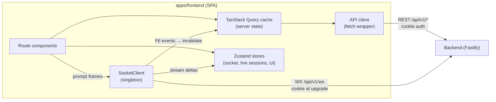
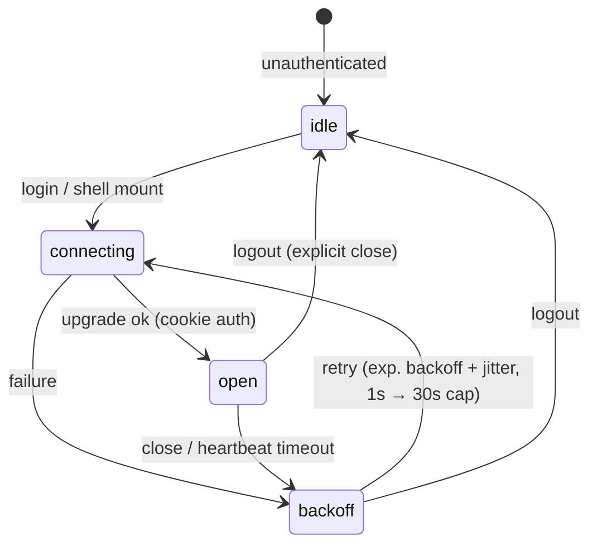
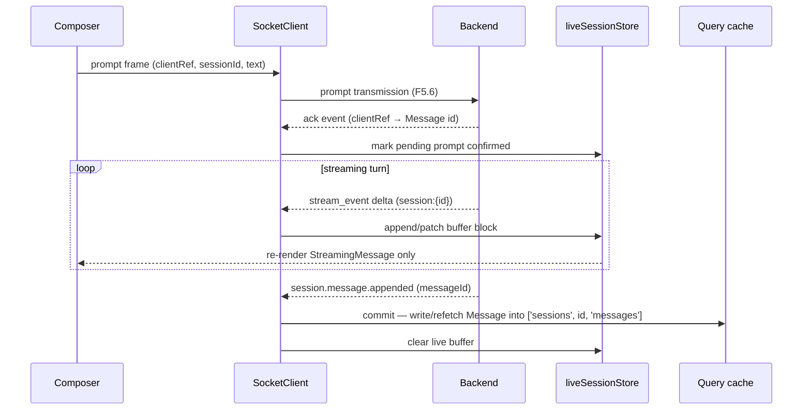
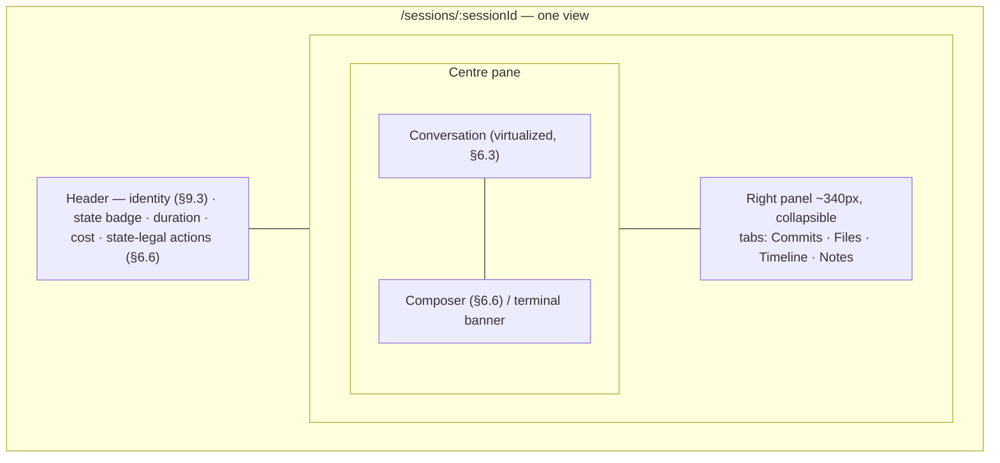

# TDS 05 — Frontend Architecture (WS4)

- **Status:** Draft for WS7 review
- **Owner:** WS4 / frontend-developer
- **Date:** 2026-08-11
- **Inputs:** `docs/tds/01-foundation-decisions.md` (Foundation Contract — consumed verbatim: F1, F4, F5, F6, F7, F8.1, F9), `Requirements.md` (PRD v2.1 §4.2, §4.4, §8, §14), `docs/project-plan.md` (WS4 row), `docs/tds/02-service-architecture-and-deployment.md` (WS1 §5 — physical `paused`/interrupt semantics), `docs/tds/06-wireframes-and-design-system.md` (WS5 — layout, tokens, component inventory; cross-document reconciliation applied 2026-08-11)
- **Consumes:** F1.3 (React 19 + Vite 6 SPA, Tailwind CSS 4, no SSR), F2.3 (backend serves SPA in prod), F4.1/F4.2 (entity vocabulary, camelCase API fields), F5 (REST conventions, error envelope, cookie auth, single multiplexed WebSocket), F6 (event envelope, refetch-on-reconnect), F7 (session states), F8.1 (`apps/frontend` in the pnpm monorepo)
- **Does not define:** REST endpoint shapes (WS2 — referenced by path convention only), visual design/wireframes/token *values* (WS5 — this document defines token *structure* and consumption), backend internals (WS1), DDL (WS3)

---

## 1. Architecture Overview

The frontend is a login-gated, operator-focused, real-time SPA per F1.3: **React 19 + Vite 6 + TypeScript 5 (strict) + Tailwind CSS 4**, no SSR. It talks to the Backend over two surfaces only:

1. **REST** (`/api/v1/...`, F5.1–F5.5) for all resource reads/writes — the source of truth for entity state.
2. **One multiplexed WebSocket** (`/api/v1/ws`, F5.6) for real-time: server→client F6 event envelopes on subscribed channels, and client→server prompt transmission for live session chat (PRD §4.2).

The guiding data rule: **REST owns state, WebSocket owns liveness.** Events carry entity IDs, never full entities (F6.2), so the client treats WebSocket events as *invalidation and streaming signals* and refetches canonical state via REST. The only exception is the live-chat streaming buffer (§6), where token deltas are rendered directly because they are ephemeral by nature and committed to REST-backed state when the turn completes.



---

## 2. Application Structure

### 2.1 Directory layout (`apps/frontend`)

Feature-sliced layout inside the F8.1 monorepo position. Shared cross-app types (entities, event envelope/types, settings schemas) come from `packages/shared`; API request/response types are generated from WS2's OpenAPI 3.1 document (types only, e.g., `openapi-typescript` — no runtime codegen).

```
apps/frontend/
  index.html
  vite.config.ts
  src/
    main.tsx                  # bootstrap: providers + router mount
    app/
      router.tsx              # route table (lazy route modules)
      providers.tsx           # QueryClientProvider, socket lifecycle, toaster
      guards.tsx              # RequireAuth wrapper (see §8)
      shell/                  # AppShell: nav, header, connection badge
    routes/                   # thin lazy entry modules per route (code-split points)
    features/
      auth/                   # login page, current-user query, api-token screens
      dashboard/              # home widgets (PRD §8.1)
      projects/               # list + detail (PRD §8.2)
      sessions/               # list + detail: conversation centre + right panel (§6.7)
        live/                 # live chat: message list, composer, tool cards (§6)
      adrs/                   # ADR list + detail (PRD §7.3)
      settings/               # category nav + forms (§7)
      memory/                 # Phase 3 placeholder route (§10)
      agents/                 # Phase 4 placeholder route (§10)
    components/               # shared primitives: StatusBadge, DataTable, Skeleton,
                              # ErrorPanel, SecretField, EmptyState, Toast
    lib/
      api/                    # fetch wrapper, error mapping, query keys, generated types
      ws/                     # SocketClient, channel registry, useChannel/useSessionStream
      format/                 # dates (ISO 8601 Z → local), cost, duration
    stores/                   # zustand: socketStore, liveSessionStore, uiStore
    styles/
      app.css                 # Tailwind entry
      theme.css               # @theme token structure (§9; values from WS5)
      fonts/                  # self-hosted Inter + JetBrains Mono woff2 (§9.1) — no CDN
```

Conventions:

- **Entity and state vocabulary** exactly per F4.1/F7 (`Session`, never "Run"; `paused`, never "suspended"). API JSON fields are `camelCase` per F4.2.
- Feature folders own their queries, mutations, and components; `components/` holds only genuinely shared primitives. No cross-feature imports except via `components/`, `lib/`, `stores/`.
- TypeScript strict mode, `noUncheckedIndexedAccess`, `exactOptionalPropertyTypes` — matching the F1.1 whole-stack strictness.

### 2.2 Routing map

Router: **React Router v7 in library (data) mode**. Rationale: mature, lazy route modules map 1:1 to code-split chunks, loader-less usage keeps all data fetching in TanStack Query (one data layer, not two).

| Path | Page (PRD §8/§14) | Phase | Notes |
|---|---|---|---|
| `/login` | Login | 1 | Outside `AppShell`; no guard |
| `/` | Dashboard (Home widgets §8.1) | 1 | Needs Attention, Active Sessions, Spend, Active Projects, Services, Recent ADRs, Upcoming Tasks, Notifications (order per WS5 §5.2). **Upcoming Tasks renders the schedule read model** — next Obsidian sync, next repository poll, next daily report — from `GET /api/v1/schedule` (WS2 §7.7). WS7 arbitration **A1**: the empty-state placeholder previously proposed here is withdrawn; no Task entity exists or is implied (§13.5 closed) |
| `/projects` | Projects list | 1 | |
| `/projects/:projectId` | Project detail (§8.2) | 1 | Tabs: Repositories, Sessions; Agents/Memory tabs are Phase 4/3 placeholders |
| `/sessions` | Sessions list | 1 | Filter by project, state (F7), type (managed/observed) |
| `/sessions/:sessionId` | Session detail (§8.3) | 1 | **One view, no page-level tabs:** conversation centre pane (live chat, §6) + persistent collapsible **right panel** holding the Commits / Files / Timeline / Notes tabs (§6.7). Panel state is a URL search param (`?panel=timeline`) so a panel tab is linkable without being a route |
| `/adrs` | ADR list | 2 | |
| `/adrs/:adrId` | ADR detail (Context/Decision/Alternatives/Consequences) | 2 | |
| `/memory` | Memory search | 3 | Placeholder route (§10) |
| `/agents` | Agents | 4 | Placeholder route (§10) |
| `/settings` | → redirect `/settings/general` | 1 | |
| `/settings/:category` | Settings (§7) | 1–2 | Categories per PRD §4.4; `memory`/`agents` categories are placeholder panels |
| `*` | Not found | 1 | |

### 2.3 Code-splitting boundaries

- **One chunk per top-level route** (`routes/*` are the split points via `React.lazy` route modules): dashboard, projects, sessions, adrs, settings, memory-stub, agents-stub, login.
- **`sessions/live` is its own nested chunk** — it carries the heaviest dependencies (virtualizer, markdown renderer, syntax highlighting) and must not weigh down the sessions list.
- Shared vendor chunking is left to Rollup defaults; no manual `manualChunks` tuning until a measured need exists (operator SPA, no SEO/TTFB pressure per F1.3).
- Every lazy boundary is wrapped in a route-level `<Suspense>` with a full-page skeleton (§11) and a route error boundary.

---

## 3. State Management

**Decision: TanStack Query v5 for all server state + Zustand for socket/live/UI state.** Rationale: nearly all frontend state is a cache of Backend resources, which is exactly TanStack Query's model — caching, cursor pagination, invalidation-on-event, and refetch-on-reconnect (F6.3) come built in rather than hand-rolled in a global store. High-frequency streaming deltas and connection status don't belong in a normalized query cache (they'd thrash it dozens of times per second), so a small set of Zustand stores holds WebSocket and live-session state with per-buffer subscriptions that re-render only the streaming message. Redux is rejected as boilerplate without benefit at this scale; React context alone is rejected because it re-renders too coarsely for streaming.

| State kind | Owner | Examples |
|---|---|---|
| Server resources | TanStack Query | Sessions, Messages (history), Projects, Repositories, Commits, PullRequests, Adrs, Notifications, Settings, service health |
| Live/socket state | Zustand `socketStore` | connection status, active channel subscriptions, last-connected timestamp |
| Streaming buffers | Zustand `liveSessionStore` | per-Session in-progress turn buffer, pending prompt acks, per-session activity flags (§6) |
| Ephemeral UI | Zustand `uiStore` (partially `localStorage`-persisted) | nav collapsed, **open session set (the single source for both switcher surfaces, §6.5)**, session right-panel collapsed + last active panel tab (§6.7), theme override, composer drafts |
| Forms | React Hook Form + Zod (local to feature) | Settings categories (§7), session launch, ADR edit |

Query-key convention mirrors REST paths (F5.2): `['sessions']`, `['sessions', id]`, `['sessions', id, 'messages']`, `['projects']`, `['settings', category]`, `['services', 'health']`, `['notifications']`. Cursor-paginated lists use `useInfiniteQuery` with the F5.3 `{ data, meta: { nextCursor, limit } }` envelope; `nextCursor` is treated as opaque.

---

## 4. API Client Conventions

`lib/api/` exposes a thin typed `fetch` wrapper — no heavyweight client:

- **Base:** same-origin `/api/v1` (prod: SPA served by Backend per F2.3; dev: Vite proxy, §12). `credentials: 'same-origin'` so the HTTP-only session cookie flows (F5.5). No CORS handling needed by design.
- **Types:** request/response types generated from WS2's OpenAPI 3.1 contract; entity types from `packages/shared`. The wrapper is generic over these types; endpoint paths live in one `endpoints.ts` map so WS2 renames touch one file.
- **Error normalization:** every non-2xx is parsed into the F5.4 envelope `{ error: { code, message, details, requestId } }` and thrown as a typed `ApiError`. Network failures synthesize `{ code: 'NETWORK_ERROR', requestId: null }`. UI mapping in §11.
- **401 handling:** a single response interceptor: on 401 (except the login call itself), clear the current-user query and redirect to `/login?returnTo=<path>` (§8).
- **Mutations** follow F5.1 sub-action verbs — e.g., `POST /api/v1/sessions/{id}/pause`, `/resume`, `/archive`, `/clone` — invoked via TanStack Query mutations with per-action pending state on the triggering control (never a global spinner).

---

## 5. WebSocket Client Architecture

One **`SocketClient` singleton** (`lib/ws/`) manages the single multiplexed connection at `/api/v1/ws` per F5.6, created when an authenticated user enters the app shell and torn down on logout.

### 5.1 Connection lifecycle



- **Auth:** the session cookie authenticates the upgrade (F5.5/F5.6). If the server closes with an auth-failure close code (exact code owned by WS2), the client does **not** retry — it routes through the 401 path (§8) instead of hammering reconnects.
- **Heartbeat / liveness:** the client sends a lightweight ping frame every 25 s and treats the connection as dead if no frame of any kind is received for 60 s, then force-closes and enters `backoff`. Exact ping/pong frame shape is WS2's; the client behavior above is the contract this document owns.
- **Connection status** lives in `socketStore` and is surfaced in the app shell as a persistent badge (`live` / `reconnecting` / `offline`) — an operator must always know whether the stream is trustworthy (PRD §14 operator-focus).

### 5.2 Channel subscription lifecycle

Channels per F5.6, e.g. `session:{id}` and `notifications`. Subscriptions are **refcounted and bound to component lifecycles**:

- `useChannel(channel, onEvent)` — registers a handler; the registry sends a subscribe frame on the first subscriber and an unsubscribe frame when the last unsubscribes, with a short linger (~5 s) so route transitions between views of the same Session don't churn subscribe/unsubscribe pairs.
- Always-on channels: `notifications` is subscribed for the whole authenticated shell lifetime (toasts + dashboard widget).
- Route-bound channels: `session:{id}` subscribes while its Session detail view is mounted **or** while the Session is in the user's open session set (`uiStore`, §6.5), enabling background multi-session monitoring.

### 5.3 Event handling and refetch-on-reconnect

Incoming frames carry the F6.2 envelope. The dispatcher is idempotent per F6.3 — it keeps a small LRU of recently seen event `id`s and drops duplicates. Since payloads carry IDs only, handling is invalidation-first:

| Event (F6.1) | Client action |
|---|---|
| `session.created` | invalidate `['sessions']` |
| `session.state_changed` | invalidate `['sessions', id]`, `['sessions']`; update composer state (§6.6) |
| `session.message.appended` | if live buffer holds this turn → commit path (§6.3); else invalidate `['sessions', id, 'messages']` |
| `session.completed` / `session.failed` | as `state_changed` + finalize any live buffer |
| `repository.synced` | invalidate `['repositories']` and affected project queries |
| `adr.*` (Phase 2) | invalidate `['adrs']` / `['adrs', id]` |
| `notification.sent` | invalidate `['notifications']`, raise toast per severity |
| `setting.updated` | invalidate `['settings', category]` |
| stream deltas (relayed `stream_event` per F1.5) | append/patch live buffer only — **no query invalidation** (§6.2) |

**Reconnect protocol (F6.3 — best-effort relay, no replay in V1):** on reaching `open` after a drop, the client (1) re-sends subscribe frames for all refcounted channels, then (2) invalidates every query group mapped to those channels (per the table above) plus `['notifications']` and `['services', 'health']`. This makes the "clients refetch on reconnect" rule concrete: any event missed during the gap is healed by refetch, and live buffers for Sessions still `running` are resynced by refetching messages and resuming delta append.

---

## 6. Live Session Chat (PRD §4.2)

The centre pane of the Session detail view (layout: §6.7); the highest-risk UI surface. Requirements: prompt transmission client→server, token-level response streaming, User/Assistant/System/Tool message history, and concurrent multi-session support (A, B, C, …).

### 6.1 Two-layer message model

- **Committed history** — Messages fetched via REST (`['sessions', id, 'messages']`, cursor-paginated per F5.3, newest-last). Canonical, cacheable, survives reload.
- **Live tail** — at most one in-progress assistant turn per Session, held in `liveSessionStore` as a mutable buffer built from relayed `stream_event` deltas (F1.5 managed-session streaming). Ephemeral by design.

The rendered list = committed history + pending user prompts (§6.8) + live tail (including a retained partial turn per the §6.2 reconciliation rule).

### 6.2 Streaming render: append/patch model



- **Append:** text deltas append to the current content block of the buffer (string concat into a block array — not React state per character; the store batches flushes to animation frames, so even fast token streams cost ≤ ~60 renders/s on one component).
- **Patch:** block-boundary events (new content block, tool-use block start/end, message metadata) patch the buffer's block structure. The buffer schema mirrors the block vocabulary WS2 relays from the Agent SDK stream; the frontend treats unknown block types as opaque and renders a neutral fallback (forward-compatible with runtime drift, in the spirit of F1.5's version-tolerant parsing).
- **Commit:** on `session.message.appended` for the streamed turn, the client refetches (or inserts from the event-triggered fetch) the canonical Message into the query cache and clears the buffer.

**Reconciliation rule (partial-turn retention).** The committed Message wins over the partial buffer **only when a canonical Message exists for that turn**. A partial buffer is never discarded merely because the stream stopped — the partial output is the most diagnostic artifact a failed session leaves behind:

| Situation | Client behavior |
|---|---|
| `session.message.appended` arrives for the streamed turn | Canonical Message replaces the buffer; buffer cleared (the normal path above) |
| Session transitions to `failed` (or the delta stream dies) with **no** committed Message for that turn | Buffer is **retained and rendered in place**, marked terminated, closed by a rule line: `— stream ended here · session failed ‹local time› · ‹error.code› · requestId ‹…›` (code/`requestId` from the `session.failed` payload or the API error that surfaced it; omitted segments render as `—`). The failure banner (§6.6) renders below it, not instead of it |
| Socket disconnect while the Session remains `running` | Buffer retained, marked "stream interrupted — reconnecting"; on reconnect the client refetches messages (§5.3) and either replaces the buffer with the now-canonical Message or resumes appending. **The turn is never blanked** |
| Turn interrupted by `[Stop]` or `pause` (WS1 §5.1) | Buffer retained until the Backend's persisted *interrupted message* arrives, then replaced by it; the interrupted marker comes from the canonical Message, not the client |

Retained buffers are read-only (no further deltas accepted for that turn id) and are dropped only when the Session view is closed *and* a canonical Message for the turn later exists, so a reload never resurrects a stale partial.

### 6.3 Long-transcript virtualization

- **TanStack Virtual** with dynamic measurement (messages vary hugely: one-liners vs. long tool output). Chosen over fixed-height windowing because chat rows are unpredictable, and over rendering everything because observed/managed transcripts can reach thousands of Messages.
- **Reverse infinite scroll:** the list anchors to the bottom; scrolling up past a threshold fetches the previous cursor page (`useInfiniteQuery`), prepending with scroll-position preservation.
- **Pinned-to-bottom behavior:** auto-follow while the user is at (or near) the bottom; any upward scroll disengages follow and shows a "Jump to latest ↓ (n new)" pill. Streaming deltas never yank the scroll position while reading history.
- The live `StreamingMessage` renders outside the virtualizer's measured set until commit (it changes size continuously; measuring it every frame would defeat virtualization).

### 6.4 Message rendering by role (F4.1 roles: user / assistant / system / tool)

- **user** — right-aligned plain text (composer input is text; no markdown authoring in V1).
- **assistant** — markdown rendering with fenced-code syntax highlighting; the streaming buffer renders through the same markdown pipeline with an incomplete-markdown-tolerant parse (dangling fences render as open code blocks rather than flashing).
- **tool** — collapsible **tool-call card**: header row with tool name, one-line input summary, and status (`running` spinner while the block is open in the stream / success / error), body collapsed by default containing formatted input and output (JSON pretty-printed, large payloads truncated with expand). Tool cards visually group under their assistant turn. This keeps transcripts scannable (PRD §14 minimal/operator-focused) without hiding what the runtime did.
- **system** — de-emphasized inline notice rows (session start, state changes from the Timeline vocabulary), not chat bubbles.

### 6.5 Multi-session support (concurrent A/B/C)

- `liveSessionStore` is a **registry keyed by Session id** — each open Session has an independent buffer, pending-prompt list, and activity counter. Nothing is global-per-"current session".
- The user's **open session set** lives in `uiStore` and is `localStorage`-persisted, so it **survives reload** (ordered list of Session ids + the currently focused id). All Sessions in the set hold `session:{id}` subscriptions (§5.2) even when not the visible route, so background activity accrues.
- **One source of truth, two surfaces.** The open set is rendered by exactly two switcher surfaces, both reading the same `uiStore` slice — they are projections of one list and therefore cannot diverge:
  1. **Shell active-sessions strip** — part of `AppShell`, so it is present on *every* authenticated route (Dashboard, Projects, Settings…). This is the primary switcher.
  2. **Live Session tab bar** — the session tabs across the top of `/sessions/:sessionId` (WS5 §5.5). It renders the same ordered open set with the same affordances; it is a denser, in-context rendering of surface 1, not a second model.
  Adding, closing, reordering, or focusing a Session mutates the one `uiStore` slice; both surfaces re-render. Closing a switcher entry removes the Session from the open set (releasing its subscription) and **never** touches Session state — no F7 transition is implied.
- **Per-entry rendering on both surfaces** (identical vocabulary): F7 `StatusBadge`/dot (§9.1), session identity per §9.3, an **unread-activity dot** while the Session has activity the operator has not looked at, and a **numeric activity counter** (new committed Messages since last focus, capped display `9+`) sourced from `liveSessionStore`. Focusing a Session clears its dot and counter. A background Session flipping to `failed` re-colours its badge on both surfaces immediately from `session.state_changed` (§5.3).
- Switching Sessions is a route change to `/sessions/:id` — buffers survive because they live in the store, not the component.
- **Bounds:** background buffers are capped (per-buffer block cap with oldest-block truncation — the committed history is the durable record) and the open set is capped at **6** to bound socket subscriptions and memory; opening a seventh evicts the least-recently-focused entry (with an undo toast). Caps are constants, not settings, in V1. On reload, persisted ids are validated against `['sessions']` and silently dropped if the Session no longer exists.

### 6.6 Prompt composer × F7 session states

The composer derives its mode strictly from the canonical Session state (F7) plus session type. Observed sessions are **monitor-only in V1**: no composer, transcript + metadata only. WS1 §5.2 has since defined their applicability matrix — Pause and Resume are never rendered (Mission Control cannot gate a CLI the operator runs themselves; the API rejects them with `OPERATION_NOT_SUPPORTED` per WS2 §1.3), and the sole lifecycle action is **Stop observing**, which detaches ingest and never terminates the user's terminal process. When transcript tailing degrades to hook-events-only (WS1 §6.3), the view surfaces a degraded-fidelity indicator rather than a silently incomplete transcript (WS5 §5.5).

| Session state (F7) | Composer (managed) | Available actions (managed) |
|---|---|---|
| `created` | **Enabled** — placeholder "Send a prompt to start this session". Submitting performs **start-with-prompt**: one operator action carrying the initial prompt (client sequence and wire shape per WS2; the UI presents it as a single action with a single pending state, and a failure leaves the prompt text in the composer per §11.3) | Start (alternate: starts the Session with **no** prompt, for operators who want the runtime up before typing), Archive is **not** offered (no `created → archived` edge in F7); Delete not in V1 vocabulary |
| `running` | Enabled — sends prompt frames over the WebSocket (§6.2); shows per-prompt pending state until server ack. **Typing and sending remain enabled while a turn is streaming**; a prompt sent mid-turn renders as a visibly-pending entry and is delivered when the current turn completes (§6.8) | Pause — **replaced by Stop while a turn is in flight** (§6.8) — End |
| `paused` | Disabled, with inline hint "Session is paused — resume to continue" (no client-side prompt queueing in V1: conservative, avoids ghost-queue divergence from the runtime). Prompts the Backend persisted as pending at pause time (WS1 §5.1) redisplay in the composer on resume for explicit re-send — never auto-replayed | Resume, End |
| `completed` | Replaced by a terminal banner: "Session completed. **Resume as new Session**" — resume creates a NEW Session record linked via `resumed_from_session_id` (F7 rule), and the UI navigates to the new Session | Resume (new Session), Clone, Export, Generate Context Package, Archive |
| `failed` | Replaced by failure banner with error detail + `requestId` if the failure surfaced through an API error; any retained partial turn stays rendered **above** the banner (§6.2) | Resume (new Session), Clone, Export, Archive |
| `archived` | Hidden — read-only transcript | **Resume as new session** (F7 permits resume from `archived`; it creates a NEW Session linked via `resumed_from_session_id`), Export. Clone is **not** offered — WS2 restricts `clone` to states other than `archived` |

**Launch modal carries no initial prompt.** Because `created` accepts a prompt directly in the composer, the Session launch modal collects only Project / Repository / Branch / Model and creates the Session; it does **not** contain an initial-prompt field and does **not** need a `Create only` split action — "create without starting" *is* the default outcome of the modal, and starting happens from the Session view (either by sending the first prompt or by `[Start]`). This removes the duplicate prompt-entry surface that would otherwise exist in two places with two different failure modes.

State transitions arrive via `session.state_changed` (§5.3), so the composer reacts live — e.g., a `running → failed` crash flips the composer to the failure banner without user action. Lifecycle buttons are never optimistic (§11.3); an `INVALID_STATE_TRANSITION` error (F7) refetches the Session and re-derives the UI. Every action set above is filtered to **state-legal** actions only, so illegal transitions are never offered (they remain rejected server-side regardless).

### 6.7 Session detail layout — conversation centre + right panel

`/sessions/:sessionId` is **one composed view, not a set of page-level tabs**. An operator watching a stream must be able to see what the Session is *producing* (commits, touched files, lifecycle) without leaving the stream — tabbing away from a live conversation to check a commit is exactly the interaction this screen exists to avoid.



- **Right panel:** persistent, ~340 px (WS5's `--mc-panel-w`), collapsible, carrying **panel-level** tabs Commits / Files / Timeline / Notes. Collapsed/expanded state and the active panel tab live in `uiStore` (§3) and persist per operator, not per Session; the active tab is also reflected in a `?panel=` search param so a specific panel is linkable.
- **Data:** each panel tab owns its own query (`['sessions', id, 'commits' | 'files' | 'timeline']`, Notes via the Session resource) and fetches **lazily on first activation**, then stays mounted and is invalidated by the same events as the rest of the view (§5.3). The conversation never unmounts when panel tabs change — buffers and scroll position are untouched.
- **Responsive collapse:**
  | Viewport | Right panel |
  |---|---|
  | ≥ 1440 px | Expanded by default |
  | 1024–1439 px | Collapsed by default to an **icon rail** (one icon per panel tab, with a dot when that panel has new content); clicking expands it as an overlay above the conversation, `Esc` collapses |
  | < 1024 px (`< md` mobile) | No rail — the panel becomes a **swipe-up sheet** from the bottom edge with the same four tabs; the conversation + composer own the full viewport (PRD §14 mobile monitoring) |
- **Focus & a11y:** the panel is a `complementary` landmark; collapsing/expanding is a single labelled toggle button (`aria-expanded`), the sheet on mobile is a focus-trapped dialog-style surface returning focus to its opener, and panel tabs follow the standard tablist/tab/tabpanel roving-tabindex pattern. The panel is never the only path to information the conversation itself must convey.

### 6.8 In-flight turn control (`[Stop]`) and pending prompts

A streaming turn needs a first-class abort that is **not** a state change. WS1 §5.1 already defines the physical primitive: the controller calls the SDK's `interrupt()`, the turn aborts, and partial assistant output already streamed is persisted as an interrupted Message flagged on the timeline.

- **Control:** whenever a turn is in flight for the focused Session (a live buffer is open, §6.1), the header's `[Pause]` control is **replaced in place** by `[Stop]`. One control slot, two meanings, never both visible: `[Stop]` ends the *turn*, `[Pause]` ends the *process* (`running → paused`, F7). When the turn completes or is stopped, the slot reverts to `[Pause]`.
- **Semantics:** `[Stop]` maps to WS1 §5.1's interrupt. It causes **no F7 transition** — the Session stays `running` — so it is not rendered as a lifecycle button and does not follow the confirm pattern of `End`/`Archive`. It is invoked through the interrupt action WS2 exposes (endpoint or client frame; see §13.6) and, like all lifecycle-adjacent calls, is **never optimistic** (§11.3): the button shows pending state until the server confirms, and the buffer is retained until the canonical interrupted Message arrives (§6.2).
- **Keyboard:** bound to `Esc` **from the conversation region** (per §9.4's suppression rule, `Esc` from the composer first returns focus to the conversation region, so a single `Esc` never stops a turn while the operator is typing; a second `Esc` does). The binding is inert when no turn is in flight.
- **Pending prompts during a stream:** typing is always allowed and **send stays enabled**. A prompt submitted while a turn is streaming is not rejected client-side and not silently swallowed — it is appended to that Session's pending-prompt list in `liveSessionStore` and rendered immediately as a **visibly-pending** user entry (muted treatment + "queued" affordance, distinct from a committed Message per §11.3), with discard available until it is transmitted. It is delivered when the current turn completes and moves to normal pending-ack rendering; on server rejection it is marked with retry/discard, never converted into fake history. Multiple queued prompts preserve submission order.

---

## 7. Settings UI (PRD §4.4, §8.6)

### 7.1 Layout and navigation

`/settings/:category` with a left category nav (top nav on mobile): **General, Integrations, Notifications, Memory, Agents, Security, Services** — the seven PRD §4.4 categories, in that order. Integrations expands to per-integration panels: GitHub, Claude Code, Telegram, Obsidian, Qdrant, Ollama.

> **Phase 3 — interface only.** The **Memory** settings category route exists with a placeholder panel (title + "Available in Phase 3" note).
> Detailed design is out of TDS scope per the project-plan scope guard.

> **Phase 4 — interface only.** The **Agents** settings category route exists with a placeholder panel.
> Detailed design is out of TDS scope per the project-plan scope guard.

Qdrant and Ollama integration panels ship their forms (they are simple host/port/key/model forms) but render behind a "Phase 3+" badge with Test Connection stubbed per WS2's stub contracts.

### 7.2 Typed schema-driven forms

Each category/integration panel is a **React Hook Form form driven by a Zod schema + field-metadata map** (label, description, control kind: `text | number | toggle | select | path | secret | interval`), rendered by a small shared field-component set. This is schema-driven rendering, not a generic runtime form generator — each panel is a real component that composes shared fields, so bespoke needs (e.g., Claude Code's cost-budget alert row) don't fight a framework.

- Zod schemas live beside (or are derived from) the shared settings types in `packages/shared`, so frontend validation and Backend validation cannot drift.
- Reads come from `['settings', category]`; saves are per-panel mutations sending **only dirty fields**. `setting.updated` events (F6) invalidate the category query — including changes made by another browser tab.
  - **Corrected by arbitration A14 (2026-08-13):** "only dirty fields" describes the *editing* model, not the request body. `PUT /settings/{category}` is a **full-category replace** (WS2 §7.3), so the panel sends `{...persisted, ...dirty}` — a body carrying only the dirty fields would reset every field the operator did not touch to its default. Secrets are the exception and are present only when replaced (`string`) or cleared (`null`); an omitted secret keeps its stored value. The implemented panels already do this.
- Every save is audit-logged server-side (PRD §4.4); the UI shows a "Saved" confirmation with timestamp, no optimistic write (§11.3).

### 7.3 Secret fields (write-only masking)

`SecretField` implements the PRD's write-only semantics end-to-end:

- The API never returns secret values — only a set/not-set indicator (masked per WS2's contract). The field renders as `••••••••` with a **"Set"** chip when a value exists, or an empty input with "Not set" when it doesn't.
- Actions: **Replace** (unlocks an empty input — never pre-filled, never round-tripped) and **Clear** (explicit destructive action with confirm). Only a replaced/cleared secret is included in the save payload; untouched secrets are omitted entirely.
- **Label vocabulary (canonical): `Replace` / `Clear`.** "Clear" is the destroy action's label everywhere a secret appears — Settings integrations, API tokens, any future credential field — because it describes removing the stored value without implying the surrounding record is deleted. Synonyms (`Remove`, `Delete`) are not used for this action; WS5's wireframes align to this naming.
- Secret inputs use `autocomplete="off"` / `type="password"` toggleable to visible while typing; values are held only in form state and dropped on unmount.

### 7.4 Test Connection pattern

Per-integration **Test Connection** button (GitHub, Telegram, Obsidian path, Qdrant, Ollama — PRD §4.4 behaviors):

- Tests run **against saved settings**. If the form is dirty, the button prompts "Save first?" — deterministic semantics; the UI never merges unsaved form values into a test.
- Lifecycle on the button + inline result panel: idle → testing (spinner, button disabled) → **success** (green, server-reported detail, e.g. account/vault/version, with tested-at time) or **failure** (red, F5.4 `error.message` + copyable `requestId`). Results are ephemeral client state, not cached.
- One in-flight test per integration; a route change cancels the pending UI (the server call may complete server-side; harmless).

### 7.5 Services health panel (PRD §4.4.7)

Read-only view of PostgreSQL, **Queue (PostgreSQL)** (F2.1 — Redis is eliminated by F3 and must not appear in the UI), Qdrant (Phase 3+ badge), Telegram Worker, Sync Worker, plus Backend build/version info. Data from WS2's health endpoint via `['services', 'health']` with `refetchInterval: 10s` **while the panel is visible** (`refetchIntervalInBackground: false`) — polling, not WebSocket, because health must be observable even when the socket itself is the sick component. Each row: status badge (up/degraded/down/unknown), latency/queue-depth detail as provided, last-checked timestamp. A compact variant of this panel is reusable on the Dashboard.

---

## 8. Auth Flow

Per F5.5: cookie session + bearer API tokens (tokens are for programmatic access; the SPA itself uses only the cookie).

- **Login:** `/login` posts credentials to `POST /api/v1/auth/login`; the Backend sets the HTTP-only, SameSite=Lax session cookie. The SPA never reads or stores the credential/cookie — success is observed by the response and by the current-user query succeeding.
- **Route guards:** everything except `/login` mounts inside `RequireAuth`, which gates on a `['auth', 'me']` query (endpoint per WS2). Unauthenticated → redirect to `/login?returnTo=<encoded path>`; after login, navigate to `returnTo` (validated as an in-app path — never an absolute URL, preventing open redirects).
- **Session expiry mid-use:** any 401 from the API interceptor (§4) or an auth-failure WebSocket close (§5.1) clears the query cache, resets stores, and redirects to `/login` with a "Session expired" notice. Draft composer text in `uiStore` persistence survives re-login.
- **Logout:** explicit action → logout endpoint → close socket (`idle`), clear caches/stores, redirect `/login`.
- **API token management** (PRD §4.4.6) lives at `/settings/security`: token list (name, created, last-used, prefix), **create** (server returns the full token exactly once — shown in a copy-to-clipboard reveal with "you won't see this again"; the UI drops it on dismiss), **revoke** (confirm dialog). Follows the §7.3 principle: full secret values are never re-displayable.

---

## 9. Theming, Responsive & Interaction Conventions

### 9.1 Dark-mode-first token structure (Tailwind CSS 4)

Tailwind 4 is configured CSS-first: `styles/theme.css` declares design tokens via `@theme`, and **dark is the default** — the `:root` values ARE the dark palette (PRD §14). Light mode, if/when enabled from Settings → General, is an override block under `[data-theme="light"]`, applied to `<html>` from the General settings value (default `dark`).

WS4 defines the token **structure**; WS5 owns the **values**. Components consume only semantic tokens — never raw palette hues:

```css
@theme {
  /* Surfaces & text (semantic) */
  --color-bg: …;            /* app background */
  --color-surface: …;       /* cards, panels */
  --color-surface-raised: …;/* popovers, modals */
  --color-border: …;            /* card/panel edges — decorative */
  --color-border-control: …;    /* input & control boundaries — SC 1.4.11, ≥3:1 */
  --color-text: …;
  --color-text-muted: …;
  --color-text-disabled: …;     /* NOT a text colour — disabled/non-text marks only */
  --color-accent: …;        /* primary interactive */
  --color-danger / --color-warning / --color-success / --color-info: …;

  /* Session state colors — keyed verbatim to F7 states */
  --color-state-created / -running / -paused / -completed / -failed / -archived: …;

  /* Structure tokens: type scale, line-height, weight, tracking, spacing scale,
     radius, shadow — names fixed here, values from WS5
     (docs/tds/06-wireframes-and-design-system.md). Line-height, weight and tracking
     are separate axes, not fused into the size token: the scale carries one size at
     two line-heights (heading vs body at 18px), which a fused token cannot express. */
}
```

Two consumption rules that follow from WS5's palette and are enforceable in review:

- **`--color-accent` marks operator intent and position** — actionable, selected, focused, current. It never reports a system condition. A component that would use the accent to say "healthy" or "under budget" uses a status token instead (WS5 §2.1.4).
- **Control boundaries must come from `--color-border-control`, never from the field's own fill.** On a near-black canvas no darker fill can reach the 3:1 identification floor — black against the surface tops out at 1.29:1 — so the border is the only element that can carry it.

The `StatusBadge` component maps a Session's state string (F7, lowercase) directly to `--color-state-<state>` — one source of truth for state color across list rows, the active-sessions strip, the Live Session tab bar, timeline, and dashboard widgets.

**Fonts are self-hosted, always.** Both families in the token structure (`--font-ui`, `--font-mono`; families and stacks per WS5) ship as **`woff2` files inside `apps/frontend`** (`src/styles/fonts/`, imported via `@font-face` in `theme.css`, bundled and fingerprinted by Vite). No Google Fonts link, no CDN, no runtime font fetch of any kind. Mission Control is a self-hosted product that must render correctly on an offline LAN server with no egress — an external font request would produce invisible-then-shifting text (a CLS source) on exactly the machine the product targets. Each `@font-face` sets `font-display: swap` and the stack always names a system fallback, so first paint is never blocked; only the weights actually used are shipped (**UI 400/500, mono 400/500** — weight 600 is retired; the display tier gets its presence from size and negative tracking at weight 500, per WS5 §2.2), subset to Latin.

**Circular is not licensable for this product.** WS5's type scale is derived from a brand reference (`Design.md`) that specifies Circular, which is a commercial Lineto face and cannot be self-hosted without purchase — and this product ships to an offline LAN server, so the CDN escape hatch does not exist. The scale, weights and negative tracking are reproduced on the self-hosted open face named in WS5 §2.2. Do not re-introduce Circular into the stack.

### 9.2 Responsive / mobile monitoring strategy

PRD §14: mobile-friendly **monitoring** — the phone is a glanceable monitor plus lightweight steering, not a workstation. Standard Tailwind breakpoints; the shell collapses to bottom/hamburger nav on `< md`.

| Surface | `< md` behavior |
|---|---|
| Dashboard | First-class: widgets stack single-column; primary mobile entry point |
| Sessions list + session switcher | First-class: state badges, activity dots + counters; the shell strip becomes a horizontal chip scroller (§6.5) |
| Live session — transcript | First-class: full streaming transcript, tool cards collapsed |
| Live session — composer | **Kept**, simplified single-line composer for `running` Sessions (quick steering is a core operator need); lifecycle actions (pause/end/resume) behind an overflow menu with confirms |
| Session detail — Commits/Files/Timeline/Notes | Right panel becomes a swipe-up sheet (§6.7); readable, read-only presentation |
| Notifications, Services health | First-class read-only |
| Projects / ADR detail | Read-only rendering; ADR **editing** hidden with an "edit on desktop" hint |
| Settings | Readable + simple toggles work; **secret Replace/Clear and Test Connection remain available** (rotating a token from a phone is a legitimate ops task); complex forms (Obsidian conflict policy, discovery paths) are desktop-first but not blocked |
| Session launch (managed) | Desktop-first; mobile offers only "resume as new Session" / "clone" shortcuts. **WS7 arbitration A12 (UX register WC5): confirmed — no `+` / New Session FAB on mobile in V1.** Resume-as-new and Clone *are* launches, but with working directory, repository, and branch inherited from a Session already vetted on a desktop; composing a new launch target is what mobile omits. The launch modal now carries a mandatory working-tree disclosure (resolved absolute path, current branch, dirty-file count, branch-change acknowledgement — WS5 WC11) that cannot be honestly reviewed on a phone, and a FAB is the highest-prominence control in mobile design language — giving the most consequential, least-verifiable action top billing on the smallest screen inverts the risk ordering. PRD §14 scopes mobile to *monitoring*. If a mobile entry point is ever wanted it belongs in the overflow/command surface, routed through the full disclosure modal — never a FAB |

All interactive targets respect a 24×24 px minimum (WCAG 2.2 2.5.8); focus indicators and keyboard navigation are required across all Phase 1–2 components (detailed a11y specs ride with WS5's design system; test gates with WS6).

### 9.3 Session identity rendering (shared rule)

**Never lead with a UUIDv7 prefix.** F4.2 IDs are UUIDv7, whose leading hex characters encode a millisecond timestamp — every Session started in the same hour shares a near-identical prefix (`0198a2f3…`, `0198a2f9…`), so a prefix column is precisely the *least* discriminating substring available and reads as noise to an operator scanning six live Sessions. The rule below applies to every surface where a Session appears: list rows, dashboard widgets, the shell strip, the Live Session tab bar, command palette results, notifications, and links.

| Slot | Content |
|---|---|
| **Primary label** | The Session **title** — a human string stored on the Session (`title`, WS3) and editable inline from the detail header (`PATCH /sessions/{id}`, WS2). Auto-derived from the **first user prompt** (first line, trimmed to ~60 chars, ellipsised) when none is set; the client falls back to that derivation for display if the field is still empty, so no surface ever renders a blank title |
| **Secondary line** | `project · branch` (mono for the branch), plus state badge; type (`managed`/`observed`) and duration/cost where the surface has room |
| **Full ID** | Detail header only, mono, **copy-on-click** with a "Copied" confirmation — the operator's bridge to logs and API calls |
| **Compact ID column** | Where a table genuinely needs an ID column, render the **last 6 hex characters** (`…3f9a1c`), mono, title-attributed with the full ID. Last characters are random in UUIDv7 and therefore actually distinguishing |

Untitled + prompt-less Sessions (e.g. a freshly created `created` Session) fall back to `Untitled session · ‹…3f9a1c›`. Observed Sessions derive their title the same way from the first ingested user prompt.

### 9.4 Keyboard model & command palette

WS5 owns the shortcut vocabulary and the cheat-sheet surface; WS4 owns dispatch mechanics and the bindings below.

**Binding corrections and rules**

- **`Ctrl+1…9` is browser-reserved and must not be used.** Chrome and Edge consume `Ctrl+1…9` for tab switching at the browser-chrome level and never deliver the event to page JavaScript, so a session-switching binding on it is dead on the product's own target browsers. **Session switching binds `Alt+1…9`** (focus the *n*-th entry of the open session set, §6.5 — the same ordered list both switcher surfaces render), plus **`Alt+[`** / **`Alt+]`** for previous/next open Session. `Alt+…` combinations are safe on Windows and Linux Chromium; the palette (below) is the guaranteed fallback for any platform where a chord is intercepted, and no shortcut is ever the only route to an action.
- **Text-entry suppression:** while focus is inside an `input`, `textarea`, or `contenteditable` node, **all single-key shortcuts (`/`, `g …` sequences, `n`, `?`) and all chord shortcuts are suppressed**, with exactly two exceptions: `Esc` (blur/step-out — from the composer it returns focus to the conversation region, §6.8) and the send binding (`Ctrl+Enter`). This prevents an operator typing "generate the docs" into the composer from teleporting to another page.
- **Dispatch:** one document-level `keydown` listener registered in `AppShell`; route- and component-scoped bindings register/unregister through a small `lib/keys` registry keyed by scope, so bindings die with their route and there is a single place to audit conflicts. Bindings are declared with metadata (label, scope, availability predicate) so the cheat sheet and the palette can enumerate them rather than duplicating a hard-coded list.

**`Ctrl+K` command palette (primary keyboard surface)**

`Ctrl+K` (and `Cmd+K`) opens a modal palette — the keyboard-first route to everything, and the reason no capability depends on a memorised chord. Unlike `Ctrl+1…9`, `Ctrl+K` *is* delivered to page JavaScript and cancellable, so the handler calls `preventDefault()` to stop the browser's address-bar search. It obeys the suppression rule above like every other chord — from inside the composer the operator presses `Esc` (focus leaves the text field, draft preserved) and then `Ctrl+K`:

- **Jump to Session by title** (§9.3 identity: title primary, `project · branch` secondary, F7 badge, `…3f9a1c` tail) — selecting navigates and adds the Session to the open set.
- **Run state-legal lifecycle actions** on a Session — start / pause / stop / resume / end / archive / clone / export / resume-as-new. The candidate list is derived from the cached Session's F7 state using the same predicate as §6.6, so an illegal transition is never offered from the palette either; execution goes through the same non-optimistic mutations (§11.3), including confirms for destructive actions.
- **Jump to a Settings category** (`/settings/:category`, §7.1) and to top-level routes.
- **Toggle theme** (dark/light, §9.1) and other `uiStore` preferences.
- **Data sources:** the palette reads **only what the app already has** — the TanStack Query cache (`['sessions']`, `['projects']`, `['adrs']`, `['settings', …]`) plus `uiStore` (open session set, theme, nav) — and the static route/settings-category tables. Opening it triggers no blocking fetch: it renders instantly from cache and issues a background `ensureQueryData(['sessions'])` refresh whose results merge in when they land, so the palette is never a loading screen. Matching is client-side fuzzy over title/project/branch/id-tail; there is no server search dependency in V1 (Phase 2 global/semantic search stays a separate surface).
- A11y: focus-trapped `dialog`, `combobox`/`listbox` pattern with `aria-activedescendant`, arrow/Enter/Esc, and results announced via a polite live region count.

---

## 10. Phase 3–5 Placeholder Routes

> **Phase 3 — interface only.** `/memory` (semantic search interface, PRD §8.4) ships as a routed placeholder page: nav entry (badged "Phase 3"), title, one-paragraph description, disabled search input. The route module, nav slot, and a reserved `memory:*`-style channel/query-key namespace are the only frontend commitments.
> Detailed design is out of TDS scope per the project-plan scope guard.

> **Phase 4 — interface only.** `/agents` (PRD §8.5) ships as a routed placeholder page with a badged nav entry; the Project detail's Agents tab and Settings → Agents category render the same placeholder pattern. `agent.*` events (F6 reserved) are ignored by the dispatcher until Phase 4.
> Detailed design is out of TDS scope per the project-plan scope guard.

> **Phase 5 — interface only.** Multi-runtime UI (runtime selector beyond Claude Code, adapter status) has no frontend surface in this TDS beyond the Session entity's `runtime` metadata field being displayed as text.
> Detailed design is out of TDS scope per the project-plan scope guard.

The placeholder pattern is one shared `<PhasePlaceholder phase={n} title description />` component so placeholders are consistent and trivially replaceable.

---

## 11. Error, Loading, and Optimistic-Update Conventions

### 11.1 Error presentation (F5.4 envelope)

Every surfaced error originates from a typed `ApiError` (§4) and renders through two shared components:

- **Inline `ErrorPanel`** for query failures in place (route/section level): human message, mapped from `error.code` where a friendlier string exists (small `code → copy` map; unknown codes fall back to `error.message`), a **Retry** button, and a de-emphasized, click-to-copy `requestId` line ("Reference: `0198…`") — the operator can quote it against Backend logs (F5.4 guarantees the correlation).
- **Toast** for mutation failures and `notification.sent` alerts: message + requestId in the expandable detail. Toasts never swallow errors silently; every failed mutation produces one unless the feature renders a more specific inline error (e.g., Test Connection §7.4, composer send failure inline under the pending prompt).
- Route-level React error boundaries catch render errors with a reload affordance; the WebSocket badge (§5.1) covers transport degradation.

### 11.2 Loading conventions

- **Skeletons, not spinners, for structural loads:** lists, cards, and detail panes render shape-matched skeletons (shared `Skeleton` primitives) on first load and behind lazy-route `Suspense`.
- **Pagination/refetch never blanks content:** `placeholderData: keepPreviousData` on paginated queries; background refetches are silent (subtle refresh indicator at most).
- **Buttons own their pending state** (spinner-in-button, disabled) for mutations; no full-screen overlays.
- **Empty ≠ loading ≠ error:** every list surface defines all three states explicitly (shared `EmptyState` with a primary action where sensible).

### 11.3 Optimistic updates — conservative policy

Default is **pessimistic**: mutate → await → invalidate. Optimistic cache writes are allowed only where all three hold: (1) trivially predictable result, (2) no server-side state machine can reject it, (3) cheap rollback. The approved list:

| Allowed (optimistic) | Never optimistic |
|---|---|
| Notification read/dismiss | Session lifecycle actions (start/pause/resume/end/archive/clone) — `INVALID_STATE_TRANSITION` is a real F7 outcome; UI must reflect server truth. `[Stop]` (turn interrupt, §6.8) is likewise never optimistic |
| Purely client UI prefs (theme, nav, open session set, right-panel state) | Settings saves (audit-logged; §7.2) and all secret operations |
| Session Notes local draft (explicit save) | ADR create/edit (Phase 2, sync-coupled) |
| — | Anything that triggers Backend side effects via the F3 queue |

Composer sends are **pending-state UI, not optimistic cache writes**: the prompt renders immediately as visibly-pending (§6.2) and is only committed on server ack — a failure marks that entry with retry/discard, never silently inserting fake history.

---

## 12. Build & Dev Tooling (Windows 11 dev / Ubuntu prod)

- **Dev:** `pnpm dev` at the repo root (F8.1) starts the Vite dev server alongside Backend/workers. `vite.config.ts` proxies `/api` → `http://127.0.0.1:8710` (F8.2 default) **with `ws: true`** so `/api/v1/ws` upgrades traverse the proxy — same-origin in dev and prod, no CORS branch anywhere. All scripts are cross-platform npm scripts (no shell-specific syntax); any path handling uses Node APIs per F8.1.
- **Prod:** `pnpm --filter frontend build` emits static assets consumed by the Backend's static serving with SPA fallback (F2.3) — deep links like `/sessions/{id}` must serve `index.html`; the fallback is WS1's to implement, noted here as a required behavior. No frontend process exists in the F2.1 topology.
- **Env:** the SPA needs **no build-time environment configuration** in V1 — same-origin relative URLs everywhere. Anything user-configurable comes from the Settings API at runtime.
- **Quality gates:** TypeScript strict `tsc --noEmit`, lint, and Vitest component/unit tests run on both Windows and Ubuntu CI (baseline per F1.1; strategy, coverage targets, and Playwright E2E scope are WS6's in `docs/tds/07-test-strategy.md`).

---

## 13. Open Points for Peer Workstreams

Recorded for WS7's cross-check; none are Foundation conflicts.

1. **WS2:** exact WebSocket frame shapes this document assumes behaviorally — subscribe/unsubscribe frames, ping/pong, prompt frame with a client-generated `clientRef` and its ack event, auth-failure close code, and the relayed `stream_event` block vocabulary (§6.2). The client architecture is frame-shape-agnostic by design (one codec module in `lib/ws/`).
2. **WS2:** masked-secret read representation (§7.3 assumes a set/not-set indicator) and Test Connection response detail fields (§7.4).
3. **WS1:** SPA fallback for deep links in the Backend's static serving (§12); which lifecycle actions, if any, apply to observed sessions (UI currently hides them, §6.6). WS1 §5.1 has since defined the physical meaning of `paused` for managed sessions (cold pause) — §6.6/§6.8 are written against it.
4. **WS5:** token values for the §9.1 structure and status-badge treatment for the six F7 states. Layout contradictions found in the cross-document critique are **resolved and applied here**: session detail is a conversation centre pane + right panel (§6.7, WS5's model adopted); the Live Session tab bar is a projection of the shell-level open session set (§6.5, WS4's model adopted); `created` accepts a prompt so the Launch modal drops its initial-prompt field and `Create only` split action (§6.6); the secret destroy action is labelled `Clear` (§7.3); `archived` offers "Resume as new session" (§6.6); `Ctrl+1…9` is replaced by `Alt+1…9` (§9.4); session identity leads with a title, not a UUIDv7 prefix (§9.3).
5. **CLOSED — WS7 arbitration A1.** The **"Upcoming Tasks" dashboard widget** (PRD §8.1) renders the **schedule read model** (WS5 §5.2's position): next Obsidian sync, next repository poll, next daily report, from `GET /api/v1/schedule` (WS2 §7.7). Values are computed at read time from Settings + last-run records; **no Task entity exists or is implied** (F4.1 unchanged). The empty-state placeholder proposed in an earlier draft of §2.2 is withdrawn — a permanently empty widget on the primary page is furniture, and its honest empty state ("no scheduled work — set sync intervals in Settings") is actionable. §2.2 updated.
6. **CLOSED — WS2 §6.3.1.** The **interrupt/stop action** is now a first-class sub-action: **`POST /api/v1/sessions/{id}/interrupt`** → `200 { data: { sessionId, messageId } }`, errors `SESSION_NOT_RUNNING` / `NO_TURN_IN_FLIGHT` / `OPERATION_NOT_SUPPORTED`. It performs **no F7 transition** and emits **no** `session.state_changed` — the Session stays `running`. The canonical marker this document asked for is `Message.status = 'interrupted'` (WS2 §6.6, storage WS3 `messages.status`), carried on `session.message.appended` with its `ordinal`, so §6.8's `[Stop]` and §6.2's retention rule both render from server truth.
7. **CLOSED — WS7 assignment (see 00-overview §5, A13).** **Session title auto-derivation is the Backend's**, exactly as this document preferred. On persisting the **first user Message** of a Session (managed prompt path or observed hook/transcript ingest), if `sessions.title IS NULL` the Backend sets it to the first line of that content, trimmed and ellipsised to ≤ 60 chars, **in the same transaction**; an operator-set title is never overwritten and `PATCH /sessions/{id}` wins thereafter. Rationale: `title` is now the primary label in Telegram notifications, Obsidian notes, exports, and the search index (WS3 weights `sessions.title` as rank class `A`) — a client-side-only derivation would leave every one of those surfaces reading "Untitled". **No new event is needed:** this document's display-only fallback (§9.3) already renders the right label immediately, and the stored value arrives with the next `['sessions', id]` fetch. Contract wording: WS2; implementation: WS1's session manager + observed ingest; WS3 unchanged (column exists, nullable).
