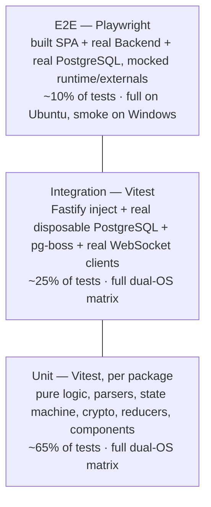
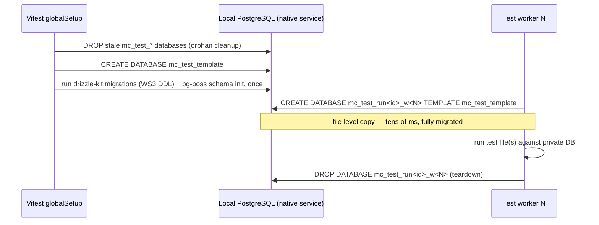

# TDS 07 — Test Strategy (WS6)

- **Status:** Draft — pending WS7 review
- **Owner:** WS6 / test-engineer
- **Date:** 2026-08-11
- **Inputs:** `docs/tds/01-foundation-decisions.md` (Foundation Contract — consumes F1, F2, F3, F4, F5, F6, F7, F8, F9), `Requirements.md` (PRD v2.1), `docs/project-plan.md` (WS6 row, risks R2/R5), `docs/research/claude-code-control-spike.md`, `docs/tds/02-service-architecture-and-deployment.md` (WS1 §4.3–§4.4 launch queue/recovery, §5 pause semantics, §6.3 tailer degradation, §8.2 root `.env`, §12 handoff notes)
- **Cross-references:** API/event contracts per `docs/tds/04-api-contracts-and-events.md` (WS2); schema/migrations per `docs/tds/03-database-schema.md` (WS3); service/wrapper architecture per `docs/tds/02-service-architecture-and-deployment.md` (WS1); frontend architecture per `docs/tds/05-frontend-architecture.md` (WS4)

This document defines *how Mission Control is tested*, not the tests themselves. It contains no test code and no production CI configuration — snippets are illustrative. Where a contract is referenced (endpoints, events, schema), the owning WS document is authoritative; this document only defines how that contract is verified.

---

## 1. Principles and Constraints

1. **Dual-OS is a first-class requirement (plan risk R5).** Every automated suite must pass natively on Windows 11 and Ubuntu. There is **no Docker anywhere** — not in dev, not in CI. Any test that only passes on one OS is a defect, not an annotation.
2. **Real PostgreSQL, mocked externals.** PostgreSQL is the single stateful substrate (F3) and is cheap to run natively on both OSes, so integration tests run against a real disposable database — never an in-memory fake (SQLite/pg-mem would silently diverge from `SKIP LOCKED`, `LISTEN/NOTIFY`, and pg-boss semantics). Everything that leaves the machine (Anthropic runtime, GitHub, Telegram) is mocked behind a port.
3. **Test the seams the architecture already has.** F2/F3 give us clean boundaries (QueuePort, worker processes, WebSocket hub, wrapper adapter). The test strategy exploits those seams instead of inventing parallel ones; where a seam is a *testability requirement* on another workstream (notably the wrapper, §5), it is stated explicitly here.
4. **Determinism over retries.** Retries are permitted only at the E2E tier. Unit and integration suites run with zero retries; a flaky test is quarantined and tracked (§11.3), never silently retried.
5. **Baseline tooling per F1.1:** Vitest (unit + integration), Playwright (E2E). No second test runner is introduced.

---

## 2. Test Pyramid and Suite Taxonomy



### 2.1 Suite definitions

| Tier | Runner | Scope | Database | External I/O | Where it lives |
|---|---|---|---|---|---|
| Unit | Vitest | One module/function/component; no network, no DB, no filesystem beyond fixtures | none | none | `**/*.test.ts` next to source, per package |
| Integration | Vitest (separate project config) | Fastify app via `app.inject()` for HTTP; real `ws` client against an ephemeral-port listener for WebSocket; pg-boss and Drizzle against a disposable DB (§3); worker processes spawned as real child processes | real PostgreSQL, per-worker disposable DB | localhost only; external HTTP mocked at the client (undici `MockAgent`) | `**/*.int.test.ts` per app/package |
| Contract | Vitest (subset of unit) | Pins our parsing/production of externally-defined or cross-package wire formats: Claude stream events (§5.3), transcript JSONL (§5.4), F6 event envelope, WS frames, OpenAPI response schemas | none | fixture files only | `**/*.contract.test.ts`, fixtures in `test/fixtures/` |
| E2E | Playwright | Built SPA served by the Backend (F2.3 prod topology), driving real browser flows | real PostgreSQL, dedicated E2E database | mock Claude runtime (§5.2) wired in via config; other externals stubbed | `apps/e2e/` (or `apps/frontend/e2e/` — WS4/WS1 layout call) |

Monorepo mapping (F8.1): each of `apps/backend`, `apps/telegram-worker`, `apps/sync-worker`, `apps/frontend`, `packages/shared` owns its unit suite; integration suites live with the app they exercise; cross-process tests (queue → worker) live in the *consuming* worker's integration suite.

### 2.2 What belongs at which tier (Phase 1–2 highlights)

- **Unit:** F7 session state-machine transition table (every legal and illegal transition, `INVALID_STATE_TRANSITION` rejection), stream-event normalizer, transcript JSONL parser, F6 envelope construction, cursor encoding/decoding (F5.3), AES-256-GCM crypto module, settings-schema validation, ADR template rendering, Obsidian note frontmatter parse/serialize, React reducers/hooks and pure components.
- **Integration:** every WS2 endpoint (happy path + error envelope per F5.4 + auth), session lifecycle end-to-end against the DB with the mock runtime, WebSocket protocol (§6), pg-boss delivery/outbox (§7), hook-ingest endpoint, settings/secrets endpoints (§8), Drizzle migrations apply cleanly from zero (WS3 DDL is exercised by every integration run via the template DB, §3.1).
- **E2E:** login → dashboard; create + start a managed Session and watch streamed output render; observed-session appears from a simulated hook POST; Session list/detail with F7 state badges; Settings page edit + masked secret + Test Connection feedback; ADR list/detail (Phase 2); notification toast on `session.completed`.

---

## 3. Integration Databases Without Docker (per F3/F8)

### 3.1 Template-database provisioning

Integration tests require a real, empty, migrated PostgreSQL database per test worker, created and destroyed fast. The cross-platform mechanism is **template databases** — no containers, no cluster-per-test:



Rules:

- **`TEST_DATABASE_URL`** (admin connection to the local instance, e.g. `postgres://postgres:…@localhost:5432/postgres`) is the only test-specific bootstrap variable; it is documented alongside the F8.2 set but is test-tooling-only, never read by application code.
- **Config injection follows WS1 §8.2/§8.3:** all apps read one root `.env` through the shared config loader, with **real process env winning** over file values. Tests therefore inject bootstrap config (per-worker `DATABASE_URL`, test `MC_ENCRYPTION_KEY`, temp `MC_DATA_DIR`) purely via process env — set on the Vitest worker or on spawned worker child processes — and **never write or modify `.env` files**, so a developer's root `.env` can coexist with any test run. The loader itself gets unit tests for exactly this precedence (real env > file), root-marker walk-up, `MC_ENV_FILE` override, and fail-fast validation (bad key length, relative `MC_DATA_DIR` → named-variable error + nonzero exit).
- The template is rebuilt whenever the migration set changes (hash of `drizzle` migration files); otherwise reused across runs for speed.
- Each Vitest worker gets its **own database** (not schema) — pg-boss owns its `pgboss` schema per F3, so schema-level isolation would collide; database-level isolation keeps pg-boss, `LISTEN/NOTIFY`, and app tables fully independent per worker, allowing parallel integration files.
- Truncation between tests *within* a worker (fast per-test reset) uses `TRUNCATE … RESTART IDENTITY CASCADE` over app tables plus pg-boss job tables; a fresh `TEMPLATE` copy is taken per test *file*, truncation per test *case*.
- Run IDs in database names + startup orphan sweep make crashed runs self-healing.

This mechanism is identical on Windows and Ubuntu because it is pure SQL against a native instance.

### 3.2 Local developer setup

| | Windows 11 (dev) | Ubuntu |
|---|---|---|
| Install | `winget install PostgreSQL.PostgreSQL.17` (or EDB installer) — same instance the app itself uses per F8.1 | `apt install postgresql-17` (PGDG repo) |
| Runs as | Windows service (auto-start) | systemd `postgresql.service` |
| Test prerequisites | instance reachable on `localhost:5432`; an admin role for `CREATE DATABASE`; `TEST_DATABASE_URL` in the developer's env | same |
| Nothing else | No Docker, no second engine, no WSL | No Docker |

The integration globalSetup fails fast with an actionable message ("PostgreSQL not reachable at TEST_DATABASE_URL — see docs/tds/07-test-strategy.md §3.2") rather than hanging.

CI provisioning is covered in §10.2.

---

## 4. Unit Testing Conventions

- One Vitest project per package/app, aggregated by a root `vitest.workspace` config; `pnpm test` runs all unit projects, `pnpm --filter <pkg> test` runs one.
- **No mocking of sibling monorepo packages** — `packages/shared` is imported for real everywhere (it is deterministic pure code + types). Mock only at ports: `AgentRuntimePort` (§5), `QueuePort` (F3) in unit tier, HTTP via undici `MockAgent`, clock via Vitest fake timers, filesystem via per-test temp dirs under the OS temp root (created with `node:fs.mkdtemp`, always removed in teardown — never repo-relative paths, per F8.1 path rules).
- Time-ordered UUIDv7 IDs (F4.2) in tests come from the shared factories (§12) with a seeded, monotonic generator so orderings are reproducible.
- Frontend unit tier (WS4's architecture governs specifics): Vitest + Testing Library + jsdom for reducers/hooks/components; the WebSocket client layer is unit-tested against a scripted in-memory socket implementing the same frame contract verified in §6.

---

## 5. Claude Code Wrapper Test Seams

The wrapper (F1.5, detailed design owned by WS1) is the highest-risk Phase 1 component and the one thing we cannot exercise for real in CI (cost, nondeterminism, credentials). The strategy: a hard port boundary, a scriptable mock behind it, and contract tests that pin our understanding of the real wire format.

### 5.1 Testability requirement on WS1 (stated, not redesigned)

WS1's wrapper design **must** isolate all `@anthropic-ai/claude-agent-sdk` calls behind a single backend-owned interface — working name **`AgentRuntimePort`** — such that no other module imports the SDK. Shape (illustrative, WS1 owns the final signature):

- `startSession(opts) → AsyncIterable<RuntimeEvent>` — opts include prompt, cwd, model, `resume?: runtimeSessionId`, `forkSession?: boolean`, permission/tool settings (Phase 4 reserved surface per F1.5).
- `sendPrompt(handle, input)` — bidirectional streaming input for live chat (PRD §4.2).
- `interrupt(handle)` / `end(handle)` — mapped by WS1 to F7 `paused`/`completed` semantics (WS0 sign-off finding 2).
- `RuntimeEvent` is **our normalized internal type** (not raw SDK types): `stream_delta`, `message_completed`, `tool_use`, `result` (carrying `total_cost_usd`, `usage`, `runtime_session_id`), `runtime_error` (with classified reason: `spawn_failed`, `crashed`, `rate_limited`).

Similarly, the transcript tailer and the hooks-ingest path are separate adapter modules (already mandated by F1.5's "version-tolerant parser isolated in an adapter module").

### 5.2 `MockAgentRuntime` — scripted runtime for integration and E2E

A test-only implementation of `AgentRuntimePort` (lives in `packages/shared/testing` or `apps/backend/test/support` — WS1 layout call) that replays **script files**: ordered lists of `RuntimeEvent`s with optional inter-event delays and fault injections. Baseline script library (fixture files, named and versioned):

| Script | Behavior it drives |
|---|---|
| `happy-single-turn` | init → several `stream_delta` partial messages → `message_completed` → `result` with `total_cost_usd` + `usage` → clean end. Verifies streaming relay, Message persistence (roles per F4.1), cost capture, `running → completed` (F7). |
| `happy-multi-turn` | as above but waits for `sendPrompt` between turns — verifies live-chat bidirectional loop. |
| `tool-use-turn` | interleaved `tool_use` events with incremental input accumulation — verifies tool Message rendering/storage. |
| `resume-session` / `fork-session` | asserts the port was called with `resume`/`forkSession` and emits a **new** `runtime_session_id`; paired with the F7 rule that resuming a completed Session creates a new Session record (`resumed_from_session_id`). |
| `spawn-failure` | immediate `runtime_error(spawn_failed)` before any output — verifies `created → failed`, error envelope, `session.failed` event emission. |
| `mid-stream-crash` | deltas, then the async iterable throws — verifies `running → failed`, partial Messages retained, WebSocket channel closes with an error frame, no orphaned process bookkeeping. |
| `rate-limit-stop` | `result` with a rate-limit stop reason — verifies WS1 §4.3 semantics: the Session **stays `running`** (the turn failed, the session did not), the condition is surfaced over the WS channel, and the affected prompt is re-enqueued as a **delayed pg-boss job** with exponential backoff + jitter (asserted via job `retryDelay`/`retryBackoff` state, under fake-timer-friendly short delays); repeated exhaustion past the retry policy marks the turn failed and notifies, still without a Session `failed` transition. |
| `slow-stream` | long inter-delta delays under fake timers — verifies heartbeat/liveness handling and UI streaming under latency (E2E). |

The mock is selected by dependency injection at app construction (test config), never by `NODE_ENV` sniffing inside production code paths.

### 5.2.1 Backend restart recovery (WS1 §4.4 recovery matrix — priority surface per WS1 §12)

Integration tests that construct the app, seed Sessions in specific states, tear the app down (or simulate boot-time recovery directly), and construct it again against the same disposable database:

- **Orphaned `running` → `failed(backend_restart)`:** a managed Session left in `running` with no live controller is transitioned `running → failed` (system trigger) on boot, with reason `backend_restart` recorded on the timeline and `session.state_changed` + `session.failed` emitted (F6/F7). The mock runtime must **not** be invoked — recovery never auto-respawns.
- **Resume-as-new after restart:** the failed Session's persisted `runtime_session_id` supports one-click Resume — asserted by calling the resume action and verifying a **new** Session record linked via `resumed_from_session_id` whose port call carries `resume: runtime_session_id` (F7 rule; `resume-session` script). Prior Messages and accumulated cost on the failed Session are untouched.
- **`paused` survives restart (cold pause, WS1 §5.1):** a Session paused before shutdown holds no process, remains `paused` after boot, and `resume` re-attaches **in place** on the same Session record (`paused → running`, same PK, port called with `resume: runtime_session_id`) — no new Session, no `failed` cascade. Pending/interrupted Message flags (WS1 §5.1) survive and redisplay without auto-replay.
- **`paused → failed` on lost resume target:** resume against a Session whose transcript the mock reports gone (runtime retention/`CLAUDE_CONFIG_DIR` moved) transitions `paused → failed` per F7's "process lost while paused"; also covered for the lazy daily-sweep detection path.
- **Queued launches survive restart:** see §7.1 — pending `session.launch` jobs are durable and serviced in FIFO order after boot.

### 5.3 Contract tests: pinning the stream-event schema

The mock proves *our* system is self-consistent; contract tests prove our **normalizer matches reality**:

- A **fixture corpus of recorded real output** — raw SDK message sequences / CLI `stream-json` lines captured from actual Claude Code runs (spike §2 event vocabulary: `system`, `assistant`, `user`, `stream_event` with `message_start`/`content_block_delta`/`message_delta`/`message_stop`, `result`; fields `session_id`, `uuid`, `parent_tool_use_id`) — checked into `apps/backend/test/fixtures/claude/recorded/`, with the Claude Code version recorded in each fixture's header.
- Contract tests feed the corpus through the normalizer and snapshot the resulting `RuntimeEvent` sequences. Key cases: partial-message delta accumulation (`text_delta`, `input_json_delta` partial-JSON assembly), usage/cost extraction from `result`, stop-reason classification.
- A small **record harness** (dev-only script, run manually with real credentials) refreshes the corpus when the pinned Claude Code / SDK version is bumped; a corpus refresh is a required step of any runtime-version upgrade PR. Contract-test failure after refresh = the format drifted = adapter work, caught before production.

### 5.4 Transcript-tailer tests

Fixture JSONL files under `apps/backend/test/fixtures/claude/transcripts/`, exercised by unit tests of the tailer adapter:

- **Happy path:** well-formed session transcript → parsed timeline matches expected Messages/tool events.
- **Incremental append:** fixture written to a temp file in chunks (including a chunk ending mid-line) — tailer must handle partial trailing lines and emit events only for complete lines.
- **Forward compatibility (mandatory):** fixtures containing (a) unknown top-level line `type`s, (b) known types with extra unknown fields, (c) a syntactically invalid line mid-file — the tailer must skip/ignore unknowns, keep tailing, and **never** throw or corrupt the Session record.
- **Drift-counter degradation (WS1 §6.3):** a fixture whose lines are predominantly drifted/unparseable drives the per-session drift counter past its threshold — asserted outcome is **degradation, not failure**: the tailer detaches for that session, observation flips to hook-only mode, **`session.observation_degraded`** is emitted (WS2 §6.9 — *not* `sync.failed`; assert the exact type string, since this was a cross-document drift caught at the WS7 gate), the degraded-fidelity flag is set and stays set for the life of the Session (no re-attach, WS7 arbitration A11), and the Session's F7 state is **unchanged** (parser drift alone never transitions state, per WS1 §5.2/§6.3). Below-threshold drift keeps full-fidelity tailing. A companion integration test proves hook ingest continues to append Messages for the degraded session.
- **Dual-OS watcher parity (WS1 §12 note 4):** the incremental-append and degradation tests run on the real filesystem watcher on **both** OSes in the CI matrix (§10.1) — Windows and Linux watcher semantics differ, so the tailer path is never mocked-only on either platform.
- **Path resolution:** encoded-cwd path computation tested for both `~/.claude/projects/...` and `%USERPROFILE%\.claude\projects\...`, honoring `CLAUDE_CONFIG_DIR` (F1.5) — pure-function unit tests, both separators.
- **Hook-ingest endpoint** (WS2 contract): integration tests POST realistic hook payloads (`SessionStart`, `UserPromptSubmit`, `PostToolUse`, `Stop`, `SessionEnd` with `session_id`, `transcript_path`) and assert observed-Session creation/updates per F7 (`created` via system trigger) and idempotency on duplicate hook delivery.

---

## 6. WebSocket Protocol Testing (per F5.6)

Integration tier: real Fastify listener on an ephemeral port, real `ws` clients, mock runtime driving traffic.

1. **Auth handshake:** upgrade with a valid session cookie succeeds; missing/expired cookie → upgrade rejected; **cross-origin `Origin` header → upgrade rejected** (WS0 sign-off finding 3 — this test exists from day one, before any hardening drift); bearer-token upgrade behavior per WS2's contract.
2. **Multiplexed channel protocol:** subscribe to `session:{id}` and `notifications` on one connection; events route only to subscribed channels; unsubscribe stops delivery; subscribing to a nonexistent/unauthorized channel returns the F5.4-style error frame; frames carry the F6 envelope verbatim (contract test against WS2's frame schema).
3. **Streaming delta ordering:** with the mock runtime emitting N deltas, the client receives them in order, per-channel, with the per-Session `ordinal` WS2 now defines (§6.6 — `ordinal` is the conversation-order and cursor key; `id`/`createdAt` are never ordering keys) — asserted monotonic per channel; interleaved traffic on two Session channels does not cross-contaminate ordering.
4. **Reconnect + refetch semantics:** kill the socket mid-stream; client reconnects and re-subscribes; per F6.3 there is **no replay** — the test asserts the server does not replay missed frames and that the documented client behavior (refetch current state via REST, then resume live frames) yields a consistent final Message list. The frontend client layer's refetch-on-reconnect is unit-tested against the scripted socket (§4) and E2E-tested once (network interruption via Playwright route abort).
5. **Backpressure/slow consumer:** a deliberately slow client must not stall the mock-runtime pump or other clients (best-effort semantics per F6.3); assert bounded server-side buffering per WS1/WS2's stated policy.

---

## 7. Queue and Worker Testing (per F3/F6)

### 7.1 pg-boss integration tests

Run against the disposable per-worker database (§3), real pg-boss:

- **At-least-once → idempotent consumers:** publish the same F6 event (same envelope `id`) twice; the consumer's side effect (e.g., one Telegram send record, one Notification row) occurs exactly once. Every consumer in `apps/telegram-worker` and `apps/sync-worker` gets this test shape; dedup-on-event-`id` is the pinned mechanism (F6.3).
- **Outbox atomicity (mandatory):** in one transaction, write a domain change and enqueue its event via the WS3-pinned mechanism (WS0 sign-off finding 4 — pg-boss insert on the caller's transaction); force a rollback after enqueue → assert **neither** the domain row **nor** the job exists. The commit-path twin asserts both exist. This test is the guardrail that keeps F6.3's "transactional outbox by construction" true forever.
- **Retry/backoff and dead-lettering:** a consumer that throws N times → job retried per policy, then parked; queue-depth/health surface (PRD §4.4.7 "Queue (PostgreSQL)") reflects it.
- **`LISTEN/NOTIFY` wake-up:** enqueue → consumer picks up within the expected latency without polling-interval sleeps dominating test time (fake timers where pg-boss allows; otherwise short real intervals with a hard cap).
- **Durable `session.launch` jobs (WS1 §4.3–§4.4):** with the concurrency semaphore saturated (max-concurrent setting = 1, one mock Session occupying the slot), `start`/`resume` requests do not fail — the Session stays `created`/`paused`, a durable `session.launch` job is enqueued, and the API response distinguishes "queued for launch" from "started" (WS2 contract). Tests then assert: (a) **restart survival** — tear down the app, reconstruct against the same disposable DB, and the pending jobs are still queued and get serviced once slots free; (b) **FIFO order** — three queued launches are serviced in enqueue order as the occupying session completes/pauses; (c) **slot release on pause** — cold-pausing the occupying Session (WS1 §5.1) frees the slot and triggers the next queued launch; (d) shrinking the max-concurrent setting via `setting.updated` never kills running Sessions, only defers new launches.

### 7.2 Worker process tests without systemd

Per F8.1 (foreground process, stdout logs, nonzero exit on fatal — no systemd in code), workers are testable as plain child processes on both OSes:

- Spawn the built worker with `execFile(node, [entry])` (explicit executable path per F8.1), env pointing at a disposable DB; assert: startup log line/health marker, job consumption from a pre-seeded queue, and clean exit on shutdown signal.
- **Cross-platform shutdown:** graceful-shutdown tests trigger `SIGTERM` on Ubuntu and `SIGINT` (Ctrl-C equivalent) on Windows — Windows has no true SIGTERM delivery to detached processes, so the worker's shutdown handler must be wired to both, and the test matrix proves it on each OS. Fatal-path test: unreachable `DATABASE_URL` → process exits nonzero within a bounded time (this is what systemd `Restart=on-failure` and a dev console both depend on).
- Settings refresh: emit `setting.updated` → worker picks up the new value without restart (F8.2), asserted via observable behavior change.

---

## 8. Settings and Secrets Testing (per F8.2, PRD §4.4/§10)

- **Crypto round-trip (unit):** AES-256-GCM encrypt→decrypt round-trips arbitrary values (property-style over generated inputs) under `MC_ENCRYPTION_KEY`; ciphertext is non-deterministic (unique IV per encryption); **tamper detection** — any flipped ciphertext/auth-tag/IV byte fails decryption loudly; **key-version field** round-trips so that a future key rotation can decrypt-old/encrypt-new (the version field exists and is asserted now; rotation tooling itself is post-V1).
- **Secret masking contract (integration, non-negotiable):** after writing a SecretItem via the Settings API, **no** read surface returns plaintext — the settings read endpoints return masked/`isSet` shape per WS2, audit-log entries (`audit_log_entries`) contain no secret material, and error `details` never echo secret inputs. Implemented as a sweep-style contract test: every WS2 response schema is scanned for secret-bearing fields, plus targeted tests seeding a sentinel secret value and asserting the sentinel string appears in no API response body and no log line captured during the test.
- **Bootstrap split:** integration test asserts F8.2 bootstrap variables are readable without a DB, and that no bootstrap setting is served or editable via the Settings API.
- **Test Connection endpoints (integration):** per-integration `test-connection` actions (WS2 contract) with stubbed integrations — GitHub/Telegram via undici `MockAgent` scripted for success, auth-failure (401), and timeout; Obsidian path via a real temp directory (exists/readable/not-a-dir cases, exercised with native paths on both OSes per F8.1); Qdrant/Ollama test-connection are **stub contracts** (WS2 phase guard) — tested only for the stub response shape. Each outcome maps to the clear success/failure feedback contract (PRD §4.4) and produces an `audit_log_entries` row for setting changes (not for reads).

---

## 9. E2E Testing (Playwright)

- **Topology under test = production topology (F2.3):** `vite build` output served statically by the Backend, single origin, real PostgreSQL (dedicated E2E database built from the same template mechanism, §3.1), Telegram/Sync workers running as child processes where a flow needs them, `MockAgentRuntime` (§5.2) injected via test config, external HTTP stubbed. Playwright's `webServer` starts the Backend; no dev-server E2E (the Vite proxy path is covered by developers daily, not by CI).
- **Flow set (Phase 1–2):** login/logout + session-cookie expiry; dashboard widgets (PRD §8.1); create → start → stream → complete a managed Session (using `happy-single-turn` and `mid-stream-crash` scripts — the crash flow asserts the UI shows `failed` state and the timeline survives); observed Session appearing after a scripted hook POST; Sessions list with F7 state badges and cursor pagination; Settings page per category incl. masked secret entry and Test Connection success/failure states; ADR list/detail and Obsidian-sync status (Phase 2); notification toast on `session.completed`.
- **Selectors and stability:** `data-testid` on interactive elements (WS4/WS5 convention), no text-content selectors for dynamic data; Playwright auto-waiting only — no bare timeouts.
- **Artifacts:** trace + screenshot + video on failure, uploaded from CI.
- Browser matrix: Chromium as the gate; WebKit/Firefox as a scheduled (nightly/weekly) non-blocking run — this is a single-operator dashboard, not a public site.

---

## 10. Dual-OS CI (GitHub Actions)

### 10.1 Matrix — which suites run where

| Job | `ubuntu-latest` | `windows-latest` | Gate? |
|---|---|---|---|
| Lint + typecheck (`tsc --noEmit`, monorepo-wide) | ✔ | — (OS-independent) | blocking |
| Unit (all packages, incl. contract tests) | ✔ | ✔ | blocking |
| Integration (backend + workers, real PostgreSQL §10.2) | ✔ | ✔ | blocking |
| Build (backend, workers, SPA `vite build`) | ✔ | ✔ | blocking |
| E2E — full flow set (Chromium) | ✔ | — | blocking |
| E2E — smoke subset, tag `@smoke` (login, launch-session-stream, settings save) | — | ✔ | blocking |
| E2E — WebKit/Firefox full | scheduled | — | non-blocking |

Rationale: unit/integration are where OS divergence actually bites (paths, process signals, file watching, PostgreSQL behavior) → full matrix. Full browser E2E on Windows roughly doubles the slowest job for little marginal signal; the Windows `@smoke` subset still proves the built stack boots, authenticates, streams, and persists on Windows every PR. Node per F1.2 via `actions/setup-node` — test the supported **floor (22)** and the **active-LTS target** as separate matrix entries, so a version-specific regression is attributed to a version rather than discovered in production; pnpm store cached per OS.

### 10.2 PostgreSQL provisioning per OS in CI (no Docker)

Both GitHub-hosted runner images **ship PostgreSQL preinstalled** (service present but stopped) — this is the primary mechanism; no containers, mirroring local dev:

- **`ubuntu-latest`:** start the preinstalled cluster (`sudo systemctl start postgresql`), set the postgres role password, export `TEST_DATABASE_URL`. *Fallback if the image drops it:* `sudo apt-get install postgresql-17` from PGDG. (GitHub `services:` containers are Docker and are deliberately **not** used, keeping CI identical in mechanism to local dev.)
- **`windows-latest`:** start the preinstalled service (`Set-Service postgresql* -StartupType Manual; Start-Service postgresql*` — the image exports `PGROOT`/`PGBIN`/`PGUSER`/`PGPASSWORD`), export `TEST_DATABASE_URL`. *Fallback:* `choco install postgresql17 --params '/Password:…'`.
- A shared setup step (cross-platform Node script, not shell — F8.1 discipline) waits for readiness (`pg_isready` from `PGBIN`/`PATH`) with a bounded timeout, then the normal §3.1 template mechanism takes over — **CI and local runs use the exact same provisioning code path** from `TEST_DATABASE_URL` onward.
- Illustrative fragment (not production config):

```yaml
strategy:
  matrix:
    os: [ubuntu-latest, windows-latest]
runs-on: ${{ matrix.os }}
steps:
  - run: node scripts/ci/start-postgres.mjs   # starts preinstalled service per-OS, waits for pg_isready
  - run: pnpm test:integration
    env:
      TEST_DATABASE_URL: ${{ steps.pg.outputs.url }}
```

### 10.3 Pipeline shape

PR → lint/typecheck + unit matrix (fast fail) → integration matrix + build matrix → E2E (ubuntu full, windows smoke) → merge gate. `main`/`DEV` pushes additionally run the scheduled-tier suites. Contract-fixture refresh (§5.3) is enforced by a check that fails when the pinned Claude Code/SDK version changes without a corpus update in the same PR.

---

## 11. Coverage, Quality Gates, Flake Policy

### 11.1 Coverage targets (Vitest v8 coverage, enforced per package in CI)

| Package | Lines/Statements | Branches | Notes |
|---|---|---|---|
| `packages/shared` | 90% | 85% | pure logic; includes F7 state machine, envelope, crypto, factories excluded |
| `apps/backend` — wrapper adapters (runtime normalizer, transcript tailer, hooks ingest) | 90% | 85% | highest-risk parsing code; measured as a scoped threshold |
| `apps/backend` (rest) | 80% | 75% | |
| `apps/telegram-worker`, `apps/sync-worker` | 80% | 75% | |
| `apps/frontend` | 70% unit | 60% | flows are covered by E2E, which coverage numbers don't capture |

Coverage is a floor, not a target to game: new PRs may not lower a package below its threshold. Generated code (Drizzle migration artifacts, OpenAPI-generated client) and `test/` trees are excluded from measurement.

### 11.2 Quality gates by roadmap phase

- **Phase 1 gate (Definition of Done for Phase 1 features):** all §10.1 blocking jobs green on both OSes; every WS2 Phase-1 endpoint has integration coverage (happy + error envelope + auth); every F7 transition (legal and illegal) unit-tested; all §5.2 mock scripts exercised, incl. all three failure scripts; §5.2.1 restart-recovery matrix (orphaned-`running` → `failed(backend_restart)`, resume-as-new, `paused` survival) and §7.1 durable `session.launch` tests green; §5.4 drift-degradation test green on both OSes; §5.3 contract corpus recorded from a real pinned Claude Code version; §7.1 outbox-atomicity and idempotency tests present for every consumer; §8 masking sweep green; E2E flow set for Phase-1 screens green; coverage floors met.
- **Phase 2 gate:** Phase-1 gate + Obsidian sync integration tests (two-way conflict-policy cases against temp vaults on both OSes), ADR generation golden-file tests, Telegram Worker consumer tests with `MockAgent`, search endpoint integration tests, corresponding E2E flows.
- **Every PR, regardless of phase:** no `test.only`/`describe.only` (lint rule), no skipped tests without a linked issue, no new hard-coded platform paths (lint rule per F8.1).

### 11.3 Flake policy

- Unit/integration: **zero retries** in CI. A test that fails intermittently is either fixed in the same PR or moved to quarantine: tagged (`@quarantine`), excluded from the merge gate, still executed and reported on scheduled runs, tracked by a linked issue with a 14-day budget — after which it is fixed or deleted, never left rotting.
- E2E: Playwright `retries: 2` in CI only (0 locally); a test that *needed* a retry is logged; two retry-passes for the same test within 7 days ⇒ quarantine flow above.
- Known flake vectors are designed out up front: no wall-clock sleeps (fake timers or condition-polling with caps), no shared mutable DB state across workers (§3.1), no port collisions (ephemeral ports everywhere), no ordering assumptions beyond per-channel/per-queue guarantees (F6.3).

## 12. Fixtures and Factories (per F4)

- **One factory per F4.1 entity**, exported from a `packages/shared` testing entry point (`packages/shared/testing`), named `build<Entity>` using F4.1 vocabulary verbatim (`buildUser`, `buildWorkspace`, `buildProject`, `buildRepository`, `buildCommit`, `buildPullRequest`, `buildSession`, `buildMessage`, `buildAdr`, `buildNotification`, `buildSetting`, `buildSecretItem`, `buildAuditLogEntry`; Phase 3/4 skeleton entities get skeleton factories only). Factories produce valid default entities with seeded, monotonic UUIDv7 IDs and UTC `timestamptz`-compatible dates (F4.2), accept partial overrides, and never talk to the DB themselves; a thin `persist(db, entity)` helper in the integration support layer inserts them via Drizzle so factory output and WS3 constraints stay honest (a factory default that violates WS3 DDL is a test failure, by design).
- **Scenario builders** compose factories for common graphs (e.g., `sessionWithMessages`, `projectWithRepository`) — used by integration and E2E seeding alike so both tiers share one data vocabulary.
- **Fixture files:** Claude recorded corpus and transcript JSONL under `apps/backend/test/fixtures/claude/` (§5.3–5.4); mock-runtime scripts alongside them; each fixture carries a comment/header with provenance (source version, capture date). Binary or oversized fixtures are prohibited; everything is reviewable text.
- Session states in any fixture/factory use F7 strings verbatim (`created`…`archived`); event fixtures use F6 names and envelope verbatim.

---

## 13. Phase 3–5 Test Considerations (placeholders)

### 13.1 Memory / Qdrant (Phase 3)

> **Phase 3 — interface only.** This section is a placeholder/extension point.
> Detailed design is out of TDS scope per the project-plan scope guard.

When Qdrant lands, the expected shape is: a `VectorStorePort` mirroring the §5 seam pattern with an in-memory fake for unit/integration tiers; a small real-Qdrant integration suite running against a natively installed Qdrant binary on `ubuntu-latest` only (Windows dev uses the fake; Qdrant's Windows story is evaluated then); golden-set relevance tests (fixed corpus, assert expected hits appear in top-k) rather than brittle score assertions; embedding calls stubbed deterministically. Graphify, if adopted, is exercised via recorded skill outputs, not live parsing in CI.

### 13.2 Agent framework (Phase 4)

> **Phase 4 — interface only.** This section is a placeholder/extension point.
> Detailed design is out of TDS scope per the project-plan scope guard.

Expected shape: Agent/AgentTeam CRUD tests follow the standard §2.2 tiers over the skeleton tables; the critical new surface is **permission enforcement** — contract tests asserting that Agent permission templates translate into the reserved runtime control surfaces (`--permission-mode`, allowed/disallowed tool patterns, `PreToolUse` `permissionDecision`, per F1.5) via `MockAgentRuntime` script assertions, plus deny-path tests proving a forbidden tool call never reaches the runtime port.

### 13.3 Multi-runtime and advanced automation (Phase 5)

> **Phase 5 — interface only.** This section is a placeholder/extension point.
> Detailed design is out of TDS scope per the project-plan scope guard.

Expected shape: each new runtime adapter (Anthropic/OpenAI/Gemini APIs, Ollama) implements `AgentRuntimePort` and inherits the entire §5.2 script suite as a reusable port-conformance kit — the mock-script library becomes the compliance test for every future runtime; per-adapter contract corpora pin each vendor's wire format exactly as §5.3 does for Claude Code.

---

## 14. Foundation Conformance

This strategy consumes the Foundation Contract verbatim: F1.1 (Vitest/Playwright baseline — no other runners), F1.5 (wrapper channels and adapter isolation → §5), F2 (worker process boundaries → §7.2), F3 (no Redis; pg-boss + PostgreSQL as the only stateful test substrate → §3, §7), F5.4/F5.6 (error envelope and WebSocket assertions → §6), F6 (envelope/delivery semantics → §7.1), F7 (state-machine test matrix → §2.2), F8 (cross-platform process/path/config discipline → §3, §7.2, §10), F9 (this document's conventions). No foundation conflicts were identified; the single addition is the test-only `TEST_DATABASE_URL` variable (§3.1), which is tooling scope, not an F8.2 bootstrap change.
